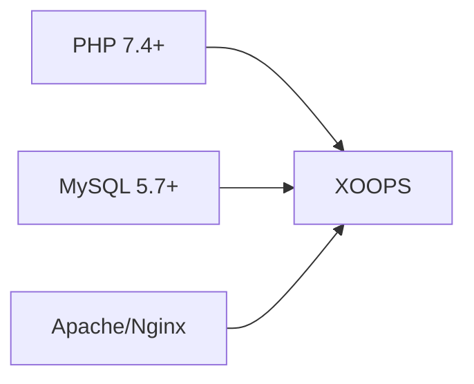
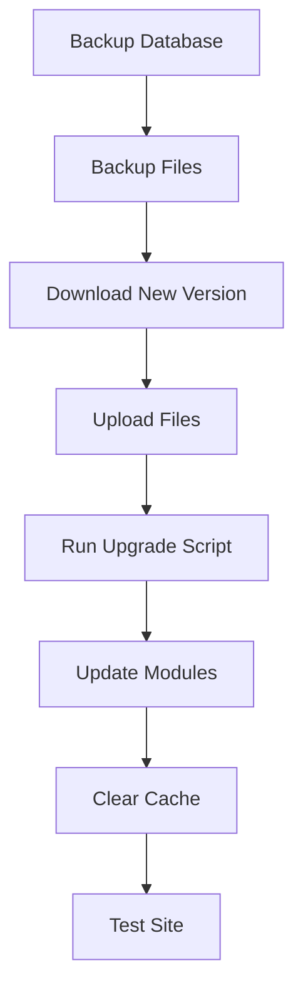

> پرسش ها و پاسخ های رایج در مورد نصب XOOPS.

---

## پیش نصب

### س: حداقل نیازهای سرور چیست؟

**A:** XOOPS 2.5.x نیاز دارد:
- PHP 7.4 یا بالاتر (PHP 8.x توصیه می شود)
- MySQL 5.7+ یا MariaDB 10.3+
- آپاچی با mod_rewrite یا Nginx
- حداقل 64 مگابایت محدودیت حافظه PHP (128 مگابایت + توصیه می شود)



### س: آیا می توانم XOOPS را روی هاست اشتراکی نصب کنم؟

**A:** بله، XOOPS روی اکثر هاست های اشتراکی که شرایط را برآورده می کنند، به خوبی کار می کند. بررسی کنید که میزبان شما ارائه می دهد:
- PHP با پسوندهای مورد نیاز (mysqli، gd، curl، json، mbstring)
- دسترسی به پایگاه داده MySQL
- قابلیت آپلود فایل
- پشتیبانی از htaccess (برای آپاچی)

### س: کدام پسوندهای PHP مورد نیاز است؟

**A:** پسوندهای مورد نیاز:
- `mysqli` - اتصال به پایگاه داده
- `gd` - پردازش تصویر
- `json` - مدیریت JSON
- `mbstring` - پشتیبانی از رشته های چند بایتی

توصیه می شود:
- `curl` - تماس های API خارجی
- `zip` - نصب ماژول
- `intl` - بین المللی سازی

---

## فرآیند نصب

### س: جادوگر نصب یک صفحه خالی را نشان می دهد

**A:** این معمولا یک خطای PHP است. امتحان کنید:

1. نمایش خطا را به طور موقت فعال کنید:
```php
// Add to htdocs/install/index.php at the top
error_reporting(E_ALL);
ini_set('display_errors', 1);
```

2. گزارش خطای PHP را بررسی کنید
3. سازگاری نسخه PHP را تأیید کنید
4. مطمئن شوید که همه پسوندهای مورد نیاز بارگذاری شده اند

### س: دریافت می کنم "نمی توان به mainfile.php نوشت"

**A:** قبل از نصب، مجوزهای نوشتن را تنظیم کنید:

```bash
chmod 666 mainfile.php
# After installation, secure it:
chmod 444 mainfile.php
```

### س: جداول پایگاه داده ایجاد نمی شوند

**A:** بررسی کنید:

1. کاربر MySQL دارای امتیازات CREATE TABLE است:
```sql
GRANT ALL PRIVILEGES ON xoopsdb.* TO 'xoopsuser'@'localhost';
FLUSH PRIVILEGES;
```

2. پایگاه داده وجود دارد:
```sql
CREATE DATABASE xoopsdb CHARACTER SET utf8mb4 COLLATE utf8mb4_unicode_ci;
```

3. اعتبار در تنظیمات پایگاه داده مطابقت جادوگر

### س: نصب کامل شد اما سایت خطاهایی را نشان می‌دهد

**A:** رفع متداول پس از نصب:

1. دایرکتوری نصب را حذف یا تغییر نام دهید:
```bash
mv htdocs/install htdocs/install.bak
```

2. مجوزهای مناسب را تنظیم کنید:
```bash
chmod -R 755 htdocs/
chmod -R 777 xoops_data/
chmod 444 mainfile.php
```

3. کش را پاک کنید:
```bash
rm -rf xoops_data/caches/smarty_cache/*
rm -rf xoops_data/caches/smarty_compile/*
```

---

## پیکربندی

### س: فایل پیکربندی کجاست؟

**A:** پیکربندی اصلی در `mainfile.php` در ریشه XOOPS است. تنظیمات کلیدی:

```php
define('XOOPS_ROOT_PATH', '/path/to/htdocs');
define('XOOPS_VAR_PATH', '/path/to/xoops_data');
define('XOOPS_URL', 'https://yoursite.com');
define('XOOPS_DB_HOST', 'localhost');
define('XOOPS_DB_USER', 'username');
define('XOOPS_DB_PASS', 'password');
define('XOOPS_DB_NAME', 'database');
define('XOOPS_DB_PREFIX', 'xoops');
```

### س: چگونه آدرس سایت را تغییر دهم؟

**A:** ویرایش `mainfile.php`:

```php
define('XOOPS_URL', 'https://newdomain.com');
```

سپس حافظه پنهان را پاک کنید و URL های کدگذاری شده را در پایگاه داده به روز کنید.

### س: چگونه XOOPS را به دایرکتوری دیگری منتقل کنم؟

**الف:**

1. انتقال فایل ها به مکان جدید
2. مسیرها را در `mainfile.php` به روز کنید:
```php
define('XOOPS_ROOT_PATH', '/new/path/to/htdocs');
define('XOOPS_VAR_PATH', '/new/path/to/xoops_data');
```
3. در صورت نیاز پایگاه داده را به روز کنید
4. تمام کش ها را پاک کنید

---

## ارتقا

### س: چگونه XOOPS را ارتقا دهم؟

**الف:**



1. **پشتیبان گیری از همه چیز** (پایگاه داده + فایل ها)
2. دانلود نسخه جدید XOOPS
3. آپلود فایل ها (`mainfile.php` رونویسی نکنید)
4. در صورت ارائه `htdocs/upgrade/` را اجرا کنید
5. ماژول ها را از طریق پنل مدیریت به روز کنید
6. تمام کش ها را پاک کنید
7. به طور کامل تست کنید

### س: آیا می توانم هنگام ارتقاء از نسخه ها صرف نظر کنم؟

**A:** به طور کلی خیر. به طور متوالی از طریق نسخه های اصلی ارتقا دهید تا اطمینان حاصل کنید که انتقال پایگاه داده به درستی اجرا می شود. یادداشت های انتشار را برای راهنمایی خاص بررسی کنید.

### س: ماژول های من پس از ارتقا کار نمی کنند

**الف:**

1. سازگاری ماژول را با نسخه جدید XOOPS بررسی کنید
2. ماژول ها را به آخرین نسخه ها به روز کنید
3. بازسازی قالب ها: Admin → System → Maintenance → Templates
4. تمام کش ها را پاک کنید
5. گزارش های خطای PHP را برای خطاهای خاص بررسی کنید

---

## عیب یابی

### س: رمز عبور مدیریت را فراموش کردم

**A:** بازنشانی از طریق پایگاه داده:

```sql
-- Generate new password hash
UPDATE xoops_users
SET pass = MD5('newpassword')
WHERE uname = 'admin';
```

یا اگر ایمیل پیکربندی شده است از ویژگی بازنشانی رمز عبور استفاده کنید.

### س: سایت پس از نصب بسیار کند است

**الف:**

1. کش را در Admin → System → Preferences فعال کنید
2. بهینه سازی پایگاه داده:
```sql
OPTIMIZE TABLE xoops_session;
OPTIMIZE TABLE xoops_online;
```
3. جستجوهای کند را در حالت اشکال زدایی بررسی کنید
4. PHP OpCache را فعال کنید

### Q: Images/CSS بارگیری نمی شود

**الف:**

1. مجوزهای فایل را بررسی کنید (644 برای فایل ها، 755 برای فهرست ها)
2. بررسی کنید که `XOOPS_URL` در `mainfile.php` صحیح است
3. htaccess. را برای بازنویسی درگیری ها بررسی کنید
4. کنسول مرورگر را برای خطاهای 404 بررسی کنید

---## مستندات مرتبط

- راهنمای نصب
- پیکربندی اولیه
- صفحه سفید مرگ

---

#xoops #faq #نصب #عیب یابی