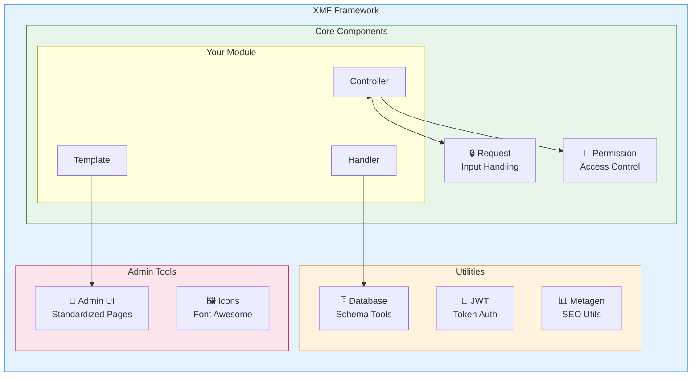
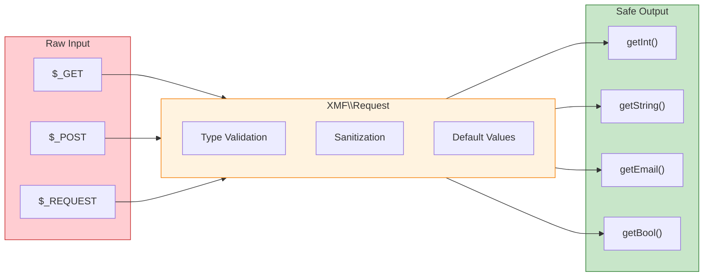

<span class="version-badge version-25x">2.5.x ✅</span> <span class="version-badge version-40x">4.0.x ✅</span>

:::tip [پلی به XOOPS مدرن]
XMF در **XOOPS 2.5.x و XOOPS 4.0.x** کار می کند. این روش پیشنهادی برای مدرن کردن ماژول‌های امروزی هنگام آماده شدن برای XOOPS 4.0 است. XMF بارگذاری خودکار PSR-4، فضاهای نام و کمکی را فراهم می کند که انتقال را هموار می کند.
:::

**چارچوب ماژول XOOPS (XMF)** یک کتابخانه قدرتمند است که برای ساده سازی و استانداردسازی توسعه ماژول XOOPS طراحی شده است. XMF شیوه‌های مدرن PHP از جمله فضاهای نام، بارگذاری خودکار و مجموعه‌ای جامع از کلاس‌های کمکی را ارائه می‌کند که کد دیگ بخار را کاهش می‌دهد و قابلیت نگهداری را بهبود می‌بخشد.

## XMF چیست؟

XMF مجموعه ای از کلاس ها و برنامه های کاربردی است که ارائه می دهد:

- **پشتیبانی مدرن PHP** - پشتیبانی کامل از فضای نام با بارگیری خودکار PSR-4
- ** رسیدگی به درخواست ** - اعتبار سنجی ورودی و پاکسازی ایمن
- ** Helpers ماژول ** - دسترسی ساده به تنظیمات و اشیاء ماژول
- ** سیستم مجوز ** - مدیریت مجوز با کاربری آسان
- ** ابزارهای پایگاه داده ** - انتقال طرحواره و ابزارهای مدیریت جدول
- ** پشتیبانی JWT ** - پیاده سازی JSON Web Token برای احراز هویت ایمن
- **تولید فراداده** - ابزارهای SEO و استخراج محتوا
- ** رابط مدیریت ** - صفحات مدیریت ماژول استاندارد

### بررسی اجمالی مؤلفه XMF



## ویژگی های کلیدی

### فضاهای نام و بارگیری خودکار

تمام کلاس های XMF در فضای نام `XMF` قرار دارند. کلاس ها در صورت ارجاع به طور خودکار بارگذاری می شوند - هیچ کتابچه راهنمای مورد نیاز نیست.

```php
use XMF\Request;
use XMF\Module\Helper;

// Classes load automatically when used
$input = Request::getString('input', '');
$helper = Helper::getHelper('mymodule');
```

### رسیدگی ایمن به درخواست

[کلاس درخواست](../05-XMF-Framework/Basics/XMF-Request.md) دسترسی ایمن به داده های درخواست HTTP را با پاکسازی داخلی فراهم می کند:



```php
use XMF\Request;

$id = Request::getInt('id', 0);
$name = Request::getString('name', '');
$email = Request::getEmail('email', '');
```

### سیستم کمکی ماژول

[Helper Module](../05-XMF-Framework/Basics/XMF-Module-Helper.md) دسترسی راحت به عملکردهای مرتبط با ماژول را فراهم می کند:

```php
$helper = \XMF\Module\Helper::getHelper('mymodule');

// Access module configuration
$configValue = $helper->getConfig('setting_name', 'default');

// Get module object
$module = $helper->getModule();

// Access handlers
$handler = $helper->getHandler('items');
```

### مدیریت مجوز

[Permission-Helper](../05-XMF-Framework/Recipes/Permission-Helper.md) مدیریت مجوز XOOPS را ساده می کند:

```php
$permHelper = new \XMF\Module\Helper\Permission();

// Check user permission
if ($permHelper->checkPermission('view', $itemId)) {
    // User has permission
}
```

## ساختار اسناد و مدارک

### اصول

- [Getting-Started-with-XMF](../05-XMF-Framework/Basics/Getting-Started-with-XMF.md) - نصب و استفاده اولیه
- [XMF-Request](../05-XMF-Framework/Basics/XMF-Request.md) - رسیدگی به درخواست و اعتبارسنجی ورودی
- [XMF-Module-Helper](../05-XMF-Framework/Basics/XMF-Module-Helper.md) - استفاده از کلاس کمکی ماژول

### دستور پخت

- [Permission-Helper](../05-XMF-Framework/Recipes/Permission-Helper.md) - کار با مجوزها
- [Module-Admin-Pages](../05-XMF-Framework/Recipes/Module-Admin-Pages.md) - ایجاد رابط های مدیریت استاندارد

### مرجع

- [JWT](../05-XMF-Framework/Reference/JWT.md) - پیاده سازی JSON Web Token
- [پایگاه داده](../05-XMF-Framework/Reference/Database.md) - ابزارهای پایگاه داده و مدیریت طرحواره
- [Metagen](Reference/Metagen.md) - ابزارهای ابرداده و SEO

## الزامات

- XOOPS 2.5.8 یا بالاتر
- PHP 7.2 یا بالاتر (PHP 8.x توصیه می شود)

## نصب

XMF با XOOPS 2.5.8 و نسخه های جدیدتر گنجانده شده است. برای نسخه های قبلی یا نصب دستی:

1. بسته XMF را از مخزن XOOPS دانلود کنید
2. در فهرست XOOPS `/class/xmf/` خود را استخراج کنید
3. بارگذاری خودکار بارگذاری کلاس را به طور خودکار انجام می دهد

## مثال شروع سریع

در اینجا یک مثال کامل است که الگوهای رایج استفاده از XMF را نشان می دهد:

```php
<?php
use XMF\Request;
use XMF\Module\Helper;
use XMF\Module\Helper\Permission;

// Get module helper
$helper = Helper::getHelper('mymodule');

// Get configuration values
$itemsPerPage = $helper->getConfig('items_per_page', 10);

// Handle request input
$op = Request::getCmd('op', 'list');
$id = Request::getInt('id', 0);

// Check permissions
$permHelper = new Permission();
if (!$permHelper->checkPermission('view', $id)) {
    redirect_header('index.php', 3, 'Access denied');
}

// Process based on operation
switch ($op) {
    case 'view':
        $handler = $helper->getHandler('items');
        $item = $handler->get($id);
        // ... display item
        break;
    case 'list':
    default:
        // ... list items
        break;
}
```

## منابع

- [مخزن XMF GitHub](https://github.com/XOOPS/XMF)
- [وب سایت پروژه XOOPS](https://xoops.org)

---

#xmf #xoops #framework #php #توسعه ماژول