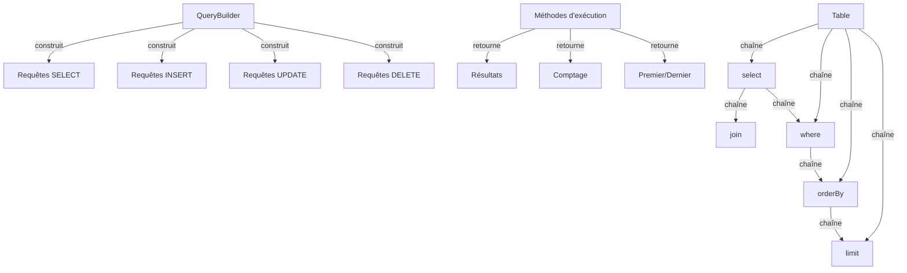

Le constructeur de requêtes XOOPS fournit une interface fluide moderne pour construire des requêtes SQL. Cela aide à prévenir l'injection SQL, améliore la lisibilité et fournit l'abstraction base de données pour plusieurs systèmes base de données.

## Architecture du constructeur de requêtes



## Classe QueryBuilder

La classe constructeur de requêtes principale avec interface fluide.

### Vue d'ensemble de la classe

```php
namespace Xoops\Database;

class QueryBuilder
{
    protected string $table = '';
    protected string $type = 'SELECT';
    protected array $selects = [];
    protected array $joins = [];
    protected array $wheres = [];
    protected array $orders = [];
    protected int $limit = 0;
    protected int $offset = 0;
    protected array $bindings = [];
}
```

### Méthodes statiques

#### table

Crée un nouveau constructeur de requêtes pour une table.

```php
public static function table(string $table): QueryBuilder
```

**Paramètres :**

| Paramètre | Type | Description |
|-----------|------|-------------|
| `$table` | string | Nom de la table (avec ou sans préfixe) |

**Retour :** `QueryBuilder` - Instance du constructeur de requêtes

**Exemple :**
```php
$query = QueryBuilder::table('users');
$query = QueryBuilder::table('xoops_users'); // Avec préfixe
```

## Requêtes SELECT

### select

Spécifie les colonnes à sélectionner.

```php
public function select(...$columns): self
```

**Paramètres :**

| Paramètre | Type | Description |
|-----------|------|-------------|
| `...$columns` | array | Noms de colonnes ou expressions |

**Retour :** `self` - Pour le chaînage de méthodes

**Exemple :**
```php
// Sélection simple
QueryBuilder::table('users')
    ->select('id', 'username', 'email')
    ->get();

// Sélection avec alias
QueryBuilder::table('users')
    ->select('id as user_id', 'username as name')
    ->get();

// Sélectionner toutes les colonnes
QueryBuilder::table('users')
    ->select('*')
    ->get();

// Sélection avec expressions
QueryBuilder::table('orders')
    ->select('id', 'COUNT(*) as total_items')
    ->groupBy('id')
    ->get();
```

### where

Ajoute une condition WHERE.

```php
public function where(string $column, string $operator = '=', mixed $value = null): self
```

**Paramètres :**

| Paramètre | Type | Description |
|-----------|------|-------------|
| `$column` | string | Nom de colonne |
| `$operator` | string | Opérateur de comparaison |
| `$value` | mixed | Valeur à comparer |

**Retour :** `self` - Pour le chaînage de méthodes

**Opérateurs :**

| Opérateur | Description | Exemple |
|----------|-------------|---------|
| `=` | Égal | `->where('status', '=', 'active')` |
| `!=` ou `<>` | Pas égal | `->where('status', '!=', 'deleted')` |
| `>` | Plus grand que | `->where('price', '>', 100)` |
| `<` | Moins que | `->where('price', '<', 100)` |
| `>=` | Plus ou égal | `->where('age', '>=', 18)` |
| `<=` | Moins ou égal | `->where('age', '<=', 65)` |
| `LIKE` | Correspondance motif | `->where('name', 'LIKE', '%john%')` |
| `IN` | Dans la liste | `->where('status', 'IN', ['active', 'pending'])` |
| `NOT IN` | Pas dans la liste | `->where('id', 'NOT IN', [1, 2, 3])` |
| `BETWEEN` | Intervalle | `->where('age', 'BETWEEN', [18, 65])` |
| `IS NULL` | Est null | `->where('deleted_at', 'IS NULL')` |
| `IS NOT NULL` | N'est pas null | `->where('deleted_at', 'IS NOT NULL')` |

**Exemple :**
```php
// Condition unique
QueryBuilder::table('users')
    ->select('*')
    ->where('status', '=', 'active')
    ->get();

// Conditions multiples (AND)
QueryBuilder::table('users')
    ->select('*')
    ->where('status', '=', 'active')
    ->where('age', '>=', 18)
    ->get();

// Opérateur IN
QueryBuilder::table('products')
    ->select('*')
    ->where('category_id', 'IN', [1, 2, 3])
    ->get();

// Opérateur LIKE
QueryBuilder::table('users')
    ->select('*')
    ->where('email', 'LIKE', '%@example.com')
    ->get();

// Vérification NULL
QueryBuilder::table('users')
    ->select('*')
    ->where('deleted_at', 'IS NULL')
    ->get();
```

### orderBy

Ordonne les résultats.

```php
public function orderBy(string $column, string $direction = 'ASC'): self
```

**Paramètres :**

| Paramètre | Type | Description |
|-----------|------|-------------|
| `$column` | string | Colonne à ordonner |
| `$direction` | string | `ASC` ou `DESC` |

**Exemple :**
```php
// Tri unique
QueryBuilder::table('users')
    ->select('*')
    ->orderBy('created_at', 'DESC')
    ->get();

// Tri multiple
QueryBuilder::table('posts')
    ->select('*')
    ->orderBy('category_id', 'ASC')
    ->orderBy('created_at', 'DESC')
    ->get();

// Tri aléatoire
QueryBuilder::table('quotes')
    ->select('*')
    ->orderBy('RAND()')
    ->get();
```

### limit / offset

Limite et décale les résultats.

```php
public function limit(int $limit): self
public function offset(int $offset): self
```

**Exemple :**
```php
// Limite simple
QueryBuilder::table('posts')
    ->select('*')
    ->limit(10)
    ->get();

// Pagination
$page = 2;
$perPage = 20;
$offset = ($page - 1) * $perPage;

QueryBuilder::table('posts')
    ->select('*')
    ->limit($perPage)
    ->offset($offset)
    ->get();
```

## Méthodes d'exécution

### get

Exécute la requête et retourne tous les résultats.

```php
public function get(): array
```

**Retour :** `array` - Tableau des lignes de résultat

**Exemple :**
```php
$users = QueryBuilder::table('users')
    ->select('id', 'username', 'email')
    ->where('status', '=', 'active')
    ->orderBy('username')
    ->get();

foreach ($users as $user) {
    echo $user['username'] . ' (' . $user['email'] . ')' . "\n";
}
```

### first

Obtient le premier résultat.

```php
public function first(): ?array
```

**Retour :** `?array` - Première ligne ou null

**Exemple :**
```php
$user = QueryBuilder::table('users')
    ->select('*')
    ->where('id', '=', 123)
    ->first();

if ($user) {
    echo 'Trouvé : ' . $user['username'];
}
```

### count

Obtient le nombre de résultats.

```php
public function count(): int
```

**Retour :** `int` - Nombre de lignes

**Exemple :**
```php
$activeUsers = QueryBuilder::table('users')
    ->where('status', '=', 'active')
    ->count();

echo "Utilisateurs actifs : $activeUsers";
```

### exists

Vérifie si la requête retourne des résultats.

```php
public function exists(): bool
```

**Retour :** `bool` - True si des résultats existent

**Exemple :**
```php
if (QueryBuilder::table('users')->where('email', '=', 'test@example.com')->exists()) {
    echo 'L\'utilisateur existe déjà';
}
```

## Requêtes INSERT

### insert

Insère une ligne.

```php
public function insert(array $values): bool
```

**Exemple :**
```php
QueryBuilder::table('users')->insert([
    'username' => 'john',
    'email' => 'john@example.com',
    'password' => password_hash('secret', PASSWORD_BCRYPT),
    'created_at' => date('Y-m-d H:i:s')
]);
```

### insertMany

Insère plusieurs lignes.

```php
public function insertMany(array $rows): bool
```

**Exemple :**
```php
QueryBuilder::table('log_entries')->insertMany([
    ['action' => 'login', 'user_id' => 1, 'timestamp' => time()],
    ['action' => 'logout', 'user_id' => 2, 'timestamp' => time()],
    ['action' => 'update', 'user_id' => 3, 'timestamp' => time()]
]);
```

## Requêtes UPDATE

### update

Met à jour les lignes.

```php
public function update(array $values): int
```

**Retour :** `int` - Nombre de lignes affectées

**Exemple :**
```php
// Mettre à jour un utilisateur unique
QueryBuilder::table('users')
    ->where('id', '=', 123)
    ->update([
        'email' => 'newemail@example.com',
        'updated_at' => date('Y-m-d H:i:s')
    ]);

// Mettre à jour plusieurs lignes
QueryBuilder::table('posts')
    ->where('status', '=', 'draft')
    ->where('created_at', '<', date('Y-m-d', strtotime('-30 days')))
    ->update([
        'status' => 'archived'
    ]);
```

### increment / decrement

Incrémente ou décrémente une colonne.

```php
public function increment(string $column, int $amount = 1): int
public function decrement(string $column, int $amount = 1): int
```

**Exemple :**
```php
// Incrémenter le compteur d'affichages
QueryBuilder::table('posts')
    ->where('id', '=', 123)
    ->increment('views');

// Décrémenter le stock
QueryBuilder::table('products')
    ->where('id', '=', 456)
    ->decrement('stock', 5);
```

## Requêtes DELETE

### delete

Supprime les lignes.

```php
public function delete(): int
```

**Retour :** `int` - Nombre de lignes supprimées

**Exemple :**
```php
// Supprimer un enregistrement unique
QueryBuilder::table('comments')
    ->where('id', '=', 789)
    ->delete();

// Supprimer plusieurs enregistrements
QueryBuilder::table('log_entries')
    ->where('created_at', '<', date('Y-m-d', strtotime('-30 days')))
    ->delete();
```

### truncate

Supprime toutes les lignes de la table.

```php
public function truncate(): bool
```

**Exemple :**
```php
// Vider toutes les sessions
QueryBuilder::table('sessions')->truncate();
```

## Meilleures pratiques

1. **Utiliser les requêtes paramétrées** - QueryBuilder gère la liaison de paramètres automatiquement
2. **Chaîner les méthodes** - Tirer parti de l'interface fluide pour le code lisible
3. **Tester la sortie SQL** - Utiliser `toSql()` pour vérifier les requêtes générées
4. **Utiliser les index** - S'assurer que les colonnes interrogées fréquemment sont indexées
5. **Limiter les résultats** - Toujours utiliser `limit()` pour les ensembles de données volumineux
6. **Utiliser les agrégats** - Laisser la base de données faire le comptage/sommation au lieu de PHP
7. **Échapper la sortie** - Toujours échapper les données affichées avec `htmlspecialchars()`
8. **Performance des index** - Surveiller les requêtes lentes et optimiser en conséquence

## Documentation connexe

- XoopsDatabase - Couche base de données et connexions
- Criteria - Système de requêtes Criteria hérité
- ../Core/XoopsObject - Persistance d'objet de données
- ../Module/Module-System - Opérations base de données de module

---

*Voir aussi : [API base de données XOOPS](https://github.com/XOOPS/XoopsCore27/tree/master/htdocs/class)*
