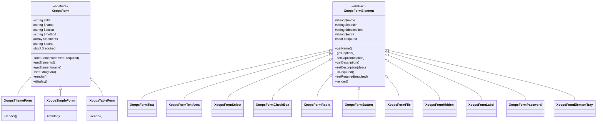
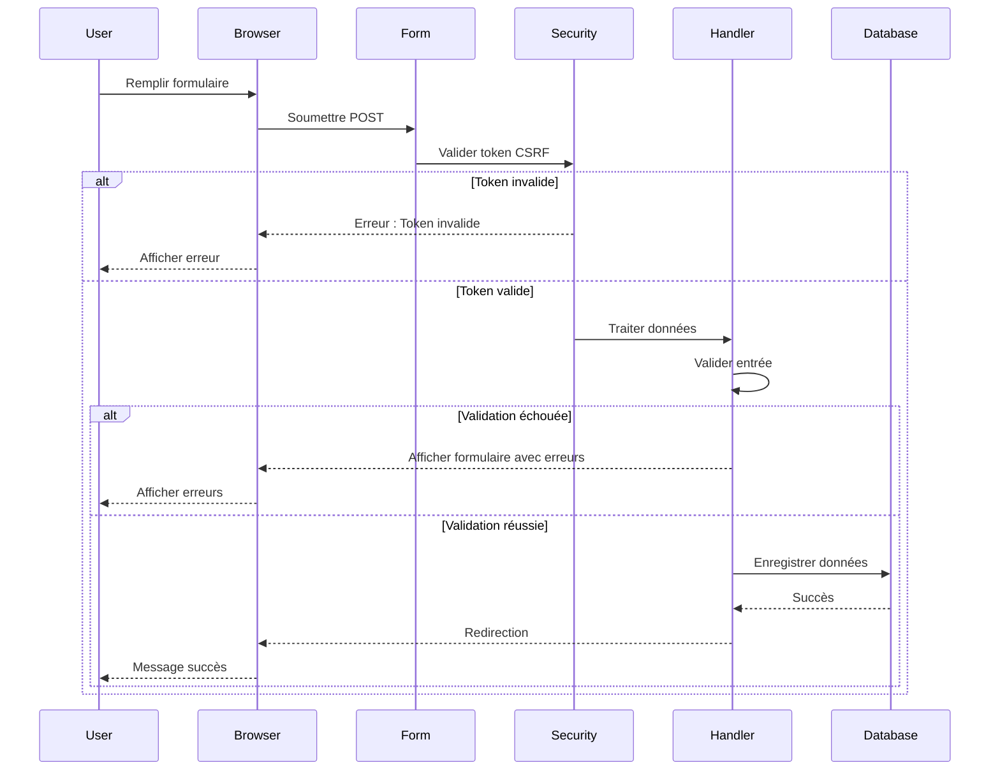

> Documentation API complète pour le système de génération de formulaires XOOPS.

---

## Hiérarchie des classes



---

## XoopsForm (Base abstraite)

### Constructeur

```php
public function __construct(
    string $title,      // Titre du formulaire
    string $name,       // Attribut name du formulaire
    string $action,     // URL action du formulaire
    string $method = 'post',  // Méthode HTTP
    bool $addToken = false    // Ajouter token CSRF
)
```

### Méthodes

| Méthode | Paramètres | Retour | Description |
|--------|------------|--------|-------------|
| `addElement` | `XoopsFormElement $element, bool $required = false` | `void` | Ajouter élément au formulaire |
| `getElements` | - | `array` | Obtenir tous les éléments |
| `getElement` | `string $name` | `XoopsFormElement\|null` | Obtenir élément par nom |
| `setExtra` | `string $extra` | `void` | Définir attributs HTML supplémentaires |
| `getExtra` | - | `string` | Obtenir attributs supplémentaires |
| `getTitle` | - | `string` | Obtenir titre du formulaire |
| `setTitle` | `string $title` | `void` | Définir titre du formulaire |
| `getName` | - | `string` | Obtenir nom du formulaire |
| `getAction` | - | `string` | Obtenir URL action |
| `render` | - | `string` | Rendu HTML du formulaire |
| `display` | - | `void` | Afficher le formulaire rendu |
| `insertBreak` | `string $extra = ''` | `void` | Insérer coupure visuelle |
| `setRequired` | `XoopsFormElement $element` | `void` | Marquer élément obligatoire |

---

## XoopsThemeForm

La classe de formulaire la plus couramment utilisée, rendu avec style sensible au thème.

### Utilisation

```php
<?php
$form = new XoopsThemeForm(
    'Enregistrement utilisateur',
    'registration_form',
    'register.php',
    'post',
    true  // Inclure token CSRF
);

$form->addElement(new XoopsFormText('Nom d\'utilisateur', 'uname', 25, 255, ''), true);
$form->addElement(new XoopsFormPassword('Mot de passe', 'pass', 25, 255), true);
$form->addElement(new XoopsFormButton('', 'submit', _SUBMIT, 'submit'));

echo $form->render();
```

---

## Éléments de formulaires

### XoopsFormText

Entrée texte sur une seule ligne.

```php
$text = new XoopsFormText(
    string $caption,    // Texte label
    string $name,       // Attribut name
    int $size,          // Largeur d'affichage
    int $maxlength,     // Max caractères
    mixed $value = ''   // Valeur par défaut
);
```

### XoopsFormTextArea

Entrée texte multi-lignes.

```php
$textarea = new XoopsFormTextArea(
    string $caption,
    string $name,
    mixed $value = '',
    int $rows = 5,
    int $cols = 50
);
```

### XoopsFormSelect

Liste déroulante ou sélection multiple.

```php
$select = new XoopsFormSelect(
    string $caption,
    string $name,
    mixed $value = null,
    int $size = 1,        // 1 = dropdown, >1 = listbox
    bool $multiple = false
);
```

### XoopsFormCheckBox

Case à cocher ou groupe de cases.

```php
$checkbox = new XoopsFormCheckBox(
    string $caption,
    string $name,
    mixed $value = null,
    string $delimeter = '&nbsp;'
);
```

### XoopsFormRadio

Groupe de boutons radio.

```php
$radio = new XoopsFormRadio(
    string $caption,
    string $name,
    mixed $value = null,
    string $delimeter = '&nbsp;'
);
```

### XoopsFormButton

Bouton soumettre, réinitialiser ou personnalisé.

```php
$button = new XoopsFormButton(
    string $caption,
    string $name,
    string $value = '',
    string $type = 'button'  // 'submit', 'reset', 'button'
);
```

### XoopsFormFile

Entrée téléchargement fichier.

```php
$file = new XoopsFormFile(
    string $caption,
    string $name,
    int $maxFileSize = 0
);
```

### XoopsFormHidden

Champ input caché.

```php
$hidden = new XoopsFormHidden(
    string $name,
    mixed $value
);
```

### XoopsFormPassword

Champ entrée mot de passe.

```php
$password = new XoopsFormPassword(
    string $caption,
    string $name,
    int $size,
    int $maxlength,
    mixed $value = ''
);
```

### XoopsFormLabel

Label d'affichage uniquement (pas une entrée).

```php
$label = new XoopsFormLabel(
    string $caption,
    string $value
);
```

### XoopsFormElementTray

Groupe d'éléments multiples ensemble.

```php
$tray = new XoopsFormElementTray(
    string $caption,
    string $delimeter = '&nbsp;'
);

$tray->addElement(XoopsFormElement $element, bool $required = false);
$tray->getElements();
```

---

## Diagramme flux du formulaire



---

## Documentation connexe

- XoopsObject API
- Guides formulaires
- Protection CSRF

---

#xoops #api #forms #xoopsform #reference
