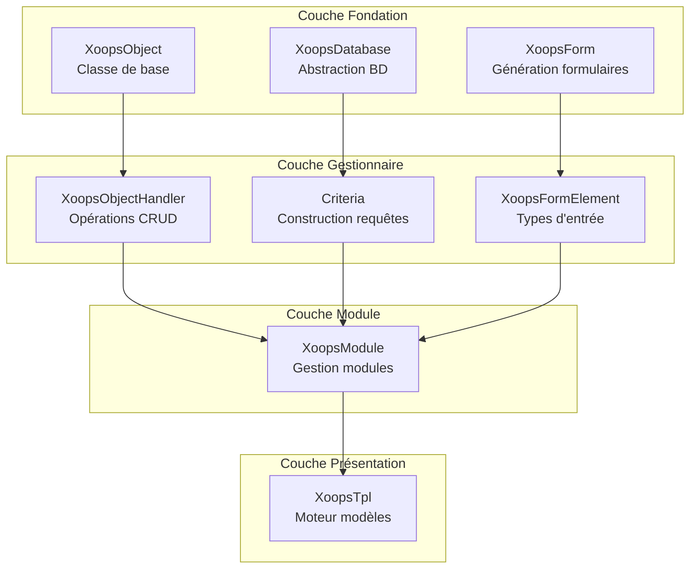
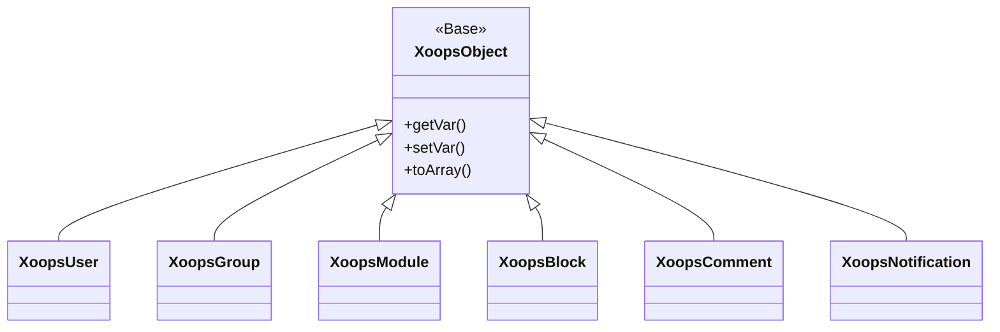
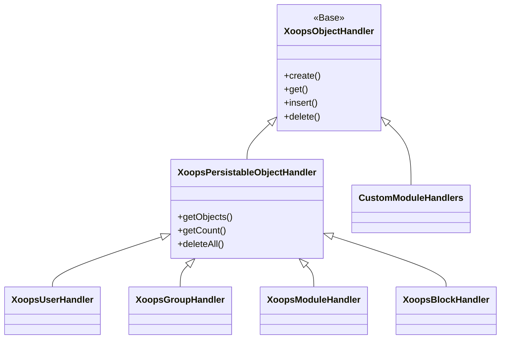
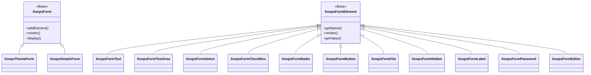

Bienvenue dans la documentation complète de la Référence API d'XOOPS. Cette section fournit une documentation détaillée pour tous les classes principales, méthodes et systèmes qui composent le système de gestion de contenu XOOPS.

## Aperçu

L'API XOOPS est organisée en plusieurs sous-systèmes majeurs, chacun responsable d'un aspect spécifique de la fonctionnalité du CMS. Comprendre ces APIs est essentiel pour développer des modules, des thèmes et des extensions pour XOOPS.

## Sections de l'API

### Classes principales

Les classes fondamentales sur lesquelles tous les autres composants d'XOOPS sont construits.

| Documentation | Description |
|--------------|-------------|
| XoopsObject | Classe de base pour tous les objets de données dans XOOPS |
| XoopsObjectHandler | Modèle gestionnaire pour les opérations CRUD |

### Couche base de données

Utilitaires d'abstraction base de données et de construction de requêtes.

| Documentation | Description |
|--------------|-------------|
| XoopsDatabase | Couche d'abstraction base de données |
| Système Criteria | Critères de requête et conditions |
| QueryBuilder | Construction de requêtes fluide moderne |

### Système de formulaires

Génération et validation de formulaires HTML.

| Documentation | Description |
|--------------|-------------|
| XoopsForm | Conteneur et rendu de formulaires |
| Éléments de formulaires | Tous les types d'éléments de formulaires disponibles |

### Classes noyau

Composants système et services principaux.

| Documentation | Description |
|--------------|-------------|
| Classes noyau | Système noyau et composants principaux |

### Système de modules

Gestion et cycle de vie des modules.

| Documentation | Description |
|--------------|-------------|
| Système de modules | Chargement, installation et gestion des modules |

### Système de modèles

Intégration Smarty.

| Documentation | Description |
|--------------|-------------|
| Système de modèles | Intégration et gestion des modèles Smarty |

### Système d'utilisateurs

Gestion des utilisateurs et authentification.

| Documentation | Description |
|--------------|-------------|
| Système d'utilisateurs | Comptes utilisateurs, groupes et permissions |

## Vue d'ensemble de l'architecture



## Hiérarchie des classes

### Modèle d'objet



### Modèle gestionnaire



### Modèle formulaire



## Modèles de conception

L'API XOOPS implémente plusieurs modèles de conception bien connus :

### Modèle Singleton
Utilisé pour les services globaux comme les connexions base de données et les instances de conteneurs.

```php
$db = XoopsDatabase::getInstance();
$container = XoopsContainer::getInstance();
```

### Modèle Factory
Les gestionnaires d'objets créent des objets de domaine de manière cohérente.

```php
$handler = xoops_getHandler('user');
$user = $handler->create();
```

### Modèle Composite
Les formulaires contiennent plusieurs éléments de formulaires; les critères peuvent contenir des critères imbriqués.

```php
$criteria = new CriteriaCompo();
$criteria->add(new Criteria('status', 1));
$criteria->add(new CriteriaCompo(...)); // Imbriqué
```

### Modèle Observateur
Le système d'événements permet un couplage faible entre les modules.

```php
$dispatcher->addListener('module.news.article_published', $callback);
```

## Exemples de démarrage rapide

### Créer et enregistrer un objet

```php
// Obtenir le gestionnaire
$handler = xoops_getHandler('user');

// Créer un nouvel objet
$user = $handler->create();
$user->setVar('uname', 'newuser');
$user->setVar('email', 'user@example.com');

// Enregistrer dans la base de données
$handler->insert($user);
```

### Interrogation avec Criteria

```php
// Construire les critères
$criteria = new CriteriaCompo();
$criteria->add(new Criteria('level', 0, '>'));
$criteria->setSort('uname');
$criteria->setOrder('ASC');
$criteria->setLimit(10);

// Obtenir les objets
$handler = xoops_getHandler('user');
$users = $handler->getObjects($criteria);
```

### Créer un formulaire

```php
$form = new XoopsThemeForm('Profil utilisateur', 'userform', 'save.php', 'post', true);
$form->addElement(new XoopsFormText('Nom d\'utilisateur', 'uname', 50, 255, $user->getVar('uname')));
$form->addElement(new XoopsFormTextArea('Bio', 'bio', $user->getVar('bio')));
$form->addElement(new XoopsFormButton('', 'submit', _SUBMIT, 'submit'));
echo $form->render();
```

## Conventions de l'API

### Conventions de nommage

| Type | Convention | Exemple |
|------|-----------|---------|
| Classes | PascalCase | `XoopsUser`, `CriteriaCompo` |
| Méthodes | camelCase | `getVar()`, `setVar()` |
| Propriétés | camelCase (protégé) | `$_vars`, `$_handler` |
| Constantes | UPPER_SNAKE_CASE | `XOBJ_DTYPE_INT` |
| Tables base de données | snake_case | `users`, `groups_users_link` |

### Types de données

XOOPS définit les types de données standard pour les variables d'objets :

| Constante | Type | Description |
|----------|------|-------------|
| `XOBJ_DTYPE_TXTBOX` | String | Entrée texte (nettoyée) |
| `XOBJ_DTYPE_TXTAREA` | String | Contenu textarea |
| `XOBJ_DTYPE_INT` | Integer | Valeurs numériques |
| `XOBJ_DTYPE_URL` | String | Validation URL |
| `XOBJ_DTYPE_EMAIL` | String | Validation email |
| `XOBJ_DTYPE_ARRAY` | Array | Tableaux sérialisés |
| `XOBJ_DTYPE_OTHER` | Mixed | Traitement personnalisé |
| `XOBJ_DTYPE_SOURCE` | String | Code source (nettoyage minimal) |
| `XOBJ_DTYPE_STIME` | Integer | Horodatage court |
| `XOBJ_DTYPE_MTIME` | Integer | Horodatage moyen |
| `XOBJ_DTYPE_LTIME` | Integer | Horodatage long |

## Méthodes d'authentification

L'API supporte plusieurs méthodes d'authentification :

### Authentification par clé API
```
X-API-Key: your-api-key
```

### Authentification Bearer OAuth
```
Authorization: Bearer your-oauth-token
```

### Authentification basée sur session
Utilise la session XOOPS existante quand l'utilisateur est connecté.

## Points d'entrée API REST

Quand l'API REST est activée :

| Point d'entrée | Méthode | Description |
|----------|--------|-------------|
| `/api.php/rest/users` | GET | Lister les utilisateurs |
| `/api.php/rest/users/{id}` | GET | Obtenir l'utilisateur par ID |
| `/api.php/rest/users` | POST | Créer un utilisateur |
| `/api.php/rest/users/{id}` | PUT | Mettre à jour l'utilisateur |
| `/api.php/rest/users/{id}` | DELETE | Supprimer l'utilisateur |
| `/api.php/rest/modules` | GET | Lister les modules |

## Documentation connexe

- Guide de développement de modules
- Guide de développement de thèmes
- Configuration système
- Meilleures pratiques de sécurité

## Historique des versions

| Version | Changements |
|---------|---------|
| 2.5.11 | Dernière version stable |
| 2.5.10 | Ajout du support API GraphQL |
| 2.5.9 | Système Criteria amélioré |
| 2.5.8 | Support autoloading PSR-4 |

---

*Cette documentation fait partie de la base de connaissances XOOPS. Pour les dernières mises à jour, visitez le [dépôt XOOPS GitHub](https://github.com/XOOPS).*
