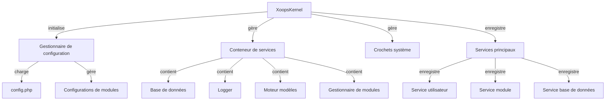

Le noyau XOOPS fournit le cadre fondamental pour l'amorçage du système, la gestion des configurations, la gestion des événements du système et l'utilitaire principal. Ces classes forment l'épine dorsale de l'application XOOPS.

## Architecture système



## Classe XoopsKernel

La classe noyau principale qui initialise et gère le système XOOPS.

### Vue d'ensemble de la classe

```php
namespace Xoops;

class XoopsKernel
{
    private static ?XoopsKernel $instance = null;
    protected ServiceContainer $services;
    protected ConfigurationManager $config;
    protected array $modules = [];
    protected bool $isLoaded = false;
}
```

### getInstance

Récupère l'instance singleton du noyau.

```php
public static function getInstance(): XoopsKernel
```

**Retour :** `XoopsKernel` - L'instance singleton du noyau

**Exemple :**
```php
$kernel = XoopsKernel::getInstance();
```

### Boot

Le processus d'amorçage du noyau suit ces étapes :

1. **Initialisation** - Définir gestionnaires d'erreurs, définir constantes
2. **Configuration** - Charger fichiers de configuration
3. **Enregistrement de services** - Enregistrer services principaux
4. **Détection de modules** - Analyser et identifier modules actifs
5. **Initialisation base de données** - Connexion à la base de données
6. **Nettoyage** - Préparer pour la gestion des requêtes

```php
public function boot(): void
```

**Exemple :**
```php
$kernel = XoopsKernel::getInstance();
$kernel->boot();
```

### Méthodes conteneur de services

#### registerService

Enregistre un service dans le conteneur de services.

```php
public function registerService(
    string $name,
    callable|object $definition
): void
```

**Paramètres :**

| Paramètre | Type | Description |
|-----------|------|-------------|
| `$name` | string | Identifiant du service |
| `$definition` | callable\|object | Fabrique de service ou instance |

**Exemple :**
```php
$kernel->registerService('custom.handler', function($c) {
    return new CustomHandler();
});
```

#### getService

Récupère un service enregistré.

```php
public function getService(string $name): mixed
```

**Paramètres :**

| Paramètre | Type | Description |
|-----------|------|-------------|
| `$name` | string | Identifiant du service |

**Retour :** `mixed` - Le service demandé

**Exemple :**
```php
$database = $kernel->getService('database');
$logger = $kernel->getService('logger');
```

#### hasService

Vérifie si un service est enregistré.

```php
public function hasService(string $name): bool
```

**Exemple :**
```php
if ($kernel->hasService('cache')) {
    $cache = $kernel->getService('cache');
}
```

## Gestionnaire de configuration

Gère la configuration d'application et les paramètres de modules.

### Vue d'ensemble de la classe

```php
namespace Xoops\Core;

class ConfigurationManager
{
    protected array $config = [];
    protected array $defaults = [];
    protected string $configPath;
}
```

### Méthodes

#### load

Charge la configuration depuis fichier ou tableau.

```php
public function load(string|array $source): void
```

**Paramètres :**

| Paramètre | Type | Description |
|-----------|------|-------------|
| `$source` | string\|array | Chemin fichier configuration ou tableau |

**Exemple :**
```php
$config = $kernel->getService('config');
$config->load(XOOPS_ROOT_PATH . '/include/config.php');
$config->load(['sitename' => 'Mon Site', 'admin_email' => 'admin@example.com']);
```

#### get

Récupère une valeur de configuration.

```php
public function get(string $key, mixed $default = null): mixed
```

**Paramètres :**

| Paramètre | Type | Description |
|-----------|------|-------------|
| `$key` | string | Clé configuration (notation pointée) |
| `$default` | mixed | Valeur par défaut si non trouvée |

**Retour :** `mixed` - Valeur configuration

**Exemple :**
```php
$siteName = $config->get('sitename');
$adminEmail = $config->get('admin.email', 'admin@example.com');
```

#### set

Définit une valeur de configuration.

```php
public function set(string $key, mixed $value): void
```

**Paramètres :**

| Paramètre | Type | Description |
|-----------|------|-------------|
| `$key` | string | Clé configuration |
| `$value` | mixed | Valeur configuration |

**Exemple :**
```php
$config->set('sitename', 'Nouveau nom de site');
$config->set('features.cache_enabled', true);
```

## Crochets système

Les crochets système permettent aux modules et plugins d'exécuter du code à des points spécifiques du cycle de vie de l'application.

### Classe HookManager

```php
namespace Xoops\Core;

class HookManager
{
    protected array $hooks = [];
    protected array $listeners = [];
}
```

### Méthodes

#### addHook

Enregistre un point de crochet.

```php
public function addHook(string $name): void
```

**Paramètres :**

| Paramètre | Type | Description |
|-----------|------|-------------|
| `$name` | string | Identifiant du crochet |

**Exemple :**
```php
$hooks = $kernel->getService('hooks');
$hooks->addHook('system.startup');
$hooks->addHook('user.login');
$hooks->addHook('module.install');
```

#### listen

Attache un écouteur à un crochet.

```php
public function listen(
    string $hookName,
    callable $callback,
    int $priority = 10
): void
```

**Paramètres :**

| Paramètre | Type | Description |
|-----------|------|-------------|
| `$hookName` | string | Identifiant du crochet |
| `$callback` | callable | Fonction à exécuter |
| `$priority` | int | Priorité d'exécution (plus haut s'exécute en premier) |

**Exemple :**
```php
$hooks->listen('user.login', function($user) {
    error_log('Utilisateur ' . $user->uname . ' connecté');
}, 10);
```

#### trigger

Exécute tous les écouteurs pour un crochet.

```php
public function trigger(
    string $hookName,
    mixed $arguments = null
): array
```

**Paramètres :**

| Paramètre | Type | Description |
|-----------|------|-------------|
| `$hookName` | string | Identifiant du crochet |
| `$arguments` | mixed | Données à passer aux écouteurs |

**Retour :** `array` - Résultats de tous les écouteurs

**Exemple :**
```php
$results = $hooks->trigger('system.startup');
$results = $hooks->trigger('user.created', $newUser);
```

## Vue d'ensemble des services principaux

Le noyau enregistre plusieurs services principaux lors de l'amorçage :

| Service | Classe | Objectif |
|---------|-------|---------|
| `database` | XoopsDatabase | Couche d'abstraction base de données |
| `config` | ConfigurationManager | Gestion configuration |
| `logger` | Logger | Journalisation d'application |
| `template` | XoopsTpl | Moteur modèles |
| `user` | UserManager | Service de gestion utilisateurs |
| `module` | ModuleManager | Gestion des modules |
| `cache` | CacheManager | Couche de cache |
| `hooks` | HookManager | Crochets d'événements système |

## Meilleures pratiques

1. **Amorçage unique** - Appeler `boot()` une seule fois lors du démarrage de l'application
2. **Utiliser le conteneur de services** - Enregistrer et récupérer les services via le noyau
3. **Gérer les crochets tôt** - Enregistrer les écouteurs de crochets avant de les déclencher
4. **Journaliser les événements importants** - Utiliser le service logger pour le débogage
5. **Mettre en cache la configuration** - Charger la configuration une fois et réutiliser
6. **Gérer les erreurs** - Toujours configurer les gestionnaires d'erreurs avant de traiter les requêtes

## Documentation connexe

- ../Module/Module-System - Système de modules et cycle de vie
- ../Template/Template-System - Intégration du moteur modèles
- ../User/User-System - Authentification et gestion des utilisateurs
- ../Database/XoopsDatabase - Couche base de données

---

*Voir aussi : [Code source noyau XOOPS](https://github.com/XOOPS/XoopsCore27/tree/master/htdocs/class)*
