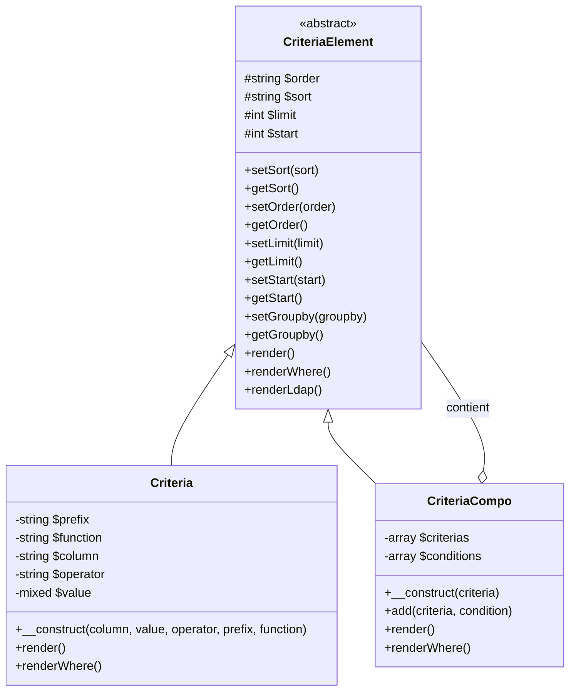
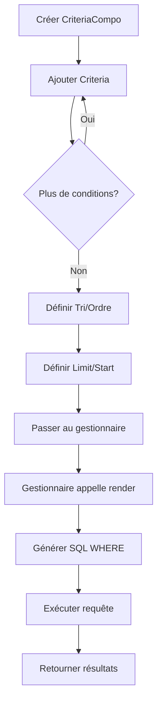
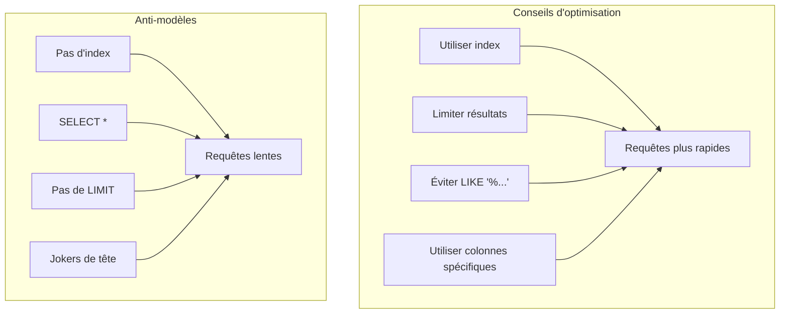

> Documentation API complète pour le système de construction de requêtes Criteria d'XOOPS.

---

## Architecture système Criteria



---

## Classe Criteria

### Constructeur

```php
public function __construct(
    string $column,           // Nom de colonne
    mixed $value = '',        // Valeur à comparer
    string $operator = '=',   // Opérateur de comparaison
    string $prefix = '',      // Préfixe de table
    string $function = ''     // Enveloppe de fonction SQL
)
```

### Opérateurs

| Opérateur | Exemple | Sortie SQL |
|----------|---------|------------|
| `=` | `new Criteria('status', 1)` | `status = 1` |
| `!=` | `new Criteria('status', 0, '!=')` | `status != 0` |
| `<>` | `new Criteria('status', 0, '<>')` | `status <> 0` |
| `<` | `new Criteria('age', 18, '<')` | `age < 18` |
| `<=` | `new Criteria('age', 18, '<=')` | `age <= 18` |
| `>` | `new Criteria('age', 18, '>')` | `age > 18` |
| `>=` | `new Criteria('age', 18, '>=')` | `age >= 18` |
| `LIKE` | `new Criteria('title', '%php%', 'LIKE')` | `title LIKE '%php%'` |
| `NOT LIKE` | `new Criteria('title', '%spam%', 'NOT LIKE')` | `title NOT LIKE '%spam%'` |
| `IN` | `new Criteria('id', '(1,2,3)', 'IN')` | `id IN (1,2,3)` |
| `NOT IN` | `new Criteria('id', '(1,2,3)', 'NOT IN')` | `id NOT IN (1,2,3)` |
| `IS NULL` | `new Criteria('deleted', null, 'IS NULL')` | `deleted IS NULL` |
| `IS NOT NULL` | `new Criteria('email', null, 'IS NOT NULL')` | `email IS NOT NULL` |
| `BETWEEN` | `new Criteria('created', '1000 AND 2000', 'BETWEEN')` | `created BETWEEN 1000 AND 2000` |

### Exemples d'utilisation

```php
// Égalité simple
$criteria = new Criteria('status', 'published');

// Comparaison numérique
$criteria = new Criteria('views', 100, '>=');

// Correspondance motif
$criteria = new Criteria('title', '%XOOPS%', 'LIKE');

// Avec préfixe de table
$criteria = new Criteria('uid', 1, '=', 'u');
// Rendu : u.uid = 1

// Avec fonction SQL
$criteria = new Criteria('title', '', '!=', '', 'LOWER');
// Rendu : LOWER(title) != ''
```

---

## Classe CriteriaCompo

### Constructeur et méthodes

```php
// Créer compo vide
$criteria = new CriteriaCompo();

// Ou avec criteria initial
$criteria = new CriteriaCompo(new Criteria('status', 'active'));

// Ajouter criteria (AND par défaut)
$criteria->add(new Criteria('views', 10, '>='));

// Ajouter avec OR
$criteria->add(new Criteria('featured', 1), 'OR');

// Imbrication
$subCriteria = new CriteriaCompo();
$subCriteria->add(new Criteria('author', 1));
$subCriteria->add(new Criteria('author', 2), 'OR');
$criteria->add($subCriteria); // (author = 1 OR author = 2)
```

### Tri et pagination

```php
$criteria = new CriteriaCompo();
$criteria->add(new Criteria('status', 'published'));

// Tri unique
$criteria->setSort('created');
$criteria->setOrder('DESC');

// Tri multiple
$criteria->setSort('category_id, created');
$criteria->setOrder('ASC, DESC');

// Pagination
$criteria->setLimit(10);    // Articles par page
$criteria->setStart(0);     // Décalage (page * limit)

// Grouper par
$criteria->setGroupby('category_id');
```

---

## Flux construction de requête



---

## Intégration gestionnaire

```php
// Méthodes standard du gestionnaire qui acceptent Criteria

// Obtenir objets multiples
$objects = $handler->getObjects($criteria);
$objects = $handler->getObjects($criteria, true);  // Comme tableau
$objects = $handler->getObjects($criteria, true, true); // Tableau, id comme clé

// Obtenir comptage
$count = $handler->getCount($criteria);

// Obtenir liste (id => identifiant)
$list = $handler->getList($criteria);

// Supprimer correspondants
$deleted = $handler->deleteAll($criteria);

// Mettre à jour correspondants
$handler->updateAll('status', 'archived', $criteria);
```

---

## Considérations de performance



### Meilleures pratiques

1. **Toujours définir LIMIT** pour les grandes tables
2. **Utiliser les index** sur les colonnes utilisées dans les critères
3. **Éviter les jokers de tête** dans LIKE (`'%term'` est lent)
4. **Pré-filtrer en PHP** quand possible pour la logique complexe
5. **Utiliser COUNT avec modération** - mettre en cache les résultats si possible

---

## Documentation connexe

- Couche base de données
- API XoopsObjectHandler
- Prévention de l'injection SQL

---

#xoops #api #criteria #database #query #reference
