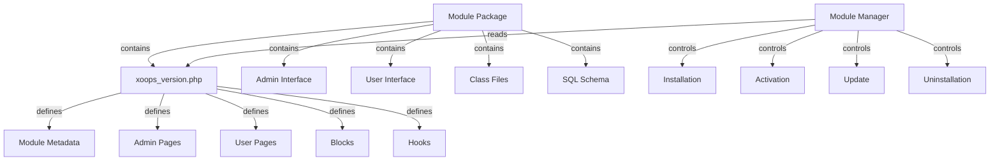

Le système de modules XOOPS fournit un cadre complet pour développer, installer, gérer et étendre les fonctionnalités des modules. Les modules sont des paquets autonomes qui étendent XOOPS avec des fonctionnalités et des capacités supplémentaires.

## Architecture des modules



## Structure des modules

Structure standard du répertoire des modules XOOPS :

```
mymodule/
├── xoops_version.php          # Module manifest and configuration
├── admin.php                  # Admin main page
├── index.php                  # User main page
├── admin/                     # Admin pages directory
│   ├── main.php
│   ├── manage.php
│   └── settings.php
├── class/                     # Module classes
│   ├── Handler/
│   │   ├── ItemHandler.php
│   │   └── CategoryHandler.php
│   └── Objects/
│       ├── Item.php
│       └── Category.php
├── sql/                       # Database schemas
│   ├── mysql.sql
│   └── postgres.sql
├── include/                   # Include files
│   ├── common.inc.php
│   └── functions.php
├── templates/                 # Module templates
│   ├── admin/
│   │   └── main.tpl
│   └── user/
│       ├── index.tpl
│       └── item.tpl
├── blocks/                    # Module blocks
│   └── blocks.php
├── tests/                     # Unit tests
├── language/                  # Language files
│   ├── english/
│   │   └── main.php
│   └── spanish/
│       └── main.php
└── docs/                      # Documentation
```

## Classe XoopsModule

La classe XoopsModule représente un module XOOPS installé.

### Vue d'ensemble de la classe

```php
namespace Xoops\Core\Module;

class XoopsModule extends XoopsObject
{
    protected int $moduleid = 0;
    protected string $name = '';
    protected string $dirname = '';
    protected string $version = '';
    protected string $description = '';
    protected array $config = [];
    protected array $blocks = [];
    protected array $adminPages = [];
    protected array $userPages = [];
}
```

### Propriétés

| Propriété | Type | Description |
|----------|------|-------------|
| `$moduleid` | int | ID unique du module |
| `$name` | string | Nom d'affichage du module |
| `$dirname` | string | Nom du répertoire du module |
| `$version` | string | Version actuelle du module |
| `$description` | string | Description du module |
| `$config` | array | Configuration du module |
| `$blocks` | array | Blocs du module |
| `$adminPages` | array | Pages du panneau d'administration |
| `$userPages` | array | Pages destinées aux utilisateurs |

### Constructeur

```php
public function __construct()
```

Crée une nouvelle instance de module et initialise les variables.

### Méthodes noyau

#### getName

Obtient le nom d'affichage du module.

```php
public function getName(): string
```

**Retour :** `string` - Nom d'affichage du module

**Exemple :**
```php
$module = new XoopsModule();
$module->setVar('name', 'Publisher');
echo $module->getName(); // "Publisher"
```

#### getDirname

Obtient le nom du répertoire du module.

```php
public function getDirname(): string
```

**Retour :** `string` - Nom du répertoire du module

**Exemple :**
```php
echo $module->getDirname(); // "publisher"
```

#### getVersion

Obtient la version actuelle du module.

```php
public function getVersion(): string
```

**Retour :** `string` - Chaîne de version

**Exemple :**
```php
echo $module->getVersion(); // "2.1.0"
```

#### getDescription

Obtient la description du module.

```php
public function getDescription(): string
```

**Retour :** `string` - Description du module

**Exemple :**
```php
$desc = $module->getDescription();
```

#### getConfig

Récupère la configuration du module.

```php
public function getConfig(string $key = null): mixed
```

**Paramètres :**

| Paramètre | Type | Description |
|-----------|------|-------------|
| `$key` | string | Clé de configuration (null pour tout) |

**Retour :** `mixed` - Valeur de configuration ou tableau

**Exemple :**
```php
$config = $module->getConfig();
$itemsPerPage = $module->getConfig('items_per_page');
```

#### setConfig

Définit la configuration du module.

```php
public function setConfig(string $key, mixed $value): void
```

**Paramètres :**

| Paramètre | Type | Description |
|-----------|------|-------------|
| `$key` | string | Clé de configuration |
| `$value` | mixed | Valeur de configuration |

**Exemple :**
```php
$module->setConfig('items_per_page', 20);
$module->setConfig('enable_cache', true);
```

#### getPath

Obtient le chemin du système de fichiers complet vers le module.

```php
public function getPath(): string
```

**Retour :** `string` - Chemin absolu du répertoire du module

**Exemple :**
```php
$path = $module->getPath(); // "/var/www/xoops/modules/publisher"
$classPath = $module->getPath() . '/class';
```

#### getUrl

Obtient l'URL du module.

```php
public function getUrl(): string
```

**Retour :** `string` - URL du module

**Exemple :**
```php
$url = $module->getUrl(); // "http://example.com/modules/publisher"
```

## Processus d'installation des modules

### Fonction xoops_module_install

La fonction d'installation du module définie dans `xoops_version.php` :

```php
function xoops_module_install_modulename($module)
{
    // $module is an XoopsModule instance

    // Create database tables
    // Initialize default configuration
    // Create default folders
    // Set up file permissions

    return true; // Success
}
```

**Paramètres :**

| Paramètre | Type | Description |
|-----------|------|-------------|
| `$module` | XoopsModule | Le module en cours d'installation |

**Retour :** `bool` - True en cas de succès, false en cas d'échec

**Exemple :**
```php
function xoops_module_install_publisher($module)
{
    // Get module path
    $modulePath = $module->getPath();

    // Create uploads directory
    $uploadsPath = XOOPS_ROOT_PATH . '/uploads/publisher';
    if (!is_dir($uploadsPath)) {
        mkdir($uploadsPath, 0755, true);
    }

    // Get database connection
    global $xoopsDB;

    // Execute SQL installation script
    $sqlFile = $modulePath . '/sql/mysql.sql';
    if (file_exists($sqlFile)) {
        $sqlQueries = file_get_contents($sqlFile);
        // Execute queries (simplified)
        $xoopsDB->queryFromFile($sqlFile);
    }

    // Set default configuration
    $module->setConfig('items_per_page', 10);
    $module->setConfig('enable_comments', true);

    return true;
}
```

### Fonction xoops_module_uninstall

La fonction de désinstallation du module :

```php
function xoops_module_uninstall_modulename($module)
{
    // Drop database tables
    // Remove uploaded files
    // Clean up configuration

    return true;
}
```

**Exemple :**
```php
function xoops_module_uninstall_publisher($module)
{
    global $xoopsDB;

    // Drop tables
    $tables = ['publisher_items', 'publisher_categories', 'publisher_comments'];
    foreach ($tables as $table) {
        $xoopsDB->query('DROP TABLE IF EXISTS ' . $xoopsDB->prefix($table));
    }

    // Remove upload folder
    $uploadsPath = XOOPS_ROOT_PATH . '/uploads/publisher';
    if (is_dir($uploadsPath)) {
        // Recursive directory deletion
        $this->recursiveRemoveDir($uploadsPath);
    }

    return true;
}
```

## Crochets des modules

Les crochets des modules permettent aux modules de s'intégrer avec d'autres modules et le système.

### Déclaration des crochets

Dans `xoops_version.php` :

```php
$modversion['hooks'] = [
    'system.page.footer' => [
        'function' => 'publisher_page_footer'
    ],
    'user.profile.view' => [
        'function' => 'publisher_user_articles'
    ],
];
```

### Implémentation des crochets

```php
// In a module file (e.g., include/hooks.php)

function publisher_page_footer()
{
    // Return HTML for footer
    return '<div class="publisher-footer">Publisher Footer Content</div>';
}

function publisher_user_articles($user_id)
{
    global $xoopsDB;

    // Get user's articles
    $result = $xoopsDB->query(
        'SELECT * FROM ' . $xoopsDB->prefix('publisher_articles') .
        ' WHERE author_id = ? ORDER BY published DESC LIMIT 5',
        [$user_id]
    );

    $articles = [];
    while ($row = $xoopsDB->fetchAssoc($result)) {
        $articles[] = $row;
    }

    return $articles;
}
```

### Crochets système disponibles

| Crochet | Paramètres | Description |
|--------|-----------|-------------|
| `system.page.header` | Aucun | Sortie d'en-tête de page |
| `system.page.footer` | Aucun | Sortie de pied de page |
| `user.login.success` | objet $user | Après la connexion utilisateur |
| `user.logout` | objet $user | Après la déconnexion utilisateur |
| `user.profile.view` | $user_id | Affichage du profil utilisateur |
| `module.install` | objet $module | Installation du module |
| `module.uninstall` | objet $module | Désinstallation du module |

## Service Gestionnaire de modules

Le service ModuleManager gère les opérations de modules.

### Méthodes

#### getModule

Récupère un module par nom.

```php
public function getModule(string $dirname): ?XoopsModule
```

**Paramètres :**

| Paramètre | Type | Description |
|-----------|------|-------------|
| `$dirname` | string | Nom du répertoire du module |

**Retour :** `?XoopsModule` - Instance du module ou null

**Exemple :**
```php
$moduleManager = $kernel->getService('module');
$publisher = $moduleManager->getModule('publisher');
if ($publisher) {
    echo $publisher->getName();
}
```

#### getAllModules

Obtient tous les modules installés.

```php
public function getAllModules(bool $activeOnly = true): array
```

**Paramètres :**

| Paramètre | Type | Description |
|-----------|------|-------------|
| `$activeOnly` | bool | Retourner uniquement les modules actifs |

**Retour :** `array` - Tableau d'objets XoopsModule

**Exemple :**
```php
$activeModules = $moduleManager->getAllModules(true);
foreach ($activeModules as $module) {
    echo $module->getName() . " - " . $module->getVersion() . "\n";
}
```

#### isModuleActive

Vérifie si un module est actif.

```php
public function isModuleActive(string $dirname): bool
```

**Exemple :**
```php
if ($moduleManager->isModuleActive('publisher')) {
    // Publisher module is active
}
```

#### activateModule

Active un module.

```php
public function activateModule(string $dirname): bool
```

**Exemple :**
```php
if ($moduleManager->activateModule('publisher')) {
    echo "Publisher activated";
}
```

#### deactivateModule

Désactive un module.

```php
public function deactivateModule(string $dirname): bool
```

**Exemple :**
```php
if ($moduleManager->deactivateModule('publisher')) {
    echo "Publisher deactivated";
}
```

## Configuration du module (xoops_version.php)

Exemple complet du manifeste du module :

```php
<?php
/**
 * Module manifest for Publisher
 */

$modversion = [
    'name' => 'Publisher',
    'version' => '2.1.0',
    'description' => 'Professional content publishing module',
    'author' => 'XOOPS Community',
    'credits' => 'Based on original work by...',
    'license' => 'GPL v2',
    'official' => 1,
    'image' => 'images/logo.png',
    'dirname' => 'publisher',
    'onInstall' => 'xoops_module_install_publisher',
    'onUpdate' => 'xoops_module_update_publisher',
    'onUninstall' => 'xoops_module_uninstall_publisher',

    // Admin pages
    'hasAdmin' => 1,
    'adminindex' => 'admin/main.php',
    'adminmenu' => [
        [
            'title' => 'Dashboard',
            'link' => 'admin/main.php',
            'icon' => 'dashboard.png'
        ],
        [
            'title' => 'Manage Items',
            'link' => 'admin/items.php',
            'icon' => 'items.png'
        ],
        [
            'title' => 'Settings',
            'link' => 'admin/settings.php',
            'icon' => 'settings.png'
        ]
    ],

    // User pages
    'hasMain' => 1,
    'main_file' => 'index.php',

    // Blocks
    'blocks' => [
        [
            'file' => 'blocks/recent.php',
            'name' => 'Recent Articles',
            'description' => 'Display recent published articles',
            'show_func' => 'publisher_recent_show',
            'edit_func' => 'publisher_recent_edit',
            'options' => '5|0|0',
            'template' => 'publisher_block_recent.tpl'
        ],
        [
            'file' => 'blocks/featured.php',
            'name' => 'Featured Articles',
            'description' => 'Display featured articles',
            'show_func' => 'publisher_featured_show',
            'edit_func' => 'publisher_featured_edit'
        ]
    ],

    // Module hooks
    'hooks' => [
        'system.page.footer' => [
            'function' => 'publisher_page_footer'
        ],
        'user.profile.view' => [
            'function' => 'publisher_user_articles'
        ]
    ],

    // Configuration items
    'config' => [
        [
            'name' => 'items_per_page',
            'title' => '_MI_PUBLISHER_ITEMS_PER_PAGE',
            'description' => '_MI_PUBLISHER_ITEMS_PER_PAGE_DESC',
            'formtype' => 'text',
            'valuetype' => 'int',
            'default' => '10'
        ],
        [
            'name' => 'enable_comments',
            'title' => '_MI_PUBLISHER_ENABLE_COMMENTS',
            'description' => '_MI_PUBLISHER_ENABLE_COMMENTS_DESC',
            'formtype' => 'yesno',
            'valuetype' => 'int',
            'default' => '1'
        ]
    ]
];

function xoops_module_install_publisher($module)
{
    // Installation logic
    return true;
}

function xoops_module_update_publisher($module)
{
    // Update logic
    return true;
}

function xoops_module_uninstall_publisher($module)
{
    // Uninstallation logic
    return true;
}
```

## Meilleures pratiques

1. **Espacer vos classes** - Utiliser des espaces de noms spécifiques aux modules pour éviter les conflits

2. **Utiliser des gestionnaires** - Toujours utiliser les classes de gestionnaire pour les opérations de base de données

3. **Internationaliser le contenu** - Utiliser les constantes de langue pour toutes les chaînes destinées à l'utilisateur

4. **Créer des scripts d'installation** - Fournir des schémas SQL pour les tables de base de données

5. **Documenter les crochets** - Documenter clairement les crochets fournis par votre module

6. **Versionner votre module** - Incrémenter les numéros de version à chaque sortie

7. **Tester l'installation** - Tester complètement les processus d'installation/désinstallation

8. **Gérer les permissions** - Vérifier les permissions utilisateur avant d'autoriser les actions

## Exemple de module complet

```php
<?php
/**
 * Custom Article Module Main Page
 */

include __DIR__ . '/include/common.inc.php';

// Get module instance
$module = xoops_getModuleByDirname('mymodule');

// Check if module is active
if (!$module) {
    die('Module not found');
}

// Get module configuration
$itemsPerPage = $module->getConfig('items_per_page');

// Get item handler
$itemHandler = xoops_getModuleHandler('item', 'mymodule');

// Fetch items with pagination
$criteria = new CriteriaCompo();
$criteria->add(new Criteria('status', 1));
$items = $itemHandler->getObjects($criteria, $itemsPerPage);

// Prepare template
$xoopsTpl->assign('items', $items);
$xoopsTpl->assign('module_name', $module->getName());
$xoopsTpl->display($module->getPath() . '/templates/user/index.tpl');
```

## Documentation connexe

- ../Kernel/Kernel-Classes - Initialisation du noyau et services noyau
- ../Template/Template-System - Modèles de module et intégration du thème
- ../Database/QueryBuilder - Construction de requêtes de base de données
- ../Core/XoopsObject - Classe objet de base

---

*Voir aussi : [Guide de développement de modules XOOPS](https://github.com/XOOPS/XoopsCore27/wiki/Module-Development)*
