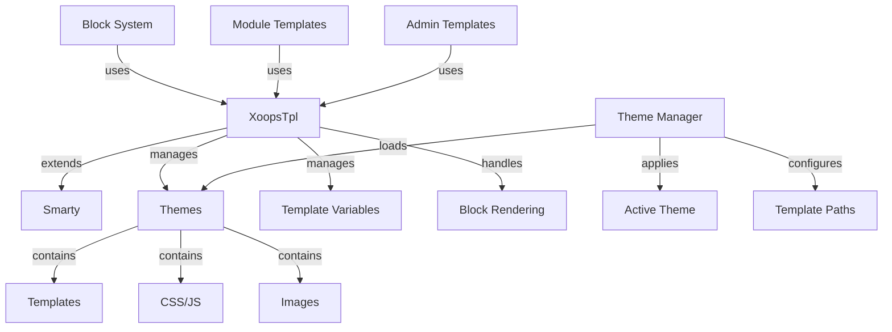

Le système de modèles XOOPS est construit sur le puissant moteur de modèles Smarty, fournissant un moyen flexible et extensible de séparer la logique de présentation de la logique métier. Il gère les thèmes, le rendu des modèles, l'attribution des variables et la génération de contenu dynamique.

## Architecture des modèles



## Classe XoopsTpl

La classe moteur de modèles principale qui étend Smarty.

### Vue d'ensemble de la classe

```php
namespace Xoops\Core;

class XoopsTpl extends Smarty
{
    protected array $vars = [];
    protected string $currentTheme = '';
    protected array $blocks = [];
    protected bool $isAdmin = false;
}
```

### Extension de Smarty

```php
use Xoops\Core\XoopsTpl;

class XoopsTpl extends Smarty
{
    private static ?XoopsTpl $instance = null;

    private function __construct()
    {
        parent::__construct();
        $this->configureDirectories();
        $this->registerPlugins();
    }

    public static function getInstance(): XoopsTpl
    {
        if (!isset(self::$instance)) {
            self::$instance = new self();
        }
        return self::$instance;
    }
}
```

### Méthodes noyau

#### getInstance

Obtient l'instance singleton du modèle.

```php
public static function getInstance(): XoopsTpl
```

**Retour :** `XoopsTpl` - Instance singleton

**Exemple :**
```php
$xoopsTpl = XoopsTpl::getInstance();
```

#### assign

Assigne une variable au modèle.

```php
public function assign(
    string|array $tplVar,
    mixed $value = null
): void
```

**Paramètres :**

| Paramètre | Type | Description |
|-----------|------|-------------|
| `$tplVar` | string\|array | Nom de variable ou tableau associatif |
| `$value` | mixed | Valeur de variable |

**Exemple :**
```php
$xoopsTpl->assign('page_title', 'Welcome');
$xoopsTpl->assign('user_name', 'John Doe');

// Multiple assignments
$xoopsTpl->assign([
    'items' => $items,
    'total_count' => count($items),
    'show_pagination' => true
]);
```

#### appendAssign

Ajoute des valeurs aux variables de tableau de modèles.

```php
public function appendAssign(
    string $tplVar,
    mixed $value
): void
```

**Paramètres :**

| Paramètre | Type | Description |
|-----------|------|-------------|
| `$tplVar` | string | Nom de variable |
| `$value` | mixed | Valeur à ajouter |

**Exemple :**
```php
$xoopsTpl->assign('breadcrumbs', ['Home']);
$xoopsTpl->appendAssign('breadcrumbs', 'Blog');
$xoopsTpl->appendAssign('breadcrumbs', 'Posts');
// breadcrumbs = ['Home', 'Blog', 'Posts']
```

#### getAssignedVars

Obtient toutes les variables de modèles assignées.

```php
public function getAssignedVars(): array
```

**Retour :** `array` - Variables assignées

**Exemple :**
```php
$vars = $xoopsTpl->getAssignedVars();
foreach ($vars as $name => $value) {
    echo "$name = " . var_export($value, true) . "\n";
}
```

#### display

Affiche un modèle et exporte vers le navigateur.

```php
public function display(
    string $resource,
    string|array $cache_id = null,
    string $compile_id = null,
    object $parent = null
): void
```

**Paramètres :**

| Paramètre | Type | Description |
|-----------|------|-------------|
| `$resource` | string | Chemin du fichier modèle |
| `$cache_id` | string\|array | Identifiant du cache |
| `$compile_id` | string | Identifiant de compilation |
| `$parent` | object | Objet modèle parent |

**Exemple :**
```php
$xoopsTpl->assign('page_title', 'Home');
$xoopsTpl->display('user:index.tpl');

// With absolute path
$xoopsTpl->display(XOOPS_ROOT_PATH . '/templates/user/index.tpl');
```

#### fetch

Affiche un modèle et retourne en tant que chaîne.

```php
public function fetch(
    string $resource,
    string|array $cache_id = null,
    string $compile_id = null,
    object $parent = null
): string
```

**Retour :** `string` - Contenu du modèle affiché

**Exemple :**
```php
$xoopsTpl->assign('message', 'Hello World');
$html = $xoopsTpl->fetch('user:message.tpl');
echo $html;

// Use for email templates
$emailContent = $xoopsTpl->fetch('mail:notification.tpl');
mail($to, $subject, $emailContent);
```

#### loadTheme

Charge un thème spécifique.

```php
public function loadTheme(string $themeName): bool
```

**Paramètres :**

| Paramètre | Type | Description |
|-----------|------|-------------|
| `$themeName` | string | Nom du répertoire du thème |

**Retour :** `bool` - True en cas de succès

**Exemple :**
```php
if ($xoopsTpl->loadTheme('bluemoon')) {
    echo "Theme loaded successfully";
}
```

#### getCurrentTheme

Obtient le nom du thème actuellement actif.

```php
public function getCurrentTheme(): string
```

**Retour :** `string` - Nom du thème

**Exemple :**
```php
$currentTheme = $xoopsTpl->getCurrentTheme();
echo "Active theme: $currentTheme";
```

#### setOutputFilter

Ajoute un filtre de sortie pour traiter la sortie du modèle.

```php
public function setOutputFilter(string $function): void
```

**Paramètres :**

| Paramètre | Type | Description |
|-----------|------|-------------|
| `$function` | string | Nom de la fonction de filtre |

**Exemple :**
```php
// Remove whitespace from output
$xoopsTpl->setOutputFilter('trim');

// Custom filter
function my_output_filter($output) {
    // Minify HTML
    $output = preg_replace('/\s+/', ' ', $output);
    return trim($output);
}
$xoopsTpl->setOutputFilter('my_output_filter');
```

#### registerPlugin

Enregistre un plugin Smarty personnalisé.

```php
public function registerPlugin(
    string $type,
    string $name,
    callable $callback
): void
```

**Paramètres :**

| Paramètre | Type | Description |
|-----------|------|-------------|
| `$type` | string | Type de plugin (modifier, block, function) |
| `$name` | string | Nom du plugin |
| `$callback` | callable | Fonction de rappel |

**Exemple :**
```php
// Register custom modifier
$xoopsTpl->registerPlugin('modifier', 'markdown', function($text) {
    return markdown_parse($text);
});

// Use in template: {$content|markdown}

// Register custom block tag
$xoopsTpl->registerPlugin('block', 'permission', function($params, $content, $smarty, &$repeat) {
    if ($repeat) return;

    // Check permission
    if (has_permission($params['name'])) {
        return $content;
    }
    return '';
});

// Use in template: {permission name="admin"}...{/permission}
```

## Système de thèmes

### Structure des thèmes

Structure standard du répertoire des thèmes XOOPS :

```
bluemoon/
├── style.css              # Main stylesheet
├── admin.css              # Admin stylesheet
├── theme.html             # Main page template
├── admin.html             # Admin page template
├── blocks/                # Block templates
│   ├── block_left.tpl
│   └── block_right.tpl
├── modules/               # Module templates
│   ├── publisher/
│   │   ├── index.tpl
│   │   └── item.tpl
│   └── news/
│       └── index.tpl
├── images/                # Theme images
│   ├── logo.png
│   └── banner.png
├── js/                    # Theme JavaScript
│   └── script.js
└── readme.txt             # Theme documentation
```

### Classe Gestionnaire de thèmes

```php
namespace Xoops\Core\Theme;

class ThemeManager
{
    protected array $themes = [];
    protected string $activeTheme = '';
    protected string $themeDirectory = '';

    public function getActiveTheme(): string {}
    public function setActiveTheme(string $theme): bool {}
    public function getThemeList(): array {}
    public function themeExists(string $name): bool {}
}
```

## Variables de modèles

### Variables globales standard

XOOPS assigne automatiquement plusieurs variables de modèles globales :

| Variable | Type | Description |
|----------|------|-------------|
| `$xoops_url` | string | URL d'installation d'XOOPS |
| `$xoops_user` | XoopsUser\|null | Objet utilisateur actuel |
| `$xoops_uname` | string | Nom d'utilisateur actuel |
| `$xoops_isadmin` | bool | L'utilisateur est administrateur |
| `$xoops_banner` | string | HTML de la bannière |
| `$xoops_notification` | string | Balisage de notification |
| `$xoops_version` | string | Version d'XOOPS |

### Variables spécifiques aux blocs

Lors du rendu des blocs :

| Variable | Type | Description |
|----------|------|-------------|
| `$block` | array | Informations du bloc |
| `$block.title` | string | Titre du bloc |
| `$block.content` | string | Contenu du bloc |
| `$block.id` | int | ID du bloc |
| `$block.module` | string | Nom du module |

### Variables de modèles de modules

Les modules assignent généralement :

| Variable | Type | Description |
|----------|------|-------------|
| `$module_name` | string | Nom d'affichage du module |
| `$module_dir` | string | Répertoire du module |
| `$xoops_module_header` | string | CSS/JS du module |

## Configuration Smarty

### Modificateurs Smarty courants

| Modificateur | Description | Exemple |
|----------|-------------|---------|
| `capitalize` | Mettre en majuscule la première lettre | `{$title\|capitalize}` |
| `count_characters` | Nombre de caractères | `{$text\|count_characters}` |
| `date_format` | Formater l'horodatage | `{$timestamp\|date_format:'%Y-%m-%d'}` |
| `escape` | Échapper caractères spéciaux | `{$html\|escape:'html'}` |
| `nl2br` | Convertir sauts de ligne en `<br>` | `{$text\|nl2br}` |
| `strip_tags` | Supprimer étiquettes HTML | `{$content\|strip_tags}` |
| `truncate` | Limiter longueur de chaîne | `{$text\|truncate:100}` |
| `upper` | Convertir en majuscules | `{$name\|upper}` |
| `lower` | Convertir en minuscules | `{$name\|lower}` |

### Structures de contrôle

```smarty
{* If statement *}
{if $user->isAdmin()}
    <p>Admin content</p>
{else}
    <p>User content</p>
{/if}

{* For loop *}
{foreach $items as $item}
    <div class="item">{$item.title}</div>
{/foreach}

{* For loop with counter *}
{foreach $items as $item name=item_loop}
    {$smarty.foreach.item_loop.iteration}: {$item.title}
{/foreach}

{* While loop *}
{while $condition}
    <!-- content -->
{/while}

{* Switch statement *}
{switch $status}
    {case 'draft'}<span class="draft">Draft</span>{break}
    {case 'published'}<span class="published">Published</span>{break}
    {default}<span class="unknown">Unknown</span>
{/switch}
```

## Exemple complet de modèle

### Code PHP

```php
<?php
/**
 * Module Article List Page
 */

include __DIR__ . '/include/common.inc.php';

$xoopsTpl = XoopsTpl::getInstance();

// Check if module is active
$module = xoops_getModuleByDirname('articles');
if (!$module) {
    redirect_header(XOOPS_URL, 3, 'Module not found');
}

// Get item handler
$itemHandler = xoops_getModuleHandler('item', 'articles');

// Get pagination parameters
$page = !empty($_GET['page']) ? (int)$_GET['page'] : 1;
$perPage = $module->getConfig('items_per_page') ?: 10;
$offset = ($page - 1) * $perPage;

// Build criteria
$criteria = new CriteriaCompo();
$criteria->add(new Criteria('status', 1));
$criteria->setSort('published', 'DESC');
$criteria->setLimit($perPage);
$criteria->setStart($offset);

// Fetch items
$items = $itemHandler->getObjects($criteria);
$total = $itemHandler->getCount(new Criteria('status', 1));

// Calculate pagination
$pages = ceil($total / $perPage);

// Assign template variables
$xoopsTpl->assign([
    'module_name' => $module->getName(),
    'items' => $items,
    'total_items' => $total,
    'current_page' => $page,
    'total_pages' => $pages,
    'items_per_page' => $perPage,
    'show_pagination' => $pages > 1
]);

// Add breadcrumbs
$xoopsTpl->assign('xoops_breadcrumbs', [
    ['url' => XOOPS_URL, 'title' => 'Home'],
    ['url' => $module->getUrl(), 'title' => $module->getName()],
    ['title' => 'Articles']
]);

// Display template
$xoopsTpl->display($module->getPath() . '/templates/user/list.tpl');
```

### Fichier de modèle (list.tpl)

```smarty
<div id="articles-list">
    <h1>{$module_name|escape}</h1>

    {if $items}
        <div class="articles-container">
            {foreach $items as $item}
                <article class="article-item">
                    <header>
                        <h2>
                            <a href="{$item.url|escape}">
                                {$item.title|escape}
                            </a>
                        </h2>
                        <div class="meta">
                            <span class="author">By {$item.author|escape}</span>
                            <span class="date">
                                {$item.published|date_format:'%B %d, %Y'}
                            </span>
                        </div>
                    </header>

                    <div class="content">
                        <p>{$item.summary|truncate:150}</p>
                    </div>

                    <footer>
                        <a href="{$item.url|escape}" class="read-more">
                            Read More »
                        </a>
                    </footer>
                </article>
            {/foreach}
        </div>

        {* Pagination *}
        {if $show_pagination}
            <nav class="pagination">
                {if $current_page > 1}
                    <a href="?page=1" class="first">« First</a>
                    <a href="?page={$current_page - 1}" class="prev">‹ Previous</a>
                {/if}

                {for $i=1 to $total_pages}
                    {if $i == $current_page}
                        <span class="current">{$i}</span>
                    {else}
                        <a href="?page={$i}">{$i}</a>
                    {/if}
                {/for}

                {if $current_page < $total_pages}
                    <a href="?page={$current_page + 1}" class="next">Next ›</a>
                    <a href="?page={$total_pages}" class="last">Last »</a>
                {/if}
            </nav>
        {/if}
    {else}
        <p class="no-items">No articles found.</p>
    {/if}
</div>
```

## Fonctions Smarty personnalisées

### Création d'une fonction de bloc personnalisée

```php
<?php
/**
 * Custom Smarty block function for permission checking
 */

function smarty_block_permission($params, $content, $smarty, &$repeat)
{
    if ($repeat) return;

    if (!isset($params['name'])) {
        return 'Permission name required';
    }

    $permName = $params['name'];
    $user = $GLOBALS['xoopsUser'];

    // Check if user has permission
    if ($user && $user->isAdmin()) {
        return $content;
    }

    if ($user && check_user_permission($user->uid(), $permName)) {
        return $content;
    }

    return '';
}
```

Enregistrer et utiliser :

```php
$xoopsTpl->registerPlugin('block', 'permission', 'smarty_block_permission');
```

Modèle :

```smarty
{permission name="edit_articles"}
    <button>Edit Article</button>
{/permission}
```

## Meilleures pratiques

1. **Échapper le contenu utilisateur** - Toujours utiliser `|escape` pour le contenu généré par l'utilisateur
2. **Utiliser les chemins de modèles** - Référencer les modèles relatifs au thème
3. **Séparer la logique de la présentation** - Garder la logique complexe en PHP
4. **Mettre en cache les modèles** - Activer la mise en cache des modèles en production
5. **Utiliser les modificateurs correctement** - Appliquer des filtres appropriés au contexte
6. **Organiser les blocs** - Placer les modèles de blocs dans un répertoire dédié
7. **Documenter les variables** - Documenter toutes les variables de modèles en PHP

## Documentation connexe

- ../Module/Module-System - Système de modules et crochets
- ../Kernel/Kernel-Classes - Noyau et configuration
- ../Core/XoopsObject - Classe objet de base

---

*Voir aussi : [Documentation Smarty](https://www.smarty.net/docs) | [API de modèles XOOPS](https://github.com/XOOPS/XoopsCore27/tree/master/htdocs/class)*
