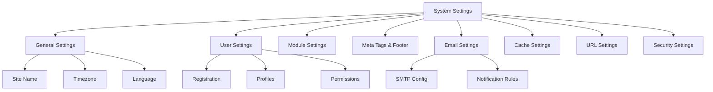

# Paramètres Système XOOPS

Ce guide couvre les paramètres système complets disponibles dans le panneau d'administration XOOPS, organisés par catégorie.

## Architecture des Paramètres Système



## Accès aux Paramètres Système

### Emplacement

**Panneau Admin > Système > Préférences**

Ou naviguez directement :

```
http://your-domain.com/xoops/admin/index.php?fct=preferences
```

### Conditions de Permission

- Seuls les administrateurs (webmasters) peuvent accéder aux paramètres système
- Les modifications affectent l'ensemble du site
- La plupart des modifications prennent effet immédiatement

## Paramètres Généraux

La configuration de base pour votre installation XOOPS.

### Informations de Base

```
Nom du Site: [Nom de Votre Site]
Description par Défaut: [Brève description de votre site]
Slogan du Site: [Slogan Accrocheur]
E-mail Admin: admin@your-domain.com
Nom du Webmaster: Nom de l'Administrateur
E-mail du Webmaster: admin@your-domain.com
```

### Paramètres d'Apparence

```
Thème par Défaut: [Sélectionnez le thème]
Langue par Défaut: Français (ou langue préférée)
Éléments par Page: 15 (généralement 10-25)
Mots dans l'Extrait: 25 (pour les résultats de recherche)
Permission de Téléchargement de Thème: Désactivée (sécurité)
```

### Paramètres Régionaux

```
Fuseau Horaire par Défaut: [Votre fuseau horaire]
Format de Date: %Y-%m-%d (format AAAA-MM-JJ)
Format de l'Heure: %H:%M:%S (format HH:MM:SS)
Heure d'Été: [Auto/Manuelle/Aucune]
```

**Tableau des Fuseaux Horaires:**

| Région | Fuseau Horaire | Décalage UTC |
|---|---|---|
| US Est | America/New_York | -5 / -4 |
| US Centre | America/Chicago | -6 / -5 |
| US Montagne | America/Denver | -7 / -6 |
| US Pacifique | America/Los_Angeles | -8 / -7 |
| UK/Londres | Europe/London | 0 / +1 |
| France/Allemagne | Europe/Paris | +1 / +2 |
| Japon | Asia/Tokyo | +9 |
| Chine | Asia/Shanghai | +8 |
| Australie/Sydney | Australia/Sydney | +10 / +11 |

### Configuration de la Recherche

```
Activer la Recherche: Oui
Rechercher dans les Pages Admin: Oui/Non
Rechercher dans les Archives: Oui
Type de Recherche par Défaut: Tous / Pages uniquement
Mots Exclus de la Recherche: [Liste séparée par des virgules]
```

**Mots courants exclus:** le, la, un, une, et, ou, mais, dans, sur, à, par, pour, de

## Paramètres Utilisateur

Contrôlez le comportement du compte utilisateur et le processus d'enregistrement.

### Enregistrement des Utilisateurs

```
Autoriser l'Enregistrement Utilisateur: Oui/Non
Type d'Enregistrement:
  ☐ Activation Automatique (Accès Instantané)
  ☐ Approbation Admin (L'Admin doit Approuver)
  ☐ Vérification E-mail (L'Utilisateur doit Vérifier l'E-mail)

Notification aux Utilisateurs: Oui/Non
Vérification E-mail Utilisateur: Requise/Optionnelle
```

### Configuration du Nouvel Utilisateur

```
Connexion Automatique des Nouveaux Utilisateurs: Oui/Non
Assigner le Groupe d'Utilisateurs par Défaut: Oui
Groupe d'Utilisateurs par Défaut: [Sélectionnez le groupe]
Créer l'Avatar Utilisateur: Oui/Non
Avatar Utilisateur Initial: [Sélectionnez le par défaut]
```

### Paramètres du Profil Utilisateur

```
Autoriser les Profils Utilisateur: Oui
Afficher la Liste des Membres: Oui
Afficher les Statistiques Utilisateur: Oui
Afficher la Dernière Fois en Ligne: Oui
Autoriser l'Avatar Utilisateur: Oui
Taille Fichier Max Avatar: 100KB
Dimensions de l'Avatar: 100x100 pixels
```

### Paramètres E-mail Utilisateur

```
Permettre aux Utilisateurs de Masquer l'E-mail: Oui
Afficher l'E-mail sur le Profil: Oui
Intervalle d'E-mail de Notification: Immédiatement/Quotidiennement/Hebdomadairement/Jamais
```

### Suivi de l'Activité des Utilisateurs

```
Suivre l'Activité des Utilisateurs: Oui
Journaliser les Connexions Utilisateur: Oui
Journaliser les Échecs de Connexion: Oui
Suivre l'Adresse IP: Oui
Effacer les Journaux d'Activité Plus Anciens Que: 90 jours
```

### Limites de Compte

```
Autoriser les E-mails en Double: Non
Longueur Minimale du Nom d'Utilisateur: 3 caractères
Longueur Maximale du Nom d'Utilisateur: 15 caractères
Longueur Minimale du Mot de Passe: 6 caractères
Exiger les Caractères Spéciaux: Oui
Exiger les Chiffres: Oui
Expiration du Mot de Passe: 90 jours (ou Jamais)
Comptes Inactifs à Supprimer: 365 jours
```

## Paramètres des Modules

Configurez le comportement des modules individuels.

### Options Courantes des Modules

Pour chaque module installé, vous pouvez définir :

```
État du Module: Actif/Inactif
Afficher dans le Menu: Oui/Non
Poids du Module: [1-999] (plus élevé = plus bas dans l'affichage)
Par Défaut de la Page d'Accueil: Ce module s'affiche lors de la visite /
Accès Admin: [Groupes d'utilisateurs autorisés]
Accès Utilisateur: [Groupes d'utilisateurs autorisés]
```

### Paramètres du Module Système

```
Afficher la Page d'Accueil Comme: Portail / Module / Page Statique
Module de Page d'Accueil par Défaut: [Sélectionnez le module]
Afficher le Menu Pied de Page: Oui
Couleur du Pied de Page: [Sélecteur de couleur]
Afficher les Statistiques Système: Oui
Afficher l'Utilisation de la Mémoire: Oui
```

### Configuration par Module

Chaque module peut avoir des paramètres spécifiques au module :

**Exemple - Module Page:**
```
Activer les Commentaires: Oui/Non
Modérer les Commentaires: Oui/Non
Commentaires par Page: 10
Activer les Évaluations: Oui
Autoriser les Évaluations Anonymes: Oui
```

**Exemple - Module Utilisateur:**
```
Dossier de Téléchargement d'Avatar: ./uploads/
Taille de Téléchargement Maximale: 100KB
Autoriser le Téléchargement de Fichier: Oui
Types de Fichiers Autorisés: jpg, gif, png
```

Accédez aux paramètres spécifiques au module :
- **Admin > Modules > [Nom du Module] > Préférences**

## Balises Meta & Paramètres SEO

Configurez les balises meta pour l'optimisation des moteurs de recherche.

### Balises Meta Globales

```
Mots-clés Meta: xoops, cms, système de gestion de contenu
Description Meta: Un puissant système de gestion de contenu pour la création de sites web dynamiques
Auteur Meta: Votre Nom
Droits d'Auteur Meta: Droits d'Auteur 2025, Votre Entreprise
Robots Meta: index, follow
Revisit Meta: 30 jours
```

### Meilleures Pratiques des Balises Meta

| Balise | Objectif | Recommandation |
|---|---|---|
| Mots-clés | Termes de recherche | 5-10 mots-clés pertinents, séparés par des virgules |
| Description | Listing de recherche | 150-160 caractères |
| Auteur | Créateur de la page | Votre nom ou entreprise |
| Droits d'Auteur | Légal | Votre avis de droits d'auteur |
| Robots | Instructions pour les crawlers | index, follow (permet l'indexation) |

### Paramètres du Pied de Page

```
Afficher le Pied de Page: Oui
Couleur du Pied de Page: Sombre/Clair
Arrière-plan du Pied de Page: [Code couleur]
Texte du Pied de Page: [HTML autorisé]
Liens Supplémentaires du Pied de Page: [Paires URL et texte]
```

**Exemple HTML du Pied de Page:**
```html
<p>Copyright &copy; 2025 Votre Entreprise. Tous droits réservés.</p>
<p><a href="/privacy">Politique de Confidentialité</a> | <a href="/terms">Conditions d'Utilisation</a></p>
```

### Balises Meta Sociales (Open Graph)

```
Activer Open Graph: Oui
ID App Facebook: [ID App]
Type de Carte Twitter: summary / summary_large_image / player
Image de Partage par Défaut: [URL de l'Image]
```

## Paramètres d'E-mail

Configurez la livraison des e-mails et le système de notification.

### Méthode de Livraison des E-mails

```
Utiliser SMTP: Oui/Non

Si SMTP:
  Hôte SMTP: smtp.gmail.com
  Port SMTP: 587 (TLS) ou 465 (SSL)
  Sécurité SMTP: TLS / SSL / Aucune
  Nom d'Utilisateur SMTP: [email@example.com]
  Mot de Passe SMTP: [password]
  Authentification SMTP: Oui/Non
  Timeout SMTP: 10 secondes

Si PHP mail():
  Chemin Sendmail: /usr/sbin/sendmail -t -i
```

### Configuration de l'E-mail

```
Adresse D'Origine: noreply@your-domain.com
Nom D'Origine: Nom de Votre Site
Adresse de Réponse: support@your-domain.com
E-mails BCC Admin: Oui/Non
```

### Paramètres de Notification

```
Envoyer l'E-mail de Bienvenue: Oui/Non
Sujet de l'E-mail de Bienvenue: Bienvenue sur [Nom du Site]
Corps de l'E-mail de Bienvenue: [Message Personnalisé]

Envoyer l'E-mail de Réinitialisation du Mot de Passe: Oui/Non
Inclure le Mot de Passe Aléatoire: Oui/Non
Expiration du Jeton: 24 heures
```

### Notifications Admin

```
Notifier Admin à l'Enregistrement: Oui
Notifier Admin sur les Commentaires: Oui
Notifier Admin sur les Soumissions: Oui
Notifier Admin sur les Erreurs: Oui
```

### Notifications Utilisateur

```
Notifier l'Utilisateur à l'Enregistrement: Oui
Notifier l'Utilisateur sur les Commentaires: Oui
Notifier l'Utilisateur sur les Messages Privés: Oui
Permettre aux Utilisateurs de Désactiver les Notifications: Oui
Fréquence de Notification par Défaut: Immédiatement
```

### Modèles d'E-mail

Personnalisez les e-mails de notification dans le panneau d'administration :

**Chemin:** Système > Modèles d'E-mail

Modèles disponibles :
- Enregistrement Utilisateur
- Réinitialisation du Mot de Passe
- Notification de Commentaire
- Message Privé
- Alertes Système
- E-mails Spécifiques aux Modules

## Paramètres du Cache

Optimisez les performances grâce à la mise en cache.

### Configuration du Cache

```
Activer la Mise en Cache: Oui/Non
Type de Cache:
  ☐ Cache Fichier
  ☐ APCu (Cache PHP Alternatif)
  ☐ Memcache (Mise en Cache Distribuée)
  ☐ Redis (Mise en Cache Avancée)

Durée de Vie du Cache: 3600 secondes (1 heure)
```

### Options de Cache par Type

**Cache Fichier:**
```
Répertoire du Cache: /var/www/html/xoops/cache/
Intervalle d'Effacement: Quotidiennement
Fichiers de Cache Maximum: 1000
```

**Cache APCu:**
```
Allocation de Mémoire: 128MB
Niveau de Fragmentation: Bas
```

**Memcache/Redis:**
```
Hôte du Serveur: localhost
Port du Serveur: 11211 (Memcache) / 6379 (Redis)
Connexion Persistante: Oui
```

### Ce qui est Mis en Cache

```
Listes de Modules en Cache: Oui
Données de Configuration en Cache: Oui
Données de Modèle en Cache: Oui
Données de Session Utilisateur en Cache: Oui
Résultats de Recherche en Cache: Oui
Requêtes de Base de Données en Cache: Oui
Flux RSS en Cache: Oui
Images en Cache: Oui
```

## Paramètres d'URL

Configurez la réécriture d'URL et le formatage.

### Paramètres d'URL Conviviale

```
Activer les URLs Conviviales: Oui/Non
Type d'URL Conviviale:
  ☐ Path Info: /page/about
  ☐ Chaîne de Requête: /index.php?p=about

Barre Oblique Finale: Inclure / Omettre
Casse d'URL: Minuscules / Sensible à la Casse
```

### Règles de Réécriture d'URL

```
Règles .htaccess: [Afficher l'actuelle]
Règles Nginx: [Afficher l'actuelle si Nginx]
Règles IIS: [Afficher l'actuelle si IIS]
```

## Paramètres de Sécurité

Contrôlez la configuration liée à la sécurité.

### Sécurité du Mot de Passe

```
Politique de Mot de Passe:
  ☐ Exiger les Majuscules
  ☐ Exiger les Minuscules
  ☐ Exiger les Chiffres
  ☐ Exiger les Caractères Spéciaux

Longueur Minimale du Mot de Passe: 8 caractères
Expiration du Mot de Passe: 90 jours
Historique du Mot de Passe: Mémoriser les 5 derniers Mots de Passe
Forcer le Changement du Mot de Passe: À la Prochaine Connexion
```

### Sécurité de la Connexion

```
Verrouiller le Compte Après Tentatives Échouées: 5 tentatives
Durée du Verrouillage: 15 minutes
Journaliser Toutes les Tentatives de Connexion: Oui
Journaliser les Échecs de Connexion: Oui
Alerte de Connexion Admin: Envoyer un E-mail à la Connexion Admin
Authentification à Deux Facteurs: Désactivée/Activée
```

### Sécurité du Téléchargement de Fichier

```
Autoriser les Téléchargements de Fichiers: Oui/Non
Taille Maximale du Fichier: 128MB
Types de Fichiers Autorisés: jpg, gif, png, pdf, zip, doc, docx
Analyser les Téléchargements pour les Logiciels Malveillants: Oui (si disponible)
Mettre en Quarantaine les Fichiers Suspects: Oui
```

### Sécurité des Sessions

```
Gestion des Sessions: Base de Données/Fichiers
Timeout de Session: 1800 secondes (30 min)
Durée de Vie du Cookie de Session: 0 (jusqu'à la fermeture du navigateur)
Cookie Sécurisé: Oui (HTTPS uniquement)
Cookie HTTP Only: Oui (Empêcher l'Accès JavaScript)
```

### Paramètres CORS

```
Autoriser les Requêtes Cross-Origin: Non
Origines Autorisées: [Domaines de la Liste]
Autoriser les Informations d'Identification: Non
Méthodes Autorisées: GET, POST
```

## Paramètres Avancés

Options de configuration supplémentaires pour les utilisateurs avancés.

### Mode Débogage

```
Mode Débogage: Désactivé/Activé
Niveau de Journal: Erreur / Avertissement / Info / Débogage
Fichier de Journal de Débogage: /var/log/xoops_debug.log
Afficher les Erreurs: Désactivé (production)
```

### Optimisation des Performances

```
Optimiser les Requêtes de Base de Données: Oui
Utiliser le Cache de Requêtes: Oui
Compresser la Sortie: Oui
Minifier CSS/JavaScript: Oui
Chargement Différé des Images: Oui
```

### Paramètres de Contenu

```
Autoriser HTML dans les Messages: Oui/Non
Balises HTML Autorisées: [Configurer]
Supprimer le Code Nuisible: Oui
Autoriser l'Intégration: Oui/Non
Modération du Contenu: Automatique/Manuelle
Détection du Spam: Oui
```

## Export/Import des Paramètres

### Sauvegarder les Paramètres

Exportez les paramètres actuels :

**Panneau Admin > Système > Outils > Exporter les Paramètres**

```bash
# Settings exported as JSON file
# Download and store securely
```

### Restaurer les Paramètres

Importez les paramètres précédemment exportés :

**Panneau Admin > Système > Outils > Importer les Paramètres**

```bash
# Upload JSON file
# Verify changes before confirming
```

## Hiérarchie de Configuration

Hiérarchie des paramètres XOOPS (haut en bas - la première correspondance gagne) :

```
1. mainfile.php (Constants)
2. Configuration Spécifique au Module
3. Paramètres Système Admin
4. Configuration du Thème
5. Préférences Utilisateur (pour les paramètres spécifiques à l'utilisateur)
```

## Script de Sauvegarde des Paramètres

Créez une sauvegarde des paramètres actuels :

```php
<?php
// Backup script: /var/www/html/xoops/backup-settings.php
require_once __DIR__ . '/mainfile.php';

$config_handler = xoops_getHandler('config');
$configs = $config_handler->getConfigs();

$backup = [
    'exported_date' => date('Y-m-d H:i:s'),
    'xoops_version' => XOOPS_VERSION,
    'php_version' => PHP_VERSION,
    'settings' => []
];

foreach ($configs as $config) {
    $backup['settings'][$config->getVar('conf_name')] = [
        'value' => $config->getVar('conf_value'),
        'description' => $config->getVar('conf_desc'),
        'type' => $config->getVar('conf_type'),
    ];
}

// Save to JSON file
file_put_contents(
    '/backups/xoops_settings_' . date('YmdHis') . '.json',
    json_encode($backup, JSON_PRETTY_PRINT)
);

echo "Paramètres sauvegardés avec succès!";
?>
```

## Modifications Courantes des Paramètres

### Changer le Nom du Site

1. Admin > Système > Préférences > Paramètres Généraux
2. Modifiez "Nom du Site"
3. Cliquez sur "Enregistrer"

### Activer/Désactiver l'Enregistrement

1. Admin > Système > Préférences > Paramètres Utilisateur
2. Basculez "Autoriser l'Enregistrement Utilisateur"
3. Choisissez le type d'enregistrement
4. Cliquez sur "Enregistrer"

### Changer le Thème par Défaut

1. Admin > Système > Préférences > Paramètres Généraux
2. Sélectionnez "Thème par Défaut"
3. Cliquez sur "Enregistrer"
4. Effacez le cache pour que les modifications prennent effet

### Mettre à Jour l'E-mail de Contact

1. Admin > Système > Préférences > Paramètres Généraux
2. Modifiez "E-mail Admin"
3. Modifiez "E-mail du Webmaster"
4. Cliquez sur "Enregistrer"

## Liste de Contrôle de Vérification

Après la configuration des paramètres système, vérifiez :

- [ ] Le nom du site s'affiche correctement
- [ ] Le fuseau horaire affiche l'heure correcte
- [ ] Les notifications par e-mail s'envoient correctement
- [ ] L'enregistrement des utilisateurs fonctionne comme configuré
- [ ] La page d'accueil affiche le par défaut sélectionné
- [ ] La fonctionnalité de recherche fonctionne
- [ ] Le cache améliore le temps de chargement de la page
- [ ] Les URLs conviviales fonctionnent (si activées)
- [ ] Les balises meta apparaissent dans la source de la page
- [ ] Les notifications admin sont reçues
- [ ] Les paramètres de sécurité sont appliqués

## Dépannage des Paramètres

### Les Paramètres ne S'Enregistrent Pas

**Solution:**
```bash
# Check file permissions on config directory
chmod 755 /var/www/html/xoops/var/

# Verify database writable
# Try saving again in admin panel
```

### Les Modifications ne Prennent Pas Effet

**Solution:**
```bash
# Clear cache
rm -rf /var/www/html/xoops/cache/*
rm -rf /var/www/html/xoops/templates_c/*

# If still not working, restart web server
systemctl restart apache2
```

### L'E-mail ne S'Envoie Pas

**Solution:**
1. Vérifiez les identifiants SMTP dans les paramètres d'e-mail
2. Testez avec le bouton "Envoyer un E-mail de Test"
3. Vérifiez les journaux d'erreurs
4. Essayez d'utiliser PHP mail() au lieu de SMTP

## Prochaines Étapes

Après la configuration des paramètres système :

1. Configurez les paramètres de sécurité
2. Optimisez les performances
3. Explorez les fonctionnalités du panneau d'administration
4. Configurez la gestion des utilisateurs

---

**Tags:** #system-settings #configuration #preferences #admin-panel

**Articles Connexes:**
- ../../06-Publisher-Module/User-Guide/Basic-Configuration
- Security-Configuration
- Performance-Optimization
- ../First-Steps/Admin-Panel-Overview
