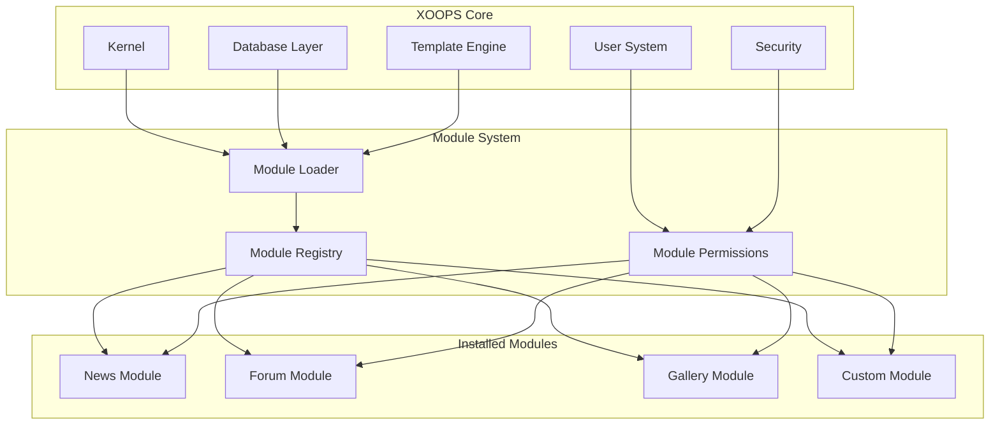
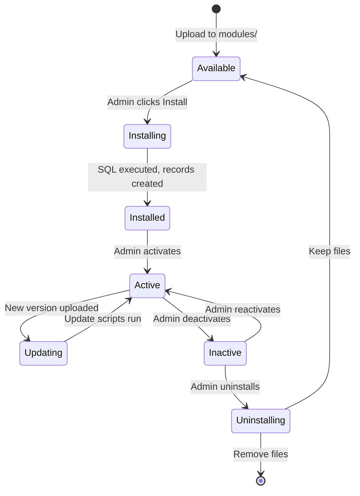

# ADR-001: Architecture Modulaire

> Enregistrement de Décision Architecturale pour la philosophie de conception modulaire du cœur de XOOPS.

---

## Statut

**Accepté** - Décision fondamentale depuis la création de XOOPS

---

## Contexte

XOOPS (eXtensible Object-Oriented Portal System) avait besoin d'une architecture qui :

1. Permette aux développeurs tiers d'étendre les fonctionnalités
2. Permette aux administrateurs de sites de personnaliser sans codage
3. Supporterait le développement indépendant et les mises à jour
4. Fournirait une isolation entre les différentes fonctionnalités
5. Passer d'un simple blog à des portails complexes

Le paysage des CMS au début des années 2000 proposait des systèmes monolithiques difficiles à personnaliser et à étendre.

---

## Diagramme de Décision



---

## Décision

Nous mettrons en œuvre une **architecture modulaire** où :

### 1. Le Cœur Fournit une Infrastructure
- Abstraction de la base de données
- Authentification et autorisations des utilisateurs
- Rendu de modèles (Smarty)
- Utilitaires de sécurité
- Génération de formulaires
- Utilitaires communs

### 2. Les Modules Sont Auto-Contenus
Chaque module :
- A sa propre structure de répertoire
- Contient ses propres classes, modèles, SQL
- Définit sa propre configuration
- Peut être installé/désinstallé indépendamment
- A un suivi de version

### 3. Structure Standard du Module
```
modules/modulename/
├── admin/                  # Admin interface
│   ├── index.php
│   └── menu.php
├── class/                  # PHP classes
├── include/                # Include files
├── language/               # Translations
├── sql/                    # Database schema
├── templates/              # Smarty templates
├── blocks/                 # Block definitions
├── xoops_version.php       # Module manifest
├── index.php               # Entry point
└── header.php              # Module bootstrap
```

### 4. Manifeste de Module (xoops_version.php)
```php
<?php
$modversion['name']        = 'Module Name';
$modversion['version']     = '1.0.0';
$modversion['description'] = 'Module description';
$modversion['dirname']     = basename(__DIR__);
$modversion['hasMain']     = 1;
$modversion['hasAdmin']    = 1;
$modversion['sqlfile']['mysql'] = 'sql/mysql.sql';
$modversion['tables']      = ['modulename_table1'];
$modversion['templates']   = [...];
$modversion['config']      = [...];
$modversion['blocks']      = [...];
```

### 5. Communication du Module
- Via les APIs du cœur (handlers, events)
- Relations de base de données
- Crochets de préchargement
- Services partagés

---

## Cycle de Vie du Module



---

## Conséquences

### Positif

1. **Extensibilité**: Des milliers de modules créés par la communauté
2. **Indépendance**: Les modules peuvent être développés séparément
3. **Flexibilité**: Les sites peuvent mélanger et assortir les fonctionnalités
4. **Maintenabilité**: Les mises à jour n'affectent pas les autres modules
5. **Marché**: Un écosystème de modules a émergé
6. **Courbe d'apprentissage**: Les développeurs apprennent un modèle

### Négatif

1. **Frais généraux**: Chaque module a un coût d'amorçage
2. **Duplication**: Le code commun peut être répété
3. **Intégration**: Les fonctionnalités entre modules nécessitent une conception soignée
4. **Versioning**: La gestion de la compatibilité des modules nécessaire
5. **Variance de Qualité**: La qualité des modules tiers varie

### Neutre

1. **Base de Données**: Chaque module gère ses propres tables
2. **Modèles**: Le thème doit accueillir différents modules
3. **Mises à Jour**: Le cœur et les modules se mettent à jour indépendamment

---

## Alternatives Envisagées

### 1. Architecture Monolithique
**Rejeté** - Trop rigide, difficile à personnaliser

### 2. Architecture de Plugin (Style WordPress)
**Partiellement adopté** - Les blocs et précharges fournissent des crochets de type plugin dans les modules

### 3. Architecture de Composants (Style Joomla)
**Rejeté** - Plus complexe, moins convivial pour les développeurs

### 4. Microservices
**Non applicable** - Trop complexe pour l'ère de l'hébergement partagé

---

## Décisions Connexes

- ADR-002: Accès à la Base de Données Orienté Objet
- ADR-003: Moteur de Modèles Smarty
- ADR-005: Système de Permissions

---

## Références

- Historique du Projet XOOPS
- Modèles d'Architecture d'Application PHP
- Études de Comparaison de CMS (2001-2005)

---

#xoops #architecture #adr #modules #design-decision
