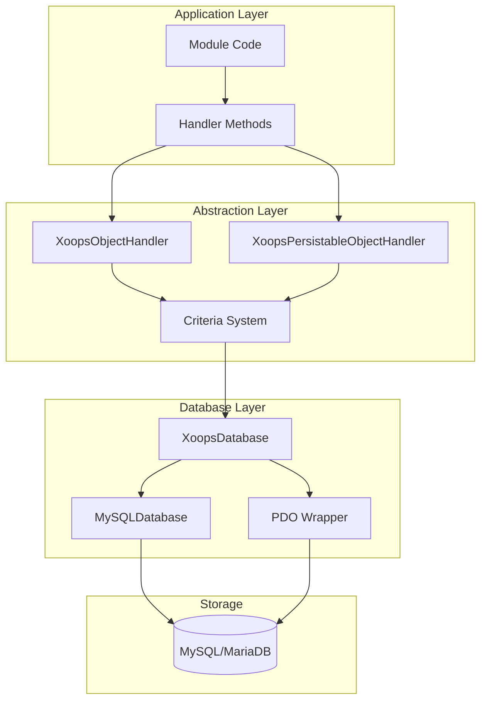
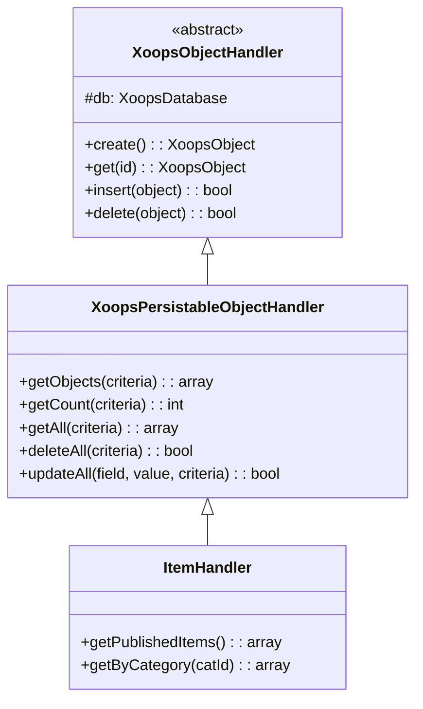
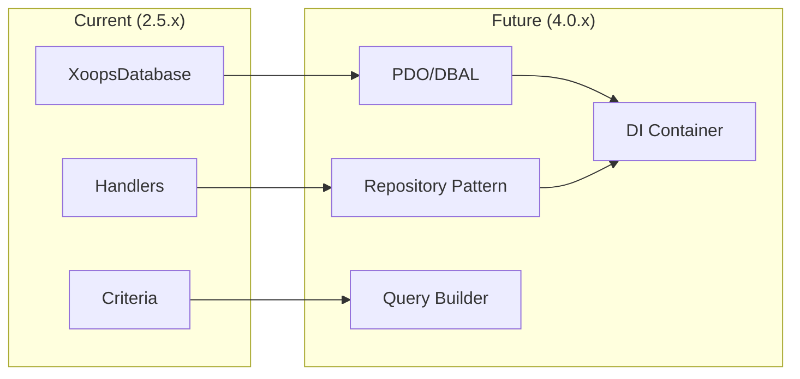

# ADR-002: Abstraction de Base de Données

> Enregistrement de Décision Architecturale pour le modèle d'accès à la base de données orienté objet de XOOPS.

---

## Statut

**Accepté** - Modèle principal depuis XOOPS 2.0

---

## Contexte

XOOPS avait besoin d'une stratégie d'interaction de base de données qui :

1. Abstraire la syntaxe SQL spécifique à la base de données
2. Fournir des opérations CRUD cohérentes sur tous les modules
3. Activer la désinfection et l'échappement des données automatiques
4. Soutenir les futures modifications du moteur de base de données
5. Simplifier les opérations courantes pour les développeurs

Les alternatives étaient :
- SQL brut dans tout le code
- ORM complet (Doctrine, Eloquent)
- Abstraction personnalisée légère

---

## Diagramme de Décision



---

## Décision

Nous mettrons en œuvre un **Modèle de Gestionnaire** avec :

### 1. XoopsObject - Conteneur de Données

Chaque entité de données étend XoopsObject :

```php
class Item extends XoopsObject
{
    public function __construct()
    {
        $this->initVar('id', XOBJ_DTYPE_INT, null, false);
        $this->initVar('title', XOBJ_DTYPE_TXTBOX, '', true, 255);
        $this->initVar('content', XOBJ_DTYPE_TXTAREA, '', false);
        $this->initVar('status', XOBJ_DTYPE_INT, 0, false);
    }
}
```

### 2. Handler - Gestionnaire d'Opérations

Chaque objet a un gestionnaire correspondant :

```php
class ItemHandler extends XoopsPersistableObjectHandler
{
    public function __construct($db)
    {
        parent::__construct($db, 'mymodule_items', Item::class, 'id', 'title');
    }

    // CRUD methods inherited:
    // - create(), get(), insert(), delete()
    // - getObjects(), getCount(), getAll()
}
```

### 3. Criteria - Constructeur de Requêtes

Conditions de requête orientées objet :

```php
$criteria = new CriteriaCompo();
$criteria->add(new Criteria('status', 1));
$criteria->add(new Criteria('created', time() - 86400, '>='));
$criteria->setSort('created');
$criteria->setOrder('DESC');
$criteria->setLimit(10);

$items = $handler->getObjects($criteria);
```

---

## Constantes de Type de Données

```php
// Variable types with automatic sanitization
XOBJ_DTYPE_INT       // Integer
XOBJ_DTYPE_TXTBOX    // Single-line text (escaped)
XOBJ_DTYPE_TXTAREA   // Multi-line text (escaped)
XOBJ_DTYPE_EMAIL     // Email validation
XOBJ_DTYPE_URL       // URL validation
XOBJ_DTYPE_ARRAY     // Serialized array
XOBJ_DTYPE_OTHER     // No processing
XOBJ_DTYPE_FLOAT     // Floating point
```

---

## Héritage du Gestionnaire



---

## Conséquences

### Positif

1. **Cohérence**: Tous les modules utilisent les mêmes modèles
2. **Sécurité**: Échappement automatique empêche l'injection SQL
3. **Simplicité**: Les opérations courantes nécessitent un code minimal
4. **Maintenabilité**: Les modifications apportées à la couche de base de données n'affectent pas les modules
5. **Testabilité**: Les gestionnaires peuvent être mockés pour les tests

### Négatif

1. **Performance**: Surcharge d'abstraction supplémentaire
2. **Complexité**: Courbe d'apprentissage pour les nouveaux développeurs
3. **Limitations**: Les requêtes complexes peuvent nécessiter du SQL brut
4. **N+1 Problem**: Pas de chargement impatient intégré

### Atténuations

- **Performance**: Mettez en cache les objets fréquemment consultés
- **Requêtes Complexes**: Autoriser le SQL brut si nécessaire
- **N+1**: Utilisez getAll() avec les critères appropriés

---

## Évolution vers XOOPS 4.0



Plans de XOOPS 4.0 :
- Doctrine DBAL pour l'abstraction de base de données
- Modèle de référentiel remplaçant les gestionnaires
- Constructeur de requêtes pour les requêtes complexes
- Intégration complète du conteneur PSR-11

---

## Exemples de Code

### CRUD Basique

```php
$helper = Helper::getInstance();
$handler = $helper->getHandler('Item');

// Create
$item = $handler->create();
$item->setVar('title', 'New Item');
$handler->insert($item);

// Read
$item = $handler->get($id);
$title = $item->getVar('title');

// Update
$item->setVar('title', 'Updated Title');
$handler->insert($item);

// Delete
$handler->delete($item);
```

### Requête Complexe

```php
$criteria = new CriteriaCompo();
$criteria->add(new Criteria('status', 'published'));
$criteria->add(new Criteria('category_id', '(1,2,3)', 'IN'));
$criteria->add(new Criteria('created', strtotime('-30 days'), '>='));
$criteria->setSort('views');
$criteria->setOrder('DESC');
$criteria->setLimit(10);
$criteria->setStart(0);

$items = $handler->getObjects($criteria);
$total = $handler->getCount($criteria);
```

---

## Décisions Connexes

- ADR-001: Architecture Modulaire
- ADR-003: Moteur de Modèles Smarty

---

## Références

- Martin Fowler - Patterns of Enterprise Application Architecture
- Concepts de Domain-Driven Design
- Modèles Active Record vs Data Mapper

---

#xoops #architecture #adr #database #handler #design-decision
