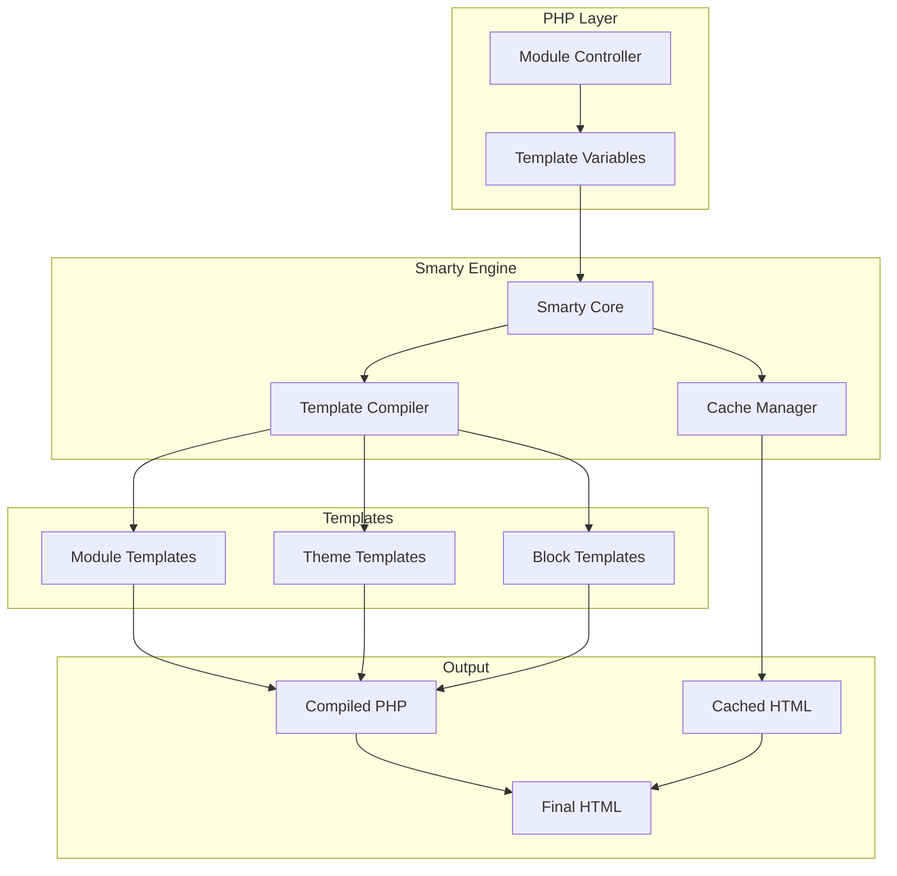
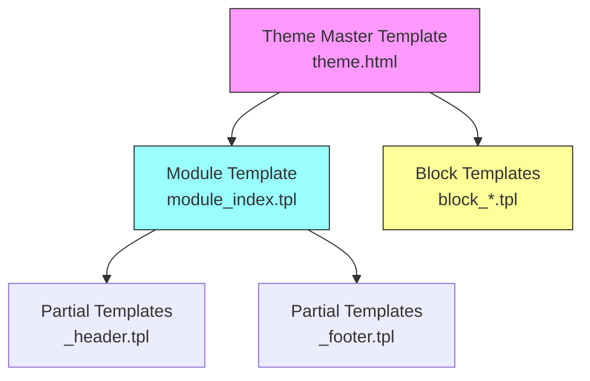

# ADR-003: Moteur de Modèles (Smarty)

> Enregistrement de Décision Architecturale pour l'adoption par XOOPS du moteur de modèles Smarty.

---

## Statut

**Accepté** - Décision centrale depuis XOOPS 2.0

**En Évolution** - Migration vers Smarty 4/5 prévue pour XOOPS 4.0

---

## Contexte

XOOPS avait besoin d'une solution de modélisation qui :

1. Sépare la présentation de la logique métier
2. Permet aux concepteurs de thèmes de travailler sans connaissance PHP
3. Supporte l'héritage de modèles et les inclusions
4. Fournit la mise en cache pour les performances
5. Enabler les modèles personnalisables par l'utilisateur
6. Supporter l'internationalisation

---

## Diagramme de Décision



---

## Décision

Nous utiliserons **Smarty** comme moteur de modèles car :

### 1. Séparation des Préoccupations

```php
// PHP (Contrôleur) - Logique métier
$items = $itemHandler->getPublishedItems();
$xoopsTpl->assign('items', $items);

// Smarty (Vue) - Présentation
// templates/items.tpl
```

```smarty
{* Smarty template - No PHP logic *}
<{foreach item=item from=$items}>
    <article>
        <h2><{$item.title}></h2>
        <p><{$item.summary}></p>
    </article>
<{/foreach}>
```

### 2. Délimiteurs XOOPS

XOOPS utilise `<{` et `}>` au lieu des standards `{` `}` :

```smarty
{* Standard Smarty *}
{$variable}

{* XOOPS Smarty - Avoids JavaScript conflicts *}
<{$variable}>
```

### 3. Hiérarchie des Modèles



### 4. Stockage des Modèles

- **Base de Données**: Modèles personnalisés stockés pour capacité de restauration
- **Système de Fichiers**: Modèles originaux dans répertoires de modules
- **Cache**: Modèles compilés pour les performances

---

## Configuration de Smarty

```php
// XOOPS Smarty initialization
$xoopsTpl = new XoopsTpl();

// Custom delimiters
$xoopsTpl->left_delim = '<{';
$xoopsTpl->right_delim = '}>';

// Caching
$xoopsTpl->caching = XOOPS_TEMPLATE_CACHE;
$xoopsTpl->cache_lifetime = 3600;

// Security
$xoopsTpl->security_policy = new Smarty_Security($xoopsTpl);
$xoopsTpl->security_policy->php_functions = [];
$xoopsTpl->security_policy->php_modifiers = ['escape', 'count'];
```

---

## Conséquences

### Positif

1. **Convivial pour les Concepteurs**: Syntaxe de type HTML
2. **Mise en Cache**: Mise en cache des modèles intégrée
3. **Sécurité**: Isolation du code PHP
4. **Flexibilité**: Modificateurs, fonctions, plugins
5. **Personnalisation**: Les utilisateurs peuvent modifier les modèles
6. **Communauté**: Grand écosystème Smarty

### Négatif

1. **Courbe d'Apprentissage**: Syntaxe spécifique à Smarty
2. **Surcharge**: Étape de compilation requise
3. **Débogage**: Les erreurs de modèle peuvent être cryptiques
4. **Problèmes de Version**: Changements de rupture entre les versions

### Atténuations

- **Apprentissage**: Documentation complète
- **Performance**: Mise en cache agressive
- **Débogage**: Console de débogage, messages d'erreur clairs
- **Versions**: Couche de compatibilité dans XOOPS

---

## Alternatives Envisagées

### 1. Twig
**Pros**: Moderne, écosystème Symfony
**Cons**: Syntaxe différente, effort de migration
**Décision**: Possible option future pour XOOPS 3.x

### 2. Blade (Laravel)
**Pros**: Syntaxe propre, populaire
**Cons**: Spécifique à Laravel
**Décision**: Non adapté pour une utilisation autonome

### 3. Modèles PHP Natifs
**Pros**: Pas de courbe d'apprentissage, rapide
**Cons**: Risques de sécurité, pas de séparation
**Décision**: Rejeté pour la maintenabilité

---

## Décisions Connexes

- ADR-001: Architecture Modulaire
- ADR-002: Abstraction de Base de Données

---

## Références

- Documentation Smarty: https://www.smarty.net/docs/en/
- Guide du Système de Modèles XOOPS
- Modèle MVC dans les Applications Web

---

#xoops #architecture #adr #smarty #templates #design-decision
