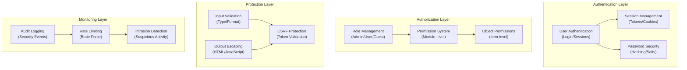

# ADR-004: Architecture du Système de Sécurité

> Architecture de sécurité complète pour XOOPS CMS protégeant contre les menaces modernes.

---

## Statut

**Accepté** - Couche de sécurité principale depuis XOOPS 2.5

---

## Contexte

### Déclaration du Problème

XOOPS a besoin d'un système de sécurité robuste qui :

1. **Protège contre les vulnérabilités web courantes** (OWASP Top 10)
2. **Fournit un contrôle des permissions granulaires** sur les modules
3. **Permet une authentification utilisateur sécurisée** avec les normes modernes
4. **Prévient les fuites de données** et l'accès non autorisé
5. **Soutient le contrôle d'accès multi-niveaux** (admin, modérateur, utilisateur, invité)
6. **S'intègre à tous les modules** de manière transparente

### Menaces Actuelles

Les attaques web modernes incluent :

- **Injection SQL** - SQL malveillant dans l'entrée utilisateur
- **XSS (Cross-Site Scripting)** - JavaScript injecté dans les pages
- **CSRF (Cross-Site Request Forgery)** - Soumission de formulaires non autorisée
- **Contournement d'authentification** - Gestion faible des sessions/mots de passe
- **Contournement d'autorisation** - Escalade de privilèges
- **Exposition des données** - Données sensibles dans les URLs, journaux ou caches

### Exigences de Sécurité XOOPS

1. Authentification des utilisateurs et gestion des sessions
2. Contrôle d'accès basé sur les rôles (RBAC)
3. Système d'autorisation pour les modules et objets
4. Validation des entrées et échappement des sorties
5. Protection contre les attaques courantes
6. Journalisation des événements de sécurité
7. Gestion sécurisée des mots de passe
8. Protection des jetons CSRF

---

## Décision

### Architecture de Sécurité Principale

---

## Conséquences

### Effets Positifs

1. **Protection Complète** - Couvre les classes de vulnérabilité majeures
2. **Sécurité En Couches** - Plusieurs couches de défense
3. **RBAC Flexible** - Contrôle des permissions à grain fin
4. **Piste d'Audit** - Suivre les événements de sécurité
5. **Normes Industrielles** - Aligne avec les recommandations OWASP
6. **Intégration des Modules** - Facile pour les modules d'utiliser les APIs de sécurité

### Effets Négatifs

1. **Complexité** - Plus de code et de configuration nécessaires
2. **Performance** - Le hachage et la validation ajoutent une surcharge
3. **Expérience Utilisateur** - La sécurité est parfois gênante
4. **Maintenance** - Nécessite des mises à jour de sécurité régulières
5. **Formation Requise** - Les développeurs doivent suivre les pratiques

### Risques et Atténuations

| Risque | Sévérité | Atténuation |
|------|----------|-----------|
| Le développeur ignore la sécurité | Haute | Examen du code, formation de sécurité |
| Nouvelles vulnérabilités découvertes | Moyenne | Audits de sécurité réguliers, mises à jour |
| Impact sur les performances | Faible | Optimiser les chemins critiques, mise en cache |
| Permissions excessivement complexes | Moyenne | Documentation claire, exemples |

---

## Décisions Connexes

- ADR-001: Architecture Modulaire - Les modules implémentent la sécurité
- ADR-005: Système de Permissions des Modules
- ADR-006: Authentification à Deux Facteurs (futur)

---

## Références

### Normes de Sécurité

- [OWASP Top 10](https://owasp.org/www-project-top-ten/)
- [Cadre de Cybersécurité NIST](https://www.nist.gov/cyberframework)
- [CWE Top 25](https://cwe.mitre.org/top25/)

### Sécurité PHP

- [Manuel de Sécurité PHP](https://www.php.net/manual/en/security.php)
- [Documentation password_hash()](https://www.php.net/manual/en/function.password-hash.php)
- [Sécurité des Sessions](https://www.php.net/manual/en/session.security.php)

### Outils

- [OWASP ZAP](https://www.zaproxy.org/) - Test de sécurité
- [Snyk](https://snyk.io/) - Scan des vulnérabilités
- [SonarQube](https://www.sonarqube.org/) - Qualité du code

---

#xoops #adr #security #architecture #authentication #authorization #rbac
