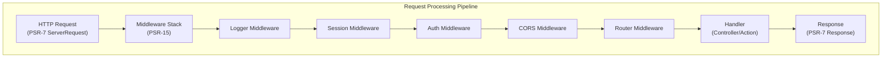

# ADR-005: Modèle d'Intergiciel PSR-15 pour XOOPS 4.0

> Adopter les gestionnaires de requêtes de serveur HTTP PSR-15 (intergiciels) pour améliorer le pipeline de traitement des requêtes.

---

## Statut

**Proposé** - En évaluation pour la version XOOPS 4.0

---

## Contexte

### Approche Actuelle

XOOPS 2.5 utilise une approche monolithique de traitement des requêtes :

```php
// Approche Actuelle: Traitement Séquentiel
require_once 'mainfile.php';
// → Initialisation du noyau
// → Authentification utilisateur
// → Chargement du module
// → Rendu de la page

// Tous dans un flux, préoccupations mélangées
```

### Problèmes avec l'Approche Actuelle

1. **Préoccupations Mélangées** - L'authentification, la journalisation, le routage sont tous entrelacés
2. **Difficile à Tester** - Difficile de tester unitairement les étapes individuelles du traitement des requêtes
3. **Difficile à Étendre** - Les modules ne peuvent se connecter que via preload/events
4. **Mauvaise Séparation** - La logique de traitement des requêtes est dispersée dans le code
5. **Non Composable** - Impossible de chaîner ou de réorganiser facilement les étapes de traitement

### Qu'est-ce que l'Intergiciel PSR-15?

PSR-15 définit une interface standard pour l'intergiciel HTTP :

```php
<?php
interface RequestHandlerInterface {
    public function handle(ServerRequestInterface $request): ResponseInterface;
}

interface MiddlewareInterface {
    public function process(
        ServerRequestInterface $request,
        RequestHandlerInterface $handler
    ): ResponseInterface;
}
```

**Chaîne d'Intergiciels:**

```
Requête
  ↓
[Logger] → logs request
  ↓
[Auth] → validates user session
  ↓
[CORS] → checks cross-origin
  ↓
[Router] → dispatches to handler
  ↓
[Handler] → generates response
  ↓
Réponse
```

---

## Décision

### Adopter la Pile d'Intergiciels PSR-15 pour XOOPS 4.0

Mettez en œuvre un pipeline de traitement des requêtes basé sur les intergiciels suivant la norme PSR-15.

### Aperçu de l'Architecture



---

## Conséquences

### Effets Positifs

1. **Séparation des Préoccupations** - Chaque intergiciel gère une responsabilité
2. **Testabilité** - Facile de tester unitairement les composants d'intergiciel individuels
3. **Composabilité** - L'intergiciel peut être mélangé et réorganisé
4. **Conforme aux Normes** - Utilise les normes PSR-15 et PSR-7
5. **Extensibilité** - Les modules peuvent facilement ajouter des intergiciels personnalisés
6. **Débogage** - Flux de requête clair à travers le pipeline
7. **Performance** - Peut optimiser les couches d'intergiciel spécifiques
8. **Interopérabilité** - Peut utiliser l'intergiciel PSR-15 tiers

### Effets Négatifs

1. **Courbe d'Apprentissage** - Les développeurs doivent comprendre PSR-15
2. **Surcharge de Performance** - Plus d'appels de fonction dans le pipeline
3. **Complexité** - Plus de pièces mobiles qu'une approche monolithique
4. **Effort de Migration** - Nécessite une refactorisation du code existant
5. **Dépendances** - Nécessite une bibliothèque HTTP PSR-7

---

## Décisions Connexes

- ADR-001: Architecture Modulaire - Fondation
- ADR-004: Système de Sécurité - Utilise l'intergiciel pour auth
- ADR-006: Auth à Deux Facteurs - Peut être un intergiciel

---

## Références

### Normes PSR

- [PSR-7: Interface de Message HTTP](https://www.php-fig.org/psr/psr-7/)
- [PSR-15: Gestionnaires de Requêtes de Serveur HTTP](https://www.php-fig.org/psr/psr-15/)

### Cadres d'Intergiciel

- [Framework Slim](https://www.slimframework.com/) - Exemples d'intergiciel
- [Zend Expressive](https://docs.zendframework.com/zend-expressive/) - Cadre PSR-15
- [Guzzle](https://docs.guzzlephp.org/) - Intergiciel client HTTP

### Outils

- [RelayPHP](https://relayphp.com/) - Bibliothèque d'intergiciel
- [Intergiciel PSR-15](https://github.com/middlewares) - Collection d'intergiciels

---

#xoops #adr #psr-15 #middleware #architecture #psr-7
