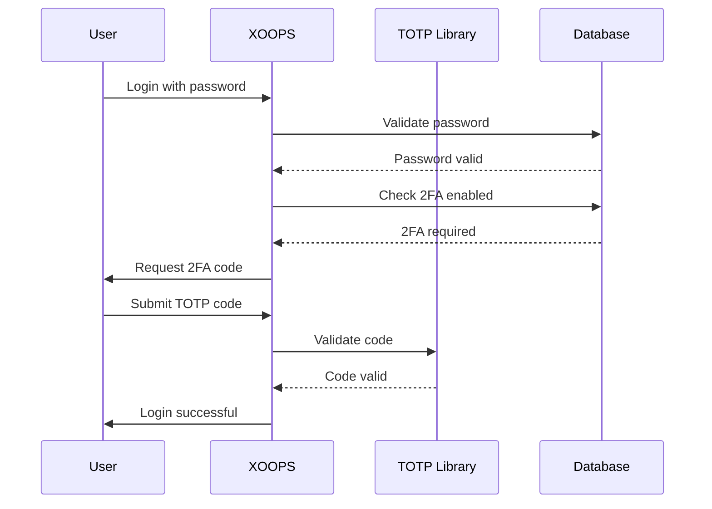

## Statut

Proposé

## Contexte

XOOPS a besoin d'une sécurité renforcée pour l'authentification des utilisateurs. L'authentification à deux facteurs (2FA) fournit une couche de sécurité supplémentaire au-delà des mots de passe, protégeant les comptes même si les mots de passe sont compromis.

Considérations clés :
- Compatibilité rétroactive avec l'authentification existante
- Support pour plusieurs méthodes 2FA
- Expérience utilisateur lors de la configuration et de la connexion
- Mécanismes de récupération pour les appareils perdus
- Intégration avec le système de permissions existant

## Décision

Nous mettrons en œuvre TOTP (One-Time Password basé sur le temps) comme méthode 2FA principale avec support pour les codes de sauvegarde.

### Approche d'Implémentation



### Schéma de Base de Données

```sql
CREATE TABLE `{PREFIX}_users_2fa` (
    `user_id` INT(11) NOT NULL,
    `secret` VARCHAR(32) NOT NULL,
    `enabled` TINYINT(1) DEFAULT 0,
    `backup_codes` TEXT,
    `last_used` INT(11),
    `created` INT(11) NOT NULL,
    PRIMARY KEY (`user_id`),
    FOREIGN KEY (`user_id`) REFERENCES `{PREFIX}_users`(`uid`)
);
```

### Interface de Service

```php
interface TwoFactorAuthInterface
{
    public function enable(int $userId): TwoFactorSetup;
    public function disable(int $userId): void;
    public function verify(int $userId, string $code): bool;
    public function generateBackupCodes(int $userId): array;
    public function isEnabled(int $userId): bool;
}
```

### Intégration d'Intergiciel

```php
class TwoFactorMiddleware implements MiddlewareInterface
{
    public function process(
        ServerRequestInterface $request,
        RequestHandlerInterface $handler
    ): ResponseInterface {
        $session = $request->getAttribute('session');

        if ($session->has('pending_2fa_user_id')) {
            // User needs to complete 2FA
            if ($this->isVerificationRequest($request)) {
                return $handler->handle($request);
            }
            return new RedirectResponse('/2fa/verify');
        }

        return $handler->handle($request);
    }
}
```

## Conséquences

### Positif

- Amélioration significative de la sécurité des comptes
- Compatibilité TOTP standard de l'industrie (Google Authenticator, Authy, etc.)
- Les codes de sauvegarde empêchent le verrouillage du compte
- Optionnel par utilisateur - n'impose pas l'adoption
- L'intergiciel PSR-15 permet une intégration propre

### Négatif

- L'étape de connexion supplémentaire impacte l'expérience utilisateur
- Les utilisateurs doivent gérer les applications d'authentificateur
- Les appareils perdus nécessitent un processus de récupération
- Stockage et requêtes de base de données supplémentaires
- Nécessite une dépendance de bibliothèque cryptographique

### Chemin de Migration

1. Ajouter une table de base de données pour les données 2FA
2. Implémenter le service TOTP avec dépendance de bibliothèque
3. Ajouter l'intergiciel à la chaîne d'authentification
4. Créer l'interface utilisateur de configuration et de vérification
5. Option admin pour exiger 2FA pour des groupes spécifiques

## Alternatives Envisagées

### OTP Basé sur SMS

Rejeté en raison de :
- Vulnérabilités d'échange de SIM
- Coût de la passerelle SMS
- Complexité de la vérification du numéro de téléphone
- Préoccupations relatives à la confidentialité

### Clés de Sécurité Matérielles (WebAuthn)

Reporté pour ADR futur :
- Implémentation plus complexe
- Support de navigateur limité historiquement
- Coût utilisateur plus élevé
- Pourrait être ajouté aux côtés de TOTP plus tard

### OTP Basé sur l'E-mail

Rejeté en raison de :
- La compromission du compte e-mail annule l'objectif
- Les délais de livraison impactent l'UX
- Problèmes de filtrage du spam

## Références

- [RFC 6238 - TOTP](https://tools.ietf.org/html/rfc6238)
- [Format de Clé Google Authenticator](https://github.com/google/google-authenticator/wiki/Key-Uri-Format)
- ../../02-Core-Concepts/Security/Security-Best-Practices - Directives de sécurité
- ../../02-Core-Concepts/Users-Permissions/Authentication - Documentation du système auth
