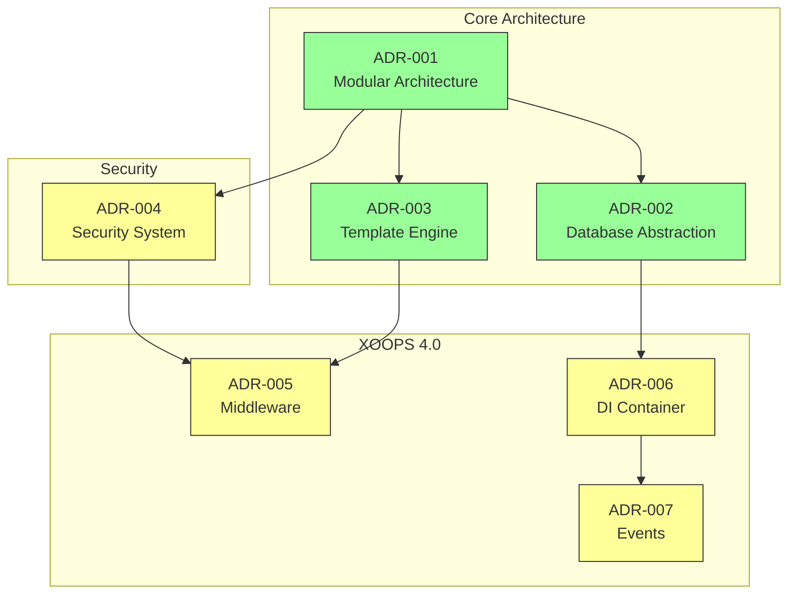
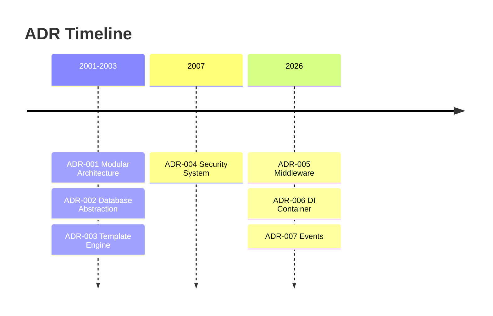

# Index des Enregistrements de Décision Architecturale

> Index complet des décisions architecturales qui ont façonné XOOPS CMS.

---

## Qu'est-ce qu'un ADR?

Les Enregistrements de Décision Architecturale (ADR) documentent les décisions architecturales importantes prises lors du développement de XOOPS. Ils capturent le contexte, la décision et les conséquences de chaque choix, fournissant un contexte historique précieux pour les responsables de la maintenance et les contributeurs.

---

## Légende du Statut ADR

| Statut | Signification |
|--------|---------|
| **Proposé** | En discussion, pas encore accepté |
| **Accepté** | La décision a été adoptée |
| **Dépréciée** | Nq plus recommandée |
| **Remplacée** | Remplacée par un autre ADR |

---

## ADRs Actuels

### Décisions Fondamentales

| ADR | Titre | Statut | Impact |
|-----|-------|--------|--------|
| ADR-001 | Architecture Modulaire | Acceptée | Cœur |
| ADR-002 | Accès à la Base de Données Orienté Objet | Acceptée | Cœur |
| ADR-003 | Moteur de Modèles Smarty | Acceptée | Cœur |

### ADRs Prévues (XOOPS 4.0)

| ADR | Titre | Statut | Impact |
|-----|-------|--------|--------|
| ADR-004 | Conception du Système de Sécurité | Proposée | Sécurité |
| ADR-005 | Intergiciel PSR-15 | Proposée | Architecture |
| ADR-006 | Conteneur d'Injection de Dépendance | Proposée | Architecture |
| ADR-007 | Refonte du Système d'Événements | Proposée | Architecture |

---

## Relations ADR



---

## Chronologie



---

## Création de Nouveaux ADRs

Lors de la proposition d'une nouvelle décision architecturale :

1. Copiez le Modèle ADR
2. Complétez toutes les sections
3. Soumettez en tant que Demande de Tirage
4. Discutez dans les Problèmes GitHub
5. Mettez à jour le statut après la décision

### Structure du Modèle ADR

```markdown
# ADR-XXX: Title

## Status
Proposed | Accepted | Deprecated | Superseded

## Context
What is the issue motivating this decision?

## Decision
What is the change that we're proposing?

## Consequences
What becomes easier or harder as a result?

## Alternatives Considered
What other options were evaluated?
```

---

## Documentation Connexe

- Concepts Fondamentaux
- Directives de Contribution
- Feuille de Route XOOPS 4.0

---

#xoops #adr #architecture #index #decisions
