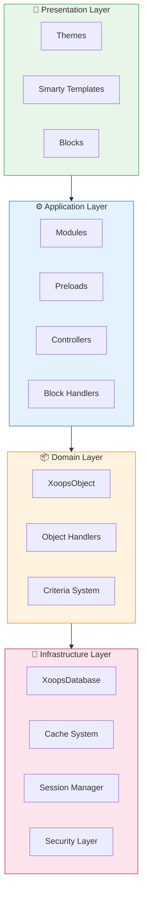
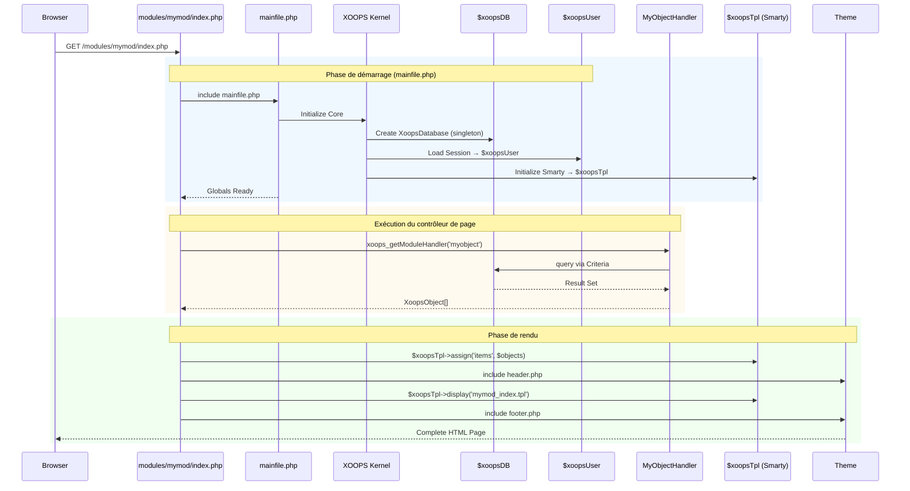

:::note[À propos de ce document]
Cette page décrit l'**architecture conceptuelle** de XOOPS qui s'applique aux versions actuelles (2.5.x) et futures (4.0.x). Certains diagrammes montrent la vision du design en couches.

**Pour les détails spécifiques aux versions :**
- **XOOPS 2.5.x Aujourd'hui :** Utilise `mainfile.php`, globals (`$xoopsDB`, `$xoopsUser`), preloads et pattern handler
- **XOOPS 4.0 Cible :** Middleware PSR-15, conteneur DI, router - voir [Roadmap](../../07-XOOPS-4.0/XOOPS-4.0-Roadmap.md)
:::

Ce document fournit une vue d'ensemble complète de l'architecture système XOOPS, expliquant comment les différents composants fonctionnent ensemble pour créer un système de gestion de contenu flexible et extensible.

## Aperçu

XOOPS suit une architecture modulaire qui sépare les préoccupations en couches distinctes. Le système est construit autour de plusieurs principes fondamentaux :

- **Modularité** : La fonctionnalité est organisée en modules indépendants et installables
- **Extensibilité** : Le système peut être étendu sans modifier le code de base
- **Abstraction** : Les couches de base de données et de présentation sont abstraites de la logique métier
- **Sécurité** : Les mécanismes de sécurité intégrés protègent contre les vulnérabilités courantes

## Couches du système



### 1. Couche de présentation

La couche de présentation gère le rendu de l'interface utilisateur en utilisant le moteur de template Smarty.

**Composants clés :**
- **Themes** : Style visuel et mise en page
- **Smarty Templates** : Rendu de contenu dynamique
- **Blocks** : Widgets de contenu réutilisables

### 2. Couche application

La couche application contient la logique métier, les contrôleurs et les fonctionnalités des modules.

**Composants clés :**
- **Modules** : Paquets de fonctionnalités autonomes
- **Handlers** : Classes de manipulation de données
- **Preloads** : Écouteurs d'événements et hooks

### 3. Couche domaine

La couche domaine contient les objets métier de base et les règles.

**Composants clés :**
- **XoopsObject** : Classe de base pour tous les objets domaine
- **Handlers** : Opérations CRUD pour les objets domaine

### 4. Couche infrastructure

La couche infrastructure fournit les services de base comme l'accès à la base de données et la mise en cache.

## Cycle de vie des demandes

Comprendre le cycle de vie des demandes est crucial pour un développement XOOPS efficace.

### Flux du contrôleur de page XOOPS 2.5.x

XOOPS 2.5.x actuel utilise un modèle de **Page Controller** où chaque fichier PHP gère sa propre demande. Les globals (`$xoopsDB`, `$xoopsUser`, `$xoopsTpl`, etc.) sont initialisées lors du démarrage et disponibles tout au long de l'exécution.



### Globals clés en 2.5.x

| Global | Type | Initialisé | Objectif |
|--------|------|-------------|---------|
| `$xoopsDB` | `XoopsDatabase` | Bootstrap | Connexion à la base de données (singleton) |
| `$xoopsUser` | `XoopsUser\|null` | Chargement de session | Utilisateur actuellement connecté |
| `$xoopsTpl` | `XoopsTpl` | Initialisation du template | Moteur de template Smarty |
| `$xoopsModule` | `XoopsModule` | Chargement du module | Contexte du module actuel |
| `$xoopsConfig` | `array` | Chargement de la configuration | Configuration du système |

:::note[Comparaison XOOPS 4.0]
En XOOPS 4.0, le modèle Page Controller est remplacé par un **Pipeline Middleware PSR-15** et une dépêche basée sur le router. Les globals sont remplacés par l'injection de dépendances. Voir [Hybrid Mode Contract](../../07-XOOPS-4.0/Specifications/Hybrid-Mode-Contract.md) pour les garanties de compatibilité lors de la migration.
:::

### 1. Phase de démarrage

```php
// mainfile.php is the entry point
include_once XOOPS_ROOT_PATH . '/mainfile.php';

// Core initialization
$xoops = Xoops::getInstance();
$xoops->boot();
```

**Étapes :**
1. Charger la configuration (`mainfile.php`)
2. Initialiser l'autoloader
3. Configurer la gestion des erreurs
4. Établir la connexion à la base de données
5. Charger la session utilisateur
6. Initialiser le moteur de template Smarty

### 2. Phase de routage

```php
// Request routing to appropriate module
$module = $GLOBALS['xoopsModule'];
$controller = $module->getController();
$controller->dispatch($request);
```

**Étapes :**
1. Analyser l'URL de la demande
2. Identifier le module cible
3. Charger la configuration du module
4. Vérifier les permissions
5. Router vers le gestionnaire approprié

### 3. Phase d'exécution

```php
// Controller execution
$data = $handler->getObjects($criteria);
$xoopsTpl->assign('items', $data);
```

**Étapes :**
1. Exécuter la logique du contrôleur
2. Interagir avec la couche de données
3. Traiter les règles métier
4. Préparer les données d'affichage

### 4. Phase de rendu

```php
// Template rendering
include XOOPS_ROOT_PATH . '/header.php';
$xoopsTpl->display('db:module_template.tpl');
include XOOPS_ROOT_PATH . '/footer.php';
```

**Étapes :**
1. Appliquer la mise en page du thème
2. Rendre le modèle du module
3. Traiter les blocs
4. Générer la réponse

## Composants de base

### XoopsObject

La classe de base pour tous les objets de données dans XOOPS.

```php
<?php
class MyModuleItem extends XoopsObject
{
    public function __construct()
    {
        $this->initVar('id', XOBJ_DTYPE_INT, null, false);
        $this->initVar('title', XOBJ_DTYPE_TXTBOX, '', true, 255);
        $this->initVar('content', XOBJ_DTYPE_TXTAREA, '', false);
        $this->initVar('created', XOBJ_DTYPE_INT, time(), false);
    }
}
```

**Méthodes clés :**
- `initVar()` - Définir les propriétés de l'objet
- `getVar()` - Récupérer les valeurs de propriétés
- `setVar()` - Définir les valeurs de propriétés
- `assignVars()` - Assigner en masse à partir d'un tableau

### XoopsPersistableObjectHandler

Gère les opérations CRUD pour les instances XoopsObject.

```php
<?php
class MyModuleItemHandler extends XoopsPersistableObjectHandler
{
    public function __construct(\XoopsDatabase $db)
    {
        parent::__construct($db, 'mymodule_items', 'MyModuleItem', 'id', 'title');
    }

    public function getActiveItems($limit = 10)
    {
        $criteria = new CriteriaCompo();
        $criteria->add(new Criteria('status', 1));
        $criteria->setSort('created');
        $criteria->setOrder('DESC');
        $criteria->setLimit($limit);

        return $this->getObjects($criteria);
    }
}
```

**Méthodes clés :**
- `create()` - Créer une nouvelle instance d'objet
- `get()` - Récupérer l'objet par ID
- `insert()` - Enregistrer l'objet dans la base de données
- `delete()` - Supprimer l'objet de la base de données
- `getObjects()` - Récupérer plusieurs objets
- `getCount()` - Compter les objets correspondants

### Structure du module

Chaque module XOOPS suit une structure de répertoire standard :

```
modules/mymodule/
├── class/                  # Classes PHP
│   ├── MyModuleItem.php
│   └── MyModuleItemHandler.php
├── include/                # Fichiers d'inclusion
│   ├── common.php
│   └── functions.php
├── templates/              # Templates Smarty
│   ├── mymodule_index.tpl
│   └── mymodule_item.tpl
├── admin/                  # Zone administrateur
│   ├── index.php
│   └── menu.php
├── language/               # Traductions
│   └── english/
│       ├── main.php
│       └── modinfo.php
├── sql/                    # Schéma de base de données
│   └── mysql.sql
├── xoops_version.php       # Informations du module
├── index.php               # Point d'entrée du module
└── header.php              # En-tête du module
```

## Conteneur d'injection de dépendances

Le développement moderne de XOOPS peut tirer parti de l'injection de dépendances pour une meilleure testabilité.

### Implémentation de conteneur de base

```php
<?php
class XoopsDependencyContainer
{
    private array $services = [];

    public function register(string $name, callable $factory): void
    {
        $this->services[$name] = $factory;
    }

    public function resolve(string $name): mixed
    {
        if (!isset($this->services[$name])) {
            throw new \InvalidArgumentException("Service not found: $name");
        }

        $factory = $this->services[$name];

        if (is_callable($factory)) {
            return $factory($this);
        }

        return $factory;
    }

    public function has(string $name): bool
    {
        return isset($this->services[$name]);
    }
}
```

### Conteneur compatible PSR-11

```php
<?php
namespace Xmf\Di;

use Psr\Container\ContainerInterface;

class BasicContainer implements ContainerInterface
{
    protected array $definitions = [];

    public function set(string $id, mixed $value): void
    {
        $this->definitions[$id] = $value;
    }

    public function get(string $id): mixed
    {
        if (!$this->has($id)) {
            throw new \InvalidArgumentException("Service not found: $id");
        }

        $entry = $this->definitions[$id];

        if (is_callable($entry)) {
            return $entry($this);
        }

        return $entry;
    }

    public function has(string $id): bool
    {
        return isset($this->definitions[$id]);
    }
}
```

### Exemple d'utilisation

```php
<?php
// Service registration
$container = new XoopsDependencyContainer();

$container->register('database', function () {
    return XoopsDatabaseFactory::getDatabaseConnection();
});

$container->register('userHandler', function ($c) {
    return new XoopsUserHandler($c->resolve('database'));
});

// Service resolution
$userHandler = $container->resolve('userHandler');
$user = $userHandler->get($userId);
```

## Points d'extension

XOOPS fournit plusieurs mécanismes d'extension :

### 1. Preloads

Les preloads permettent aux modules de se connecter aux événements de base.

```php
<?php
// modules/mymodule/preloads/core.php
class MymoduleCorePreload extends XoopsPreloadItem
{
    public static function eventCoreHeaderEnd($args)
    {
        // Execute when header processing ends
    }

    public static function eventCoreFooterStart($args)
    {
        // Execute when footer processing starts
    }
}
```

### 2. Plugins

Les plugins étendent les fonctionnalités spécifiques au sein des modules.

```php
<?php
// modules/mymodule/plugins/notify.php
class MymoduleNotifyPlugin
{
    public function onItemCreate($item)
    {
        // Send notification when item is created
    }
}
```

### 3. Filtres

Les filtres modifient les données au fur et à mesure qu'elles circulent dans le système.

```php
<?php
// Content filter example
$myts = MyTextSanitizer::getInstance();
$content = $myts->displayTarea($rawContent, 1, 1, 1);
```

## Meilleures pratiques

### Organisation du code

1. **Utilisez les namespaces** pour le nouveau code :
   ```php
   namespace XoopsModules\MyModule;

   class Item extends \XoopsObject
   {
       // Implementation
   }
   ```

2. **Suivez l'autoloading PSR-4** :
   ```json
   {
       "autoload": {
           "psr-4": {
               "XoopsModules\\MyModule\\": "class/"
           }
       }
   }
   ```

3. **Séparez les préoccupations** :
   - Logique de domaine dans `class/`
   - Présentation dans `templates/`
   - Contrôleurs à la racine du module

### Performance

1. **Utilisez la mise en cache** pour les opérations coûteuses
2. **Chargez tardivement** les ressources si possible
3. **Minimisez les requêtes de base de données** en utilisant la mise en lot des critères
4. **Optimisez les templates** en évitant la logique complexe

### Sécurité

1. **Validez toutes les entrées** en utilisant `Xmf\Request`
2. **Échappez la sortie** dans les templates
3. **Utilisez les déclarations préparées** pour les requêtes de base de données
4. **Vérifiez les permissions** avant les opérations sensibles

## Documentation connexe

- [Design-Patterns](Design-Patterns.md) - Modèles de conception utilisés dans XOOPS
- [Database Layer](../Database/Database-Layer.md) - Détails de l'abstraction de base de données
- [Smarty Basics](../Templates/Smarty-Basics.md) - Documentation du système de templates
- [Security Best Practices](../Security/Security-Best-Practices.md) - Directives de sécurité

---

#xoops #architecture #core #design #system-design
