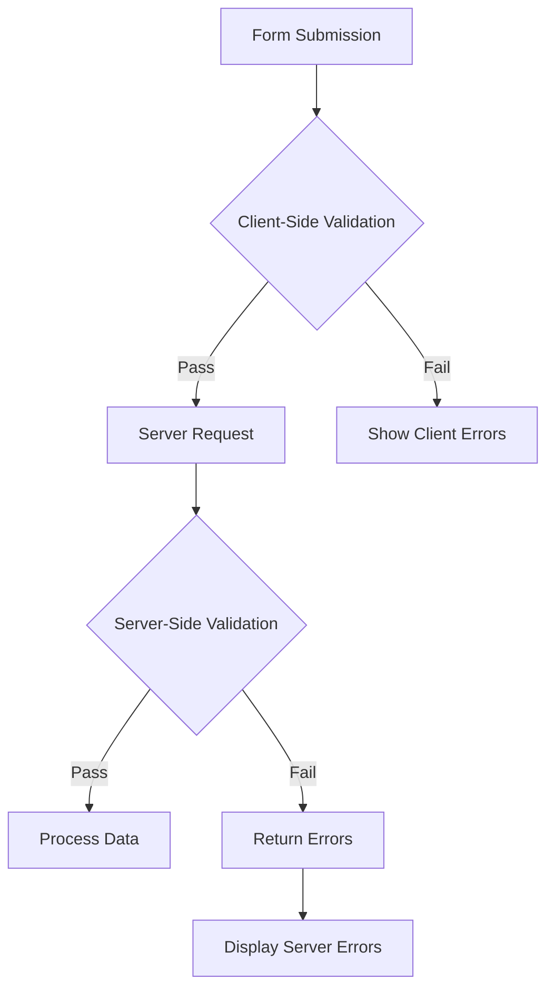

## Aperçu

XOOPS fournit une validation côté client et côté serveur pour les entrées de formulaire. Ce guide couvre les techniques de validation, les validateurs intégrés et la mise en œuvre de la validation personnalisée.

## Architecture de validation



## Validation côté serveur

### Utilisation de XoopsFormValidator

```php
use Xoops\Core\Form\Validator;

$validator = new Validator();

$validator->addRule('username', 'required', 'Username is required');
$validator->addRule('username', 'minLength:3', 'Username must be at least 3 characters');
$validator->addRule('username', 'maxLength:50', 'Username cannot exceed 50 characters');
$validator->addRule('email', 'email', 'Please enter a valid email address');
$validator->addRule('password', 'minLength:8', 'Password must be at least 8 characters');

if (!$validator->validate($_POST)) {
    $errors = $validator->getErrors();
    // Handle errors
}
```

### Règles de validation intégrées

| Règle | Description | Exemple |
|-------|-------------|---------|
| `required` | Le champ ne doit pas être vide | `required` |
| `email` | Format de courriel valide | `email` |
| `url` | Format d'URL valide | `url` |
| `numeric` | Valeur numérique uniquement | `numeric` |
| `integer` | Valeur entière uniquement | `integer` |
| `minLength` | Longueur minimale de la chaîne | `minLength:3` |
| `maxLength` | Longueur maximale de la chaîne | `maxLength:100` |
| `min` | Valeur numérique minimale | `min:1` |
| `max` | Valeur numérique maximale | `max:100` |
| `regex` | Motif regex personnalisé | `regex:/^[a-z]+$/` |
| `in` | Valeur dans la liste | `in:draft,published,archived` |
| `date` | Format de date valide | `date` |
| `alpha` | Lettres uniquement | `alpha` |
| `alphanumeric` | Lettres et chiffres | `alphanumeric` |

### Règles de validation personnalisées

```php
$validator->addCustomRule('unique_username', function($value) {
    $memberHandler = xoops_getHandler('member');
    $criteria = new \CriteriaCompo();
    $criteria->add(new \Criteria('uname', $value));
    return $memberHandler->getUserCount($criteria) === 0;
}, 'Username already exists');

$validator->addRule('username', 'unique_username');
```

## Validation des demandes

### Assainissement des données d'entrée

```php
use Xoops\Core\Request;

// Get sanitized values
$username = Request::getString('username', '', 'POST');
$email = Request::getEmail('email', '', 'POST');
$age = Request::getInt('age', 0, 'POST');
$price = Request::getFloat('price', 0.0, 'POST');
$tags = Request::getArray('tags', [], 'POST');

// With validation
$username = Request::getString('username', '', 'POST', [
    'minLength' => 3,
    'maxLength' => 50
]);
```

### Prévention du XSS

```php
use Xoops\Core\Text\Sanitizer;

$sanitizer = Sanitizer::getInstance();

// Sanitize HTML content
$cleanContent = $sanitizer->sanitizeForDisplay($userContent);

// Strip all HTML
$plainText = $sanitizer->stripHtml($userContent);

// Allow specific tags
$content = $sanitizer->sanitizeForDisplay($userContent, [
    'allowedTags' => '<p><br><strong><em><a>'
]);
```

## Validation côté client

### Attributs de validation HTML5

```php
// Required field
$element->setExtra('required');

// Pattern validation
$element->setExtra('pattern="[a-zA-Z0-9]+" title="Alphanumeric only"');

// Length constraints
$element->setExtra('minlength="3" maxlength="50"');

// Numeric constraints
$element->setExtra('min="1" max="100"');
```

### Validation JavaScript

```javascript
document.getElementById('myForm').addEventListener('submit', function(e) {
    const username = document.getElementById('username').value;
    const errors = [];

    if (username.length < 3) {
        errors.push('Username must be at least 3 characters');
    }

    if (!/^[a-zA-Z0-9_]+$/.test(username)) {
        errors.push('Username can only contain letters, numbers, and underscores');
    }

    if (errors.length > 0) {
        e.preventDefault();
        displayErrors(errors);
    }
});
```

## Protection CSRF

### Génération de jetons

```php
// Generate token in form
$form->addElement(new \XoopsFormHiddenToken());

// This adds a hidden field with security token
```

### Vérification du jeton

```php
use Xoops\Core\Security;

if (!Security::checkReferer()) {
    die('Invalid request origin');
}

if (!Security::checkToken()) {
    die('Invalid security token');
}
```

## Validation d'envoi de fichier

```php
use Xoops\Core\Uploader;

$uploader = new Uploader(
    uploadDir: XOOPS_UPLOAD_PATH . '/images/',
    allowedMimeTypes: ['image/jpeg', 'image/png', 'image/gif'],
    maxFileSize: 2 * 1024 * 1024, // 2MB
    maxWidth: 1920,
    maxHeight: 1080
);

if ($uploader->fetchMedia('image_upload')) {
    if ($uploader->upload()) {
        $savedFile = $uploader->getSavedFileName();
    } else {
        $errors[] = $uploader->getErrors();
    }
}
```

## Affichage des erreurs

### Collecte des erreurs

```php
$errors = [];

if (empty($username)) {
    $errors['username'] = 'Username is required';
}

if (!filter_var($email, FILTER_VALIDATE_EMAIL)) {
    $errors['email'] = 'Invalid email format';
}

if (!empty($errors)) {
    // Store in session for display after redirect
    $_SESSION['form_errors'] = $errors;
    $_SESSION['form_data'] = $_POST;
    header('Location: ' . $_SERVER['HTTP_REFERER']);
    exit;
}
```

### Affichage des erreurs

```smarty
{if $errors}
<div class="alert alert-danger">
    <ul>
        {foreach $errors as $field => $message}
        <li>{$message}</li>
        {/foreach}
    </ul>
</div>
{/if}
```

## Meilleures pratiques

1. **Toujours valider côté serveur** - La validation côté client peut être contournée
2. **Utiliser des requêtes paramétrées** - Prévenir l'injection SQL
3. **Assainir la sortie** - Prévenir les attaques XSS
4. **Valider les envois de fichiers** - Vérifier les types MIME et les tailles
5. **Utiliser les jetons CSRF** - Prévenir la falsification de demande inter-site
6. **Limiter le débit des soumissions** - Prévenir les abus

## Documentation associée

- Référence des éléments de formulaire
- Aperçu des formulaires
- Meilleures pratiques de sécurité
