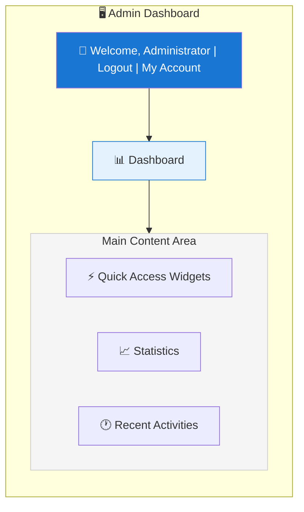
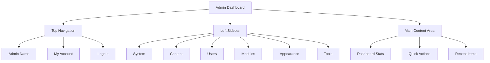

# Aperçu du panneau d'administration XOOPS

Guide complet pour naviguer et utiliser le tableau de bord administrateur XOOPS.

## Accès au panneau d'administration

### Connexion administrateur

Ouvrez votre navigateur et accédez à :

```
http://your-domain.com/xoops/admin/
```

Ou si XOOPS est à la racine :

```
http://your-domain.com/admin/
```

Entrez vos identifiants d'administrateur :

```
Username: [Your admin username]
Password: [Your admin password]
```

### Après la connexion

Vous verrez le tableau de bord administrateur principal :



## Disposition du panneau d'administration



## Composants du tableau de bord

### Barre supérieure

La barre supérieure contient les contrôles essentiels :

| Élément | Objectif |
|---|---|
| **Logo administrateur** | Cliquez pour revenir au tableau de bord |
| **Message de bienvenue** | Affiche le nom de l'administrateur connecté |
| **Mon compte** | Modifier le profil et le mot de passe de l'administrateur |
| **Aide** | Accédez à la documentation |
| **Déconnexion** | Se déconnecter du panneau d'administration |

### Barre de navigation latérale gauche

Menu principal organisé par fonction :

```
├── Système
│   ├── Tableau de bord
│   ├── Préférences
│   ├── Utilisateurs administrateur
│   ├── Groupes
│   ├── Permissions
│   ├── Modules
│   └── Outils
├── Contenu
│   ├── Pages
│   ├── Catégories
│   ├── Commentaires
│   └── Gestionnaire média
├── Utilisateurs
│   ├── Utilisateurs
│   ├── Demandes d'utilisateur
│   ├── Utilisateurs en ligne
│   └── Groupes d'utilisateurs
├── Modules
│   ├── Modules
│   ├── Paramètres des modules
│   └── Mises à jour de modules
├── Apparence
│   ├── Thèmes
│   ├── Modèles
│   ├── Blocs
│   └── Images
└── Outils
    ├── Maintenance
    ├── Email
    ├── Statistiques
    ├── Journaux
    └── Sauvegardes
```

### Zone de contenu principal

Affiche les informations et contrôles pour la section sélectionnée :

- Formulaires de configuration
- Tableaux de données avec listes
- Graphiques et statistiques
- Boutons d'action rapide
- Texte d'aide et info-bulles

### Widgets du tableau de bord

Accès rapide aux informations clés :

- **Informations système :** version PHP, version MySQL, version XOOPS
- **Statistiques rapides :** nombre d'utilisateurs, total des publications, modules installés
- **Activité récente :** dernières connexions, changements de contenu, erreurs
- **État du serveur :** CPU, mémoire, utilisation du disque
- **Notifications :** alertes système, mises à jour en attente

## Fonctions administratives essentielles

### Gestion du système

**Localisation :** Système > [Diverses options]

#### Préférences

Configurez les paramètres système de base :

```
Système > Préférences > [Catégorie de paramètres]
```

Catégories :
- Paramètres généraux (nom du site, fuseau horaire)
- Paramètres utilisateur (enregistrement, profils)
- Paramètres email (configuration SMTP)
- Paramètres de cache (options de mise en cache)
- Paramètres d'URL (URL conviviales)
- Méta-balises (paramètres SEO)

Voir Configuration de base et Paramètres système.

#### Utilisateurs administrateur

Gérer les comptes administrateur :

```
Système > Utilisateurs administrateur
```

Fonctions :
- Ajouter de nouveaux administrateurs
- Modifier les profils administrateur
- Modifier les mots de passe administrateur
- Supprimer les comptes administrateur
- Définir les permissions administrateur

### Gestion du contenu

**Localisation :** Contenu > [Diverses options]

#### Pages/Articles

Gérer le contenu du site :

```
Contenu > Pages (ou votre module)
```

Fonctions :
- Créer de nouvelles pages
- Modifier le contenu existant
- Supprimer les pages
- Publier/dépublier
- Définir les catégories
- Gérer les révisions

#### Catégories

Organiser le contenu :

```
Contenu > Catégories
```

Fonctions :
- Créer une hiérarchie de catégories
- Modifier les catégories
- Supprimer les catégories
- Assigner aux pages

#### Commentaires

Modérer les commentaires des utilisateurs :

```
Contenu > Commentaires
```

Fonctions :
- Afficher tous les commentaires
- Approuver les commentaires
- Modifier les commentaires
- Supprimer les spams
- Bloquer les commentateurs

### Gestion des utilisateurs

**Localisation :** Utilisateurs > [Diverses options]

#### Utilisateurs

Gérer les comptes d'utilisateurs :

```
Utilisateurs > Utilisateurs
```

Fonctions :
- Afficher tous les utilisateurs
- Créer de nouveaux utilisateurs
- Modifier les profils utilisateur
- Supprimer les comptes
- Réinitialiser les mots de passe
- Modifier le statut de l'utilisateur
- Assigner aux groupes

#### Utilisateurs en ligne

Surveiller les utilisateurs actifs :

```
Utilisateurs > Utilisateurs en ligne
```

Affiche :
- Utilisateurs actuellement en ligne
- Heure de la dernière activité
- Adresse IP
- Localisation de l'utilisateur (si configurée)

#### Groupes d'utilisateurs

Gérer les rôles et permissions des utilisateurs :

```
Utilisateurs > Groupes
```

Fonctions :
- Créer des groupes personnalisés
- Définir les permissions de groupe
- Assigner les utilisateurs aux groupes
- Supprimer les groupes

### Gestion des modules

**Localisation :** Modules > [Diverses options]

#### Modules

Installer et configurer des modules :

```
Modules > Modules
```

Fonctions :
- Afficher les modules installés
- Activer/désactiver les modules
- Mettre à jour les modules
- Configurer les paramètres de module
- Installer de nouveaux modules
- Afficher les détails du module

#### Vérifier les mises à jour

```
Modules > Modules > Vérifier les mises à jour
```

Affiche :
- Mises à jour de module disponibles
- Journal des modifications
- Options de téléchargement et d'installation

### Gestion de l'apparence

**Localisation :** Apparence > [Diverses options]

#### Thèmes

Gérer les thèmes du site :

```
Apparence > Thèmes
```

Fonctions :
- Afficher les thèmes installés
- Définir le thème par défaut
- Télécharger de nouveaux thèmes
- Supprimer les thèmes
- Aperçu du thème
- Configuration du thème

#### Blocs

Gérer les blocs de contenu :

```
Apparence > Blocs
```

Fonctions :
- Créer des blocs personnalisés
- Modifier le contenu des blocs
- Organiser les blocs sur la page
- Définir la visibilité du bloc
- Supprimer les blocs
- Configurer la mise en cache des blocs

#### Modèles

Gérer les modèles (avancé) :

```
Apparence > Modèles
```

Pour les utilisateurs avancés et les développeurs.

### Outils système

**Localisation :** Système > Outils

#### Mode maintenance

Empêcher l'accès des utilisateurs pendant la maintenance :

```
Système > Mode maintenance
```

Configurer :
- Activer/désactiver la maintenance
- Message de maintenance personnalisé
- Adresses IP autorisées (pour les tests)

#### Gestion de base de données

```
Système > Base de données
```

Fonctions :
- Vérifier la cohérence de la base de données
- Exécuter les mises à jour de base de données
- Réparer les tableaux
- Optimiser la base de données
- Exporter la structure de la base de données

#### Journaux d'activité

```
Système > Journaux
```

Surveiller :
- Activité des utilisateurs
- Actions administratives
- Événements système
- Journaux d'erreurs

## Actions rapides

Tâches courantes accessibles depuis le tableau de bord :

```
Liens rapides :
├── Créer une nouvelle page
├── Ajouter un nouvel utilisateur
├── Créer un bloc de contenu
├── Télécharger une image
├── Envoyer un email en masse
├── Mettre à jour tous les modules
└── Vider le cache
```

## Raccourcis clavier du panneau d'administration

Navigation rapide :

| Raccourci | Action |
|---|---|
| `Ctrl+H` | Aller à l'aide |
| `Ctrl+D` | Aller au tableau de bord |
| `Ctrl+Q` | Recherche rapide |
| `Ctrl+L` | Déconnexion |

## Gestion des comptes utilisateur

### Mon compte

Accédez à votre profil d'administrateur :

1. Cliquez sur "Mon compte" en haut à droite
2. Modifiez les informations du profil :
   - Adresse email
   - Nom réel
   - Informations utilisateur
   - Avatar

### Modifier le mot de passe

Modifiez votre mot de passe administrateur :

1. Allez à **Mon compte**
2. Cliquez sur "Modifier le mot de passe"
3. Entrez le mot de passe actuel
4. Entrez le nouveau mot de passe (deux fois)
5. Cliquez sur "Enregistrer"

**Conseils de sécurité :**
- Utilisez des mots de passe forts (16+ caractères)
- Incluez des majuscules, minuscules, chiffres, symboles
- Modifiez le mot de passe tous les 90 jours
- Ne partagez jamais les identifiants administrateur

### Déconnexion

Se déconnecter du panneau d'administration :

1. Cliquez sur "Déconnexion" en haut à droite
2. Vous serez redirigé vers la page de connexion

## Statistiques du panneau d'administration

### Statistiques du tableau de bord

Aperçu rapide des métriques du site :

| Métrique | Valeur |
|--------|-------|
| Utilisateurs en ligne | 12 |
| Utilisateurs totaux | 256 |
| Publications totales | 1 234 |
| Commentaires totaux | 5 678 |
| Modules totaux | 8 |

### État du système

Informations sur le serveur et les performances :

| Composant | Version/Valeur |
|-----------|---------------|
| Version XOOPS | 2.5.11 |
| Version PHP | 8.2.x |
| Version MySQL | 8.0.x |
| Charge du serveur | 0.45, 0.42 |
| Uptime | 45 jours |

### Activité récente

Chronologie des événements récents :

```
12:45 - Connexion administrateur
12:30 - Nouvel utilisateur enregistré
12:15 - Page publiée
12:00 - Commentaire posté
11:45 - Module mis à jour
```

## Système de notification

### Alertes administrateur

Recevez des notifications pour :

- Nouvelles inscriptions d'utilisateurs
- Commentaires en attente de modération
- Tentatives de connexion échouées
- Erreurs système
- Mises à jour de modules disponibles
- Problèmes de base de données
- Avertissements d'espace disque

Configurez les alertes :

**Système > Préférences > Paramètres email**

```
Notifier l'administrateur à l'enregistrement : Oui
Notifier l'administrateur sur les commentaires : Oui
Notifier l'administrateur sur les erreurs : Oui
Email d'alerte : admin@your-domain.com
```

## Tâches administratives courantes

### Créer une nouvelle page

1. Allez à **Contenu > Pages** (ou module pertinent)
2. Cliquez sur "Ajouter une nouvelle page"
3. Remplissez :
   - Titre
   - Contenu
   - Description
   - Catégorie
   - Métadonnées
4. Cliquez sur "Publier"

### Gérer les utilisateurs

1. Allez à **Utilisateurs > Utilisateurs**
2. Afficher la liste des utilisateurs avec :
   - Nom d'utilisateur
   - Email
   - Date d'enregistrement
   - Dernière connexion
   - Statut

3. Cliquez sur le nom d'utilisateur pour :
   - Modifier le profil
   - Modifier le mot de passe
   - Modifier les groupes
   - Bloquer/débloquer l'utilisateur

### Configurer un module

1. Allez à **Modules > Modules**
2. Trouvez le module dans la liste
3. Cliquez sur le nom du module
4. Cliquez sur "Préférences" ou "Paramètres"
5. Configurez les options du module
6. Enregistrez les modifications

### Créer un nouveau bloc

1. Allez à **Apparence > Blocs**
2. Cliquez sur "Ajouter un nouveau bloc"
3. Entrez :
   - Titre du bloc
   - Contenu du bloc (HTML autorisé)
   - Position sur la page
   - Visibilité (toutes les pages ou spécifiques)
   - Module (le cas échéant)
4. Cliquez sur "Soumettre"

## Aide du panneau d'administration

### Documentation intégrée

Accédez à l'aide depuis le panneau d'administration :

1. Cliquez sur le bouton "Aide" dans la barre supérieure
2. Aide contextuelle pour la page actuelle
3. Liens vers la documentation
4. Questions fréquemment posées

### Ressources externes

- Site officiel XOOPS : https://xoops.org/
- Forum communautaire : https://xoops.org/modules/newbb/
- Référentiel de modules : https://xoops.org/modules/repository/
- Bugs/Problèmes : https://github.com/XOOPS/XoopsCore/issues

## Personnalisation du panneau d'administration

### Thème administrateur

Choisissez le thème de l'interface administrateur :

**Système > Préférences > Paramètres généraux**

```
Thème administrateur : [Sélectionner le thème]
```

Thèmes disponibles :
- Par défaut (light)
- Mode sombre
- Thèmes personnalisés

### Personnalisation du tableau de bord

Choisissez quels widgets apparaissent :

**Tableau de bord > Personnaliser**

Sélectionner :
- Informations système
- Statistiques
- Activité récente
- Liens rapides
- Widgets personnalisés

## Permissions du panneau d'administration

Différents niveaux d'administrateur ont différentes permissions :

| Rôle | Capacités |
|---|---|
| **Webmaster** | Accès complet à toutes les fonctions administratives |
| **Admin** | Fonctions administratives limitées |
| **Modérateur** | Modération du contenu uniquement |
| **Éditeur** | Création et modification de contenu |

Gérez les permissions :

**Système > Permissions**

## Meilleures pratiques de sécurité pour le panneau d'administration

1. **Mot de passe fort :** Utilisez un mot de passe de 16+ caractères
2. **Changements réguliers :** Modifiez le mot de passe tous les 90 jours
3. **Surveiller l'accès :** Vérifiez régulièrement les journaux des "Utilisateurs administrateur"
4. **Limiter l'accès :** Renommez le dossier administrateur pour une sécurité supplémentaire
5. **Utiliser HTTPS :** Accédez toujours à l'administrateur via HTTPS
6. **Liste blanche IP :** Limitez l'accès administrateur à des adresses IP spécifiques
7. **Déconnexion régulière :** Déconnectez-vous lorsque vous avez terminé
8. **Sécurité du navigateur :** Videz régulièrement le cache du navigateur

Voir Configuration de sécurité.

## Dépannage du panneau d'administration

### Impossible d'accéder au panneau d'administration

**Solution :**
1. Vérifiez les identifiants de connexion
2. Videz le cache et les cookies du navigateur
3. Essayez un navigateur différent
4. Vérifiez que le chemin du dossier administrateur est correct
5. Vérifiez les permissions des fichiers sur le dossier administrateur
6. Vérifiez la connexion à la base de données dans mainfile.php

### Page administrateur vierge

**Solution :**
```bash
# Vérifier les erreurs PHP
tail -f /var/log/apache2/error.log

# Activer temporairement le mode debug
sed -i "s/define('XOOPS_DEBUG', 0)/define('XOOPS_DEBUG', 1)/" /var/www/html/xoops/mainfile.php

# Vérifier les permissions des fichiers
ls -la /var/www/html/xoops/admin/
```

### Panneau d'administration lent

**Solution :**
1. Videz le cache : **Système > Outils > Vider le cache**
2. Optimisez la base de données : **Système > Base de données > Optimiser**
3. Vérifiez les ressources du serveur : `htop`
4. Examinez les requêtes lentes dans MySQL

### Module n'apparaissant pas

**Solution :**
1. Vérifiez que le module est installé : **Modules > Modules**
2. Vérifiez que le module est activé
3. Vérifiez que les permissions sont assignées
4. Vérifiez que les fichiers du module existent
5. Examinez les journaux d'erreurs

## Étapes suivantes

Après vous être familiarisé avec le panneau d'administration :

1. Créez votre première page
2. Configurez les groupes d'utilisateurs
3. Installez des modules supplémentaires
4. Configurez les paramètres de base
5. Implémentez la sécurité

---

**Balises :** #admin-panel #dashboard #navigation #getting-started

**Articles connexes :**
- ../Configuration/Basic-Configuration
- ../Configuration/System-Settings
- Creating-Your-First-Page
- Managing-Users
- Installing-Modules
