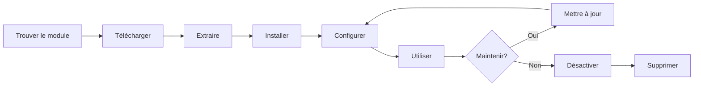

# Installation et gestion des modules XOOPS

Apprenez à étendre la fonctionnalité de XOOPS en installant et en configurant des modules.

## Comprendre les modules XOOPS

### Que sont les modules ?

Les modules sont des extensions qui ajoutent des fonctionnalités à XOOPS :

| Type | Objectif | Exemples |
|---|---|---|
| **Contenu** | Gérer des types de contenu spécifiques | Nouvelles, Blog, Tickets |
| **Communauté** | Interaction des utilisateurs | Forum, Commentaires, Avis |
| **eCommerce** | Vendre des produits | Boutique, Panier, Paiements |
| **Média** | Gérer les fichiers/images | Galerie, Téléchargements, Vidéos |
| **Utilitaire** | Outils et assistants | Email, Sauvegarde, Analytique |

### Modules essentiels vs optionnels

| Module | Type | Inclus | Supprimable |
|---|---|---|---|
| **Système** | Essentiel | Oui | Non |
| **Utilisateur** | Essentiel | Oui | Non |
| **Profil** | Recommandé | Oui | Oui |
| **MP (Message privé)** | Recommandé | Oui | Oui |
| **WF-Channel** | Optionnel | Souvent | Oui |
| **Nouvelles** | Optionnel | Non | Oui |
| **Forum** | Optionnel | Non | Oui |

## Cycle de vie du module



## Trouver des modules

### Référentiel de modules XOOPS

Référentiel officiel des modules XOOPS :

**Visitez :** https://xoops.org/modules/repository/

```
Répertoire > Modules > [Parcourir les catégories]
```

Parcourir par catégorie :
- Gestion du contenu
- Communauté
- eCommerce
- Multimédia
- Développement
- Administration du site

### Évaluation des modules

Avant d'installer, vérifiez :

| Critères | Ce qu'il faut chercher |
|---|---|
| **Compatibilité** | Fonctionne avec votre version XOOPS |
| **Note** | Bonnes critiques et notes des utilisateurs |
| **Mises à jour** | Entretenu récemment |
| **Téléchargements** | Populaire et largement utilisé |
| **Exigences** | Compatible avec votre serveur |
| **Licence** | GPL ou licence open source similaire |
| **Support** | Développeur actif et communauté |

### Lire les informations du module

Chaque page de listing de module affiche :

```
Nom du module : [Nom]
Version : [X.X.X]
Requiert : XOOPS [Version]
Auteur : [Nom]
Dernière mise à jour : [Date]
Téléchargements : [Nombre]
Note : [Étoiles]
Description : [Brève description]
Compatibilité : PHP [Version], MySQL [Version]
```

## Installation de modules

### Méthode 1 : Installation via le panneau d'administration

**Étape 1 : Accédez à la section Modules**

1. Connectez-vous au panneau d'administration
2. Accédez à **Modules > Modules**
3. Cliquez sur **"Installer un nouveau module"** ou **"Parcourir les modules"**

**Étape 2 : Téléchargez le module**

Option A - Téléchargement direct :
1. Cliquez sur **"Choisir un fichier"**
2. Sélectionnez le fichier .zip du module sur votre ordinateur
3. Cliquez sur **"Télécharger"**

Option B - Téléchargement par URL :
1. Collez l'URL du module
2. Cliquez sur **"Télécharger et installer"**

**Étape 3 : Examinez les informations du module**

```
Nom du module : [Nom affiché]
Version : [Version]
Auteur : [Informations sur l'auteur]
Description : [Description complète]
Exigences : [Versions PHP/MySQL]
```

Examinez et cliquez sur **"Procéder à l'installation"**

**Étape 4 : Choisissez le type d'installation**

```
☐ Installation neuve (Nouvelle installation)
☐ Mise à jour (Mise à niveau existante)
☐ Supprimer puis installer (Remplacer l'existant)
```

Sélectionnez l'option appropriée.

**Étape 5 : Confirmez l'installation**

Examinez la confirmation finale :
```
Le module sera installé dans : /modules/modulename/
Base de données : xoops_db
Procéder ? [Oui] [Non]
```

Cliquez sur **"Oui"** pour confirmer.

**Étape 6 : Installation terminée**

```
Installation réussie !

Module : [Nom du module]
Version : [Version]
Tableaux créés : [Nombre]
Fichiers installés : [Nombre]

[Aller aux paramètres du module]  [Retour aux modules]
```

### Méthode 2 : Installation manuelle (avancée)

Pour l'installation manuelle ou le dépannage :

**Étape 1 : Téléchargez le module**

1. Téléchargez le .zip du module depuis le référentiel
2. Extrayez dans `/var/www/html/xoops/modules/modulename/`

```bash
# Extraire le module
unzip module_name.zip
cp -r module_name /var/www/html/xoops/modules/

# Définir les permissions
chmod -R 755 /var/www/html/xoops/modules/module_name
```

**Étape 2 : Exécutez le script d'installation**

```
Visitez : http://your-domain.com/xoops/modules/module_name/admin/index.php?op=install
```

Ou via le panneau d'administration (Système > Modules > Mettre à jour la base de données).

**Étape 3 : Vérifiez l'installation**

1. Allez à **Modules > Modules** dans l'administrateur
2. Cherchez votre module dans la liste
3. Vérifiez qu'il affiche "Actif"

## Configuration des modules

### Accédez aux paramètres du module

1. Allez à **Modules > Modules**
2. Trouvez votre module
3. Cliquez sur le nom du module
4. Cliquez sur **"Préférences"** ou **"Paramètres"**

### Paramètres courants du module

La plupart des modules offrent :

```
Statut du module : [Actif/Désactif]
Afficher dans le menu : [Oui/Non]
Poids du module : [1-999] (ordre d'affichage)
Visible aux groupes : [Cases à cocher pour les groupes d'utilisateurs]
```

### Options spécifiques au module

Chaque module a des paramètres uniques. Exemples :

**Module Nouvelles :**
```
Éléments par page : 10
Afficher l'auteur : Oui
Autoriser les commentaires : Oui
Modération requise : Oui
```

**Module Forum :**
```
Sujets par page : 20
Publications par page : 15
Taille maximale de la pièce jointe : 5MB
Activer les signatures : Oui
```

**Module Galerie :**
```
Images par page : 12
Taille des miniatures : 150x150
Téléchargement maximum : 10MB
Filigrane : Oui/Non
```

Consultez la documentation de votre module pour les options spécifiques.

### Enregistrez la configuration

Après ajustement des paramètres :

1. Cliquez sur **"Soumettre"** ou **"Enregistrer"**
2. Vous verrez une confirmation :
   ```
   Paramètres enregistrés avec succès !
   ```

## Gestion des blocs de modules

De nombreux modules créent des "blocs" - des zones de contenu semblables à des widgets.

### Affichage des blocs de modules

1. Allez à **Apparence > Blocs**
2. Cherchez les blocs de votre module
3. La plupart des modules affichent "[Nom du module] - [Description du bloc]"

### Configurer les blocs

1. Cliquez sur le nom du bloc
2. Ajustez :
   - Titre du bloc
   - Visibilité (toutes les pages ou spécifiques)
   - Position sur la page (gauche, centre, droite)
   - Groupes d'utilisateurs qui peuvent voir
3. Cliquez sur **"Soumettre"**

### Afficher le bloc sur la page d'accueil

1. Allez à **Apparence > Blocs**
2. Trouvez le bloc que vous voulez
3. Cliquez sur **"Modifier"**
4. Définir :
   - **Visible pour :** Sélectionnez les groupes
   - **Position :** Choisissez la colonne (gauche/centre/droite)
   - **Pages :** Page d'accueil ou toutes les pages
5. Cliquez sur **"Soumettre"**

## Installation d'exemples de modules spécifiques

### Installation du module Nouvelles

**Idéal pour :** Articles de blog, annonces

1. Téléchargez le module Nouvelles depuis le référentiel
2. Téléchargez via **Modules > Modules > Installer**
3. Configurez dans **Modules > Nouvelles > Préférences** :
   - Articles par page : 10
   - Autoriser les commentaires : Oui
   - Approuver avant la publication : Oui
4. Créer des blocs pour les dernières actualités
5. Commencez à publier des articles !

### Installation du module Forum

**Idéal pour :** Discussion communautaire

1. Téléchargez le module Forum
2. Installez via le panneau d'administration
3. Créez les catégories de forum dans le module
4. Configurez les paramètres :
   - Sujets/page : 20
   - Publications/page : 15
   - Activer la modération : Oui
5. Assignez les permissions des groupes d'utilisateurs
6. Créez des blocs pour les derniers sujets

### Installation du module Galerie

**Idéal pour :** Vitrine d'images

1. Téléchargez le module Galerie
2. Installez et configurez
3. Créez des albums photo
4. Téléchargez des images
5. Définissez les permissions pour l'affichage/téléchargement
6. Affichage de la galerie sur le site Web

## Mise à jour des modules

### Vérifier les mises à jour

```
Panneau d'administration > Modules > Modules > Vérifier les mises à jour
```

Cela affiche :
- Mises à jour de module disponibles
- Version actuelle vs nouvelle version
- Notes de version/changements

### Mettre à jour un module

1. Allez à **Modules > Modules**
2. Cliquez sur le module avec la mise à jour disponible
3. Cliquez sur le bouton **"Mettre à jour"**
4. Sélectionnez **"Mettre à jour"** dans le type d'installation
5. Suivez l'assistant d'installation
6. Module mis à jour !

### Notes importantes sur la mise à jour

Avant de mettre à jour :

- [ ] Sauvegardez la base de données
- [ ] Sauvegardez les fichiers du module
- [ ] Examinez le journal des modifications
- [ ] Testez d'abord sur le serveur de staging
- [ ] Notez toute modification personnalisée

Après la mise à jour :
- [ ] Vérifiez la fonctionnalité
- [ ] Vérifiez les paramètres du module
- [ ] Examinez les avertissements/erreurs
- [ ] Videz le cache

## Permissions des modules

### Assignez l'accès du groupe d'utilisateurs

Contrôlez quels groupes d'utilisateurs peuvent accéder aux modules :

**Localisation :** Système > Permissions

Pour chaque module, configurez :

```
Module : [Nom du module]

Accès administrateur : [Sélectionnez les groupes]
Accès utilisateur : [Sélectionnez les groupes]
Permission de lecture : [Groupes autorisés à voir]
Permission d'écriture : [Groupes autorisés à publier]
Permission de suppression : [Administrateurs uniquement]
```

### Niveaux de permission courants

```
Contenu public (Nouvelles, Pages) :
├── Accès administrateur : Webmaster
├── Accès utilisateur : Tous les utilisateurs enregistrés
└── Permission de lecture : Tout le monde

Fonctionnalités communautaires (Forum, Commentaires) :
├── Accès administrateur : Webmaster, Modérateurs
├── Accès utilisateur : Tous les utilisateurs enregistrés
└── Permission d'écriture : Tous les utilisateurs enregistrés

Outils d'administration :
├── Accès administrateur : Webmaster uniquement
└── Accès utilisateur : Désactif
```

## Désactiver et supprimer des modules

### Désactiver le module (Garder les fichiers)

Garder le module mais masquer du site :

1. Allez à **Modules > Modules**
2. Trouvez le module
3. Cliquez sur le nom du module
4. Cliquez sur **"Désactiver"** ou définissez le statut sur Inactif
5. Module caché mais données préservées

Réactiver à tout moment :
1. Cliquez sur le module
2. Cliquez sur **"Activer"**

### Supprimer le module complètement

Supprimer le module et ses données :

1. Allez à **Modules > Modules**
2. Trouvez le module
3. Cliquez sur **"Désinstaller"** ou **"Supprimer"**
4. Confirmez : "Supprimer le module et toutes les données ?"
5. Cliquez sur **"Oui"** pour confirmer

**Avertissement :** La désinstallation supprime toutes les données du module !

### Réinstaller après désinstallation

Si vous désinstallez un module :
- Fichiers de module supprimés
- Tableaux de base de données supprimés
- Toutes les données perdues
- Doit réinstaller pour utiliser à nouveau
- Peut restaurer à partir de la sauvegarde

## Dépannage de l'installation des modules

### Le module n'apparaît pas après l'installation

**Symptôme :** Module listé mais non visible sur le site

**Solution :**
```
1. Vérifiez que le module est "Actif" (Modules > Modules)
2. Activez les blocs de module (Apparence > Blocs)
3. Vérifiez les permissions utilisateur (Système > Permissions)
4. Videz le cache (Système > Outils > Vider le cache)
5. Vérifiez que .htaccess ne bloque pas le module
```

### Erreur d'installation : "La table existe déjà"

**Symptôme :** Erreur lors de l'installation du module

**Solution :**
```
1. Module partiellement installé avant
2. Essayez l'option "Supprimer puis installer"
3. Ou désinstallez d'abord, puis installez à nouveau
4. Vérifiez la base de données pour les tableaux existants :
   mysql> SHOW TABLES LIKE 'xoops_module%';
```

### Module manquant les dépendances

**Symptôme :** Le module ne s'installera pas - nécessite un autre module

**Solution :**
```
1. Notez les modules requis du message d'erreur
2. Installez d'abord les modules requis
3. Installez ensuite le module
4. Installez dans le bon ordre
```

### Page vierge lors de l'accès au module

**Symptôme :** Le module se charge mais n'affiche rien

**Solution :**
```
1. Activez le mode debug dans mainfile.php :
   define('XOOPS_DEBUG', 1);

2. Vérifiez le journal des erreurs PHP :
   tail -f /var/log/php_errors.log

3. Vérifiez les permissions des fichiers :
   chmod -R 755 /var/www/html/xoops/modules/modulename

4. Vérifiez la connexion à la base de données dans la configuration du module

5. Désactivez et réinstallez le module
```

### Le module casse le site

**Symptôme :** L'installation du module casse le site Web

**Solution :**
```
1. Désactivez immédiatement le module problématique :
   Admin > Modules > [Module] > Désactiver

2. Videz le cache :
   rm -rf /var/www/html/xoops/cache/*
   rm -rf /var/www/html/xoops/templates_c/*

3. Restaurez à partir de la sauvegarde si nécessaire

4. Vérifiez les journaux d'erreurs pour la cause première

5. Contactez le développeur du module
```

## Considérations de sécurité des modules

### Installez uniquement à partir de sources de confiance

```
✓ Référentiel officiel XOOPS
✓ Modules XOOPS officiels GitHub
✓ Développeurs de modules de confiance
✗ Sites Web inconnus
✗ Sources non vérifiées
```

### Vérifiez les permissions du module

Après l'installation :

1. Examinez le code du module pour une activité suspecte
2. Vérifiez les tableaux de la base de données pour les anomalies
3. Surveiller les modifications de fichiers
4. Gardez les modules à jour
5. Supprimer les modules inutilisés

### Meilleure pratique des permissions

```
Répertoire de module : 755 (lisible, non accessible par le serveur Web)
Fichiers du module : 644 (lecture uniquement)
Données du module : Protégées par la base de données
```

## Ressources de développement de module

### En savoir plus sur le développement de modules

- Documentation officielle : https://xoops.org/
- Référentiel GitHub : https://github.com/XOOPS/
- Forum communautaire : https://xoops.org/modules/newbb/
- Guide du développeur : Disponible dans le dossier docs

## Meilleures pratiques pour les modules

1. **Installer un à la fois :** Surveiller les conflits
2. **Tester après l'installation :** Vérifier la fonctionnalité
3. **Documenter la configuration personnalisée :** Noter vos paramètres
4. **Garder à jour :** Installer les mises à jour de module rapidement
5. **Supprimer les inutilisés :** Supprimer les modules dont vous n'avez pas besoin
6. **Sauvegarde avant :** Toujours sauvegarder avant d'installer
7. **Lire la documentation :** Vérifier les instructions du module
8. **Rejoindre la communauté :** Demander de l'aide si nécessaire

## Liste de contrôle d'installation de module

Pour chaque installation de module :

- [ ] Rechercher et lire les avis
- [ ] Vérifier la compatibilité de la version XOOPS
- [ ] Sauvegarder la base de données et les fichiers
- [ ] Télécharger la dernière version
- [ ] Installer via le panneau d'administration
- [ ] Configurer les paramètres
- [ ] Créer/positionner les blocs
- [ ] Définir les permissions utilisateur
- [ ] Tester la fonctionnalité
- [ ] Documenter la configuration
- [ ] Planifier les mises à jour

## Étapes suivantes

Après l'installation de modules :

1. Créer du contenu pour les modules
2. Configurer les groupes d'utilisateurs
3. Explorer les fonctionnalités administrateur
4. Optimiser les performances
5. Installer des modules supplémentaires si nécessaire

---

**Balises :** #modules #installation #extension #management

**Articles connexes :**
- Admin-Panel-Overview
- Managing-Users
- Creating-Your-First-Page
- ../Configuration/System-Settings
