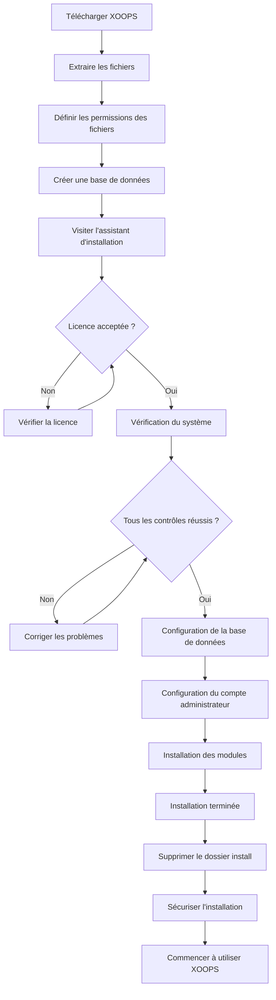

# Guide complet d'installation de XOOPS

Ce guide fournit une procédure exhaustive pour installer XOOPS à partir de zéro en utilisant l'assistant d'installation.

## Conditions préalables

Avant de commencer l'installation, assurez-vous d'avoir :

- Accès à votre serveur web via FTP ou SSH
- Accès administrateur à votre serveur de base de données
- Un nom de domaine enregistré
- Les exigences du serveur vérifiées
- Des outils de sauvegarde disponibles

## Processus d'installation



## Installation étape par étape

### Étape 1 : Télécharger XOOPS

Téléchargez la dernière version depuis [https://xoops.org/](https://xoops.org/) :

```bash
# Avec wget
wget https://xoops.org/download/xoops-2.5.8.zip

# Avec curl
curl -O https://xoops.org/download/xoops-2.5.8.zip
```

### Étape 2 : Extraire les fichiers

Extrayez l'archive XOOPS vers votre racine web :

```bash
# Accédez à la racine web
cd /var/www/html

# Extrayez XOOPS
unzip xoops-2.5.8.zip

# Renommez le dossier (optionnel, mais recommandé)
mv xoops-2.5.8 xoops
cd xoops
```

### Étape 3 : Définir les permissions des fichiers

Définissez les permissions appropriées pour les répertoires XOOPS :

```bash
# Rendre les répertoires accessibles (755 pour les répertoires, 644 pour les fichiers)
find . -type d -exec chmod 755 {} \;
find . -type f -exec chmod 644 {} \;

# Rendre les répertoires spécifiques accessibles au serveur web
chmod 777 uploads/
chmod 777 templates_c/
chmod 777 var/
chmod 777 cache/

# Sécuriser mainfile.php après l'installation
chmod 644 mainfile.php
```

### Étape 4 : Créer une base de données

Créez une nouvelle base de données pour XOOPS en utilisant MySQL :

```sql
-- Créer la base de données
CREATE DATABASE xoops_db CHARACTER SET utf8mb4 COLLATE utf8mb4_unicode_ci;

-- Créer l'utilisateur
CREATE USER 'xoops_user'@'localhost' IDENTIFIED BY 'secure_password_here';

-- Accorder les privilèges
GRANT ALL PRIVILEGES ON xoops_db.* TO 'xoops_user'@'localhost';
FLUSH PRIVILEGES;
```

Ou en utilisant phpMyAdmin :

1. Connectez-vous à phpMyAdmin
2. Cliquez sur l'onglet "Bases de données"
3. Entrez le nom de la base de données : `xoops_db`
4. Sélectionnez le classement "utf8mb4_unicode_ci"
5. Cliquez sur "Créer"
6. Créez un utilisateur avec le même nom que la base de données
7. Accordez tous les privilèges

### Étape 5 : Exécuter l'assistant d'installation

Ouvrez votre navigateur et accédez à :

```
http://your-domain.com/xoops/install/
```

#### Phase de vérification du système

L'assistant vérifie votre configuration serveur :

- Version de PHP >= 5.6.0
- MySQL/MariaDB disponible
- Extensions PHP requises (GD, PDO, etc.)
- Permissions des répertoires
- Connectivité de la base de données

**Si les vérifications échouent :**

Consultez la section #Problèmes-courants-d'installation pour obtenir des solutions.

#### Configuration de la base de données

Entrez vos identifiants de base de données :

```
Hôte de base de données : localhost
Nom de la base de données : xoops_db
Utilisateur de la base de données : xoops_user
Mot de passe de la base de données : [votre_mot_de_passe_sécurisé]
Préfixe de table : xoops_
```

**Notes importantes :**
- Si votre hôte de base de données diffère de localhost (par exemple, serveur distant), entrez le nom d'hôte correct
- Le préfixe de table est utile si vous exécutez plusieurs instances XOOPS dans une base de données
- Utilisez un mot de passe fort avec des majuscules, des minuscules, des chiffres et des symboles

#### Configuration du compte administrateur

Créez votre compte administrateur :

```
Nom d'utilisateur administrateur : admin (ou choisissez un personnalisé)
E-mail administrateur : admin@your-domain.com
Mot de passe administrateur : [mot_de_passe_unique_fort]
Confirmer le mot de passe : [répéter_le_mot_de_passe]
```

**Meilleures pratiques :**
- Utilisez un nom d'utilisateur unique, pas "admin"
- Utilisez un mot de passe avec 16+ caractères
- Stockez les identifiants dans un gestionnaire de mots de passe sécurisé
- Ne partagez jamais les identifiants administrateur

#### Installation des modules

Choisissez les modules par défaut à installer :

- **Module système** (requis) - Fonctionnalités principales de XOOPS
- **Module utilisateur** (requis) - Gestion des utilisateurs
- **Module profil** (recommandé) - Profils utilisateur
- **Module MP (message privé)** (recommandé) - Messagerie interne
- **Module WF-Channel** (optionnel) - Gestion de contenu

Sélectionnez tous les modules recommandés pour une installation complète.

### Étape 6 : Terminer l'installation

Après toutes les étapes, vous verrez un écran de confirmation :

```
Installation terminée !

Votre installation XOOPS est prête à être utilisée.
Panneau administrateur : http://your-domain.com/xoops/admin/
Panneau utilisateur : http://your-domain.com/xoops/
```

### Étape 7 : Sécuriser votre installation

#### Supprimer le dossier d'installation

```bash
# Supprimer le répertoire d'installation (CRITIQUE pour la sécurité)
rm -rf /var/www/html/xoops/install/

# Ou le renommer
mv /var/www/html/xoops/install/ /var/www/html/xoops/install.bak
```

**ATTENTION :** N'oubliez jamais le dossier d'installation accessible en production !

#### Sécuriser mainfile.php

```bash
# Rendre mainfile.php en lecture seule
chmod 644 /var/www/html/xoops/mainfile.php

# Définir la propriété
chown www-data:www-data /var/www/html/xoops/mainfile.php
```

#### Définir les permissions appropriées des fichiers

```bash
# Permissions de production recommandées
find . -type f -name "*.php" -exec chmod 644 {} \;
find . -type d -exec chmod 755 {} \;

# Répertoires accessibles en écriture par le serveur web
chmod 777 uploads/ var/ cache/ templates_c/
```

#### Activer HTTPS/SSL

Configurez SSL dans votre serveur web (nginx ou Apache).

**Pour Apache :**
```apache
<VirtualHost *:443>
    ServerName your-domain.com
    DocumentRoot /var/www/html/xoops

    SSLEngine on
    SSLCertificateFile /etc/ssl/certs/your-cert.crt
    SSLCertificateKeyFile /etc/ssl/private/your-key.key

    # Forcer la redirection HTTPS
    <IfModule mod_rewrite.c>
        RewriteEngine On
        RewriteCond %{HTTPS} off
        RewriteRule ^(.*)$ https://%{HTTP_HOST}%{REQUEST_URI} [L,R=301]
    </IfModule>
</VirtualHost>
```

## Configuration post-installation

### 1. Accéder au panneau administrateur

Accédez à :
```
http://your-domain.com/xoops/admin/
```

Connectez-vous avec vos identifiants administrateur.

### 2. Configurer les paramètres de base

Configurez les éléments suivants :

- Nom et description du site
- Adresse e-mail de l'administrateur
- Fuseau horaire et format de date
- Optimisation pour les moteurs de recherche

### 3. Tester l'installation

- [ ] Visiter la page d'accueil
- [ ] Vérifier que les modules se chargent
- [ ] Vérifier que l'enregistrement des utilisateurs fonctionne
- [ ] Tester les fonctions du panneau administrateur
- [ ] Confirmer que SSL/HTTPS fonctionne

### 4. Planifier les sauvegardes

Configurez les sauvegardes automatiques :

```bash
# Créer un script de sauvegarde (backup.sh)
#!/bin/bash
DATE=$(date +%Y%m%d_%H%M%S)
BACKUP_DIR="/backups/xoops"
XOOPS_DIR="/var/www/html/xoops"

# Sauvegarder la base de données
mysqldump -u xoops_user -p[password] xoops_db > $BACKUP_DIR/db_$DATE.sql

# Sauvegarder les fichiers
tar -czf $BACKUP_DIR/files_$DATE.tar.gz $XOOPS_DIR

echo "Sauvegarde terminée : $DATE"
```

Planifier avec cron :
```bash
# Sauvegarde quotidienne à 2 heures du matin
0 2 * * * /usr/local/bin/backup.sh
```

## Problèmes courants d'installation

### Problème : Erreurs d'autorisation refusée

**Symptôme :** "Permission denied" lors du chargement ou de la création de fichiers

**Solution :**
```bash
# Vérifier l'utilisateur du serveur web
ps aux | grep apache  # Pour Apache
ps aux | grep nginx   # Pour Nginx

# Corriger les permissions (remplacer www-data par votre utilisateur du serveur web)
chown -R www-data:www-data /var/www/html/xoops
chmod -R 755 /var/www/html/xoops
chmod 777 uploads/ var/ cache/ templates_c/
```

### Problème : Échec de la connexion à la base de données

**Symptôme :** "Cannot connect to database server"

**Solution :**
1. Vérifiez les identifiants de la base de données dans l'assistant d'installation
2. Vérifiez que MySQL/MariaDB est en cours d'exécution :
   ```bash
   service mysql status  # ou mariadb
   ```
3. Vérifiez que la base de données existe :
   ```sql
   SHOW DATABASES;
   ```
4. Tester la connexion à partir de la ligne de commande :
   ```bash
   mysql -h localhost -u xoops_user -p xoops_db
   ```

### Problème : Écran blanc vide

**Symptôme :** XOOPS affiche une page vierge

**Solution :**
1. Vérifiez les journaux d'erreur PHP :
   ```bash
   tail -f /var/log/apache2/error.log
   ```
2. Activez le mode débogage dans mainfile.php :
   ```php
   define('XOOPS_DEBUG', 1);
   ```
3. Vérifiez les permissions des fichiers sur mainfile.php et les fichiers de configuration
4. Vérifiez que l'extension PHP-MySQL est installée

### Problème : Impossible d'écrire dans le répertoire des téléchargements

**Symptôme :** Le téléchargement échoue, "Cannot write to uploads/"

**Solution :**
```bash
# Vérifier les permissions actuelles
ls -la uploads/

# Corriger les permissions
chmod 777 uploads/
chown www-data:www-data uploads/

# Pour des fichiers spécifiques
chmod 644 uploads/*
```

### Problème : Extensions PHP manquantes

**Symptôme :** La vérification du système échoue avec des extensions manquantes (GD, MySQL, etc.)

**Solution (Ubuntu/Debian) :**
```bash
# Installer la bibliothèque GD de PHP
apt-get install php-gd

# Installer le support PHP MySQL
apt-get install php-mysql

# Redémarrer le serveur web
systemctl restart apache2  # ou nginx
```

**Solution (CentOS/RHEL) :**
```bash
# Installer la bibliothèque GD de PHP
yum install php-gd

# Installer le support PHP MySQL
yum install php-mysql

# Redémarrer le serveur web
systemctl restart httpd
```

### Problème : Processus d'installation lent

**Symptôme :** L'assistant d'installation expire ou s'exécute très lentement

**Solution :**
1. Augmentez le délai d'expiration de PHP dans php.ini :
   ```ini
   max_execution_time = 300  # 5 minutes
   ```
2. Augmentez MySQL max_allowed_packet :
   ```sql
   SET GLOBAL max_allowed_packet = 256M;
   ```
3. Vérifiez les ressources du serveur :
   ```bash
   free -h  # Vérifier la RAM
   df -h    # Vérifier l'espace disque
   ```

### Problème : Panneau administrateur non accessible

**Symptôme :** Impossible d'accéder au panneau d'administration après l'installation

**Solution :**
1. Vérifiez que l'utilisateur administrateur existe dans la base de données :
   ```sql
   SELECT * FROM xoops_users WHERE uid = 1;
   ```
2. Videz le cache et les cookies du navigateur
3. Vérifiez que le dossier des sessions est accessible en écriture :
   ```bash
   chmod 777 var/
   ```
4. Vérifiez que les règles htaccess ne bloquent pas l'accès au panneau d'administration

## Liste de vérification

Après l'installation, vérifiez :

- [x] La page d'accueil de XOOPS se charge correctement
- [x] Le panneau administrateur est accessible à /xoops/admin/
- [x] SSL/HTTPS fonctionne
- [x] Le dossier d'installation est supprimé ou inaccessible
- [x] Les permissions des fichiers sont sécurisées (644 pour les fichiers, 755 pour les répertoires)
- [x] Les sauvegardes de base de données sont planifiées
- [x] Les modules se chargent sans erreurs
- [x] Le système d'enregistrement des utilisateurs fonctionne
- [x] La fonctionnalité de téléchargement de fichiers fonctionne
- [x] Les notifications par e-mail s'envoient correctement

## Prochaines étapes

Une fois l'installation terminée :

1. Lisez le guide de configuration de base
2. Sécurisez votre installation
3. Explorez le panneau administrateur
4. Installez des modules supplémentaires
5. Configurez les groupes d'utilisateurs et les autorisations

---

**Tags:** #installation #setup #getting-started #troubleshooting

**Articles connexes :**
- Server-Requirements
- Upgrading-XOOPS
- ../Configuration/Security-Configuration
