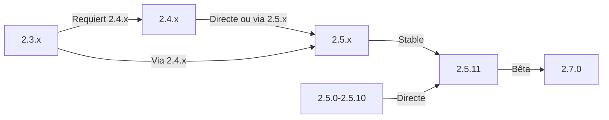

Ce guide couvre la mise à niveau de XOOPS à partir de versions plus anciennes vers la dernière version tout en préservant vos données et personnalisations.

> **Information sur les versions**
> - **Stable :** XOOPS 2.5.11
> - **Bêta :** XOOPS 2.7.0 (test)
> - **Futur :** XOOPS 4.0 (en développement - voir Roadmap)

## Liste de contrôle pré-mise à niveau

Avant de commencer la mise à niveau, vérifiez :

- [ ] Version actuelle de XOOPS documentée
- [ ] Version XOOPS cible identifiée
- [ ] Sauvegarde complète du système effectuée
- [ ] Sauvegarde de la base de données vérifiée
- [ ] Liste des modules installés et leurs versions enregistrées
- [ ] Modifications personnalisées documentées
- [ ] Environnement de test disponible
- [ ] Chemin de mise à niveau coché (certaines versions sautent les versions intermédiaires)
- [ ] Ressources du serveur vérifiées (suffisamment d'espace disque, de mémoire)
- [ ] Mode de maintenance activé

## Guide du chemin de mise à niveau

Différents chemins de mise à niveau selon la version actuelle :



**Important :** Ne sautez jamais les versions principales. Si vous mettez à niveau à partir de 2.3.x, d'abord mettre à niveau vers 2.4.x, puis vers 2.5.x.

## Étape 1 : Sauvegarde complète du système

### Sauvegarde de la base de données

Utilisez mysqldump pour sauvegarder la base de données :

```bash
# Sauvegarde complète de la base de données
mysqldump -u xoops_user -p xoops_db > /backups/xoops_db_backup_$(date +%Y%m%d_%H%M%S).sql

# Sauvegarde compressée
mysqldump -u xoops_user -p xoops_db | gzip > /backups/xoops_db_backup_$(date +%Y%m%d_%H%M%S).sql.gz
```

Ou en utilisant phpMyAdmin :

1. Sélectionnez votre base de données XOOPS
2. Cliquez sur l'onglet "Exporter"
3. Choisissez le format "SQL"
4. Sélectionnez "Enregistrer comme fichier"
5. Cliquez sur "Aller"

Vérifier le fichier de sauvegarde :

```bash
# Vérifier la taille de la sauvegarde
ls -lh /backups/xoops_db_backup*.sql

# Vérifier l'intégrité de la sauvegarde (non compressée)
head -20 /backups/xoops_db_backup_*.sql

# Vérifier la sauvegarde compressée
zcat /backups/xoops_db_backup_*.sql.gz | head -20
```

### Sauvegarde du système de fichiers

Sauvegardez tous les fichiers XOOPS :

```bash
# Sauvegarde de fichiers compressée
tar -czf /backups/xoops_files_$(date +%Y%m%d_%H%M%S).tar.gz /var/www/html/xoops

# Non compressée (plus rapide, nécessite plus d'espace disque)
tar -cf /backups/xoops_files_$(date +%Y%m%d_%H%M%S).tar /var/www/html/xoops

# Afficher la progression de la sauvegarde
tar -czf /backups/xoops_files_$(date +%Y%m%d_%H%M%S).tar.gz --verbose /var/www/html/xoops | tail
```

Stockez les sauvegardes en toute sécurité :

```bash
# Stockage de sauvegarde sécurisé
chmod 600 /backups/xoops_*
ls -lah /backups/

# Optionnel : Copier vers un stockage distant
scp /backups/xoops_* user@backup-server:/secure/backups/
```

### Tester la restauration de la sauvegarde

**CRITIQUE :** Testez toujours que votre sauvegarde fonctionne :

```bash
# Vérifier le contenu de l'archive tar
tar -tzf /backups/xoops_files_*.tar.gz | head -20

# Extraire vers un emplacement de test
mkdir /tmp/restore_test
cd /tmp/restore_test
tar -xzf /backups/xoops_files_*.tar.gz

# Vérifier que les fichiers clés existent
ls -la xoops/mainfile.php
ls -la xoops/install/
```

## Étape 2 : Activer le mode de maintenance

Empêchez les utilisateurs d'accéder au site pendant la mise à niveau :

### Option 1 : Panneau administrateur XOOPS

1. Connectez-vous au panneau d'administration
2. Aller à Système > Maintenance
3. Activez "Mode de maintenance du site"
4. Définissez le message de maintenance
5. Enregistrez

### Option 2 : Mode de maintenance manuel

Créez un fichier de maintenance à la racine web :

```html
<!-- /var/www/html/maintenance.html -->
<!DOCTYPE html>
<html>
<head>
    <title>En maintenance</title>
    <style>
        body { font-family: Arial; text-align: center; padding: 50px; }
        h1 { color: #333; }
        p { color: #666; margin: 20px 0; }
    </style>
</head>
<body>
    <h1>Site en maintenance</h1>
    <p>Nous améliorons actuellement notre site.</p>
    <p>Temps estimé : environ 30 minutes.</p>
    <p>Merci de votre patience !</p>
</body>
</html>
```

Configurez Apache pour afficher la page de maintenance :

```apache
# Dans .htaccess ou dans la configuration du vhost
ErrorDocument 503 /maintenance.html

# Rediriger tout le trafic vers la page de maintenance
<IfModule mod_rewrite.c>
    RewriteEngine On
    RewriteCond %{REMOTE_ADDR} !^192\.168\.1\.100$  # Votre IP
    RewriteRule ^(.*)$ - [R=503,L]
</IfModule>
```

## Étape 3 : Télécharger la nouvelle version

Téléchargez XOOPS depuis le site officiel :

```bash
# Télécharger la dernière version
cd /tmp
wget https://xoops.org/download/xoops-2.5.8.zip

# Vérifier la somme de contrôle (si fourni)
sha256sum xoops-2.5.8.zip
# Comparer avec le hash SHA256 officiel

# Extraire vers un emplacement temporaire
unzip xoops-2.5.8.zip
cd xoops-2.5.8
```

## Étape 4 : Préparation des fichiers avant la mise à niveau

### Identifier les modifications personnalisées

Vérifiez les fichiers principaux personnalisés :

```bash
# Rechercher les fichiers modifiés (fichiers avec mtime plus récent)
find /var/www/html/xoops -type f -newer /var/www/html/xoops/install.php

# Vérifier les thèmes personnalisés
ls /var/www/html/xoops/themes/
# Notez les thèmes personnalisés

# Vérifier les modules personnalisés
ls /var/www/html/xoops/modules/
# Notez tout module personnalisé que vous avez créé
```

### Documenter l'état actuel

Créez un rapport de mise à niveau :

```bash
cat > /tmp/upgrade_report.txt << EOF
=== Rapport de mise à niveau XOOPS ===
Date : $(date)
Version actuelle : 2.5.6
Version cible : 2.5.8

=== Modules installés ===
$(ls /var/www/html/xoops/modules/)

=== Modifications personnalisées ===
[Documenter toute modification personnalisée du thème ou du module]

=== Thèmes ===
$(ls /var/www/html/xoops/themes/)

=== Statut des plugins ===
[Répertorier toute modification personnalisée du code]

EOF
```

## Étape 5 : Fusionner les nouveaux fichiers avec l'installation actuelle

### Stratégie : Préserver les fichiers personnalisés

Remplacez les fichiers principaux de XOOPS mais préservez :
- `mainfile.php` (votre configuration de base de données)
- Thèmes personnalisés dans `themes/`
- Modules personnalisés dans `modules/`
- Chargements d'utilisateurs dans `uploads/`
- Données du site dans `var/`

### Processus de fusion manuelle

```bash
# Définir les variables
XOOPS_OLD="/var/www/html/xoops"
XOOPS_NEW="/tmp/xoops-2.5.8"
BACKUP="/backups/pre-upgrade"

# Créer une sauvegarde pré-mise à niveau sur place
mkdir -p $BACKUP
cp -r $XOOPS_OLD/* $BACKUP/

# Copier les nouveaux fichiers (mais préserver les fichiers sensibles)
# Copier tout sauf les répertoires protégés
rsync -av --exclude='mainfile.php' \
    --exclude='modules/custom*' \
    --exclude='themes/custom*' \
    --exclude='uploads' \
    --exclude='var' \
    --exclude='cache' \
    --exclude='templates_c' \
    $XOOPS_NEW/ $XOOPS_OLD/

# Vérifier les fichiers critiques préservés
ls -la $XOOPS_OLD/mainfile.php
```

### Utilisation d'upgrade.php (le cas échéant)

Certaines versions XOOPS incluent un script de mise à niveau automatisé :

```bash
# Copier les nouveaux fichiers avec le programme d'installation
cp -r /tmp/xoops-2.5.8/* /var/www/html/xoops/

# Exécuter l'assistant de mise à niveau
# Visiter : http://your-domain.com/xoops/upgrade/
```

### Permissions des fichiers après la fusion

Restaurez les permissions appropriées :

```bash
# Définir la propriété
chown -R www-data:www-data /var/www/html/xoops

# Définir les permissions du répertoire
find /var/www/html/xoops -type d -exec chmod 755 {} \;

# Définir les permissions du fichier
find /var/www/html/xoops -type f -exec chmod 644 {} \;

# Répertoires accessibles en écriture
chmod 777 /var/www/html/xoops/cache
chmod 777 /var/www/html/xoops/templates_c
chmod 777 /var/www/html/xoops/uploads
chmod 777 /var/www/html/xoops/var

# Sécuriser mainfile.php
chmod 644 /var/www/html/xoops/mainfile.php
```

## Étape 6 : Migration de la base de données

### Vérifier les modifications de la base de données

Consultez les notes de version de XOOPS pour les modifications de la structure de la base de données :

```bash
# Extraire et examiner les fichiers de migration SQL
find /tmp/xoops-2.5.8 -name "*.sql" -type f
# Documenter tous les fichiers .sql trouvés
```

### Exécuter les mises à jour de la base de données

### Option 1 : Mise à jour automatisée (le cas échéant)

Utilisez le panneau d'administration :

1. Connectez-vous à l'admin
2. Aller à **Système > Base de données**
3. Cliquez sur "Vérifier les mises à jour"
4. Vérifiez les modifications en attente
5. Cliquez sur "Appliquer les mises à jour"

### Option 2 : Mises à jour manuelles de la base de données

Exécutez les fichiers SQL de migration :

```bash
# Se connecter à la base de données
mysql -u xoops_user -p xoops_db

# Voir les modifications en attente (varie selon la version)
SELECT * FROM xoops_config WHERE conf_name LIKE '%version%';

# Exécuter les scripts de migration manuellement si nécessaire
SOURCE /tmp/xoops-2.5.8/migrate_2.5.6_to_2.5.8.sql;
```

### Vérification de la base de données

Vérifiez l'intégrité de la base de données après la mise à jour :

```sql
-- Vérifier la cohérence de la base de données
REPAIR TABLE xoops_users;
OPTIMIZE TABLE xoops_users;

-- Vérifier que les tables clés existent
SHOW TABLES LIKE 'xoops_%';

-- Vérifier les comptages de lignes (devrait augmenter ou rester identique)
SELECT COUNT(*) FROM xoops_users;
SELECT COUNT(*) FROM xoops_posts;
```

## Étape 7 : Vérifier la mise à niveau

### Vérification de la page d'accueil

Visitez votre page d'accueil XOOPS :

```
http://your-domain.com/xoops/
```

Attendu : La page se charge sans erreurs, s'affiche correctement

### Vérification du panneau d'administration

Accès admin :

```
http://your-domain.com/xoops/admin/
```

Vérifiez :
- [ ] Le panneau d'administration se charge
- [ ] La navigation fonctionne
- [ ] Le tableau de bord s'affiche correctement
- [ ] Pas d'erreurs de base de données dans les journaux

### Vérification des modules

Vérifiez les modules installés :

1. Allez à **Modules > Modules** en admin
2. Vérifiez que tous les modules sont toujours installés
3. Vérifiez les messages d'erreur
4. Activez tous les modules qui ont été désactivés

### Vérification du fichier journal

Passez en revue les journaux système pour les erreurs :

```bash
# Vérifier le journal d'erreur du serveur web
tail -50 /var/log/apache2/error.log

# Vérifier le journal d'erreur PHP
tail -50 /var/log/php_errors.log

# Vérifier le journal du système XOOPS (le cas échéant)
# Dans le panneau d'administration : Système > Journaux
```

### Tester les fonctions principales

- [ ] La connexion/déconnexion de l'utilisateur fonctionne
- [ ] L'enregistrement des utilisateurs fonctionne
- [ ] Les fonctions de chargement de fichiers
- [ ] Les notifications par e-mail s'envoient
- [ ] La fonctionnalité de recherche fonctionne
- [ ] Les fonctions d'administration opérationnelles
- [ ] Fonctionnalité du module intacte

## Étape 8 : Nettoyage post-mise à niveau

### Supprimer les fichiers temporaires

```bash
# Supprimer le répertoire d'extraction
rm -rf /tmp/xoops-2.5.8

# Effacer le cache du modèle (sûr à supprimer)
rm -rf /var/www/html/xoops/templates_c/*

# Effacer le cache du site
rm -rf /var/www/html/xoops/cache/*
```

### Supprimer le mode de maintenance

Réactiver l'accès normal au site :

```apache
# Supprimer la redirection du mode de maintenance de .htaccess
# Ou supprimer le fichier maintenance.html
rm /var/www/html/maintenance.html
```

### Mettre à jour la documentation

Mettez à jour vos notes de mise à niveau :

```bash
# Documenter la mise à niveau réussie
cat >> /tmp/upgrade_report.txt << EOF

=== Résultats de la mise à niveau ===
Statut : SUCCÈS
Date de mise à niveau : $(date)
Nouvelle version : 2.5.8
Durée : [temps en minutes]

Tests post-mise à niveau :
- [x] La page d'accueil se charge
- [x] Panneau d'administration accessible
- [x] Modules fonctionnels
- [x] L'enregistrement des utilisateurs fonctionne
- [x] Base de données optimisée

EOF
```

## Dépannage des mises à niveau

### Problème : Écran blanc vide après la mise à niveau

**Symptôme :** La page d'accueil ne montre rien

**Solution :**
```bash
# Vérifier les erreurs PHP
tail -f /var/log/apache2/error.log

# Activer le mode débogage temporairement
echo "define('XOOPS_DEBUG', 1);" >> /var/www/html/xoops/mainfile.php

# Vérifier les permissions des fichiers
ls -la /var/www/html/xoops/mainfile.php

# Restaurer à partir de la sauvegarde si nécessaire
cp /backups/xoops_files_*.tar.gz /tmp/
cd /tmp && tar -xzf xoops_files_*.tar.gz
```

### Problème : Erreur de connexion à la base de données

**Symptôme :** Message "Cannot connect to database"

**Solution :**
```bash
# Vérifier les identifiants de la base de données dans mainfile.php
grep -i "database\|host\|user" /var/www/html/xoops/mainfile.php

# Tester la connexion
mysql -h localhost -u xoops_user -p xoops_db -e "SELECT 1"

# Vérifier l'état de MySQL
systemctl status mysql

# Vérifier que la base de données existe toujours
mysql -u xoops_user -p -e "SHOW DATABASES" | grep xoops
```

### Problème : Panneau administrateur non accessible

**Symptôme :** Impossible d'accéder à /xoops/admin/

**Solution :**
```bash
# Vérifier les règles .htaccess
cat /var/www/html/xoops/.htaccess

# Vérifier que les fichiers d'administration existent
ls -la /var/www/html/xoops/admin/

# Vérifier que mod_rewrite est activé
apache2ctl -M | grep rewrite

# Redémarrer le serveur web
systemctl restart apache2
```

### Problème : Modules ne se chargeant pas

**Symptôme :** Les modules affichent des erreurs ou sont désactivés

**Solution :**
```bash
# Vérifier que les fichiers du module existent
ls /var/www/html/xoops/modules/

# Vérifier les permissions du module
ls -la /var/www/html/xoops/modules/*/

# Vérifier la configuration du module dans la base de données
mysql -u xoops_user -p xoops_db -e "SELECT * FROM xoops_modules WHERE module_status = 0"

# Réactiver les modules dans le panneau d'administration
# Système > Modules > Cliquez sur le module > Statut de mise à jour
```

### Problème : Erreurs d'autorisation refusée

**Symptôme :** "Permission denied" lors du chargement ou de la sauvegarde

**Solution :**
```bash
# Vérifier la propriété des fichiers
ls -la /var/www/html/xoops/ | head -20

# Corriger la propriété
chown -R www-data:www-data /var/www/html/xoops

# Corriger les permissions du répertoire
find /var/www/html/xoops -type d -exec chmod 755 {} \;

# Rendre le cache/uploads accessible en écriture
chmod 777 /var/www/html/xoops/cache
chmod 777 /var/www/html/xoops/templates_c
chmod 777 /var/www/html/xoops/uploads
chmod 777 /var/www/html/xoops/var
```

### Problème : Chargement lent des pages

**Symptôme :** Les pages se chargent très lentement après la mise à niveau

**Solution :**
```bash
# Effacer tous les caches
rm -rf /var/www/html/xoops/cache/*
rm -rf /var/www/html/xoops/templates_c/*

# Optimiser la base de données
mysql -u xoops_user -p xoops_db << EOF
OPTIMIZE TABLE xoops_users;
OPTIMIZE TABLE xoops_posts;
OPTIMIZE TABLE xoops_config;
ANALYZE TABLE xoops_users;
EOF

# Vérifier le journal d'erreur PHP pour les avertissements
grep -i "deprecated\|warning" /var/log/php_errors.log | tail -20

# Augmenter temporairement la mémoire/le temps d'exécution de PHP
# Modifier php.ini :
memory_limit = 256M
max_execution_time = 300
```

## Procédure de restauration

Si la mise à niveau échoue de manière critique, restaurez à partir de la sauvegarde :

### Restaurer la base de données

```bash
# Restaurer à partir de la sauvegarde
mysql -u xoops_user -p xoops_db < /backups/xoops_db_backup_YYYYMMDD_HHMMSS.sql

# Ou à partir de la sauvegarde compressée
gunzip < /backups/xoops_db_backup_YYYYMMDD_HHMMSS.sql.gz | mysql -u xoops_user -p xoops_db

# Vérifier la restauration
mysql -u xoops_user -p xoops_db -e "SELECT COUNT(*) FROM xoops_users"
```

### Restaurer le système de fichiers

```bash
# Arrêter le serveur web
systemctl stop apache2

# Supprimer l'installation actuelle
rm -rf /var/www/html/xoops/*

# Extraire la sauvegarde
cd /var/www/html
tar -xzf /backups/xoops_files_YYYYMMDD_HHMMSS.tar.gz

# Corriger les permissions
chown -R www-data:www-data xoops/
find xoops -type d -exec chmod 755 {} \;
find xoops -type f -exec chmod 644 {} \;
chmod 777 xoops/cache xoops/templates_c xoops/uploads xoops/var

# Démarrer le serveur web
systemctl start apache2

# Vérifier la restauration
# Visiter http://your-domain.com/xoops/
```

## Liste de contrôle de vérification de la mise à niveau

Après la fin de la mise à niveau, vérifiez :

- [ ] Version de XOOPS mise à jour (vérifier admin > Informations système)
- [ ] La page d'accueil se charge sans erreurs
- [ ] Tous les modules fonctionnels
- [ ] La connexion utilisateur fonctionne
- [ ] Le panneau d'administration accessible
- [ ] Les téléchargements de fichiers fonctionnent
- [ ] Les notifications par e-mail fonctionnelles
- [ ] L'intégrité de la base de données vérifiée
- [ ] Les permissions des fichiers correctes
- [ ] Mode de maintenance supprimé
- [ ] Les sauvegardes sécurisées et testées
- [ ] Les performances acceptables
- [ ] SSL/HTTPS fonctionnant
- [ ] Pas de messages d'erreur dans les journaux

## Prochaines étapes

Après une mise à niveau réussie :

1. Mettre à jour tous les modules personnalisés vers les dernières versions
2. Examiner les notes de version pour les fonctionnalités obsolètes
3. Envisager l'optimisation des performances
4. Mettre à jour les paramètres de sécurité
5. Tester entièrement la fonctionnalité
6. Garder les fichiers de sauvegarde sécurisés

---

**Tags:** #upgrade #maintenance #backup #database-migration

**Articles connexes :**
- ../../06-Publisher-Module/User-Guide/Installation
- Server-Requirements
- ../Configuration/Basic-Configuration
- ../Configuration/Security-Configuration
