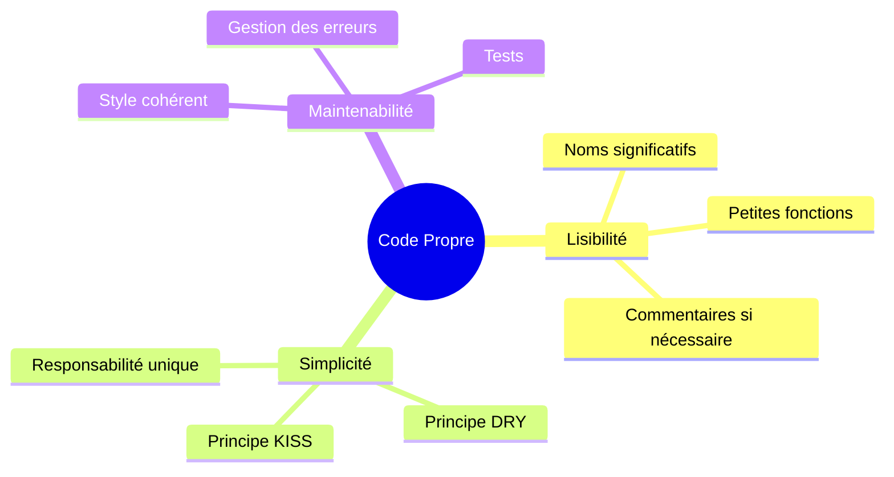

## Aperçu

Le code propre est du code facile à lire, comprendre et maintenir. Ce guide couvre les principes de code propre spécifiquement appliqués au développement de modules XOOPS.

## Principes fondamentaux



## Noms significatifs

### Variables

```php
// Mauvais
$d = new DateTime();
$u = $memberHandler->getUser($id);
$arr = [];

// Bien
$createdDate = new DateTime();
$currentUser = $memberHandler->getUser($userId);
$publishedArticles = [];
```

### Fonctions

```php
// Mauvais
function process($data) { ... }
function handle($item) { ... }
function doStuff($x, $y) { ... }

// Bien
function publishArticle(Article $article): void { ... }
function calculateTotalPrice(array $items): float { ... }
function sendNotificationEmail(User $user, string $subject): bool { ... }
```

### Classes

```php
// Mauvais
class Manager { ... }
class Helper { ... }
class Utils { ... }

// Bien
class ArticleRepository { ... }
class NotificationService { ... }
class PermissionChecker { ... }
```

## Petites fonctions

### Responsabilité unique

```php
// Mauvais - fait trop de choses
function processArticle($data) {
    // Valider
    if (empty($data['title'])) {
        throw new Exception('Title required');
    }
    // Sauvegarder
    $article = new Article();
    $article->setTitle($data['title']);
    $this->repository->save($article);
    // Notifier
    $this->mailer->send($article->getAuthor(), 'Article published');
    // Journaliser
    $this->logger->info('Article created');
    return $article;
}

// Bien - chaque fonction fait une seule chose
function validateArticleData(array $data): void
{
    if (empty($data['title'])) {
        throw new ValidationException('Title required');
    }
}

function createArticle(array $data): Article
{
    $this->validateArticleData($data);
    return Article::create($data['title'], $data['content']);
}

function publishArticle(Article $article): void
{
    $this->repository->save($article);
    $this->notifyAuthor($article);
    $this->logArticleCreation($article);
}
```

### Longueur de la fonction

Garder les fonctions courtes - idéalement moins de 20 lignes :

```php
// Bien - fonction ciblée
public function getPublishedArticles(int $limit = 10): array
{
    $criteria = new CriteriaCompo();
    $criteria->add(new Criteria('status', 'published'));
    $criteria->setSort('published_at');
    $criteria->setOrder('DESC');
    $criteria->setLimit($limit);

    return $this->repository->getObjects($criteria);
}
```

## Principe DRY (Ne pas répéter vous-même)

### Extraire le code commun

```php
// Mauvais - code répété
function getActiveUsers() {
    $criteria = new CriteriaCompo();
    $criteria->add(new Criteria('level', 0, '>'));
    $criteria->setSort('uname');
    return $this->userHandler->getObjects($criteria);
}

function getActiveAdmins() {
    $criteria = new CriteriaCompo();
    $criteria->add(new Criteria('level', 0, '>'));
    $criteria->add(new Criteria('is_admin', 1));
    $criteria->setSort('uname');
    return $this->userHandler->getObjects($criteria);
}

// Bien - logique partagée extraite
function getUsers(CriteriaCompo $criteria): array
{
    $criteria->add(new Criteria('level', 0, '>'));
    $criteria->setSort('uname');
    return $this->userHandler->getObjects($criteria);
}

function getActiveUsers(): array
{
    return $this->getUsers(new CriteriaCompo());
}

function getActiveAdmins(): array
{
    $criteria = new CriteriaCompo();
    $criteria->add(new Criteria('is_admin', 1));
    return $this->getUsers($criteria);
}
```

## Gestion des erreurs

### Utiliser les exceptions correctement

```php
// Mauvais - exceptions génériques
throw new Exception('Error');

// Bien - exceptions spécifiques
throw new ArticleNotFoundException($articleId);
throw new PermissionDeniedException('Cannot edit article');
throw new ValidationException(['title' => 'Title is required']);
```

### Gérer les erreurs avec élégance

```php
public function findArticle(string $id): ?Article
{
    try {
        return $this->repository->findById($id);
    } catch (DatabaseException $e) {
        $this->logger->error('Database error finding article', [
            'id' => $id,
            'error' => $e->getMessage()
        ]);
        throw new ServiceException('Unable to retrieve article', 0, $e);
    }
}
```

## Commentaires

### Quand commenter

```php
// Mauvais - commentaire évident
// Incrémenter le compteur
$counter++;

// Bien - explique pourquoi, pas quoi
// Mettre en cache pendant 1 heure pour réduire la charge de la base de données pendant les heures de pointe
$cache->set($key, $data, 3600);

// Bien - documente un algorithme complexe
/**
 * Calculer le score de pertinence de l'article en utilisant l'algorithme TF-IDF.
 * Des scores plus élevés indiquent une meilleure correspondance avec les termes de recherche.
 */
function calculateRelevanceScore(Article $article, array $terms): float
{
    // ...
}
```

## Organisation du code

### Structure de classe

```php
class ArticleService
{
    // 1. Constantes
    private const MAX_TITLE_LENGTH = 255;

    // 2. Propriétés
    private ArticleRepository $repository;
    private EventDispatcher $events;

    // 3. Constructeur
    public function __construct(
        ArticleRepository $repository,
        EventDispatcher $events
    ) {
        $this->repository = $repository;
        $this->events = $events;
    }

    // 4. Méthodes publiques
    public function publish(Article $article): void { ... }
    public function archive(Article $article): void { ... }

    // 5. Méthodes privées
    private function validateForPublication(Article $article): void { ... }
}
```

## Liste de contrôle de code propre

- [ ] Les noms sont significatifs et prononçables
- [ ] Les fonctions font une seule chose
- [ ] Les fonctions sont petites (< 20 lignes)
- [ ] Pas de code dupliqué
- [ ] Gestion des erreurs appropriée avec des exceptions spécifiques
- [ ] Les commentaires expliquent "pourquoi", pas "quoi"
- [ ] Formatage et style cohérents
- [ ] Pas de nombres magiques ou de chaînes
- [ ] Les dépendances sont injectées, pas créées

## Documentation connexe

- Organisation du code
- Gestion des erreurs
- Meilleures pratiques de test
- Normes PHP
