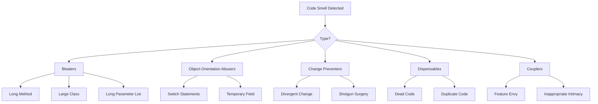

## Aperçu

Les odeurs de code sont des indicateurs de problèmes potentiels dans le code. Ils ne signifient pas nécessairement que le code est cassé, mais ils suggèrent des domaines qui pourraient bénéficier d'une refactorisation.

## Odeurs de code courantes



## Gonflements

### Méthode longue

```php
// Odeur : La méthode fait trop
function processArticleSubmission($data) {
    // 100+ lignes de validation, sauvegarde, notification, etc.
}

// Solution : Extraire en méthodes ciblées
function processArticleSubmission(array $data): Article
{
    $this->validateInput($data);
    $article = $this->createArticle($data);
    $this->saveArticle($article);
    $this->notifySubscribers($article);
    return $article;
}
```

### Grande classe (Dieu objet)

```php
// Odeur : La classe fait tout
class ArticleManager {
    public function create() { ... }
    public function delete() { ... }
    public function sendEmail() { ... }
    public function generatePDF() { ... }
    public function exportToExcel() { ... }
    public function validateUser() { ... }
    public function checkPermissions() { ... }
    // ... 50 méthodes de plus
}

// Solution : Diviser en classes ciblées
class ArticleService { ... }
class ArticleExporter { ... }
class ArticleNotifier { ... }
class PermissionChecker { ... }
```

### Liste de paramètres longue

```php
// Odeur : Trop de paramètres
function createArticle($title, $content, $author, $category, $tags, $status, $publishDate, $featured, $image) { ... }

// Solution : Utiliser un objet de paramètre
class CreateArticleCommand {
    public string $title;
    public string $content;
    public int $authorId;
    public int $categoryId;
    public array $tags;
    public string $status;
    public ?DateTime $publishDate;
    public bool $featured;
    public ?string $image;
}

function createArticle(CreateArticleCommand $command): Article { ... }
```

## Abuseurs d'orientation objet

### Instructions Switch

```php
// Odeur : Vérification de type avec switch
function getDiscount($userType) {
    switch ($userType) {
        case 'regular':
            return 0;
        case 'premium':
            return 10;
        case 'vip':
            return 20;
        default:
            return 0;
    }
}

// Solution : Utiliser le polymorphisme
interface UserType {
    public function getDiscount(): int;
}

class RegularUser implements UserType {
    public function getDiscount(): int { return 0; }
}

class PremiumUser implements UserType {
    public function getDiscount(): int { return 10; }
}

class VipUser implements UserType {
    public function getDiscount(): int { return 20; }
}
```

### Champ temporaire

```php
// Odeur : Champs utilisés uniquement dans certaines situations
class Article {
    private $tempCalculatedScore;

    public function search($terms) {
        $this->tempCalculatedScore = $this->calculateScore($terms);
        // ... utiliser le score
    }
}

// Solution : Passer en paramètre ou en valeur de retour
class Article {
    public function getSearchScore(array $terms): float {
        return $this->calculateScore($terms);
    }
}
```

## Preventeurs de changement

### Changement divergent

```php
// Odeur : Une classe change pour de nombreuses raisons différentes
class Article {
    public function save() { ... } // Changement de base de données
    public function toJson() { ... } // Changement de format API
    public function validate() { ... } // Changement de règle métier
    public function render() { ... } // Changement d'interface utilisateur
}

// Solution : Séparer les responsabilités
class Article { ... } // Objet de domaine uniquement
class ArticleRepository { public function save() { ... } }
class ArticleSerializer { public function toJson() { ... } }
class ArticleValidator { public function validate() { ... } }
```

### Chirurgie par chevrotine

```php
// Odeur : Un changement nécessite de modifier de nombreux fichiers
// Changer le format de date nécessite de modifier :
// - ArticleController.php
// - ArticleView.php
// - ArticleAPI.php
// - ArticleExport.php

// Solution : Centraliser
class DateFormatter {
    public function format(DateTime $date): string {
        return $date->format($this->config->get('date_format'));
    }
}
```

## Éléments inutiles

### Code mort

```php
// Odeur : Code inaccessible ou inutilisé
function processData($data) {
    if (true) {
        return $this->handleData($data);
    }
    // Ceci n'exécute jamais
    return $this->legacyHandler($data);
}

// Ancienne méthode inutilisée toujours dans la base de code
function oldMethod() {
    // Non appelé nulle part
}

// Solution : Supprimer le code mort
function processData($data) {
    return $this->handleData($data);
}
```

### Code dupliqué

```php
// Odeur : Même logique à plusieurs endroits
class ArticleHandler {
    public function getActive() {
        $criteria = new CriteriaCompo();
        $criteria->add(new Criteria('status', 'active'));
        return $this->getObjects($criteria);
    }
}

class NewsHandler {
    public function getActive() {
        $criteria = new CriteriaCompo();
        $criteria->add(new Criteria('status', 'active'));
        return $this->getObjects($criteria);
    }
}

// Solution : Extraire le comportement commun
trait ActiveRecordsTrait {
    public function getActive(): array {
        $criteria = new CriteriaCompo();
        $criteria->add(new Criteria('status', 'active'));
        return $this->getObjects($criteria);
    }
}
```

## Coupleurs

### Envie de fonctionnalité

```php
// Odeur : Méthode utilise les données d'un autre objet plus que ses propres
class Invoice {
    public function calculateTotal(Customer $customer) {
        $total = 0;
        foreach ($this->items as $item) {
            $total += $item->price;
        }
        // Utilise largement les données du client
        if ($customer->isPremium()) {
            $total *= (1 - $customer->getDiscountRate());
        }
        if ($customer->getCountry() === 'US') {
            $total *= 1.08; // Tax
        }
        return $total;
    }
}

// Solution : Déplacer le comportement vers l'objet avec les données
class Customer {
    public function applyDiscount(float $amount): float {
        return $this->isPremium()
            ? $amount * (1 - $this->discountRate)
            : $amount;
    }

    public function applyTax(float $amount): float {
        return $this->country === 'US'
            ? $amount * 1.08
            : $amount;
    }
}
```

## Liste de contrôle de refactorisation

Quand vous repérez une odeur de code :

1. **Identifier** - De quel type d'odeur s'agit-il ?
2. **Évaluer** - Quel est l'impact sur la sévérité ?
3. **Planifier** - Quelle technique de refactorisation s'applique ?
4. **Tester** - Assurer l'existence des tests avant la refactorisation
5. **Refactoriser** - Faire de petits changements progressifs
6. **Vérifier** - Exécuter les tests après chaque changement

## Documentation connexe

- Principes de code propre
- Organisation du code
- Meilleures pratiques de test
