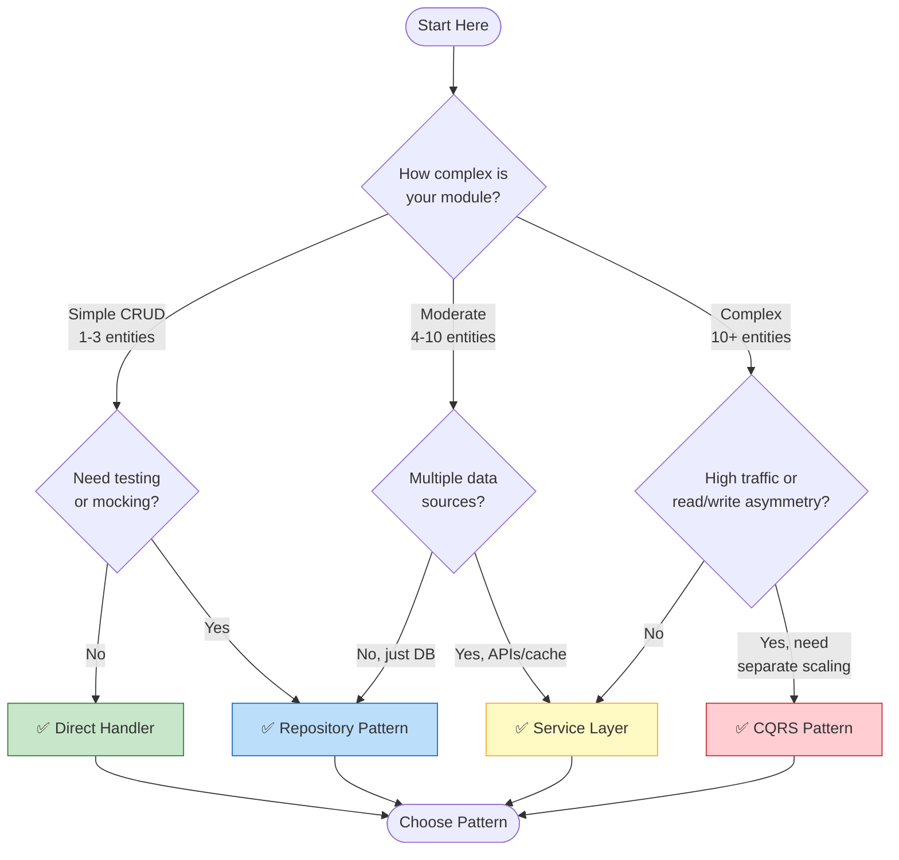
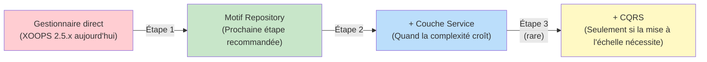

<span class="version-badge version-25x">2.5.x ✅</span> <span class="version-badge version-40x">4.0.x ✅</span>

> **Quel motif dois-je utiliser ?** Cet arbre de décision vous aide à choisir entre les gestionnaires directs, le motif Repository, la couche Service et CQRS.

---

## Arbre de décision rapide



---

## Comparaison des motifs

| Critères | Gestionnaire direct | Repository | Couche Service | CQRS |
|----------|---------------|------------|---------------|------|
| **Complexité** | ⭐ | ⭐⭐ | ⭐⭐⭐ | ⭐⭐⭐⭐⭐ |
| **Testabilité** | ❌ Difficile | ✅ Bon | ✅ Excellent | ✅ Excellent |
| **Flexibilité** | ❌ Faible | ✅ Moyen | ✅ Élevé | ✅ Très élevé |
| **XOOPS 2.5.x** | ✅ Natif | ✅ Fonctionne | ✅ Fonctionne | ⚠️ Complexe |
| **XOOPS 4.0** | ⚠️ Déprécié | ✅ Recommandé | ✅ Recommandé | ✅ Pour la mise à l'échelle |
| **Taille de l'équipe** | 1 dev | 1-3 devs | 2-5 devs | 5+ devs |
| **Maintenance** | ❌ Plus élevée | ✅ Modérée | ✅ Plus basse | ⚠️ Nécessite l'expertise |

---

## Quand utiliser chaque motif

### ✅ Gestionnaire direct (`XoopsPersistableObjectHandler`)

**Meilleur pour :** Modules simples, prototypes rapides, apprentissage de XOOPS

```php
// Simple et direct - bon pour les petits modules
$handler = xoops_getModuleHandler('article', 'news');
$articles = $handler->getObjects(new Criteria('status', 1));
```

**Choisir ceci quand :**
- Construire un module simple avec 1-3 tables de base de données
- Créer un prototype rapide
- Vous êtes le seul développeur et n'avez pas besoin de tests
- Le module ne croîtra pas significativement

**Limitations :**
- Difficile à tester unitairement (dépendance globale)
- Couplage serré à la couche de base de données XOOPS
- La logique métier a tendance à s'échapper dans les contrôleurs

---

### ✅ Motif Repository

**Meilleur pour :** La plupart des modules, les équipes voulant la testabilité

```php
// L'abstraction permet de simuler pour les tests
interface ArticleRepositoryInterface {
    public function findPublished(): array;
    public function save(Article $article): void;
}

class XoopsArticleRepository implements ArticleRepositoryInterface {
    private $handler;

    public function __construct() {
        $this->handler = xoops_getModuleHandler('article', 'news');
    }

    public function findPublished(): array {
        return $this->handler->getObjects(new Criteria('status', 1));
    }
}
```

**Choisir ceci quand :**
- Vous voulez écrire des tests unitaires
- Vous pourriez changer les sources de données plus tard (DB → API)
- Travailler avec 2+ développeurs
- Construire des modules pour la distribution

**Chemin de mise à jour :** C'est le motif recommandé pour la préparation XOOPS 4.0.

---

### ✅ Couche Service

**Meilleur pour :** Modules avec logique métier complexe

```php
// Le service coordonne plusieurs dépôts et contient les règles métier
class ArticlePublicationService {
    public function __construct(
        private ArticleRepositoryInterface $articles,
        private NotificationServiceInterface $notifications,
        private CacheInterface $cache
    ) {}

    public function publish(int $articleId): void {
        $article = $this->articles->find($articleId);
        $article->setStatus('published');
        $article->setPublishedAt(new DateTime());

        $this->articles->save($article);
        $this->notifications->notifySubscribers($article);
        $this->cache->invalidate("article:{$articleId}");
    }
}
```

**Choisir ceci quand :**
- Les opérations couvrent plusieurs sources de données
- Les règles métier sont complexes
- Vous avez besoin de la gestion des transactions
- Plusieurs parties de l'application font la même chose

**Chemin de mise à jour :** Combiner avec Repository pour une architecture robuste.

---

### ⚠️ CQRS (Command Query Responsibility Segregation)

**Meilleur pour :** Modules haute performance avec asymétrie lecture/écriture

```php
// Les commandes modifient l'état
class PublishArticleCommand {
    public function __construct(
        public readonly int $articleId,
        public readonly int $publisherId
    ) {}
}

// Les requêtes lisent l'état (peuvent utiliser des modèles de lecture dénormalisés)
class GetPublishedArticlesQuery {
    public function __construct(
        public readonly int $limit = 10
    ) {}
}
```

**Choisir ceci quand :**
- Les lectures surpassent largement les écritures (100:1 ou plus)
- Vous avez besoin de mise à l'échelle différente pour les lectures vs écritures
- Exigences complexes en matière de rapports/analyses
- L'approvisionnement en événements bénéficierait à votre domaine

**Avertissement :** CQRS ajoute une complexité significative. La plupart des modules XOOPS n'en ont pas besoin.

---

## Chemin de mise à niveau recommandé



### Étape 1 : Envelopper les gestionnaires dans les dépôts (2-4 heures)

1. Créer une interface pour vos besoins d'accès aux données
2. L'implémenter à l'aide du gestionnaire existant
3. Injecter le référentiel au lieu d'appeler `xoops_getModuleHandler()` directement

### Étape 2 : Ajouter la couche Service si nécessaire (1-2 jours)

1. Quand la logique métier apparaît dans les contrôleurs, extraire vers un Service
2. Le service utilise les dépôts, pas les gestionnaires directement
3. Les contrôleurs deviennent fins (routage → service → réponse)

### Étape 3 : Envisager CQRS uniquement si (rare)

1. Vous avez des millions de lectures par jour
2. Les modèles de lecture et d'écriture sont considérablement différents
3. Vous avez besoin d'approvisionnement en événements pour les pistes d'audit
4. Vous avez une équipe expérimentée avec CQRS

---

## Carte de référence rapide

| Question | Réponse |
|----------|--------|
| **"Je dois juste sauvegarder/charger les données"** | Gestionnaire direct |
| **"Je veux écrire des tests"** | Motif Repository |
| **"J'ai des règles métier complexes"** | Couche Service |
| **"Je dois mettre à l'échelle les lectures séparément"** | CQRS |
| **"Je me prépare pour XOOPS 4.0"** | Repository + Couche Service |

---

## Documentation connexe

- [Guide du motif Repository](Patterns/Repository-Pattern.md)
- [Guide du motif Couche Service](Patterns/Service-Layer-Pattern.md)
- [Guide du motif CQRS](../07-XOOPS-4.0/Implementation-Guides/CQRS-Pattern-Guide.md) *(avancé)*
- [Contrat du mode hybride](../07-XOOPS-4.0/Specifications/Hybrid-Mode-Contract.md)

---

#patterns #data-access #decision-tree #best-practices #xoops
