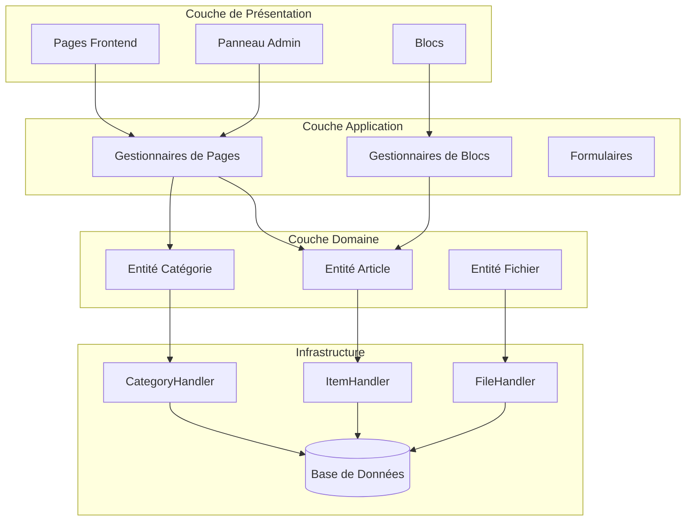
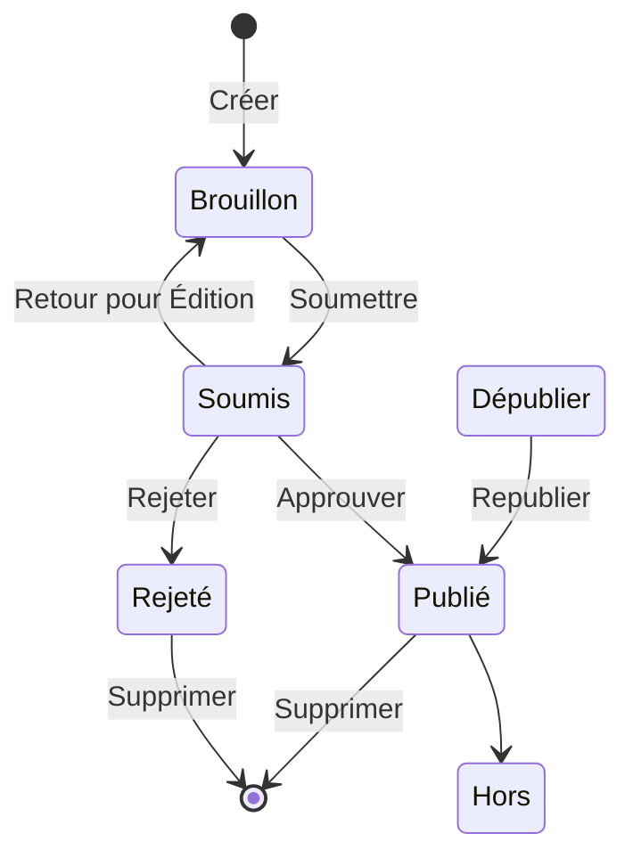

## Aperçu

Ce document fournit une analyse technique de l'architecture du module Publisher, des modèles et des détails d'implémentation. Utilisez-le comme référence pour comprendre comment un module XOOPS de qualité production est structuré.

## Aperçu de l'Architecture



## Structure des Répertoires

```
publisher/
├── admin/
│   ├── index.php           # Tableau de bord admin
│   ├── item.php            # Gestion des articles
│   ├── category.php        # Gestion des catégories
│   ├── permission.php      # Permissions
│   ├── file.php            # Gestionnaire de fichiers
│   └── menu.php            # Menu admin
├── assets/
│   ├── css/
│   ├── js/
│   └── images/
├── class/
│   ├── Category.php        # Entité catégorie
│   ├── CategoryHandler.php # Accès aux données catégorie
│   ├── Item.php            # Entité article
│   ├── ItemHandler.php     # Accès aux données article
│   ├── File.php            # Pièce jointe
│   ├── FileHandler.php     # Accès aux données fichier
│   ├── Form/               # Classes de formulaire
│   ├── Common/             # Utilitaires
│   └── Helper.php          # Aide du module
├── include/
│   ├── common.php          # Initialisation
│   ├── functions.php       # Fonctions utilitaires
│   ├── oninstall.php       # Hooks d'installation
│   ├── onupdate.php        # Hooks de mise à jour
│   └── search.php          # Intégration de recherche
├── language/
├── templates/
├── sql/
└── xoops_version.php
```

## Analyse des Entités

### Entité Article

```php
class Item extends \XoopsObject
{
    // Champs
    public function initVar(): void
    {
        $this->initVar('itemid', XOBJ_DTYPE_INT, null, false);
        $this->initVar('categoryid', XOBJ_DTYPE_INT, 0, false);
        $this->initVar('title', XOBJ_DTYPE_TXTBOX, '', true);
        $this->initVar('subtitle', XOBJ_DTYPE_TXTBOX, '');
        $this->initVar('summary', XOBJ_DTYPE_TXTAREA, '');
        $this->initVar('body', XOBJ_DTYPE_TXTAREA, '', true);
        $this->initVar('uid', XOBJ_DTYPE_INT, 0);
        $this->initVar('status', XOBJ_DTYPE_INT, 0);
        $this->initVar('datesub', XOBJ_DTYPE_INT, time());
        // ... plus de champs
    }

    // Méthodes métier
    public function isPublished(): bool
    {
        return $this->getVar('status') == _PUBLISHER_STATUS_PUBLISHED;
    }

    public function canEdit(int $userId): bool
    {
        return $this->getVar('uid') == $userId
            || $this->isAdmin($userId);
    }
}
```

### Modèle Handler

```php
class ItemHandler extends \XoopsPersistableObjectHandler
{
    public function __construct(\XoopsDatabase $db)
    {
        parent::__construct(
            $db,
            'publisher_items',
            Item::class,
            'itemid',
            'title'
        );
    }

    public function getPublishedItems(int $limit = 10): array
    {
        $criteria = new \CriteriaCompo();
        $criteria->add(new \Criteria('status', _PUBLISHER_STATUS_PUBLISHED));
        $criteria->setSort('datesub');
        $criteria->setOrder('DESC');
        $criteria->setLimit($limit);

        return $this->getObjects($criteria);
    }
}
```

## Système de Permissions

### Types de Permissions

| Permission | Description |
|------------|-------------|
| `publisher_view` | Afficher la catégorie/les articles |
| `publisher_submit` | Soumettre de nouveaux articles |
| `publisher_approve` | Approbation automatique des soumissions |
| `publisher_moderate` | Examiner les articles en attente |
| `publisher_global` | Permissions globales du module |

### Vérification de Permission

```php
class PermissionHandler
{
    public function isGranted(string $permission, int $categoryId): bool
    {
        $userId = $GLOBALS['xoopsUser']?->uid() ?? 0;
        $groups = $this->getUserGroups($userId);

        return $this->grouppermHandler->checkRight(
            $permission,
            $categoryId,
            $groups,
            $this->helper->getModule()->mid()
        );
    }
}
```

## États du Flux de Travail



## Structure des Modèles

### Modèles Frontend

| Modèle | Objectif |
|--------|----------|
| `publisher_index.tpl` | Page d'accueil du module |
| `publisher_item.tpl` | Article unique |
| `publisher_category.tpl` | Liste des catégories |
| `publisher_submit.tpl` | Formulaire de soumission |
| `publisher_search.tpl` | Résultats de recherche |

### Modèles de Blocs

| Modèle | Objectif |
|--------|----------|
| `publisher_block_latest.tpl` | Articles récents |
| `publisher_block_spotlight.tpl` | Article en vedette |
| `publisher_block_category.tpl` | Menu des catégories |

## Modèles Clés Utilisés

1. **Modèle Handler** - Encapsulation de l'accès aux données
2. **Objet Valeur** - Constantes de statut
3. **Méthode Modèle** - Génération de formulaire
4. **Stratégie** - Différents modes d'affichage
5. **Observateur** - Notifications sur les événements

## Leçons pour le Développement de Modules

1. Utiliser XoopsPersistableObjectHandler pour les CRUD
2. Implémenter les permissions granulaires
3. Séparer la présentation de la logique
4. Utiliser Criteria pour les requêtes
5. Supporter les statuts de contenu multiples
6. Intégrer le système de notification XOOPS

## Documentation Connexe

- Créer des Articles - Gestion des articles
- Gérer les Catégories - Système de catégories
- Configuration des Permissions - Configuration des permissions
- Développeur-Guide/Hooks et Événements - Points d'extension
