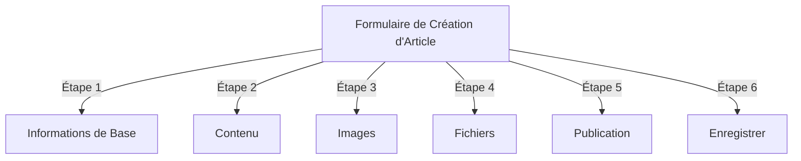
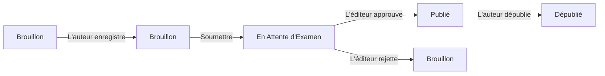
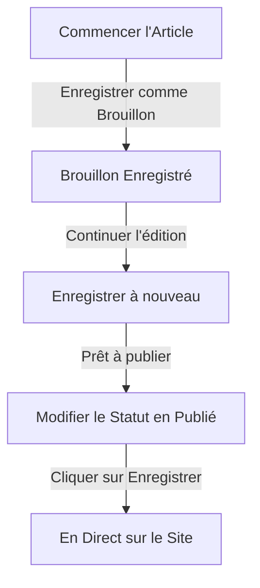

# Créer des Articles dans Publisher

> Guide étape par étape pour créer, éditer, formater et publier des articles dans le module Publisher.

---

## Accéder à la Gestion des Articles

### Navigation du Panneau d'Administration

```
Panneau d'Administration
└── Modules
    └── Publisher
        └── Articles
            ├── Créer Nouveau
            ├── Éditer
            ├── Supprimer
            └── Publier
```

### Chemin le Plus Rapide

1. Se connecter en tant qu'**Administrateur**
2. Cliquer sur **Modules** dans la barre d'administration
3. Trouver **Publisher**
4. Cliquer sur le lien **Admin**
5. Cliquer sur **Articles** dans le menu gauche
6. Cliquer sur le bouton **Ajouter un Article**

---

## Formulaire de Création d'Article

### Informations de Base

Lors de la création d'un nouvel article, remplissez les sections suivantes :



---

## Étape 1 : Informations de Base

### Champs Obligatoires

#### Titre de l'Article

```
Champ : Titre
Type : Saisie de texte (obligatoire)
Longueur maximale : 255 caractères
Exemple : "5 Conseils pour une Meilleure Photographie"
```

**Directives :**
- Descriptif et spécifique
- Inclure des mots-clés pour le SEO
- Éviter LES MAJUSCULES
- Garder moins de 60 caractères pour un meilleur affichage

#### Sélectionner une Catégorie

```
Champ : Catégorie
Type : Liste déroulante (obligatoire)
Options : Liste des catégories créées
Exemple : Photographie > Tutoriels
```

**Conseils :**
- Les catégories parentes et sous-catégories sont disponibles
- Choisir la catégorie la plus pertinente
- Une seule catégorie par article
- Peut être modifiée plus tard

#### Sous-titre de l'Article (Optionnel)

```
Champ : Sous-titre
Type : Saisie de texte (optionnel)
Longueur maximale : 255 caractères
Exemple : "Apprenez les fondamentaux de la photographie en 5 étapes faciles"
```

**Utilisé pour :**
- Titre résumé
- Texte d'amorce
- Titre étendu

### Description de l'Article

#### Description Courte

```
Champ : Description Courte
Type : Zone de texte (optionnel)
Longueur maximale : 500 caractères
```

**Objectif :**
- Texte d'aperçu de l'article
- Affiché dans la liste des catégories
- Utilisé dans les résultats de recherche
- Description méta pour le SEO

**Exemple :**
```
"Découvrez les techniques essentielles de photographie qui transformeront vos
photos d'ordinaires à extraordinaires. Ce guide complet couvre la composition,
l'éclairage et les paramètres d'exposition."
```

#### Contenu Complet

```
Champ : Corps de l'Article
Type : Éditeur WYSIWYG (obligatoire)
Longueur maximale : Illimitée
Format : HTML
```

La zone de contenu principal de l'article avec édition de texte riche.

---

## Étape 2 : Formater le Contenu

### Utiliser l'Éditeur WYSIWYG

#### Formatage du Texte

```
Gras :              Ctrl+B ou cliquer sur le bouton [B]
Italique :          Ctrl+I ou cliquer sur le bouton [I]
Souligné :          Ctrl+U ou cliquer sur le bouton [U]
Barré :             Alt+Maj+D ou cliquer sur le bouton [S]
Indice :            Ctrl+, (virgule)
Exposant :          Ctrl+. (point)
```

#### Structure des Titres

Créer une hiérarchie appropriée du document :

```html
<h1>Titre de l'Article</h1>      <!-- Utilisé une fois au début -->
<h2>Section Principale</h2>       <!-- Pour les sections majeures -->
<h3>Sous-section</h3>             <!-- Pour les sujets secondaires -->
<h4>Sous-sous-section</h4>        <!-- Pour les détails -->
```

**Dans l'Éditeur :**
- Cliquer sur la liste déroulante **Format**
- Sélectionner le niveau de titre (H1-H6)
- Taper le titre

#### Listes

**Liste Non Ordonnée (Puces) :**

```markdown
• Point un
• Point deux
• Point trois
```

Étapes dans l'éditeur :
1. Cliquer sur le bouton [≡] Liste à puces
2. Taper chaque point
3. Appuyer sur Entrée pour l'élément suivant
4. Appuyer deux fois sur Retour pour terminer la liste

**Liste Ordonnée (Numérotée) :**

```markdown
1. Première étape
2. Deuxième étape
3. Troisième étape
```

Étapes dans l'éditeur :
1. Cliquer sur le bouton [1.] Liste numérotée
2. Taper chaque élément
3. Appuyer sur Entrée pour le suivant
4. Appuyer deux fois sur Retour pour terminer

**Listes Imbriquées :**

```markdown
1. Point principal
   a. Sous-point
   b. Sous-point
2. Point suivant
```

Étapes :
1. Créer la première liste
2. Appuyer sur Tab pour indenter
3. Créer les éléments imbriqués
4. Appuyer sur Maj+Tab pour dés-indenter

#### Liens

**Ajouter un Hyperlien :**

1. Sélectionner le texte à lier
2. Cliquer sur le bouton **[🔗] Lien**
3. Saisir l'URL : `https://example.com`
4. Optionnel : Ajouter un titre/cible
5. Cliquer sur **Insérer le Lien**

**Supprimer un Lien :**

1. Cliquer dans le texte lié
2. Cliquer sur le bouton **[🔗] Supprimer le Lien**

#### Code et Citations

**Bloc de Citation :**

```
"Ceci est une citation importante d'un expert"
- Attribution
```

Étapes :
1. Taper le texte de la citation
2. Cliquer sur le bouton **[❝] Citation**
3. Le texte est indenté et stylisé

**Bloc de Code :**

```python
def hello_world():
    print("Hello, World!")
```

Étapes :
1. Cliquer sur **Format → Code**
2. Coller le code
3. Sélectionner le langage (optionnel)
4. Le code s'affiche avec la coloration syntaxique

---

## Étape 3 : Ajouter des Images

### Image en Vedette (Image Héros)

```
Champ : Image en Vedette / Image Principale
Type : Téléchargement d'image
Format : JPG, PNG, GIF, WebP
Taille maximale : 5 Mo
Recommandé : 600x400 px
```

**Pour Télécharger :**

1. Cliquer sur le bouton **Télécharger l'Image**
2. Sélectionner l'image de l'ordinateur
3. Recadrer/redimensionner si nécessaire
4. Cliquer sur **Utiliser cette Image**

**Placement de l'Image :**
- Affichée en haut de l'article
- Utilisée dans les listes de catégories
- Affichée dans l'archive
- Utilisée pour le partage sur les réseaux sociaux

### Images Intégrées

Insérer des images dans le texte de l'article :

1. Positionner le curseur dans l'éditeur où l'image doit aller
2. Cliquer sur le bouton **[🖼️] Image** dans la barre d'outils
3. Choisir l'option de téléchargement :
   - Télécharger une nouvelle image
   - Sélectionner depuis la galerie
   - Saisir l'URL de l'image
4. Configurer :
   ```
   Taille de l'Image :
   - Largeur : 300-600 px
   - Hauteur : Auto (conserve le ratio)
   - Alignement : Gauche/Centre/Droite
   ```
5. Cliquer sur **Insérer l'Image**

**Envelopper le Texte Autour de l'Image :**

Dans l'éditeur après insertion :

```html
<!-- L'image flotte à gauche, le texte s'enveloppe autour -->

```

### Galerie d'Images

Créer une galerie multi-images :

1. Cliquer sur le bouton **Galerie** (s'il est disponible)
2. Télécharger plusieurs images :
   - Un clic simple : Ajouter une image
   - Glisser-déposer : Ajouter plusieurs
3. Arranger l'ordre en glissant-déposant
4. Définir les légendes pour chaque image
5. Cliquer sur **Créer la Galerie**

---

## Étape 4 : Joindre des Fichiers

### Ajouter des Pièces Jointes

```
Champ : Pièces Jointes
Type : Téléchargement de fichier (plusieurs autorisés)
Supporté : PDF, DOC, XLS, ZIP, etc.
Taille maximale par fichier : 10 Mo
Taille maximale par article : 5 fichiers
```

**Pour Joindre :**

1. Cliquer sur le bouton **Ajouter un Fichier**
2. Sélectionner le fichier de l'ordinateur
3. Optionnel : Ajouter une description du fichier
4. Cliquer sur **Joindre un Fichier**
5. Répéter pour plusieurs fichiers

**Exemples de Fichiers :**
- Guides PDF
- Feuilles de calcul Excel
- Documents Word
- Archives ZIP
- Code source

### Gérer les Fichiers Joints

**Éditer un Fichier :**

1. Cliquer sur le nom du fichier
2. Éditer la description
3. Cliquer sur **Enregistrer**

**Supprimer un Fichier :**

1. Trouver le fichier dans la liste
2. Cliquer sur l'icône **[×] Supprimer**
3. Confirmer la suppression

---

## Étape 5 : Publication et Statut

### Statut de l'Article

```
Champ : Statut
Type : Liste déroulante
Options :
  - Brouillon : Non publié, seulement l'auteur voit
  - En Attente : Attente d'approbation
  - Publié : En direct sur le site
  - Archivé : Contenu ancien
  - Dépublié : Était publié, maintenant caché
```

**Flux de Statut :**



### Options de Publication

#### Publier Immédiatement

```
Statut : Publié
Date de Début : Aujourd'hui (auto-rempli)
Date de Fin : (laisser vide pour aucune expiration)
```

#### Planifier pour Plus Tard

```
Statut : Planifié
Date de Début : Date/heure future
Exemple : 15 février 2024 à 9:00 AM
```

L'article sera publié automatiquement à l'heure spécifiée.

#### Définir l'Expiration

```
Activer l'Expiration : Oui
Date d'Expiration : Date future
Action : Archive/Masquer/Supprimer
Exemple : 1er avril 2024 (article s'archive automatiquement)
```

### Options de Visibilité

```yaml
Afficher l'Article :
  - Afficher en page d'accueil : Oui/Non
  - Afficher dans la catégorie : Oui/Non
  - Inclure dans la recherche : Oui/Non
  - Inclure dans les articles récents : Oui/Non

Article en Vedette :
  - Marquer comme vedette : Oui/Non
  - Position dans la section vedette : (nombre)
```

---

## Étape 6 : SEO et Métadonnées

### Paramètres SEO

```
Champ : Paramètres SEO (Développer la section)
```

#### Description Méta

```
Champ : Description Méta
Type : Texte (160 caractères recommandés)
Utilisé par : Moteurs de recherche, médias sociaux

Exemple :
"Apprenez les fondamentaux de la photographie en 5 étapes faciles.
Découvrez les techniques de composition, d'éclairage et d'exposition."
```

#### Mots-clés Méta

```
Champ : Mots-clés Méta
Type : Liste séparée par des virgules
Maximum : 5-10 mots-clés

Exemple : Photographie, Tutoriel, Composition, Éclairage, Exposition
```

#### URL Slug

```
Champ : URL Slug (auto-généré à partir du titre)
Type : Texte
Format : minuscules, tirets, pas d'espaces

Auto : "top-5-tips-for-better-photography"
Éditer : Modifier avant publication
```

#### Balises Open Graph

Auto-générées à partir des informations de l'article :
- Titre
- Description
- Image en vedette
- URL de l'article
- Date de publication

Utilisées par Facebook, LinkedIn, WhatsApp, etc.

---

## Étape 7 : Commentaires et Interaction

### Paramètres des Commentaires

```yaml
Autoriser les Commentaires :
  - Activer : Oui/Non
  - Par défaut : Hérité des préférences
  - Remplacer : Spécifique à cet article

Modérer les Commentaires :
  - Exiger l'approbation : Oui/Non
  - Par défaut : Hérité des préférences
```

### Paramètres des Évaluations

```yaml
Autoriser les Évaluations :
  - Activer : Oui/Non
  - Échelle : 5 étoiles (par défaut)
  - Afficher la moyenne : Oui/Non
  - Afficher le nombre : Oui/Non
```

---

## Étape 8 : Options Avancées

### Auteur et Signature

```
Champ : Auteur
Type : Liste déroulante
Par défaut : Utilisateur actuel
Options : Tous les utilisateurs avec permission d'auteur

Affichage :
  - Afficher le nom de l'auteur : Oui/Non
  - Afficher la biographie de l'auteur : Oui/Non
  - Afficher l'avatar de l'auteur : Oui/Non
```

### Verrouillage d'Édition

```
Champ : Verrouillage d'Édition
Objectif : Prévenir les modifications accidentelles

Verrouiller l'Article :
  - Verrouillé : Oui/Non
  - Raison du verrouillage : "Version finale"
  - Date de déverrouillage : (optionnel)
```

### Historique des Révisions

Versions auto-sauvegardées de l'article :

```
Afficher les Révisions :
  - Cliquer sur "Historique des Révisions"
  - Affiche toutes les versions sauvegardées
  - Comparer les versions
  - Restaurer une version précédente
```

---

## Enregistrement et Publication

### Flux d'Enregistrement



### Enregistrer l'Article

**Auto-enregistrement :**
- Déclenché toutes les 60 secondes
- Enregistre automatiquement comme brouillon
- Affiche "Dernier enregistrement : il y a 2 minutes"

**Enregistrement Manuel :**
- Cliquer sur **Enregistrer et Continuer** pour garder l'édition
- Cliquer sur **Enregistrer et Afficher** pour voir la version publiée
- Cliquer sur **Enregistrer** pour enregistrer et fermer

### Publier l'Article

1. Définir **Statut** : Publié
2. Définir **Date de Début** : Maintenant (ou date future)
3. Cliquer sur **Enregistrer** ou **Publier**
4. Un message de confirmation apparaît
5. L'article est en direct (ou planifié)

---

## Éditer les Articles Existants

### Accéder à l'Éditeur d'Article

1. Aller à **Admin → Publisher → Articles**
2. Trouver l'article dans la liste
3. Cliquer sur l'icône/bouton **Éditer**
4. Faire les modifications
5. Cliquer sur **Enregistrer**

### Édition en Masse

Éditer plusieurs articles à la fois :

```
1. Aller à la liste Articles
2. Sélectionner les articles (cases à cocher)
3. Choisir "Édition en Masse" dans la liste déroulante
4. Modifier le champ sélectionné
5. Cliquer sur "Mettre à Jour Tout"

Disponible pour :
  - Statut
  - Catégorie
  - En Vedette (Oui/Non)
  - Auteur
```

### Aperçu de l'Article

Avant publication :

1. Cliquer sur le bouton **Aperçu**
2. Voir comme les lecteurs verront
3. Vérifier le formatage
4. Tester les liens
5. Revenir à l'éditeur pour ajuster

---

## Gestion des Articles

### Afficher Tous les Articles

**Vue Liste des Articles :**

```
Admin → Publisher → Articles

Colonnes :
  - Titre
  - Catégorie
  - Auteur
  - Statut
  - Date de création
  - Date de modification
  - Actions (Éditer, Supprimer, Aperçu)

Tri :
  - Par titre (A-Z)
  - Par date (plus récent/plus ancien)
  - Par statut (Publié/Brouillon)
  - Par catégorie
```

### Filtrer les Articles

```
Options de Filtrage :
  - Par catégorie
  - Par statut
  - Par auteur
  - Par plage de dates
  - Rechercher par titre

Exemple : Afficher tous les articles "Brouillon" de "Jean" dans la catégorie "Actualités"
```

### Supprimer un Article

**Soft Delete (Recommandé) :**

1. Modifier **Statut** : Dépublié
2. Cliquer sur **Enregistrer**
3. L'article est caché mais non supprimé
4. Peut être restauré plus tard

**Hard Delete :**

1. Sélectionner l'article dans la liste
2. Cliquer sur le bouton **Supprimer**
3. Confirmer la suppression
4. L'article est supprimé définitivement

---

## Meilleures Pratiques de Contenu

### Écrire des Articles de Qualité

```
Structure :
  ✓ Titre accrocheur
  ✓ Sous-titre/description clair
  ✓ Paragraphe d'ouverture engageant
  ✓ Sections logiques avec en-têtes
  ✓ Visuels de soutien
  ✓ Conclusion/résumé
  ✓ Appel à l'action

Longueur :
  - Articles de blog : 500-2000 mots
  - Actualités : 300-800 mots
  - Guides : 2000-5000 mots
  - Minimum : 300 mots
```

### Optimisation SEO

```
Optimisation du Titre :
  ✓ Inclure le mot-clé principal
  ✓ Garder moins de 60 caractères
  ✓ Placer le mot-clé près du début
  ✓ Être descriptif et spécifique

Optimisation du Contenu :
  ✓ Utiliser les titres (H1, H2, H3)
  ✓ Inclure le mot-clé dans le titre
  ✓ Utiliser le gras pour les termes importants
  ✓ Ajouter des liens descriptifs
  ✓ Inclure des images avec texte alt

Description Méta :
  ✓ Inclure le mot-clé principal
  ✓ 155-160 caractères
  ✓ Orientation action
  ✓ Unique par article
```

### Conseils de Formatage

```
Lisibilité :
  ✓ Paragraphes courts (2-4 phrases)
  ✓ Points à puces pour les listes
  ✓ Sous-titres tous les 300 mots
  ✓ Espaces blancs généreux
  ✓ Sauts de ligne entre les sections

Attrait Visuel :
  ✓ Image en vedette en haut
  ✓ Images intégrées dans le contenu
  ✓ Texte alt sur toutes les images
  ✓ Blocs de code pour le technique
  ✓ Blocs de citation pour l'emphase
```

---

## Raccourcis Clavier

### Raccourcis de l'Éditeur

```
Gras :              Ctrl+B
Italique :          Ctrl+I
Souligné :          Ctrl+U
Lien :              Ctrl+K
Enregistrer Brouillon : Ctrl+S
```

### Raccourcis de Texte

```
-- →  (tiret en tiret cadratin)
... → … (trois points en points de suspension)
(c) → © (copyright)
(r) → ® (marque déposée)
(tm) → ™ (marque commerciale)
```

---

## Tâches Courantes

### Copier un Article

1. Ouvrir l'article
2. Cliquer sur le bouton **Dupliquer** ou **Cloner**
3. L'article est copié comme brouillon
4. Éditer le titre et le contenu
5. Publier

### Planifier un Article

1. Créer l'article
2. Définir **Date de Début** : Date/heure future
3. Définir **Statut** : Publié
4. Cliquer sur **Enregistrer**
5. L'article se publie automatiquement

### Publication en Masse

1. Créer les articles comme brouillons
2. Définir les dates de publication
3. Les articles se publient automatiquement aux heures prévues
4. Surveiller depuis la vue "Planifiés"

### Déplacer Entre les Catégories

1. Éditer l'article
2. Modifier la liste déroulante **Catégorie**
3. Cliquer sur **Enregistrer**
4. L'article apparaît dans la nouvelle catégorie

---

## Dépannage

### Problème : Ne peut pas enregistrer l'article

**Solution :**
```
1. Vérifier le formulaire pour les champs obligatoires
2. Vérifier qu'une catégorie est sélectionnée
3. Vérifier la limite de mémoire PHP
4. Essayer d'abord d'enregistrer comme brouillon
5. Vider le cache du navigateur
```

### Problème : Les images ne s'affichent pas

**Solution :**
```
1. Vérifier que le téléchargement de l'image a réussi
2. Vérifier le format du fichier image (JPG, PNG)
3. Vérifier le chemin de l'image dans la base de données
4. Vérifier les permissions du répertoire de téléchargement
5. Essayer de re-télécharger l'image
```

### Problème : La barre d'outils de l'éditeur ne s'affiche pas

**Solution :**
```
1. Vider le cache du navigateur
2. Essayer un navigateur différent
3. Désactiver les extensions du navigateur
4. Vérifier la console JavaScript pour les erreurs
5. Vérifier que le plugin d'éditeur est installé
```

### Problème : L'article ne se publie pas

**Solution :**
```
1. Vérifier que le Statut = "Publié"
2. Vérifier que la Date de Début est aujourd'hui ou antérieure
3. Vérifier que les permissions permettent la publication
4. Vérifier que la catégorie est publiée
5. Vider le cache du module
```

---

## Guides Connexes

- Guide de Configuration
- Gestion des Catégories
- Configuration des Permissions
- Personnalisation des Modèles

---

## Prochaines Étapes

- Créer votre premier Article
- Configurer les Catégories
- Configurer les Permissions
- Revoir la Personnalisation des Modèles

---

#publisher #articles #contenu #création #formatage #édition #xoops
