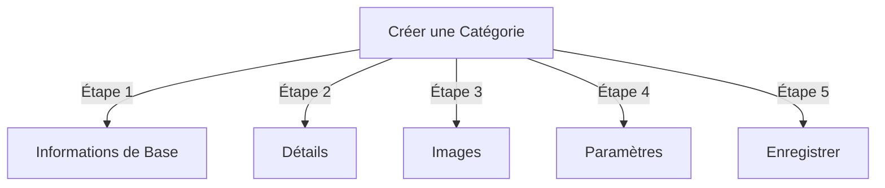

# Gérer les Catégories dans Publisher

> Guide complet pour créer, organiser les hiérarchies et gérer les catégories du module Publisher.

---

## Bases des Catégories

### Qu'est-ce que les Catégories ?

Les catégories organisent les articles en groupes logiques :

```
Exemple de Structure :

  Actualités (Catégorie Principale)
    ├── Technologie
    ├── Sports
    └── Divertissement

  Tutoriels (Catégorie Principale)
    ├── Photographie
    │   ├── Bases
    │   └── Avancé
    └── Écriture
        └── Blogging
```

### Avantages d'une Bonne Structure de Catégories

```
✓ Meilleure navigation utilisateur
✓ Contenu organisé
✓ SEO amélioré
✓ Gestion du contenu plus facile
✓ Meilleur flux de travail éditorial
```

---

## Accéder à la Gestion des Catégories

### Navigation du Panneau d'Administration

```
Panneau d'Administration
└── Modules
    └── Publisher
        └── Catégories
            ├── Créer Nouveau
            ├── Éditer
            ├── Supprimer
            ├── Permissions
            └── Organiser
```

### Accès Rapide

1. Se connecter en tant qu'**Administrateur**
2. Aller à **Admin → Modules**
3. Cliquer sur **Publisher → Admin**
4. Cliquer sur **Catégories** dans le menu gauche

---

## Créer des Catégories

### Formulaire de Création de Catégorie



### Étape 1 : Informations de Base

#### Nom de la Catégorie

```
Champ : Nom de la Catégorie
Type : Saisie de texte (obligatoire)
Longueur maximale : 100 caractères
Unicité : Devrait être unique
Exemple : "Photographie"
```

**Directives :**
- Descriptif et cohérent (singulier ou pluriel)
- Capitalisé correctement
- Éviter les caractères spéciaux
- Garder raisonnablement court

#### Description de la Catégorie

```
Champ : Description
Type : Zone de texte (optionnel)
Longueur maximale : 500 caractères
Utilisé dans : Pages de liste de catégories, blocs de catégories
```

**Objectif :**
- Explique le contenu de la catégorie
- Apparaît au-dessus des articles de la catégorie
- Aide les utilisateurs à comprendre la portée
- Utilisé pour la description méta SEO

**Exemple :**
```
"Conseils, tutoriels et inspiration photographique pour tous les niveaux
de compétence. Des bases de composition aux techniques d'éclairage avancées,
maîtrisez votre art."
```

### Étape 2 : Catégorie Parente

#### Créer une Hiérarchie

```
Champ : Catégorie Parente
Type : Liste déroulante
Options : Aucune (racine), ou catégories existantes
```

**Exemples de Hiérarchie :**

```
Structure Plate :
  Actualités
  Tutoriels
  Critiques

Structure Imbriquée :
  Actualités
    Technologie
    Affaires
    Sports
  Tutoriels
    Photographie
      Bases
      Avancé
    Écriture
```

**Créer une Sous-catégorie :**

1. Cliquer sur la liste déroulante **Catégorie Parente**
2. Sélectionner le parent (par ex., "Actualités")
3. Remplir le nom de la catégorie
4. Enregistrer
5. La nouvelle catégorie apparaît comme enfant

### Étape 3 : Image de Catégorie

#### Télécharger l'Image de Catégorie

```
Champ : Image de Catégorie
Type : Téléchargement d'image (optionnel)
Format : JPG, PNG, GIF, WebP
Taille maximale : 5 Mo
Recommandé : 300x200 px (ou la taille de votre thème)
```

**Pour Télécharger :**

1. Cliquer sur le bouton **Télécharger l'Image**
2. Sélectionner l'image de l'ordinateur
3. Recadrer/redimensionner si nécessaire
4. Cliquer sur **Utiliser cette Image**

**Où Utilisé :**
- Page de liste des catégories
- En-tête du bloc de catégories
- Fil d'Ariane (certains thèmes)
- Partage sur les réseaux sociaux

### Étape 4 : Paramètres de Catégorie

#### Paramètres d'Affichage

```yaml
Statut :
  - Activé : Oui/Non
  - Caché : Oui/Non (caché des menus, toujours accessible)

Options d'Affichage :
  - Afficher la description : Oui/Non
  - Afficher l'image : Oui/Non
  - Afficher le nombre d'articles : Oui/Non
  - Afficher les sous-catégories : Oui/Non

Disposition :
  - Éléments par page : 10-50
  - Ordre d'affichage : Date/Titre/Auteur
  - Direction d'affichage : Croissant/Décroissant
```

#### Permissions de Catégorie

```yaml
Qui Peut Voir :
  - Anonyme : Oui/Non
  - Enregistré : Oui/Non
  - Groupes spécifiques : Configurer par groupe

Qui Peut Soumettre :
  - Enregistré : Oui/Non
  - Groupes spécifiques : Configurer par groupe
  - L'auteur doit avoir : Permission "soumettre des articles"
```

### Étape 5 : Paramètres SEO

#### Balises Méta

```
Champ : Description Méta
Type : Texte (160 caractères)
Objectif : Description du moteur de recherche

Champ : Mots-clés Méta
Type : Liste séparée par des virgules
Exemple : photographie, tutoriels, conseils, techniques
```

#### Configuration d'URL

```
Champ : URL Slug
Type : Texte
Auto-généré à partir du nom de la catégorie
Exemple : "photographie" à partir de "Photographie"
Peut être personnalisé avant enregistrement
```

### Enregistrer la Catégorie

1. Remplir tous les champs obligatoires :
   - Nom de la Catégorie ✓
   - Description (recommandé)
2. Optionnel : Télécharger l'image, définir le SEO
3. Cliquer sur **Enregistrer la Catégorie**
4. Un message de confirmation apparaît
5. La catégorie est maintenant disponible

---

## Hiérarchie des Catégories

### Créer une Structure Imbriquée

```
Exemple étape par étape : Créer Actualités → Sous-catégorie Technologie

1. Aller à l'admin des Catégories
2. Cliquer sur "Ajouter une Catégorie"
3. Nom : "Actualités"
4. Parent : (laisser vide - c'est une racine)
5. Enregistrer
6. Cliquer sur "Ajouter une Catégorie" à nouveau
7. Nom : "Technologie"
8. Parent : "Actualités" (sélectionner dans la liste déroulante)
9. Enregistrer
```

### Afficher l'Arborescence de Hiérarchie

```
La vue des Catégories affiche la structure en arborescence :

📁 Actualités
  📄 Technologie
  📄 Sports
  📄 Divertissement
📁 Tutoriels
  📄 Photographie
    📄 Bases
    📄 Avancé
  📄 Écriture
```

Cliquer sur les flèches de développement pour afficher/masquer les sous-catégories.

### Réorganiser les Catégories

#### Déplacer une Catégorie

1. Aller à la liste des Catégories
2. Cliquer sur **Éditer** sur la catégorie
3. Modifier la **Catégorie Parente**
4. Cliquer sur **Enregistrer**
5. La catégorie est déplacée vers la nouvelle position

#### Réorganiser les Catégories

S'il est disponible, utiliser le glisser-déposer :

1. Aller à la liste des Catégories
2. Cliquer et glisser la catégorie
3. Déposer à la nouvelle position
4. L'ordre s'enregistre automatiquement

#### Supprimer une Catégorie

**Option 1 : Soft Delete (Masquer)**

1. Éditer la catégorie
2. Définir **Statut** : Désactivé
3. Cliquer sur **Enregistrer**
4. La catégorie est masquée mais non supprimée

**Option 2 : Hard Delete**

1. Aller à la liste des Catégories
2. Cliquer sur **Supprimer** sur la catégorie
3. Choisir l'action pour les articles :
   ```
   ☐ Déplacer les articles vers la catégorie parente
   ☐ Déplacer les articles vers la racine (Actualités)
   ☐ Supprimer tous les articles de la catégorie
   ```
4. Confirmer la suppression

---

## Opérations sur les Catégories

### Éditer une Catégorie

1. Aller à **Admin → Publisher → Catégories**
2. Cliquer sur **Éditer** sur la catégorie
3. Modifier les champs :
   - Nom
   - Description
   - Catégorie parente
   - Image
   - Paramètres
4. Cliquer sur **Enregistrer**

### Éditer les Permissions de Catégorie

1. Aller aux Catégories
2. Cliquer sur **Permissions** sur la catégorie (ou cliquer sur la catégorie puis sur Permissions)
3. Configurer les groupes :

```
Pour chaque groupe :
  ☐ Afficher les articles de cette catégorie
  ☐ Soumettre des articles à cette catégorie
  ☐ Éditer ses propres articles
  ☐ Éditer tous les articles
  ☐ Approuver/Modérer les articles
  ☐ Gérer la catégorie
```

4. Cliquer sur **Enregistrer les Permissions**

### Définir l'Image de Catégorie

**Télécharger une nouvelle image :**

1. Éditer la catégorie
2. Cliquer sur **Modifier l'Image**
3. Télécharger ou sélectionner l'image
4. Recadrer/redimensionner
5. Cliquer sur **Utiliser l'Image**
6. Cliquer sur **Enregistrer la Catégorie**

**Supprimer l'image :**

1. Éditer la catégorie
2. Cliquer sur **Supprimer l'Image** (s'il est disponible)
3. Cliquer sur **Enregistrer la Catégorie**

---

## Permissions de Catégorie

### Matrice de Permissions

```
                    Anonyme  Enregistré  Éditeur  Admin
Afficher catégorie     ✓         ✓         ✓       ✓
Soumettre article      ✗         ✓         ✓       ✓
Éditer son article     ✗         ✓         ✓       ✓
Éditer tous articles   ✗         ✗         ✓       ✓
Modérer articles       ✗         ✗         ✓       ✓
Gérer la catégorie     ✗         ✗         ✗       ✓
```

### Définir les Permissions au Niveau des Catégories

#### Contrôle d'Accès Par Catégorie

1. Aller à la liste des **Catégories**
2. Sélectionner une catégorie
3. Cliquer sur **Permissions**
4. Pour chaque groupe, sélectionner les permissions :

```
Exemple : Catégorie Actualités
  Anonyme :    Affichage uniquement
  Enregistré : Soumettre les articles
  Éditeurs :   Approuver les articles
  Admins :     Contrôle complet
```

5. Cliquer sur **Enregistrer**

#### Permissions au Niveau des Champs

Contrôler quels champs de formulaire les utilisateurs peuvent voir/éditer :

```
Exemple : Limiter la visibilité des champs pour les utilisateurs Enregistrés

Les utilisateurs Enregistrés peuvent voir/éditer :
  ✓ Titre
  ✓ Description
  ✓ Contenu
  ✗ Auteur (auto-défini par l'utilisateur actuel)
  ✗ Date programmée (éditeurs uniquement)
  ✗ En Vedette (admins uniquement)
```

**Configurer dans :**
- Permissions de Catégorie
- Chercher la section "Visibilité des Champs"

---

## Meilleures Pratiques pour les Catégories

### Structure des Catégories

```
✓ Garder la hiérarchie 2-3 niveaux profonds
✗ Ne pas créer trop de catégories de niveau supérieur
✗ Ne pas créer des catégories avec un seul article

✓ Utiliser un nommage cohérent (pluriel ou singulier)
✗ Ne pas utiliser des noms vagues ("Trucs", "Autre")

✓ Créer des catégories pour les articles qui existent
✗ Ne pas créer des catégories vides à l'avance
```

### Directives de Nommage

```
Bons noms :
  "Photographie"
  "Développement Web"
  "Conseils de Voyage"
  "Actualités Commerciales"

À éviter :
  "Articles" (trop vague)
  "Contenu" (redondant)
  "Actualités&Mises à jour" (incohérent)
  "PHOTOGRAPHIE TRUCS" (formatage)
```

### Conseils d'Organisation

```
Par Sujet :
  Actualités
    Technologie
    Sports
    Divertissement

Par Type :
  Tutoriels
    Vidéo
    Texte
    Interactif

Par Audience :
  Pour les Débutants
  Pour les Experts
  Études de Cas

Géographique :
  Amérique du Nord
    États-Unis
    Canada
  Europe
```

---

## Blocs de Catégories

### Bloc de Catégorie Publisher

Afficher les listes de catégories sur votre site :

1. Aller à **Admin → Blocs**
2. Trouver **Publisher - Catégories**
3. Cliquer sur **Éditer**
4. Configurer :

```
Titre du Bloc : "Catégories d'Actualités"
Afficher les sous-catégories : Oui/Non
Afficher le nombre d'articles : Oui/Non
Hauteur : (pixels ou auto)
```

5. Cliquer sur **Enregistrer**

### Bloc d'Articles de Catégorie

Afficher les derniers articles d'une catégorie spécifique :

1. Aller à **Admin → Blocs**
2. Trouver **Publisher - Articles de Catégorie**
3. Cliquer sur **Éditer**
4. Sélectionner :

```
Catégorie : Actualités (ou catégorie spécifique)
Nombre d'articles : 5
Afficher les images : Oui/Non
Afficher la description : Oui/Non
```

5. Cliquer sur **Enregistrer**

---

## Analyse des Catégories

### Afficher les Statistiques de Catégorie

Depuis l'admin des Catégories :

```
Chaque catégorie affiche :
  - Articles totaux : 45
  - Publiés : 42
  - Brouillon : 2
  - En attente d'approbation : 1
  - Affichages totaux : 5 234
  - Dernier article : il y a 2 heures
```

### Afficher le Trafic de Catégorie

S'il est activé :

1. Cliquer sur le nom de la catégorie
2. Cliquer sur l'onglet **Statistiques**
3. Afficher :
   - Affichages de pages
   - Articles populaires
   - Tendances du trafic
   - Termes de recherche utilisés

---

## Modèles de Catégories

### Personnaliser l'Affichage des Catégories

Si vous utilisez des modèles personnalisés, chaque catégorie peut remplacer :

```
publisher_category.tpl
  ├── En-tête de catégorie
  ├── Description de la catégorie
  ├── Image de catégorie
  ├── Liste des articles
  └── Pagination
```

**Pour personnaliser :**

1. Copier le fichier de modèle
2. Modifier le HTML/CSS
3. Assigner à la catégorie dans l'admin
4. La catégorie utilise le modèle personnalisé

---

## Tâches Courantes

### Créer une Hiérarchie d'Actualités

```
Admin → Publisher → Catégories
1. Créer "Actualités" (parent)
2. Créer "Technologie" (parent : Actualités)
3. Créer "Sports" (parent : Actualités)
4. Créer "Divertissement" (parent : Actualités)
```

### Déplacer les Articles Entre les Catégories

1. Aller à l'admin **Articles**
2. Sélectionner les articles (cases à cocher)
3. Sélectionner **"Modifier la Catégorie"** dans la liste déroulante d'actions en masse
4. Choisir la nouvelle catégorie
5. Cliquer sur **Mettre à Jour Tout**

### Masquer une Catégorie Sans la Supprimer

1. Éditer la catégorie
2. Définir **Statut** : Désactivé/Caché
3. Enregistrer
4. La catégorie n'est pas affichée dans les menus (toujours accessible via URL)

### Créer une Catégorie pour les Brouillons

```
Meilleure Pratique :

Créer une catégorie "En Révision"
  ├── Objectif : Articles en attente d'approbation
  ├── Permissions : Cachée du public
  ├── Seulement les admins/éditeurs peuvent voir
  ├── Déplacer les articles ici jusqu'à approbation
  └── Déplacer vers "Actualités" quand publié
```

---

## Importer/Exporter les Catégories

### Exporter les Catégories

S'il est disponible :

1. Aller à l'admin des **Catégories**
2. Cliquer sur **Exporter**
3. Sélectionner le format : CSV/JSON/XML
4. Télécharger le fichier
5. Sauvegarde effectuée

### Importer les Catégories

S'il est disponible :

1. Préparer un fichier avec les catégories
2. Aller à l'admin des **Catégories**
3. Cliquer sur **Importer**
4. Télécharger le fichier
5. Choisir la stratégie de mise à jour :
   - Créer uniquement les nouveaux
   - Mettre à jour les existants
   - Remplacer tous
6. Cliquer sur **Importer**

---

## Dépannage des Catégories

### Problème : Les sous-catégories ne s'affichent pas

**Solution :**
```
1. Vérifier que le statut de la catégorie parente est "Activé"
2. Vérifier les permissions permettent d'afficher
3. Vérifier que les sous-catégories ont le statut "Activé"
4. Vider le cache : Admin → Outils → Vider le Cache
5. Vérifier que le thème affiche les sous-catégories
```

### Problème : Impossible de supprimer une catégorie

**Solution :**
```
1. La catégorie ne doit avoir aucun article
2. Déplacer ou supprimer d'abord les articles :
   Admin → Articles
   Sélectionner les articles dans la catégorie
   Modifier la catégorie vers une autre
3. Puis supprimer la catégorie vide
4. Ou choisir l'option "déplacer les articles" lors de la suppression
```

### Problème : L'image de catégorie ne s'affiche pas

**Solution :**
```
1. Vérifier que l'image a été téléchargée avec succès
2. Vérifier le format du fichier image (JPG, PNG)
3. Vérifier les permissions du répertoire de téléchargement
4. Vérifier que le thème affiche les images de catégories
5. Essayer de re-télécharger l'image
6. Vider le cache du navigateur
```

### Problème : Les permissions ne prennent pas effet

**Solution :**
```
1. Vérifier les permissions des groupes dans la Catégorie
2. Vérifier les permissions globales de Publisher
3. Vérifier que l'utilisateur appartient au groupe configuré
4. Vider le cache de session
5. Se déconnecter et se reconnecter
6. Vérifier que les modules de permissions sont installés
```

---

## Liste de Vérification des Meilleures Pratiques pour les Catégories

Avant de déployer les catégories :

- [ ] La hiérarchie fait 2-3 niveaux profonds
- [ ] Chaque catégorie a 5+ articles
- [ ] Les noms de catégories sont cohérents
- [ ] Les permissions sont appropriées
- [ ] Les images de catégories sont optimisées
- [ ] Les descriptions sont complètes
- [ ] Les métadonnées SEO sont remplies
- [ ] Les URLs sont conviviales
- [ ] Les catégories sont testées sur le front-end
- [ ] La documentation est mise à jour

---

## Guides Connexes

- Création d'Articles
- Gestion des Permissions
- Configuration du Module
- Guide d'Installation

---

## Prochaines Étapes

- Créer des Articles dans les catégories
- Configurer les Permissions
- Personnaliser avec les Modèles Personnalisés

---

#publisher #catégories #organisation #hiérarchie #gestion #xoops
