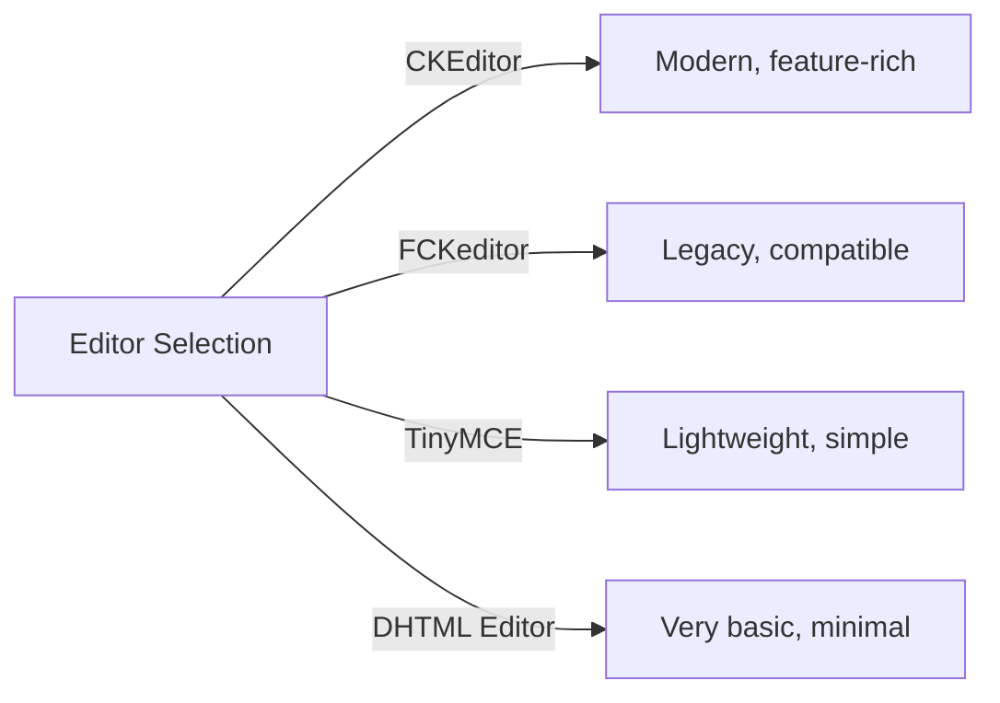
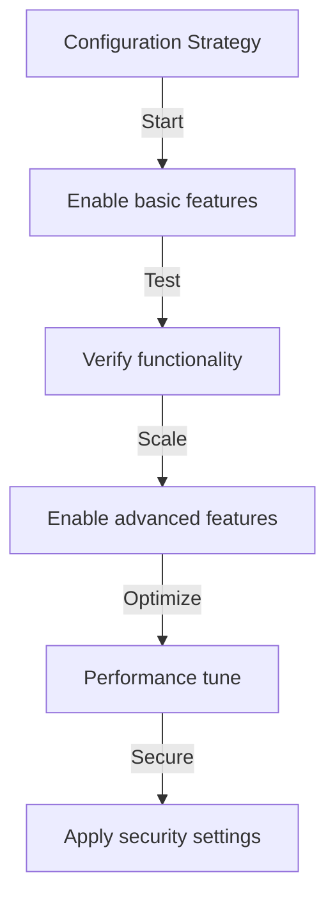

# Configuration de base de Publisher

> Configurez les paramètres, les préférences et les options générales du module Publisher pour votre installation XOOPS.

---

## Accéder à la configuration

### Navigation du panneau admin

```
Panneau d'administration XOOPS
└── Modules
    └── Publisher
        ├── Preferences
        ├── Settings
        └── Configuration
```

1. Connectez-vous en tant qu'**administrateur**
2. Allez à **Admin Panel → Modules**
3. Trouvez le module **Publisher**
4. Cliquez sur le lien **Preferences** ou **Admin**

---

## Paramètres généraux

### Configuration d'accès

```
Admin Panel → Modules → Publisher
```

Cliquez sur l'**icône engrenage** ou **Settings** pour ces options :

#### Options d'affichage

| Paramètre | Options | Par défaut | Description |
|---------|---------|---------|-------------|
| **Items per page** | 5-50 | 10 | Articles affichés dans les listes |
| **Show breadcrumb** | Yes/No | Yes | Affichage de la barre de navigation |
| **Use paging** | Yes/No | Yes | Paginer les longues listes |
| **Show date** | Yes/No | Yes | Afficher la date de l'article |
| **Show category** | Yes/No | Yes | Afficher la catégorie de l'article |
| **Show author** | Yes/No | Yes | Afficher l'auteur de l'article |
| **Show views** | Yes/No | Yes | Afficher le comptage des vues d'article |

**Exemple de configuration :**

```yaml
Items Per Page: 15
Show Breadcrumb: Yes
Use Paging: Yes
Show Date: Yes
Show Category: Yes
Show Author: Yes
Show Views: Yes
```

#### Options d'auteur

| Paramètre | Par défaut | Description |
|---------|---------|-------------|
| **Show author name** | Yes | Afficher le nom réel ou le nom d'utilisateur |
| **Use username** | No | Afficher le nom d'utilisateur au lieu du nom |
| **Show author email** | No | Afficher l'e-mail de contact de l'auteur |
| **Show author avatar** | Yes | Afficher l'avatar de l'utilisateur |

---

## Configuration de l'éditeur

### Sélectionner l'éditeur WYSIWYG

Publisher prend en charge plusieurs éditeurs :

#### Éditeurs disponibles



### CKEditor (Recommandé)

**Meilleur pour :** La plupart des utilisateurs, les navigateurs modernes, toutes les fonctionnalités

1. Allez à **Preferences**
2. Définissez **Editor** : CKEditor
3. Configurez les options :

```
Editor: CKEditor 4.x
Toolbar: Full
Height: 400px
Width: 100%
Remove plugins: []
Add plugins: [mathjax, codesnippet]
```

### FCKeditor

**Meilleur pour :** Compatibilité, systèmes plus anciens

```
Editor: FCKeditor
Toolbar: Default
Custom config: (optional)
```

### TinyMCE

**Meilleur pour :** Empreinte minimale, édition de base

```
Editor: TinyMCE
Plugins: [paste, table, link, image]
Toolbar: minimal
```

---

## Paramètres de fichier et téléchargement

### Configurer les répertoires de téléchargement

```
Admin → Publisher → Preferences → Upload Settings
```

#### Paramètres de type de fichier

```yaml
Types de fichiers autorisés :
  Images:
    - jpg
    - jpeg
    - gif
    - png
    - webp
  Documents:
    - pdf
    - doc
    - docx
    - xls
    - xlsx
    - ppt
    - pptx
  Archives:
    - zip
    - rar
    - 7z
  Media:
    - mp3
    - mp4
    - webm
    - mov
```

#### Limites de taille de fichier

| Type de fichier | Taille max | Notes |
|-----------|----------|-------|
| **Images** | 5 MB | Par fichier image |
| **Documents** | 10 MB | Fichiers PDF, Office |
| **Media** | 50 MB | Fichiers vidéo/audio |
| **All files** | 100 MB | Total par téléchargement |

**Configuration :**

```
Max Image Upload Size: 5 MB
Max Document Upload Size: 10 MB
Max Media Upload Size: 50 MB
Total Upload Size: 100 MB
Max Files per Article: 5
```

### Redimensionnement d'images

Publisher redimensionne automatiquement les images pour la cohérence :

```yaml
Thumbnail Size:
  Width: 150
  Height: 150
  Mode: Crop/Resize

Category Image Size:
  Width: 300
  Height: 200
  Mode: Resize

Article Featured Image:
  Width: 600
  Height: 400
  Mode: Resize
```

---

## Paramètres de commentaire et d'interaction

### Configuration des commentaires

```
Preferences → Comments Section
```

#### Options de commentaires

```yaml
Autoriser les commentaires :
  - Enabled: Yes/No
  - Default: Yes
  - Per-article override: Yes

Comment Moderation:
  - Moderate comments: Yes/No
  - Moderate guest comments only: Yes/No
  - Spam filter: Enabled
  - Max comments per day: (unlimited)

Comment Display:
  - Display format: Threaded/Flat
  - Comments per page: 10
  - Date format: Full date/Time ago
  - Show comment count: Yes/No
```

### Configuration des évaluations

```yaml
Autoriser les évaluations :
  - Enabled: Yes/No
  - Default: Yes
  - Per-article override: Yes

Rating Options:
  - Rating scale: 5 stars (default)
  - Allow user to rate own: No
  - Show average rating: Yes
  - Show rating count: Yes
```

---

## Paramètres SEO et URL

### Optimisation pour les moteurs de recherche

```
Preferences → SEO Settings
```

#### Configuration de l'URL

```yaml
URLs SEO :
  - Enabled: No (mettre à Yes pour les URLs SEO)
  - URL rewriting: None/Apache mod_rewrite/IIS rewrite

Format de l'URL :
  - Category: /category/news
  - Article: /article/welcome-to-site
  - Archive: /archive/2024/01

Meta Description:
  - Auto-generate: Yes
  - Max length: 160 characters

Meta Keywords:
  - Auto-generate: Yes
  - From: Article tags, title
```

### Activer les URLs SEO (Avancé)

**Prérequis :**
- Apache avec `mod_rewrite` activé
- Support `.htaccess` activé

**Étapes de configuration :**

1. Allez à **Preferences → SEO Settings**
2. Définissez **SEO URLs** : Yes
3. Définissez **URL Rewriting** : Apache mod_rewrite
4. Vérifiez que le fichier `.htaccess` existe dans le dossier Publisher

**Configuration .htaccess :**

```apache
<IfModule mod_rewrite.c>
    RewriteEngine On
    RewriteBase /modules/publisher/

    # Category rewrites
    RewriteRule ^category/([0-9]+)-(.*)\.html$ index.php?op=showcategory&categoryid=$1 [L,QSA]

    # Article rewrites
    RewriteRule ^article/([0-9]+)-(.*)\.html$ index.php?op=showitem&itemid=$1 [L,QSA]

    # Archive rewrites
    RewriteRule ^archive/([0-9]+)/([0-9]+)/$ index.php?op=archive&year=$1&month=$2 [L,QSA]
</IfModule>
```

---

## Cache et performance

### Configuration du cache

```
Preferences → Cache Settings
```

```yaml
Activer le cache :
  - Enabled: Yes
  - Cache type: File (or Memcache)

Cache Lifetime:
  - Category lists: 3600 seconds (1 hour)
  - Article lists: 1800 seconds (30 minutes)
  - Single article: 7200 seconds (2 hours)
  - Recent articles block: 900 seconds (15 minutes)

Cache Clear:
  - Manual clear: Available in admin
  - Auto-clear on article save: Yes
  - Clear on category change: Yes
```

### Effacer le cache

**Effacement manuel du cache :**

1. Allez à **Admin → Publisher → Tools**
2. Cliquez sur **Clear Cache**
3. Sélectionnez les types de cache à effacer :
   - [ ] Category cache
   - [ ] Article cache
   - [ ] Block cache
   - [ ] All cache
4. Cliquez sur **Clear Selected**

**Ligne de commande :**

```bash
# Effacer tout le cache de Publisher
php /path/to/xoops/admin/cache_manage.php publisher

# Ou supprimer directement les fichiers de cache
rm -rf /path/to/xoops/var/cache/publisher/*
```

---

## Notification et workflow

### Notifications par e-mail

```
Preferences → Notifications
```

```yaml
Notifier l'admin sur nouvel article :
  - Enabled: Yes
  - Recipient: Admin email
  - Include summary: Yes

Notify Moderators:
  - Enabled: Yes
  - On new submission: Yes
  - On pending articles: Yes

Notifier l'auteur :
  - On approval: Yes
  - On rejection: Yes
  - On comment: No (optional)
```

### Workflow de soumission

```yaml
Require Approval:
  - Enabled: Yes
  - Editor approval: Yes
  - Admin approval: No

Draft Save:
  - Auto-save interval: 60 seconds
  - Save local versions: Yes
  - Revision history: Last 5 versions
```

---

## Paramètres de contenu

### Paramètres de publication par défaut

```
Preferences → Content Settings
```

```yaml
Statut d'article par défaut :
  - Draft/Published: Draft
  - Featured by default: No
  - Auto-publish time: None

Visibilité par défaut :
  - Public/Private: Public
  - Show on front page: Yes
  - Show in categories: Yes

Publication programmée :
  - Enabled: Yes
  - Allow per-article: Yes

Expiration du contenu :
  - Enabled: No
  - Auto-archive old: No
  - Archive after days: (unlimited)
```

### Options de contenu WYSIWYG

```yaml
Allow HTML:
  - In articles: Yes
  - In comments: No

Allow Embedded Media:
  - Videos (iframe): Yes
  - Images: Yes
  - Plugins: No

Content Filtering:
  - Strip tags: No
  - XSS filter: Yes (recommended)
```

---

## Paramètres du moteur de recherche

### Configurer l'intégration de la recherche

```
Preferences → Search Settings
```

```yaml
Activer l'indexation des articles :
  - Include in site search: Yes
  - Index type: Full text/Title only

Search Options:
  - Search in titles: Yes
  - Search in content: Yes
  - Search in comments: Yes

Meta Tags:
  - Auto generate: Yes
  - OG tags (social): Yes
  - Twitter cards: Yes
```

---

## Paramètres avancés

### Mode debug (développement uniquement)

```
Preferences → Advanced
```

```yaml
Mode debug :
  - Enabled: No (only for development!)

Development Features:
  - Show SQL queries: No
  - Log errors: Yes
  - Error email: admin@example.com
```

### Optimisation de la base de données

```
Admin → Tools → Optimize Database
```

```bash
# Optimisation manuelle
mysql> OPTIMIZE TABLE publisher_items;
mysql> OPTIMIZE TABLE publisher_categories;
mysql> OPTIMIZE TABLE publisher_comments;
```

---

## Personnalisation du module

### Modèles de thème

```
Preferences → Display → Templates
```

Sélectionnez l'ensemble de modèles :
- Default
- Classic
- Modern
- Dark
- Custom

Chaque modèle contrôle :
- Article layout
- Category listing
- Archive display
- Comment display

---

## Conseils de configuration

### Bonnes pratiques



1. **Commencer simple** - Activer d'abord les fonctionnalités principales
2. **Tester chaque changement** - Vérifier avant de continuer
3. **Activer le cache** - Améliore les performances
4. **Sauvegarder d'abord** - Exporter les paramètres avant les changements majeurs
5. **Monitorer les journaux** - Vérifier régulièrement les journaux d'erreurs

### Optimisation des performances

```yaml
Pour de meilleures performances :
  - Enable caching: Yes
  - Cache lifetime: 3600 seconds
  - Limit items per page: 10-15
  - Compress images: Yes
  - Minify CSS/JS: Yes (if available)
```

### Durcissement de la sécurité

```yaml
Pour une meilleure sécurité :
  - Moderate comments: Yes
  - Disable HTML in comments: Yes
  - XSS filtering: Yes
  - File type whitelist: Strict
  - Max upload size: Reasonable limit
```

---

## Paramètres d'export/import

### Configuration de sauvegarde

```
Admin → Tools → Export Settings
```

**Pour sauvegarder la configuration actuelle :**

1. Cliquez sur **Export Configuration**
2. Enregistrez le fichier `.cfg` téléchargé
3. Stocker dans un endroit sûr

**Pour restaurer :**

1. Cliquez sur **Import Configuration**
2. Sélectionnez le fichier `.cfg`
3. Cliquez sur **Restore**

---

## Guides de configuration connexes

- Category Management
- Article Creation
- Permission Configuration
- Installation Guide

---

## Dépannage de configuration

### Les paramètres ne s'enregistrent pas

**Solution :**
1. Vérifiez les permissions des répertoires sur `/var/config/`
2. Vérifiez l'accès en écriture de PHP
3. Vérifiez le journal des erreurs PHP pour les problèmes
4. Effacez le cache du navigateur et réessayez

### L'éditeur n'apparaît pas

**Solution :**
1. Vérifiez que le plugin de l'éditeur est installé
2. Vérifiez la configuration de l'éditeur XOOPS
3. Essayez une option d'éditeur différente
4. Vérifiez la console du navigateur pour les erreurs JavaScript

### Problèmes de performance

**Solution :**
1. Activer le cache
2. Réduire les articles par page
3. Compresser les images
4. Vérifier l'optimisation de la base de données
5. Vérifier le journal des requêtes lentes

---

## Prochaines étapes

- Configurer les permissions de groupe
- Créer votre premier article
- Mettre en place les catégories
- Vérifier les modèles personnalisés

---

#publisher #configuration #preferences #settings #xoops
