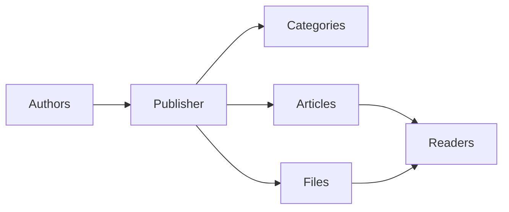
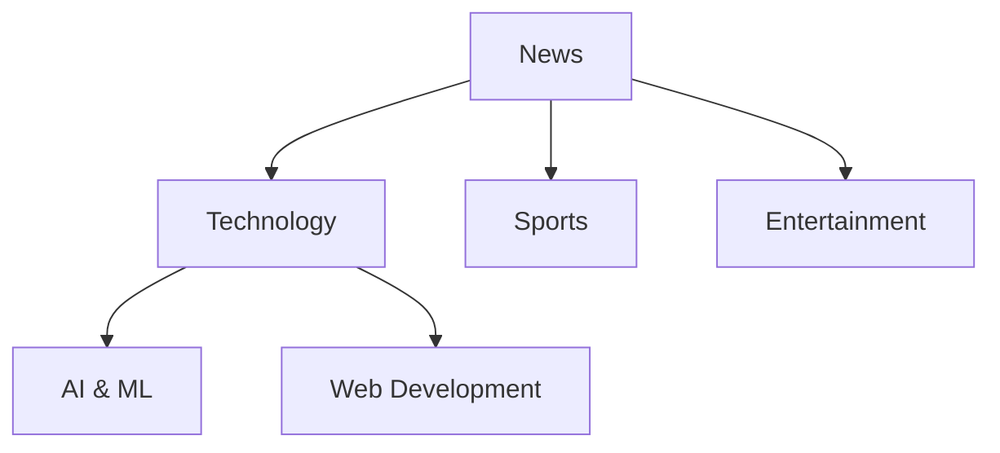
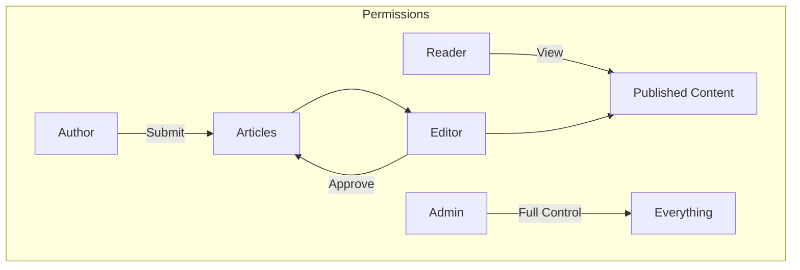
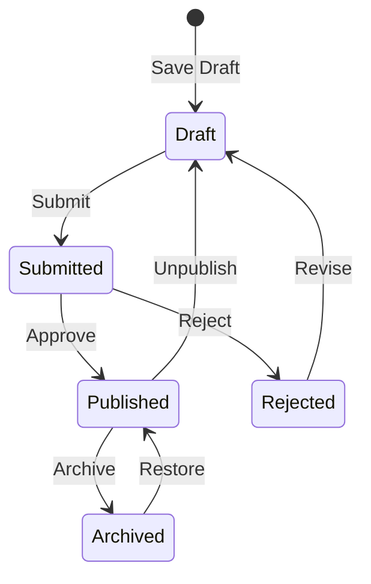

# Prise en main de Publisher

> Un guide étape par étape pour configurer et utiliser le module Publisher d'actualités/blog.

---

## Qu'est-ce que Publisher ?

Publisher est le principal module de gestion de contenu pour XOOPS, conçu pour :

- **Sites d'actualités** - Publier des articles avec des catégories
- **Blogs** - Blogging personnel ou multi-auteurs
- **Documentation** - Bases de connaissances organisées
- **Portails de contenu** - Contenu médias mixtes



---

## Configuration rapide

### Étape 1 : Installer Publisher

1. Télécharger depuis [GitHub](https://github.com/XoopsModules25x/publisher)
2. Télécharger vers `modules/publisher/`
3. Allez à Admin → Modules → Install

### Étape 2 : Créer des catégories



1. Admin → Publisher → Categories
2. Cliquez sur "Add Category"
3. Remplissez :
   - **Name**: Nom de la catégorie
   - **Description**: Ce que contient cette catégorie
   - **Image**: Image de catégorie facultative
4. Définir les permissions (qui peut soumettre/afficher)
5. Enregistrer

### Étape 3 : Configurer les paramètres

1. Admin → Publisher → Preferences
2. Paramètres clés à configurer :

| Paramètre | Recommandé | Description |
|---------|-------------|-------------|
| Items per page | 10-20 | Articles sur l'index |
| Editor | TinyMCE/CKEditor | Éditeur de texte enrichi |
| Allow ratings | Yes | Commentaires des lecteurs |
| Allow comments | Yes | Discussions |
| Auto-approve | No | Contrôle éditorial |

### Étape 4 : Créer votre premier article

1. Menu principal → Publisher → Submit Article
2. Remplissez le formulaire :
   - **Title**: Titre de l'article
   - **Category**: Où il appartient
   - **Summary**: Description courte
   - **Body**: Contenu complet de l'article
3. Ajouter des éléments optionnels :
   - Image à la une
   - Pièces jointes
   - Paramètres SEO
4. Soumettre pour examen ou publier

---

## Rôles des utilisateurs



### Lecteur
- Afficher les articles publiés
- Évaluer et commenter
- Contenu de recherche

### Auteur
- Soumettre de nouveaux articles
- Modifier ses propres articles
- Ajouter des fichiers

### Éditeur
- Approuver/rejeter les soumissions
- Modifier un article
- Gérer les catégories

### Administrateur
- Contrôle complet du module
- Configurer les paramètres
- Gérer les permissions

---

## Rédiger des articles

### Éditeur d'article

```
┌─────────────────────────────────────────────────────┐
│ Title: [Your Article Title                        ] │
├─────────────────────────────────────────────────────┤
│ Category: [Select Category          ▼]              │
├─────────────────────────────────────────────────────┤
│ Summary:                                            │
│ ┌─────────────────────────────────────────────────┐ │
│ │ Brief description shown in listings...          │ │
│ └─────────────────────────────────────────────────┘ │
├─────────────────────────────────────────────────────┤
│ Body:                                               │
│ ┌─────────────────────────────────────────────────┐ │
│ │ [B] [I] [U] [Link] [Image] [Code]               │ │
│ ├─────────────────────────────────────────────────┤ │
│ │                                                  │ │
│ │ Full article content goes here...               │ │
│ │                                                  │ │
│ └─────────────────────────────────────────────────┘ │
├─────────────────────────────────────────────────────┤
│ [Submit] [Preview] [Save Draft]                     │
└─────────────────────────────────────────────────────┘
```

### Bonnes pratiques

1. **Titres attrayants** - Titres clairs et engageants
2. **Bonnes résumés** - Inciter les lecteurs à cliquer
3. **Contenu structuré** - Utiliser les titres, listes, images
4. **Catégorisation appropriée** - Aider les lecteurs à trouver le contenu
5. **Optimisation SEO** - Mots-clés dans le titre et le contenu

---

## Gestion du contenu

### Flux d'état des articles



### Descriptions des statuts

| Statut | Description |
|--------|-------------|
| Draft | Travail en cours |
| Submitted | En attente d'examen |
| Published | Actif sur le site |
| Expired | Après la date d'expiration |
| Rejected | Nécessite une révision |
| Archived | Supprimé des listes |

---

## Navigation

### Accès à Publisher

- **Menu principal** → Publisher
- **URL directe** : `yoursite.com/modules/publisher/`

### Pages clés

| Page | URL | Objectif |
|------|-----|---------|
| Index | `/modules/publisher/` | Listes d'articles |
| Category | `/modules/publisher/category.php?id=X` | Articles par catégorie |
| Article | `/modules/publisher/item.php?itemid=X` | Article unique |
| Submit | `/modules/publisher/submit.php` | Nouvel article |
| Search | `/modules/publisher/search.php` | Trouver des articles |

---

## Blocs

Publisher fournit plusieurs blocs pour votre site :

### Articles récents
Affiche les derniers articles publiés

### Menu des catégories
Navigation par catégorie

### Articles populaires
Contenu le plus consulté

### Article aléatoire
Présenter un contenu aléatoire

### En vedette
Articles en vedette

---

## Documentation connexe

- Création et modification d'articles
- Gestion des catégories
- Extension de Publisher

---

#xoops #publisher #user-guide #getting-started #cms
