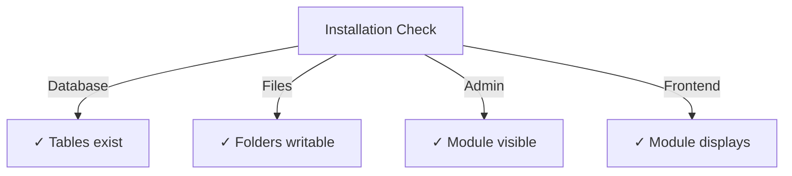

# Guide d'installation de Publisher

> Instructions complètes pour installer et configurer le module Publisher pour XOOPS CMS.

---

## Exigences système

### Exigences minimales

| Exigence | Version | Notes |
|-------------|---------|-------|
| XOOPS | 2.5.10+ | Plateforme CMS principale |
| PHP | 7.1+ | PHP 8.x recommandé |
| MySQL | 5.7+ | Serveur de base de données |
| Serveur Web | Apache/Nginx | Avec support de réécriture |

### Extensions PHP

```
- PDO (PHP Data Objects)
- pdo_mysql ou mysqli
- mb_string (chaînes multi-octets)
- curl (pour contenu externe)
- json
- gd (traitement d'image)
```

### Espace disque

- **Fichiers du module** : ~5 MB
- **Répertoire cache** : 50+ MB recommandé
- **Répertoire upload** : Selon les besoins du contenu

---

## Liste de contrôle de pré-installation

Avant d'installer Publisher, vérifiez :

- [ ] Le noyau XOOPS est installé et en cours d'exécution
- [ ] Le compte administrateur dispose des permissions de gestion des modules
- [ ] Sauvegarde de base de données créée
- [ ] Les permissions de fichiers permettent l'accès en écriture au répertoire `/modules/`
- [ ] La limite de mémoire PHP est d'au moins 128 MB
- [ ] Les limites de taille de téléchargement de fichiers sont appropriées (min 10 MB)

---

## Étapes d'installation

### Étape 1 : Télécharger Publisher

#### Option A : Depuis GitHub (Recommandé)

```bash
# Naviguez vers le répertoire des modules
cd /path/to/xoops/htdocs/modules/

# Clonez le référentiel
git clone https://github.com/XoopsModules25x/publisher.git

# Vérifiez le téléchargement
ls -la publisher/
```

#### Option B : Téléchargement manuel

1. Visitez [GitHub Publisher Releases](https://github.com/XoopsModules25x/publisher/releases)
2. Téléchargez le dernier fichier `.zip`
3. Extrayez vers `modules/publisher/`

### Étape 2 : Définir les permissions de fichiers

```bash
# Définir la propriété appropriée
chown -R www-data:www-data /path/to/xoops/htdocs/modules/publisher

# Définir les permissions du répertoire (755)
find publisher -type d -exec chmod 755 {} \;

# Définir les permissions de fichiers (644)
find publisher -type f -exec chmod 644 {} \;

# Rendre les scripts exécutables
chmod 755 publisher/admin/index.php
chmod 755 publisher/index.php
```

### Étape 3 : Installer via l'admin XOOPS

1. Connectez-vous au **Panneau d'administration XOOPS** en tant qu'administrateur
2. Accédez à **System → Modules**
3. Cliquez sur **Install Module**
4. Trouvez **Publisher** dans la liste
5. Cliquez sur le bouton **Install**
6. Attendez la fin de l'installation (affiche les tables de base de données créées)

```
Installation Progress:
✓ Tables created
✓ Configuration initialized
✓ Permissions set
✓ Cache cleared
Installation Complete!
```

---

## Configuration initiale

### Étape 1 : Accéder à l'admin Publisher

1. Allez à **Admin Panel → Modules**
2. Trouvez le module **Publisher**
3. Cliquez sur le lien **Admin**
4. Vous êtes maintenant dans l'administration de Publisher

### Étape 2 : Configurer les préférences du module

1. Cliquez sur **Preferences** dans le menu de gauche
2. Configurez les paramètres de base :

```
Paramètres généraux :
- Editor: Sélectionnez votre éditeur WYSIWYG
- Items per page: 10
- Show breadcrumb: Yes
- Allow comments: Yes
- Allow ratings: Yes

Paramètres SEO :
- SEO URLs: No (activez plus tard si nécessaire)
- URL rewriting: None

Paramètres de téléchargement :
- Max upload size: 5 MB
- Allowed file types: jpg, png, gif, pdf, doc, docx
```

3. Cliquez sur **Save Settings**

### Étape 3 : Créer la première catégorie

1. Cliquez sur **Categories** dans le menu de gauche
2. Cliquez sur **Add Category**
3. Remplissez le formulaire :

```
Category Name: News
Description: Latest news and updates
Image: (optional) Upload category image
Parent Category: (laissez vide pour le niveau supérieur)
Status: Enabled
```

4. Cliquez sur **Save Category**

### Étape 4 : Vérifier l'installation

Vérifiez ces indicateurs :



#### Vérification de base de données

```bash
mysql -u xoops_user -p xoops_database
mysql> SHOW TABLES LIKE 'publisher%';

# Devrait afficher les tables :
# - publisher_categories
# - publisher_items
# - publisher_comments
# - publisher_files
```

#### Vérification Frontend

1. Visitez votre page d'accueil XOOPS
2. Cherchez le bloc **Publisher** ou **News**
3. Devrait afficher les articles récents

---

## Configuration après l'installation

### Sélection de l'éditeur

Publisher prend en charge plusieurs éditeurs WYSIWYG :

| Éditeur | Avantages | Inconvénients |
|--------|------|------|
| FCKeditor | Riche en fonctionnalités | Plus ancien, plus volumineux |
| CKEditor | Norme moderne | Complexité de configuration |
| TinyMCE | Léger | Fonctionnalités limitées |
| DHTML Editor | Basique | Très basique |

**Pour changer d'éditeur :**

1. Allez à **Preferences**
2. Faites défiler jusqu'au paramètre **Editor**
3. Sélectionnez dans la liste déroulante
4. Enregistrez et testez

### Upload Directory Setup

```bash
# Create upload directories
mkdir -p /path/to/xoops/uploads/publisher/
mkdir -p /path/to/xoops/uploads/publisher/categories/
mkdir -p /path/to/xoops/uploads/publisher/images/
mkdir -p /path/to/xoops/uploads/publisher/files/

# Set permissions
chmod 755 /path/to/xoops/uploads/publisher/
chmod 755 /path/to/xoops/uploads/publisher/*
```

### Configure Image Sizes

In Preferences, set thumbnail sizes:

```
Category image size: 300 x 200 px
Article image size: 600 x 400 px
Thumbnail size: 150 x 100 px
```

---

## Étapes après l'installation

### 1. Définir les permissions de groupe

1. Allez à **Permissions** dans le menu administrateur
2. Configurez l'accès pour les groupes :
   - Anonymous: View only
   - Registered Users: Submit articles
   - Editors: Approve/edit articles
   - Admins: Full access

### 2. Configurer la visibilité du module

1. Allez à **Blocks** dans l'administration XOOPS
2. Trouvez les blocs Publisher :
   - Publisher - Latest Articles
   - Publisher - Categories
   - Publisher - Archives
3. Configurez la visibilité du bloc par page

### 3. Importer le contenu de test (Facultatif)

Pour tester, importez des articles exemple :

1. Allez à **Publisher Admin → Import**
2. Sélectionnez **Sample Content**
3. Cliquez sur **Import**

### 4. Activer les URLs SEO (Facultatif)

Pour les URLs conviviales pour les moteurs de recherche :

1. Allez à **Preferences**
2. Définir **SEO URLs**: Yes
3. Activez la réécriture **.htaccess**
4. Vérifiez que le fichier `.htaccess` existe dans le dossier Publisher

```apache
# Exemple .htaccess
<IfModule mod_rewrite.c>
    RewriteEngine On
    RewriteBase /modules/publisher/
    RewriteRule ^category/([0-9]+)-(.*)\.html$ index.php?op=showcategory&categoryid=$1 [L]
    RewriteRule ^article/([0-9]+)-(.*)\.html$ index.php?op=showitem&itemid=$1 [L]
</IfModule>
```

---

## Dépannage d'installation

### Problème : Le module n'apparaît pas dans l'admin

**Solution :**
```bash
# Vérifiez les permissions de fichiers
ls -la /path/to/xoops/modules/publisher/

# Vérifiez que xoops_version.php existe
ls /path/to/xoops/modules/publisher/xoops_version.php

# Vérifiez la syntaxe PHP
php -l /path/to/xoops/modules/publisher/xoops_version.php
```

### Problème : Les tables de base de données ne sont pas créées

**Solution :**
1. Vérifiez que l'utilisateur MySQL a le privilège CREATE TABLE
2. Vérifiez le journal des erreurs de base de données :
   ```bash
   mysql> SHOW WARNINGS;
   ```
3. Importez manuellement SQL :
   ```bash
   mysql -u user -p database < modules/publisher/sql/mysql.sql
   ```

### Problème : Le téléchargement de fichier échoue

**Solution :**
```bash
# Vérifiez que le répertoire existe et est accessible en écriture
stat /path/to/xoops/uploads/publisher/

# Corriger les permissions
chmod 777 /path/to/xoops/uploads/publisher/

# Vérifiez les paramètres PHP
php -i | grep upload_max_filesize
```

### Problème : Erreurs "Page non trouvée"

**Solution :**
1. Vérifiez que le fichier `.htaccess` est présent
2. Vérifiez que Apache `mod_rewrite` est activé :
   ```bash
   a2enmod rewrite
   systemctl restart apache2
   ```
3. Vérifiez `AllowOverride All` dans la config Apache

---

## Mise à niveau depuis les versions précédentes

### De Publisher 1.x à 2.x

1. **Sauvegardez l'installation actuelle :**
   ```bash
   cp -r modules/publisher/ modules/publisher-backup/
   mysqldump -u user -p database > publisher-backup.sql
   ```

2. **Téléchargez Publisher 2.x**

3. **Écrasez les fichiers :**
   ```bash
   rm -rf modules/publisher/
   unzip publisher-2.0.zip -d modules/
   ```

4. **Exécutez la mise à jour :**
   - Allez à **Admin → Publisher → Update**
   - Cliquez sur **Update Database**
   - Attendez la fin

5. **Vérifiez :**
   - Vérifiez que tous les articles s'affichent correctement
   - Vérifiez que les permissions sont intactes
   - Testez les téléchargements de fichiers

---

## Considérations de sécurité

### Permissions de fichiers

```
- Fichiers principaux : 644 (lisibles par le serveur web)
- Répertoires : 755 (navigables par le serveur web)
- Répertoires de téléchargement : 755 ou 777
- Fichiers de configuration : 600 (non lisibles par le web)
```

### Désactiver l'accès direct aux fichiers sensibles

Créez `.htaccess` dans les répertoires de téléchargement :

```apache
<FilesMatch "\.(php|phtml|php3|php4|php5|phtml)$">
    Deny from all
</FilesMatch>
```

### Sécurité de la base de données

```bash
# Utiliser un mot de passe fort
ALTER USER 'publisher_user'@'localhost' IDENTIFIED BY 'strong_password_here';

# Accorder les permissions minimales
GRANT SELECT, INSERT, UPDATE, DELETE ON publisher_db.* TO 'publisher_user'@'localhost';
FLUSH PRIVILEGES;
```

---

## Liste de vérification

Après l'installation, vérifiez :

- [ ] Le module apparaît dans la liste des modules d'administration
- [ ] Peut accéder à la section d'administration de Publisher
- [ ] Peut créer des catégories
- [ ] Peut créer des articles
- [ ] Les articles s'affichent sur le frontend
- [ ] Les téléchargements de fichiers fonctionnent
- [ ] Les images s'affichent correctement
- [ ] Les permissions sont appliquées correctement
- [ ] Les tables de base de données sont créées
- [ ] Le répertoire de cache est accessible en écriture

---

## Prochaines étapes

Après une installation réussie :

1. Lire le guide de configuration de base
2. Créer votre premier article
3. Configurer les permissions de groupe
4. Vérifier la gestion des catégories

---

## Support et ressources

- **GitHub Issues** : [Publisher Issues](https://github.com/XoopsModules25x/publisher/issues)
- **Forum XOOPS** : [Community Support](https://www.xoops.org/modules/newbb/)
- **GitHub Wiki** : [Installation Help](https://github.com/XoopsModules25x/publisher/wiki)

---

#publisher #installation #setup #xoops #module #configuration
