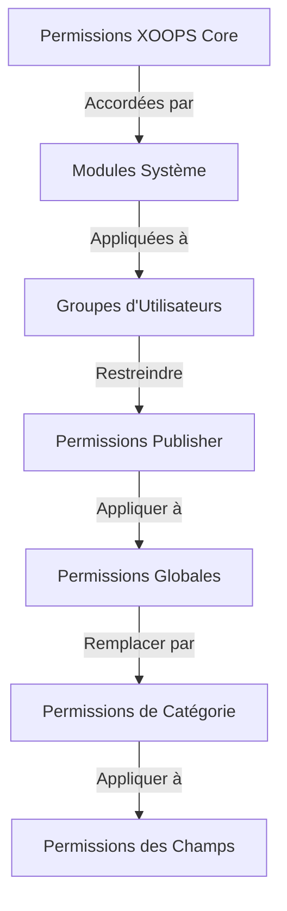

# Configuration des Permissions Publisher

> Guide complet pour configurer les permissions de groupe, le contrôle d'accès et gérer l'accès des utilisateurs dans Publisher.

---

## Bases des Permissions

### Qu'est-ce que les Permissions ?

Les permissions contrôlent ce que les différents groupes d'utilisateurs peuvent faire dans Publisher :

```
Qui peut :
  - Afficher les articles
  - Soumettre des articles
  - Éditer les articles
  - Approuver les articles
  - Gérer les catégories
  - Configurer les paramètres
```

### Niveaux de Permission

```
Anonyme
  └── Afficher uniquement les articles publiés

Utilisateurs Enregistrés
  ├── Afficher les articles
  ├── Soumettre des articles (en attente d'approbation)
  └── Éditer ses propres articles

Éditeurs/Modérateurs
  ├── Toutes les permissions des utilisateurs enregistrés
  ├── Approuver les articles
  ├── Éditer tous les articles
  └── Gérer certaines catégories

Administrateurs
  └── Accès complet à tout
```

---

## Accéder à la Gestion des Permissions

### Naviguer vers les Permissions

```
Panneau d'Administration
└── Modules
    └── Publisher
        ├── Permissions
        ├── Permissions des Catégories
        └── Gestion des Groupes
```

### Accès Rapide

1. Se connecter en tant qu'**Administrateur**
2. Aller à **Admin → Modules**
3. Cliquer sur **Publisher → Admin**
4. Cliquer sur **Permissions** dans le menu gauche

---

## Permissions Globales

### Permissions au Niveau du Module

Contrôler l'accès au module Publisher et ses fonctionnalités :

```
Vue de configuration des permissions :
┌─────────────────────────────────────┐
│ Permission             │ Anon │ Reg │ Éditeur │ Admin │
├────────────────────────┼──────┼─────┼────────┼───────┤
│ Afficher les articles  │  ✓   │  ✓  │   ✓    │  ✓   │
│ Soumettre des articles │  ✗   │  ✓  │   ✓    │  ✓   │
│ Éditer ses articles    │  ✗   │  ✓  │   ✓    │  ✓   │
│ Éditer tous les articles│  ✗   │  ✗  │   ✓    │  ✓   │
│ Approuver les articles │  ✗   │  ✗  │   ✓    │  ✓   │
│ Gérer les catégories   │  ✗   │  ✗  │   ✗    │  ✓   │
│ Accès au panneau admin │  ✗   │  ✗  │   ✓    │  ✓   │
└─────────────────────────────────────┘
```

### Descriptions des Permissions

| Permission | Utilisateurs | Effet |
|------------|--------------|-------|
| **Afficher les articles** | Tous les groupes | Peut voir les articles publiés sur le front-end |
| **Soumettre des articles** | Enregistrés+ | Peut créer de nouveaux articles (en attente d'approbation) |
| **Éditer ses articles** | Enregistrés+ | Peut éditer/supprimer ses propres articles |
| **Éditer tous les articles** | Éditeurs+ | Peut éditer les articles de n'importe quel utilisateur |
| **Supprimer ses articles** | Enregistrés+ | Peut supprimer ses propres articles non publiés |
| **Supprimer tous les articles** | Éditeurs+ | Peut supprimer n'importe quel article |
| **Approuver les articles** | Éditeurs+ | Peut publier les articles en attente |
| **Gérer les catégories** | Admins | Créer, éditer, supprimer les catégories |
| **Accès admin** | Éditeurs+ | Accéder à l'interface d'administration |

---

## Configurer les Permissions Globales

### Étape 1 : Accéder aux Paramètres de Permission

1. Aller à **Admin → Modules**
2. Trouver **Publisher**
3. Cliquer sur **Permissions** (ou lien Admin puis Permissions)
4. Vous voyez la matrice de permissions

### Étape 2 : Définir les Permissions des Groupes

Pour chaque groupe, configurer ce qu'ils peuvent faire :

#### Utilisateurs Anonymes

```yaml
Permissions du Groupe Anonyme :
  Afficher les articles : ✓ OUI
  Soumettre des articles : ✗ NON
  Éditer les articles : ✗ NON
  Supprimer les articles : ✗ NON
  Approuver les articles : ✗ NON
  Gérer les catégories : ✗ NON
  Accès admin : ✗ NON

Résultat : Les utilisateurs anonymes ne peuvent voir que le contenu publié
```

#### Utilisateurs Enregistrés

```yaml
Permissions du Groupe Enregistré :
  Afficher les articles : ✓ OUI
  Soumettre des articles : ✓ OUI (approbation requise)
  Éditer ses articles : ✓ OUI
  Éditer tous les articles : ✗ NON
  Supprimer ses articles : ✓ OUI (brouillons uniquement)
  Supprimer tous les articles : ✗ NON
  Approuver les articles : ✗ NON
  Gérer les catégories : ✗ NON
  Accès admin : ✗ NON

Résultat : Les utilisateurs enregistrés peuvent contribuer du contenu après approbation
```

#### Groupe Éditeurs

```yaml
Permissions du Groupe Éditeurs :
  Afficher les articles : ✓ OUI
  Soumettre des articles : ✓ OUI
  Éditer ses articles : ✓ OUI
  Éditer tous les articles : ✓ OUI
  Supprimer ses articles : ✓ OUI
  Supprimer tous les articles : ✓ OUI
  Approuver les articles : ✓ OUI
  Gérer les catégories : ✓ LIMITÉ
  Accès admin : ✓ OUI
  Configurer les paramètres : ✗ NON

Résultat : Les éditeurs gèrent le contenu mais pas les paramètres
```

#### Administrateurs

```yaml
Permissions du Groupe Admins :
  ✓ ACCÈS COMPLET à toutes les fonctionnalités

  - Toutes les permissions des éditeurs
  - Gérer toutes les catégories
  - Configurer tous les paramètres
  - Gérer les permissions
  - Installer/désinstaller
```

### Étape 3 : Enregistrer les Permissions

1. Configurer les permissions de chaque groupe
2. Cocher les cases pour les actions autorisées
3. Décocher les cases pour les actions refusées
4. Cliquer sur **Enregistrer les Permissions**
5. Un message de confirmation apparaît

---

## Permissions au Niveau des Catégories

### Définir l'Accès aux Catégories

Contrôler qui peut afficher/soumettre à des catégories spécifiques :

```
Admin → Publisher → Catégories
→ Sélectionner une catégorie → Permissions
```

### Matrice des Permissions de Catégorie

```
                    Anonyme  Enregistré  Éditeur  Admin
Afficher la catégorie  ✓         ✓         ✓       ✓
Soumettre à la catégorie ✗        ✓         ✓       ✓
Éditer ses articles    ✗         ✓         ✓       ✓
Éditer tous les articles ✗        ✗         ✓       ✓
Approuver dans catégorie ✗        ✗         ✓       ✓
Gérer la catégorie     ✗         ✗         ✗       ✓
```

### Configurer les Permissions de Catégorie

1. Aller à l'admin des **Catégories**
2. Trouver la catégorie
3. Cliquer sur le bouton **Permissions**
4. Pour chaque groupe, sélectionner :
   - [ ] Afficher cette catégorie
   - [ ] Soumettre des articles
   - [ ] Éditer ses articles
   - [ ] Éditer tous les articles
   - [ ] Approuver les articles
   - [ ] Gérer la catégorie
5. Cliquer sur **Enregistrer**

### Exemples de Permissions de Catégorie

#### Catégorie d'Actualités Publiques

```
Anonyme : Affichage uniquement
Enregistré : Affichage + Soumission (en attente d'approbation)
Éditeurs : Approbation + Édition
Admins : Contrôle complet
```

#### Catégorie de Mises à Jour Internes

```
Anonyme : Pas d'accès
Enregistré : Affichage uniquement
Éditeurs : Soumission + Approbation
Admins : Contrôle complet
```

#### Catégorie de Blog d'Invité

```
Anonyme : Affichage uniquement
Enregistré : Soumission (en attente d'approbation)
Éditeurs : Approbation
Admins : Contrôle complet
```

---

## Permissions au Niveau des Champs

### Contrôler la Visibilité des Champs du Formulaire

Restreindre quels champs de formulaire les utilisateurs peuvent voir/éditer :

```
Admin → Publisher → Permissions → Champs
```

### Options des Champs

```yaml
Champs Visibles pour les Utilisateurs Enregistrés :
  ✓ Titre
  ✓ Description
  ✓ Contenu (corps)
  ✓ Image en vedette
  ✓ Catégorie
  ✓ Balises
  ✗ Auteur (auto-défini)
  ✗ Date de publication (éditeurs uniquement)
  ✗ Date programmée (éditeurs uniquement)
  ✗ Drapeau En Vedette (éditeurs uniquement)
  ✗ Permissions (admins uniquement)
```

### Exemples

#### Soumission Limitée pour Enregistrés

Les utilisateurs enregistrés voient moins d'options :

```
Champs disponibles :
  - Titre ✓
  - Description ✓
  - Contenu ✓
  - Image en vedette ✓
  - Catégorie ✓

Champs masqués :
  - Auteur (auto-utilisateur actuel)
  - Date de publication (les éditeurs décident)
  - Date programmée (admins uniquement)
  - Statut En Vedette (les éditeurs choisissent)
```

#### Formulaire Complet pour les Éditeurs

Les éditeurs voient toutes les options :

```
Champs disponibles :
  - Tous les champs de base
  - Toutes les métadonnées
  - Sélection d'auteur ✓
  - Date/heure de publication ✓
  - Date programmée ✓
  - Statut En Vedette ✓
  - Date d'expiration ✓
  - Permissions ✓
```

---

## Configuration des Groupes d'Utilisateurs

### Créer un Groupe Personnalisé

1. Aller à **Admin → Utilisateurs → Groupes**
2. Cliquer sur **Créer un Groupe**
3. Saisir les détails du groupe :

```
Nom du Groupe : "Blogueurs Communautaires"
Description du Groupe : "Utilisateurs qui contribuent du contenu de blog"
Type : Groupe régulier
```

4. Cliquer sur **Enregistrer le Groupe**
5. Retourner aux permissions Publisher
6. Définir les permissions pour le nouveau groupe

### Exemples de Groupes

```
Groupes Suggérés pour Publisher :

Groupe : Contributeurs
  - Membres réguliers qui soumettent des articles
  - Peuvent éditer leurs propres articles
  - Ne peuvent pas approuver les articles

Groupe : Relecteurs
  - Peuvent voir les articles soumis
  - Peuvent approuver/rejeter les articles
  - Ne peuvent pas supprimer les articles des autres

Groupe : Éditeurs
  - Peuvent éditer n'importe quel article
  - Peuvent approuver les articles
  - Peuvent modérer les commentaires
  - Peuvent gérer certaines catégories

Groupe : Éditeurs
  - Peuvent éditer n'importe quel article
  - Peuvent publier directement (pas d'approbation)
  - Peuvent gérer toutes les catégories
  - Peuvent configurer les paramètres
```

---

## Hiérarchies de Permissions

### Flux de Permissions



### Héritage des Permissions

```
Base : Permissions globales du module
  ↓
Catégorie : Remplacements pour les catégories spécifiques
  ↓
Champ : Restreint davantage les champs disponibles
  ↓
Utilisateur : A la permission si TOUS les niveaux le permettent
```

**Exemple :**

```
L'utilisateur veut éditer un article :
1. Le groupe d'utilisateurs doit avoir la permission "éditer les articles" (global)
2. La catégorie doit permettre l'édition (niveau catégorie)
3. Les restrictions de champs doivent permettre (s'il y a lieu)
4. L'utilisateur doit être auteur OU éditeur (pour propre vs tous)

Si TOUT niveau refuse → Permission refusée
```

---

## Permissions de Flux d'Approbation

### Configurer l'Approbation des Soumissions

Contrôler si les articles nécessitent une approbation :

```
Admin → Publisher → Préférences → Flux de Travail
```

#### Options d'Approbation

```yaml
Flux de Soumission :
  Exiger l'Approbation : Oui

  Pour les Utilisateurs Enregistrés :
    - Nouveaux articles : Brouillon (en attente d'approbation)
    - Les éditeurs doivent approuver
    - L'utilisateur peut éditer en attente
    - Après approbation : L'utilisateur peut toujours éditer

  Pour les Éditeurs :
    - Nouveaux articles : Publier directement (optionnel)
    - Ignorer la file d'attente d'approbation
    - Ou toujours exiger l'approbation
```

#### Configurer Par Groupe

1. Aller à Préférences
2. Trouver "Flux de Soumission"
3. Pour chaque groupe, définir :

```
Groupe : Utilisateurs Enregistrés
  Exiger l'approbation : ✓ OUI
  Statut par défaut : Brouillon
  Peut modifier en attente : ✓ OUI

Groupe : Éditeurs
  Exiger l'approbation : ✗ NON
  Statut par défaut : Publié
  Peut modifier publié : ✓ OUI
```

4. Cliquer sur **Enregistrer**

---

## Modérer les Articles

### Approuver les Articles en Attente

Pour les utilisateurs avec la permission "approuver les articles" :

1. Aller à **Admin → Publisher → Articles**
2. Filtrer par **Statut** : En Attente
3. Cliquer sur l'article pour le revoir
4. Vérifier la qualité du contenu
5. Définir **Statut** : Publié
6. Optionnel : Ajouter des notes éditoriales
7. Cliquer sur **Enregistrer**

### Rejeter les Articles

Si l'article ne respecte pas les normes :

1. Ouvrir l'article
2. Définir **Statut** : Brouillon
3. Ajouter une raison de rejet (dans un commentaire ou un e-mail)
4. Cliquer sur **Enregistrer**
5. Envoyer un message à l'auteur expliquant le rejet

### Modérer les Commentaires

Si vous modérez les commentaires :

1. Aller à **Admin → Publisher → Commentaires**
2. Filtrer par **Statut** : En Attente
3. Examiner le commentaire
4. Options :
   - Approuver : Cliquer sur **Approuver**
   - Rejeter : Cliquer sur **Supprimer**
   - Éditer : Cliquer sur **Éditer**, corriger, enregistrer
5. Cliquer sur **Enregistrer**

---

## Gérer l'Accès des Utilisateurs

### Afficher les Groupes d'Utilisateurs

Voir quels utilisateurs appartiennent à quels groupes :

```
Admin → Utilisateurs → Groupes d'Utilisateurs

Pour chaque utilisateur :
  - Groupe principal (un)
  - Groupes secondaires (plusieurs)

Les permissions s'appliquent de tous les groupes (union)
```

### Ajouter un Utilisateur à un Groupe

1. Aller à **Admin → Utilisateurs**
2. Trouver l'utilisateur
3. Cliquer sur **Éditer**
4. Sous **Groupes**, cocher les groupes à ajouter
5. Cliquer sur **Enregistrer**

### Modifier les Permissions d'Utilisateur

Pour les utilisateurs individuels (s'il est supporté) :

1. Aller à l'admin des Utilisateurs
2. Trouver l'utilisateur
3. Cliquer sur **Éditer**
4. Chercher le remplacement des permissions individuelles
5. Configurer selon les besoins
6. Cliquer sur **Enregistrer**

---

## Scénarios de Permissions Courants

### Scénario 1 : Blog Ouvert

Permettre à quiconque de soumettre :

```
Anonyme : Afficher
Enregistré : Soumettre, éditer le sien, supprimer le sien
Éditeurs : Approuver, éditer tous, supprimer tous
Admins : Contrôle complet

Résultat : Blog communautaire ouvert
```

### Scénario 2 : Site d'Actualités Modéré

Processus d'approbation strict :

```
Anonyme : Affichage uniquement
Enregistré : Pas de soumission
Éditeurs : Soumettre, approuver les autres
Admins : Contrôle complet

Résultat : Seulement les professionnels approuvés publient
```

### Scénario 3 : Blog de Personnel

Les employés peuvent contribuer :

```
Créer le groupe : "Personnel"
Anonyme : Afficher
Enregistré : Affichage uniquement (non-personnel)
Personnel : Soumettre, éditer le sien, publier directement
Admins : Contrôle complet

Résultat : Blog rédigé par le personnel
```

### Scénario 4 : Multi-Catégorie avec Éditeurs Différents

Éditeurs différents pour différentes catégories :

```
Catégorie Actualités :
  Groupe Éditeurs A : Contrôle complet

Catégorie Critiques :
  Groupe Éditeurs B : Contrôle complet

Catégorie Tutoriels :
  Groupe Éditeurs C : Contrôle complet

Résultat : Contrôle éditorial décentralisé
```

---

## Test des Permissions

### Vérifier que les Permissions Fonctionnent

1. Créer un utilisateur de test pour chaque groupe
2. Se connecter en tant que chaque utilisateur de test
3. Essayer de :
   - Afficher les articles
   - Soumettre un article (doit créer un brouillon si autorisé)
   - Éditer un article (propre et autres)
   - Supprimer un article
   - Accéder au panneau d'administration
   - Accéder aux catégories

4. Vérifier que les résultats correspondent aux permissions attendues

### Cas de Test Communs

```
Cas de Test 1 : Utilisateur Anonyme
  [ ] Peut afficher les articles publiés : ✓
  [ ] Ne peut pas soumettre d'articles : ✓
  [ ] Ne peut pas accéder à l'admin : ✓

Cas de Test 2 : Utilisateur Enregistré
  [ ] Peut soumettre des articles : ✓
  [ ] Les articles vont en Brouillon : ✓
  [ ] Peut éditer son propre article : ✓
  [ ] Ne peut pas éditer les autres : ✓
  [ ] Ne peut pas accéder à l'admin : ✓

Cas de Test 3 : Éditeur
  [ ] Peut approuver les articles : ✓
  [ ] Peut éditer n'importe quel article : ✓
  [ ] Peut accéder à l'admin : ✓
  [ ] Ne peut pas supprimer tous : ✓ (ou ✓ si autorisé)

Cas de Test 4 : Admin
  [ ] Peut tout faire : ✓
```

---

## Dépannage des Permissions

### Problème : L'utilisateur ne peut pas soumettre d'articles

**Vérifier :**
```
1. Le groupe d'utilisateurs a la permission "soumettre des articles"
   Admin → Publisher → Permissions

2. L'utilisateur appartient au groupe autorisé
   Admin → Utilisateurs → Éditer l'utilisateur → Groupes

3. La catégorie autorise la soumission du groupe d'utilisateurs
   Admin → Publisher → Catégories → Permissions

4. L'utilisateur est enregistré (pas anonyme)
```

**Solution :**
```bash
1. Vérifier que le groupe d'utilisateurs enregistrés a la permission de soumission
2. Ajouter l'utilisateur au groupe approprié
3. Vérifier les permissions de catégorie
4. Vider le cache de session utilisateur
```

### Problème : L'éditeur ne peut pas approuver les articles

**Vérifier :**
```
1. Le groupe d'éditeurs a la permission "approuver les articles"
2. Les articles existent avec le statut "En Attente"
3. L'éditeur est dans le groupe correct
4. La catégorie autorise l'approbation du groupe d'éditeurs
```

**Solution :**
```bash
1. Aller aux Permissions, vérifier "approuver les articles" est coché pour le groupe d'éditeurs
2. Créer un article de test, le définir en Brouillon
3. Essayer d'approuver en tant qu'éditeur
4. Vérifier les messages d'erreur dans le journal système
```

### Problème : Peut voir les articles mais ne peut pas accéder à la catégorie

**Vérifier :**
```
1. La catégorie n'est pas désactivée/cachée
2. Les permissions de catégorie permettent l'affichage
3. Le groupe de l'utilisateur est autorisé à afficher la catégorie
4. La catégorie est publiée
```

**Solution :**
```bash
1. Aller aux Catégories, vérifier que le statut de la catégorie est "Activé"
2. Vérifier que les permissions de catégorie sont définies
3. Ajouter le groupe de l'utilisateur à la permission d'affichage de la catégorie
```

### Problème : Les permissions ont changé mais ne prennent pas effet

**Solution :**
```bash
1. Vider le cache : Admin → Outils → Vider le Cache
2. Vider la session : Déconnexion et reconnexion
3. Vérifier le journal système pour les erreurs
4. Vérifier que les permissions ont réellement été enregistrées
5. Essayer un navigateur différent/mode incognito
```

---

## Sauvegarde et Exportation des Permissions

### Exporter les Permissions

Certains systèmes permettent d'exporter :

1. Aller à **Admin → Publisher → Outils**
2. Cliquer sur **Exporter les Permissions**
3. Enregistrer le fichier `.xml` ou `.json`
4. Garder comme sauvegarde

### Importer les Permissions

Restaurer à partir d'une sauvegarde :

1. Aller à **Admin → Publisher → Outils**
2. Cliquer sur **Importer les Permissions**
3. Sélectionner le fichier de sauvegarde
4. Revoir les modifications
5. Cliquer sur **Importer**

---

## Meilleures Pratiques

### Liste de Vérification de Configuration des Permissions

- [ ] Décider sur les groupes d'utilisateurs
- [ ] Assigner des noms clairs aux groupes
- [ ] Définir les permissions de base pour chaque groupe
- [ ] Tester chaque niveau de permission
- [ ] Documenter la structure des permissions
- [ ] Créer un flux d'approbation
- [ ] Former les éditeurs à la modération
- [ ] Surveiller l'utilisation des permissions
- [ ] Revoir les permissions trimestriellement
- [ ] Sauvegarder les paramètres de permissions

### Meilleures Pratiques de Sécurité

```
✓ Principe du Moindre Privilège
  - Accorder les permissions minimales nécessaires

✓ Accès Basé sur le Rôle
  - Utiliser des groupes pour les rôles (éditeur, modérateur, etc)

✓ Auditer les Permissions
  - Revoir qui a quel accès

✓ Séparation des Devoirs
  - Soumetteur, approbateur, éditeur sont différents

✓ Examen Régulier
  - Vérifier les permissions trimestriellement
  - Supprimer l'accès quand les utilisateurs partent
  - Mettre à jour pour les nouvelles exigences
```

---

## Guides Connexes

- Créer des Articles
- Gérer les Catégories
- Configuration de Base
- Installation

---

## Prochaines Étapes

- Configurer les Permissions pour votre flux de travail
- Créer des Articles avec les permissions appropriées
- Configurer les Catégories avec les permissions
- Former les utilisateurs à la création d'articles

---

#publisher #permissions #groupes #contrôle-d-accès #sécurité #modération #xoops
