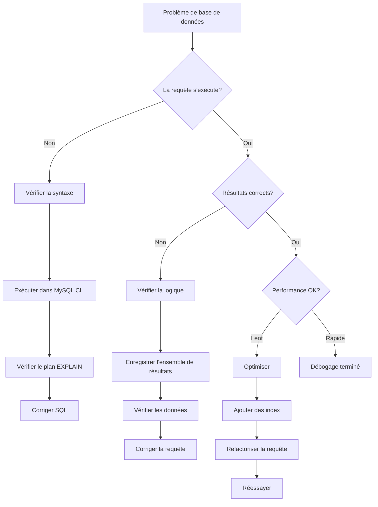
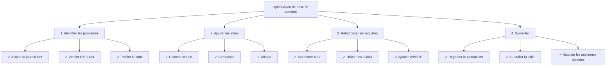

# Techniques de débogage de base de données

> Méthodes et outils pour déboguer les requêtes SQL et les problèmes de base de données dans les applications XOOPS.

---

## Diagramme de diagnostic



---

## Activer l'enregistrement des requêtes

### Méthode 1: Mode de débogage XOOPS

```php
<?php
// Dans mainfile.php
define('XOOPS_DEBUG_LEVEL', 2);

// Maintenant toutes les requêtes apparaissent dans la table xoops_log
// Ou dans les fichiers: xoops_data/logs/
?>
```

Vérifier les résultats:
```bash
# Afficher les journaux
tail -100 xoops_data/logs/*.log

# Ou interroger la base de données
SELECT * FROM xoops_log ORDER BY created DESC LIMIT 20;
```

---

### Méthode 2: Journal des requêtes lentes MySQL

Activer dans `/etc/mysql/my.cnf`:

```ini
[mysqld]
# Activer l'enregistrement des requêtes lentes
slow_query_log = 1
slow_query_log_file = /var/log/mysql/slow.log
long_query_time = 1          # Enregistrer les requêtes > 1 seconde
log_queries_not_using_indexes = 1
```

Redémarrer MySQL:
```bash
sudo systemctl restart mysql
# ou
sudo systemctl restart mariadb
```

Afficher le journal:
```bash
tail -100 /var/log/mysql/slow.log

# Ou analyser avec mysqldumpslow
mysqldumpslow -s t -t 10 /var/log/mysql/slow.log
```

---

### Méthode 3: Journal général des requêtes

Activer pour toutes les requêtes (attention: fichiers journaux volumineux):

```sql
-- Activer
SET GLOBAL general_log = 'ON';
SET GLOBAL log_output = 'FILE';
SET GLOBAL general_log_file = '/var/log/mysql/general.log';

-- Désactiver
SET GLOBAL general_log = 'OFF';

-- Afficher
SHOW VARIABLES LIKE 'general_log%';
```

---

## Déboguer le SQL dans le code

### Enregistrer l'exécution des requêtes

```php
<?php
require_once 'mainfile.php';

$ray = ray();  // Si vous utilisez le débogueur Ray

// Exécuter une requête
$query = "SELECT u.uid, u.uname, COUNT(a.id) as total_articles
          FROM xoops_users u
          LEFT JOIN xoops_articles a ON u.uid = a.author_id
          GROUP BY u.uid
          ORDER BY total_articles DESC";

$ray->label('Requête')->info($query);

$result = $GLOBALS['xoopsDB']->query($query);

if (!$result) {
    $ray->error("Erreur SQL: " . $GLOBALS['xoopsDB']->error);
    exit;
}

// Enregistrer les résultats
$data = [];
while ($row = $result->fetch_assoc()) {
    $data[] = $row;
}

$ray->label('Résultats')->dump($data);
$ray->info("Trouvé " . count($data) . " lignes");
?>
```

---

### Mesurer les performances des requêtes

```php
<?php
$db = $GLOBALS['xoopsDB'];
$ray = ray();

// Mesurer le temps d'exécution
$start = microtime(true);

$query = "SELECT * FROM xoops_articles LIMIT 1000";
$result = $db->query($query);

$exec_time = (microtime(true) - $start) * 1000;  // millisecondes

$ray->info("Requête exécutée en: {$exec_time}ms");

// Enregistrer les requêtes lentes
if ($exec_time > 100) {  // Alerte si > 100ms
    $ray->warning("Requête lente détectée: {$exec_time}ms");
    $ray->info($query);
}
?>
```

---

### Vérifier les résultats des requêtes

```php
<?php
$db = $GLOBALS['xoopsDB'];
$ray = ray();

$query = "SELECT * FROM xoops_articles WHERE author_id = 5";
$result = $db->query($query);

// Vérifier si la requête a réussi
if (!$result) {
    $ray->error("Requête échouée: " . $db->error);
    exit;
}

// Obtenir le nombre de lignes
$count = $result->num_rows;
$ray->info("Requête retournée: $count lignes");

// Récupérer les résultats
$articles = [];
while ($row = $result->fetch_assoc()) {
    $articles[] = $row;
}

// Vérifier les données
if (empty($articles)) {
    $ray->warning("Aucun article trouvé pour l'auteur 5");
} else {
    $ray->success("Trouvé " . count($articles) . " articles");
    $ray->dump($articles);
}
?>
```

---

## Analyser les performances des requêtes

### Commande EXPLAIN

Utiliser EXPLAIN pour analyser l'exécution des requêtes:

```sql
-- Analyser une requête
EXPLAIN SELECT * FROM xoops_articles WHERE author_id = 5;

-- Avec des informations étendues
EXPLAIN EXTENDED SELECT * FROM xoops_articles WHERE author_id = 5;

-- Format JSON (montre plus de détails)
EXPLAIN FORMAT=JSON SELECT * FROM xoops_articles WHERE author_id = 5\G
```

**Champs clés à vérifier:**

```
type: ALL           (mauvais) - Balayage complet de la table
      INDEX         (correct) - Balayage d'index
      ref/const     (bon) - Recherche directe d'index
      range         (correct) - Balayage par plage utilisant l'index

possible_keys:      Index disponibles
key:                Index réellement utilisé
key_len:            Longueur d'index utilisée
rows:               Nombre estimé de lignes examinées
Extra:              Informations supplémentaires (Using where, Using index, etc.)
```

### Exemple d'analyse

```sql
-- Requête lente sans index
EXPLAIN SELECT * FROM xoops_articles WHERE author_id = 5;

+----+-------------+----------+------+---------------+------+---------+------+-------+-------------+
| id | select_type | table    | type | possible_keys | key  | key_len | rows | Extra |
+----+-------------+----------+------+---------------+------+---------+------+-------+-------------+
|  1 | SIMPLE      | articles | ALL  | NULL          | NULL | NULL    | 1000 | Using where |
+----+-------------+----------+------+---------------+------+-------+------+-------+-------------+
                                      ↑
                          Aucun index disponible!

-- Après ajout d'un index
ALTER TABLE xoops_articles ADD INDEX (author_id);

EXPLAIN SELECT * FROM xoops_articles WHERE author_id = 5;

+----+-------------+----------+------+---------------+-----------+---------+-------+------+
| id | select_type | table    | type | possible_keys | key       | key_len | rows  | Extra|
+----+-------------+----------+------+---------------+-----------+---------+-------+------+
|  1 | SIMPLE      | articles | ref  | author_id     | author_id | 4       | 10    |
+----+-------------+----------+------+---------------+-----------+---------+-------+------+
                                                              ↑
                                      Utilisation d'index - beaucoup plus rapide!
```

---

## Problèmes SQL courants

### 1. Problème de requête N+1

**Problème:**
```php
<?php
// MAUVAIS: Requêtes multiples dans une boucle
$authors = $db->query("SELECT uid FROM xoops_users LIMIT 100");
while ($author = $authors->fetch_assoc()) {
    // Cette requête s'exécute 100 fois!
    $articles = $db->query(
        "SELECT COUNT(*) FROM xoops_articles WHERE author_id = " . $author['uid']
    );
    echo $articles->fetch_row()[0];
}
?>
```

**Solution: Utiliser une JOIN**
```php
<?php
// CORRECT: Une requête
$result = $db->query("
    SELECT u.uid, u.uname, COUNT(a.id) as total
    FROM xoops_users u
    LEFT JOIN xoops_articles a ON u.uid = a.author_id
    GROUP BY u.uid
    LIMIT 100
");

while ($row = $result->fetch_assoc()) {
    echo $row['total'];
}
?>
```

---

### 2. Index manquants

**Identifier:**
```sql
-- Trouver les requêtes qui balaient toutes les lignes
SELECT * FROM xoops_log
WHERE info LIKE '%type: ALL%'
ORDER BY created DESC;
```

**Ajouter les index:**
```sql
-- Index simple colonne
ALTER TABLE xoops_articles ADD INDEX (author_id);
ALTER TABLE xoops_articles ADD INDEX (created);

-- Index composite
ALTER TABLE xoops_articles ADD INDEX (author_id, created);

-- Index unique
ALTER TABLE xoops_articles ADD UNIQUE INDEX (slug);
```

---

### 3. Conditions WHERE inefficaces

**Problème:**
```sql
-- Mauvais: Les fonctions empêchent l'utilisation d'index
SELECT * FROM xoops_articles
WHERE YEAR(created) = 2024;

-- Mauvais: OU avec des colonnes différentes
SELECT * FROM xoops_articles
WHERE category = 'tech' OR author_id = 5;
```

**Solution:**
```sql
-- Correct: Utiliser une plage
SELECT * FROM xoops_articles
WHERE created >= '2024-01-01' AND created < '2025-01-01';

-- Correct: Utiliser UNION pour des colonnes différentes
SELECT * FROM xoops_articles WHERE category = 'tech'
UNION
SELECT * FROM xoops_articles WHERE author_id = 5;
```

---

## Déboguer des problèmes spécifiques

### Problème: La requête retourne des résultats incorrects

```php
<?php
$ray = ray();

// Tester avec des données d'exemple
$author_id = 5;
$ray->info("Recherche de author_id = $author_id");

$query = "SELECT * FROM xoops_articles WHERE author_id = ?";
$stmt = $db->prepare($query);
$stmt->bind_param("i", $author_id);
$stmt->execute();

$result = $stmt->get_result();
$count = $result->num_rows;

$ray->info("Trouvé: $count articles");

// Vérifier si une requête paramétrée aide
if ($count == 0) {
    // Essayer sans paramètre pour déboguer
    $debug_query = "SELECT * FROM xoops_articles WHERE author_id = $author_id";
    $ray->warning("Requête de débogage: $debug_query");
}

// Afficher le premier résultat
if ($row = $result->fetch_assoc()) {
    $ray->label('Premier résultat')->dump($row);
}
?>
```

---

### Problème: Requête de JOIN lente

```php
<?php
$ray = ray();

$query = "
    SELECT a.id, a.title, u.uname, u.email
    FROM xoops_articles a
    LEFT JOIN xoops_users u ON a.author_id = u.uid
    WHERE a.status = 1
    ORDER BY a.created DESC
    LIMIT 50
";

$ray->info("Exécution de la requête de jointure");
$ray->measure(function() use ($query) {
    $result = $GLOBALS['xoopsDB']->query($query);
    return $result;
});

// Analyser avec EXPLAIN
$ray->label('Analyse de requête')->info($query);
?>
```

Exécuter EXPLAIN:
```sql
EXPLAIN SELECT a.id, a.title, u.uname, u.email
FROM xoops_articles a
LEFT JOIN xoops_users u ON a.author_id = u.uid
WHERE a.status = 1
ORDER BY a.created DESC
LIMIT 50\G

-- Chercher:
-- - type: ALL (besoin d'index)
-- - Extra: Using temporary; Using filesort (inefficace)
-- Correction: Ajouter un index composite
ALTER TABLE xoops_articles ADD INDEX (status, created);
```

---

## Créer un journal de débogage des requêtes

```php
<?php
// Créer modules/yourmodule/QueryLogger.php

class QueryLogger {
    private static $queries = [];
    private static $times = [];

    public static function log($query) {
        self::$queries[] = $query;
        self::$times[] = microtime(true);
    }

    public static function execute($query) {
        $start = microtime(true);
        $result = $GLOBALS['xoopsDB']->query($query);
        $time = (microtime(true) - $start) * 1000;

        self::log($query);
        self::$times[count(self::$times) - 1] = $time;

        return $result;
    }

    public static function report() {
        echo "<h1>Rapport de requête</h1>";
        echo "<table>";
        echo "<tr><th>Requête</th><th>Temps (ms)</th></tr>";

        foreach (self::$queries as $i => $query) {
            $time = self::$times[$i] ?? 0;
            echo "<tr>";
            echo "<td><pre>" . htmlspecialchars(substr($query, 0, 100)) . "</pre></td>";
            echo "<td>" . number_format($time, 2) . "</td>";
            echo "</tr>";
        }

        echo "</table>";
    }

    public static function getTotalQueries() {
        return count(self::$queries);
    }

    public static function getTotalTime() {
        return array_sum(self::$times);
    }
}
?>
```

Utilisation:
```php
<?php
require_once 'QueryLogger.php';

$result = QueryLogger::execute("SELECT * FROM xoops_articles");

// Plus tard...
echo "Requêtes totales: " . QueryLogger::getTotalQueries();
echo "Temps total: " . QueryLogger::getTotalTime() . "ms";
QueryLogger::report();
?>
```

---

## Liste de contrôle d'optimisation de base de données



---

## Requêtes MySQL utiles

```sql
-- Trouver les tables lentes
SELECT * FROM xoops_log
WHERE info LIKE '%type: ALL%'
ORDER BY created DESC LIMIT 20;

-- Lister tous les index
SHOW INDEX FROM xoops_articles;

-- Trouver les index dupliqués
SELECT a.table_name, a.index_name, a.seq_in_index, a.column_name
FROM information_schema.statistics a
JOIN information_schema.statistics b
  ON a.table_name = b.table_name
  AND a.seq_in_index = b.seq_in_index
  AND a.column_name = b.column_name
  AND a.index_name != b.index_name
WHERE a.table_name LIKE 'xoops_%';

-- Tailles des tables
SELECT table_name,
       ROUND(((data_length + index_length) / 1024 / 1024), 2) AS size_mb
FROM information_schema.tables
WHERE table_schema = 'xoops_db'
ORDER BY size_mb DESC;

-- Trouver les index inutilisés
SELECT * FROM performance_schema.table_io_waits_summary_by_index_usage
WHERE object_schema != 'mysql'
AND count_star = 0
ORDER BY object_name;
```

---

## Documentation connexe

- Activer le mode débogage
- Utilisation du débogueur Ray
- FAQ sur les performances
- Fondamentaux de la base de données

---

#xoops #database #debugging #sql #optimization #mysql
