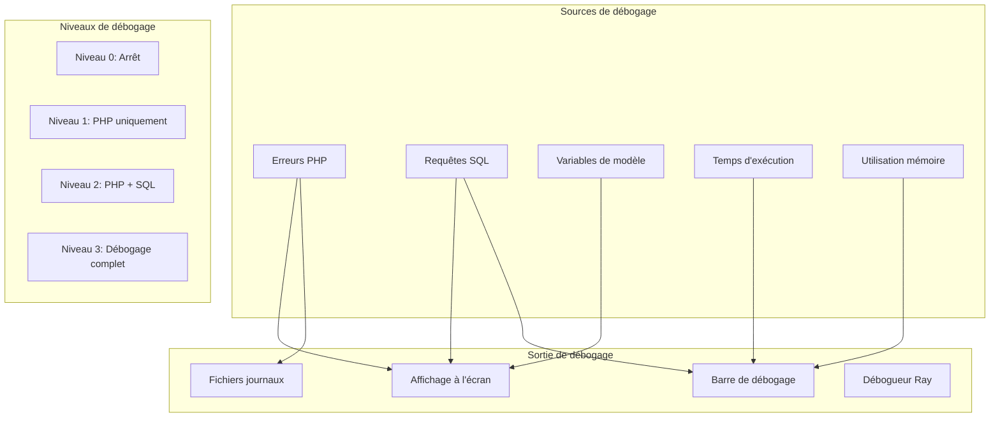
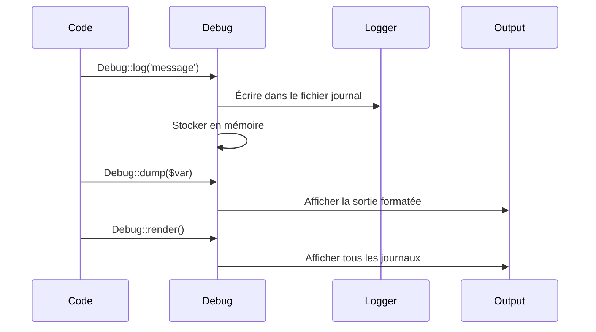

> Guide complet des fonctionnalités et outils de débogage XOOPS.

---

## Architecture de débogage



---

## Niveaux de débogage XOOPS

### Activer dans mainfile.php

```php
<?php
// Paramètres du niveau de débogage
define('XOOPS_DEBUG_LEVEL', 2);

// Niveau 0: Débogage désactivé (production)
// Niveau 1: Débogage PHP uniquement
// Niveau 2: Requêtes PHP + SQL
// Niveau 3: PHP + SQL + modèles Smarty
```

### Détails des niveaux

| Niveau | Erreurs PHP | Requêtes SQL | Variables modèle | Recommandé pour |
|--------|------------|-------------|-----------------|-----------------|
| 0 | Masquées | Non | Non | Production |
| 1 | Affichées | Non | Non | Vérifications rapides |
| 2 | Affichées | Enregistrées | Non | Développement |
| 3 | Affichées | Enregistrées | Affichées | Débogage approfondi |

---

## Affichage des erreurs PHP

### Paramètres de développement

```php
// Ajouter à mainfile.php pour le développement
error_reporting(E_ALL);
ini_set('display_errors', '1');
ini_set('display_startup_errors', '1');
ini_set('log_errors', '1');
ini_set('error_log', XOOPS_VAR_PATH . '/logs/php_errors.log');
```

### Paramètres de production

```php
// Paramètres sécurisés pour la production
error_reporting(E_ALL & ~E_NOTICE & ~E_DEPRECATED);
ini_set('display_errors', '0');
ini_set('log_errors', '1');
ini_set('error_log', XOOPS_VAR_PATH . '/logs/php_errors.log');
```

---

## Débogage des requêtes SQL

### Afficher les requêtes en mode débogage

Avec `XOOPS_DEBUG_LEVEL` défini à 2 ou 3, les requêtes SQL apparaissent au bas des pages.

### Enregistrement manuel des requêtes

```php
// Enregistrer une requête spécifique
$sql = "SELECT * FROM " . $GLOBALS['xoopsDB']->prefix('mymodule_items');

// Avant l'exécution
error_log("Requête SQL: " . $sql);

$result = $GLOBALS['xoopsDB']->query($sql);

// Enregistrer le temps de requête
$start = microtime(true);
$result = $GLOBALS['xoopsDB']->query($sql);
$time = microtime(true) - $start;
error_log("Requête durée: " . number_format($time * 1000, 2) . "ms");
```

### Utiliser XoopsLogger

```php
// Accéder au journalisateur
$logger = $GLOBALS['xoopsLogger'];

// Obtenir toutes les requêtes
$queries = $logger->queries;
foreach ($queries as $query) {
    echo "SQL: " . $query['sql'] . "\n";
    echo "Temps: " . $query['time'] . "s\n";
    echo "---\n";
}

// Enregistrer un message personnalisé
$logger->addExtra('Mon débogage', 'Message de débogage personnalisé');
```

---

## Débogage des modèles Smarty

### Activer la console de débogage Smarty

```php
// Dans votre module ou modèle
{debug}

// Ou en PHP
$GLOBALS['xoopsTpl']->debugging = true;
$GLOBALS['xoopsTpl']->debugging_ctrl = 'URL';  // Ajouter SMARTY_DEBUG à l'URL
```

### Afficher les variables assignées

```smarty
{* Dans le modèle, afficher toutes les variables assignées *}
<pre>
{$smarty.template_object->tpl_vars|print_r}
</pre>

{* Afficher une variable spécifique *}
{$myvar|@debug_print_var}
```

### Déboguer en PHP

```php
// Avant d'afficher le modèle
echo "<pre>";
print_r($GLOBALS['xoopsTpl']->getTemplateVars());
echo "</pre>";
```

---

## Intégration du débogueur Ray

### Installation

```bash
composer require spatie/ray --dev
```

### Configuration

```php
// ray.php à la racine XOOPS
return [
    'enable' => true,
    'host' => 'localhost',
    'port' => 23517,
    'remote_path' => null,
    'local_path' => null,
];
```

### Exemples d'utilisation

```php
// Sortie basique
ray('Bonjour depuis XOOPS');

// Inspection de variables
ray($item)->label('Objet article');

// Vue étendue
ray($complexArray)->expand();

// Mesurer le temps d'exécution
ray()->measure();
// ... code à mesurer ...
ray()->measure();

// Requêtes SQL
ray()->showQueries();

// Code couleur
ray('Erreur occurred')->red();
ray('Succès!')->green();
ray('Avertissement')->orange();

// Trace de pile
ray()->trace();

// Pause l'exécution (comme un point d'arrêt)
ray()->pause();
```

### Déboguer les requêtes de base de données

```php
// Enregistrer toutes les requêtes
ray()->showQueries();

// Ou requête spécifique
$sql = "SELECT * FROM items WHERE status = 'active'";
ray($sql)->label('Requête');

$result = $db->query($sql);
ray($result)->label('Résultat');
```

---

## Barre de débogage PHP

### Installation

```bash
composer require maximebf/debugbar
```

### Intégration

```php
<?php
// include/debugbar.php

use DebugBar\StandardDebugBar;

$debugbar = new StandardDebugBar();
$debugbarRenderer = $debugbar->getJavascriptRenderer();

// Ajouter à l'en-tête
echo $debugbarRenderer->renderHead();

// Enregistrer les messages
$debugbar['messages']->addMessage('Bonjour le monde!');

// Enregistrer les exceptions
$debugbar['exceptions']->addException(new Exception('Test'));

// Opérations temporelles
$debugbar['time']->startMeasure('operation', 'Mon opération');
// ... code ...
$debugbar['time']->stopMeasure('operation');

// Ajouter au pied de page
echo $debugbarRenderer->render();
```

---

## Assistant de débogage personnalisé

```php
<?php
// class/Debug.php

namespace XoopsModules\MyModule;

class Debug
{
    private static bool $enabled = true;
    private static array $logs = [];
    private static float $startTime;

    public static function init(): void
    {
        self::$startTime = microtime(true);
        self::$enabled = (defined('XOOPS_DEBUG_LEVEL') && XOOPS_DEBUG_LEVEL > 0);
    }

    public static function log(string $message, string $level = 'info'): void
    {
        if (!self::$enabled) return;

        self::$logs[] = [
            'time' => microtime(true) - self::$startTime,
            'level' => $level,
            'message' => $message,
            'memory' => memory_get_usage(true)
        ];

        // Aussi écrire dans le fichier
        $logFile = XOOPS_VAR_PATH . '/logs/debug_' . date('Y-m-d') . '.log';
        $logMessage = sprintf(
            "[%s] [%s] [%.4fs] [%s MB] %s\n",
            date('H:i:s'),
            strtoupper($level),
            microtime(true) - self::$startTime,
            round(memory_get_usage(true) / 1024 / 1024, 2),
            $message
        );
        error_log($logMessage, 3, $logFile);
    }

    public static function dump($var, string $label = ''): void
    {
        if (!self::$enabled) return;

        $output = $label ? "$label: " : '';
        $output .= print_r($var, true);
        self::log($output, 'dump');

        if (php_sapi_name() !== 'cli') {
            echo "<pre style='background:#f5f5f5;padding:10px;margin:10px;border:1px solid #ddd;'>";
            if ($label) echo "<strong>$label:</strong>\n";
            var_dump($var);
            echo "</pre>";
        }
    }

    public static function time(string $label): callable
    {
        $start = microtime(true);
        return function() use ($start, $label) {
            $elapsed = microtime(true) - $start;
            self::log("$label: " . number_format($elapsed * 1000, 2) . "ms", 'timing');
        };
    }

    public static function render(): string
    {
        if (!self::$enabled || empty(self::$logs)) return '';

        $html = '<div style="background:#333;color:#fff;padding:20px;margin:20px;font-family:monospace;font-size:12px;">';
        $html .= '<h3 style="margin-top:0;">Journal de débogage</h3>';
        $html .= '<table style="width:100%;border-collapse:collapse;">';

        foreach (self::$logs as $log) {
            $color = match($log['level']) {
                'error' => '#ff6b6b',
                'warning' => '#ffd93d',
                'dump' => '#6bcb77',
                'timing' => '#4d96ff',
                default => '#fff'
            };

            $html .= sprintf(
                '<tr style="border-bottom:1px solid #555;">
                    <td style="padding:5px;width:80px;">%.4fs</td>
                    <td style="padding:5px;width:80px;color:%s">%s</td>
                    <td style="padding:5px;">%s</td>
                    <td style="padding:5px;width:100px;">%s MB</td>
                </tr>',
                $log['time'],
                $color,
                strtoupper($log['level']),
                htmlspecialchars($log['message']),
                round($log['memory'] / 1024 / 1024, 2)
            );
        }

        $html .= '</table></div>';
        return $html;
    }
}

// Utilisation
Debug::init();
Debug::log('Page démarrée');
$timer = Debug::time('Requête base de données');
// ... requête ...
$timer();
Debug::dump($result, 'Résultat de la requête');
echo Debug::render();
```

---

## Flux de sortie de débogage



---

## Documentation connexe

- Écran blanc de la mort
- Utilisation du débogueur Ray
- Meilleures pratiques de sécurité

---

#xoops #debugging #troubleshooting #development #logging
