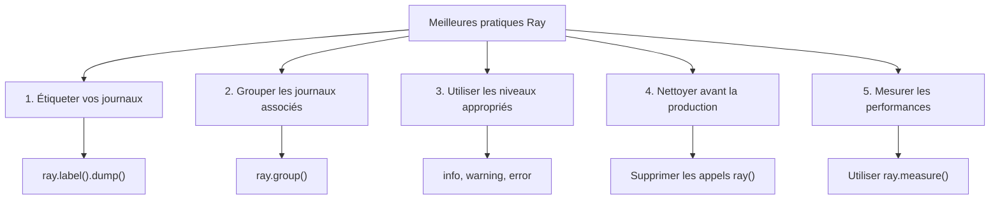

# Utilisation du débogueur Ray pour XOOPS

> Débogage moderne avec Ray: inspecter les variables, enregistrer les messages, suivre les requêtes SQL et profiler les performances dans votre application XOOPS.

---

## Qu'est-ce que Ray?

Ray est un outil de débogage léger qui vous aide à inspecter l'état de l'application sans arrêter l'exécution ni utiliser de points d'arrêt. C'est parfait pour le développement XOOPS.

**Fonctionnalités:**
- Enregistrer les messages et variables
- Inspecter les requêtes SQL
- Suivre les performances
- Profiler le code
- Grouper les journaux associés
- Timeline visuelle

**Conditions:**
- PHP 7.4+
- Application Ray (version gratuite disponible)
- Composer

---

## Installation

### Étape 1: Installer le package Ray

```bash
cd /path/to/xoops

# Installer Ray via Composer
composer require spatie/ray

# Ou installer globalement
composer global require spatie/ray
```

### Étape 2: Télécharger l'application Ray

Télécharger depuis [ray.so](https://ray.so):
- Mac: Ray.app
- Windows: Ray.exe
- Linux: ray (AppImage)

### Étape 3: Configurer le pare-feu (si nécessaire)

Ray utilise le port 23517 par défaut:

```bash
# UFW
sudo ufw allow 23517/udp

# iptables
sudo iptables -A INPUT -p udp --dport 23517 -j ACCEPT
```

---

## Utilisation de base

### Enregistrement simple

```php
<?php
require_once 'mainfile.php';
require 'vendor/autoload.php';

// Initialiser Ray
$ray = ray();

// Enregistrer un message simple
$ray->info('Page chargée');

// Enregistrer une variable
$user = ['name' => 'John', 'email' => 'john@example.com'];
$ray->dump($user);

// Enregistrer avec un libellé
$ray->label('Données utilisateur')->dump($user);
?>
```

**Sortie dans l'application Ray:**
```
ℹ Page chargée
👁 Données utilisateur: ['name' => 'John', 'email' => 'john@example.com']
```

---

### Différents niveaux de journal

```php
<?php
$ray = ray();

// Info
$ray->info('Message d\'information');

// Succès
$ray->success('Opération terminée');

// Avertissement
$ray->warning('Problème potentiel');

// Erreur
$ray->error('Une erreur s\'est produite');

// Débogage
$ray->debug('Informations de débogage');

// Notice
$ray->notice('Avis');
?>
```

---

### Vider les variables

```php
<?php
$ray = ray();

// Vider simple
$ray->dump($variable);

// Multiples vidanges
$ray->dump($var1, $var2, $var3);

// Avec libellés
$ray->label('Utilisateur')->dump($user);
$ray->label('Article')->dump($post);

// Vider le tableau avec formatage
$config = [
    'debug' => true,
    'cache' => 'redis',
    'db_host' => 'localhost'
];
$ray->label('Configuration')->dump($config);
?>
```

---

## Fonctionnalités avancées

### 1. Suivi des requêtes SQL

```php
<?php
$ray = ray();

// Enregistrer une requête de base de données
$ray->notice('Exécution de la requête');
$result = $GLOBALS['xoopsDB']->query("SELECT * FROM xoops_users LIMIT 10");

// Enregistrer le résultat
while ($row = $result->fetch_assoc()) {
    $ray->dump($row);
}

// Ou enregistrer avec libellé
$query = "SELECT COUNT(*) as total FROM xoops_articles";
$ray->label('Requête de comptage d\'articles')->info($query);
$result = $GLOBALS['xoopsDB']->query($query);
?>
```

### 2. Profilage des performances

```php
<?php
$ray = ray();

// Démarrer un profil
$ray->showQueries();  // Afficher toutes les requêtes

// Votre code
$start = microtime(true);
expensive_operation();
$end = microtime(true);

$ray->label('Temps d\'exécution')->info(($end - $start) . ' secondes');

// Ou mesurer directement
$ray->measure(function() {
    expensive_operation();
});
?>
```

### 3. Débogage conditionnel

```php
<?php
$ray = ray();

// Uniquement en développement
if (defined('XOOPS_DEBUG_LEVEL') && XOOPS_DEBUG_LEVEL > 0) {
    $ray->debug('Mode de débogage activé');
}

// Uniquement pour un utilisateur spécifique
if ($xoopsUser && $xoopsUser->getVar('uid') == 1) {
    $ray->dump($sensitive_data);
}

// Uniquement dans une section spécifique
if ($_GET['debug'] == 'module') {
    $ray->label('Débogage du module')->dump($_GET);
}
?>
```

### 4. Grouper les journaux associés

```php
<?php
$ray = ray();

// Démarrer un groupe
$ray->group('Authentification utilisateur');
    $ray->info('Vérification des identifiants');
    $ray->info('Mot de passe vérifié');
    $ray->success('Utilisateur authentifié');
$ray->groupEnd();

// Ou utiliser une fermeture
$ray->group('Opérations de base de données', function($ray) {
    $ray->info('Connexion à la base de données');
    $ray->info('Exécution des requêtes');
    $ray->success('Opérations terminées');
});
?>
```

---

## Débogage spécifique à XOOPS

### Débogage du module

```php
<?php
// modules/mymodule/index.php
require_once '../../mainfile.php';
require_once XOOPS_ROOT_PATH . '/vendor/autoload.php';

$ray = ray();

// Enregistrer l'initialisation du module
$ray->group('Initialisation du module');
    $ray->info('Module: ' . XOOPS_MODULE_NAME);

    // Vérifier que le module est actif
    if (is_object($xoopsModule)) {
        $ray->success('Module chargé');
        $ray->dump($xoopsModule->getValues());
    }

    // Vérifier les permissions de l'utilisateur
    if (xoops_isUser()) {
        $ray->info('Utilisateur: ' . $xoopsUser->getVar('uname'));
    } else {
        $ray->warning('Utilisateur anonyme');
    }
$ray->groupEnd();

// Obtenir la configuration du module
$config_handler = xoops_getHandler('config');
$module = xoops_getHandler('module')->getByDirname(XOOPS_MODULE_NAME);
$settings = $config_handler->getConfigsByCat(0, $module->mid());

$ray->label('Paramètres du module')->dump($settings);
?>
```

### Débogage du modèle

```php
<?php
// Dans le modèle ou le code PHP
$ray = ray();

// Enregistrer les variables assignées
$tpl = new XoopsTpl();
$ray->label('Variables du modèle')->dump($tpl->get_template_vars());

// Enregistrer les variables spécifiques
$ray->label('Variable utilisateur')->dump($tpl->get_template_vars('user'));

// Enregistrer l'état du moteur Smarty
$ray->label('Configuration de Smarty')->dump([
    'compile_dir' => $tpl->getCompileDir(),
    'cache_dir' => $tpl->getCacheDir(),
    'debugging' => $tpl->debugging
]);
?>
```

### Débogage de la base de données

```php
<?php
$ray = ray();

// Enregistrer les opérations de base de données
$ray->group('Opérations de base de données');

// Comptage des requêtes
$ray->info('Préfixe de base de données: ' . XOOPS_DB_PREFIX);

// Lister les tables
$result = $GLOBALS['xoopsDB']->query("SHOW TABLES");
$tables = [];
while ($row = $result->fetch_row()) {
    $tables[] = $row[0];
}
$ray->label('Tables')->dump($tables);

// Vérifier la connexion
if ($GLOBALS['xoopsDB']) {
    $ray->success('Base de données connectée');
} else {
    $ray->error('Échec de la connexion à la base de données');
}

$ray->groupEnd();
?>
```

---

## Fonctions personnalisées Ray

### Créer des fonctions d'aide

```php
<?php
// Créer fichier: class/rayhelper.php

class RayHelper {
    public static function init() {
        return ray();
    }

    public static function module($module_name) {
        $ray = ray();
        $module = xoops_getHandler('module')->getByDirname($module_name);

        if (!$module) {
            $ray->error("Module '$module_name' non trouvé");
            return;
        }

        $ray->group("Module: $module_name");
        $ray->dump([
            'name' => $module->getVar('name'),
            'version' => $module->getVar('version'),
            'active' => $module->getVar('isactive'),
            'mid' => $module->getVar('mid')
        ]);
        $ray->groupEnd();
    }

    public static function user() {
        global $xoopsUser;
        $ray = ray();

        if (!$xoopsUser) {
            $ray->info('Utilisateur anonyme');
            return;
        }

        $ray->group('Informations utilisateur');
        $ray->dump([
            'uname' => $xoopsUser->getVar('uname'),
            'uid' => $xoopsUser->getVar('uid'),
            'email' => $xoopsUser->getVar('email'),
            'admin' => $xoopsUser->isAdmin()
        ]);
        $ray->groupEnd();
    }

    public static function config($module_name) {
        $ray = ray();

        $module = xoops_getHandler('module')->getByDirname($module_name);
        if (!$module) {
            $ray->error("Module '$module_name' non trouvé");
            return;
        }

        $config_handler = xoops_getHandler('config');
        $settings = $config_handler->getConfigsByCat(0, $module->mid());

        $ray->label("Configuration de $module_name")->dump($settings);
    }
}
?>
```

Utilisation:
```php
<?php
require 'class/rayhelper.php';

RayHelper::user();
RayHelper::module('mymodule');
RayHelper::config('mymodule');
?>
```

---

## Surveillance des performances

### Performance des requêtes

```php
<?php
$ray = ray();

// Mesurer le temps des requêtes
$ray->group('Performance des requêtes');

$queries = [
    "SELECT COUNT(*) FROM xoops_users",
    "SELECT * FROM xoops_articles LIMIT 1000",
    "SELECT a.*, u.uname FROM xoops_articles a JOIN xoops_users u"
];

foreach ($queries as $query) {
    $start = microtime(true);
    $result = $GLOBALS['xoopsDB']->query($query);
    $time = (microtime(true) - $start) * 1000;  // ms

    $ray->label(substr($query, 0, 40) . '...')->info("${time}ms");
}

$ray->groupEnd();
?>
```

### Performance des requêtes

```php
<?php
$ray = ray();

// Mesurer le temps total de la requête
$ray->group('Métriques de requête');

// Utilisation de la mémoire
$memory = memory_get_usage() / 1024 / 1024;
$peak = memory_get_peak_usage() / 1024 / 1024;
$ray->info("Mémoire: {$memory}MB / Pic: {$peak}MB");

// Vérifier le temps d'exécution
if (function_exists('microtime')) {
    $elapsed = isset($_SERVER['REQUEST_TIME_FLOAT'])
        ? microtime(true) - $_SERVER['REQUEST_TIME_FLOAT']
        : 0;
    $ray->info("Temps d'exécution: {$elapsed}s");
}

// Comptage des fichiers inclus
if (function_exists('get_included_files')) {
    $files = count(get_included_files());
    $ray->info("Fichiers inclus: $files");
}

$ray->groupEnd();
?>
```

---

## Flux de débogage

### Débogage de l'installation du module

```php
<?php
// Créer modules/mymodule/debug_install.php
require_once '../../mainfile.php';
require_once XOOPS_ROOT_PATH . '/vendor/autoload.php';

$ray = ray();

$ray->group('Débogage de l\'installation du module');

// Vérifier xoopsversion.php
$version_file = __DIR__ . '/xoopsversion.php';
if (file_exists($version_file)) {
    $modversion = [];
    include $version_file;
    $ray->label('xoopsversion.php')->dump($modversion);
} else {
    $ray->error('xoopsversion.php non trouvé');
}

// Vérifier les fichiers de langue
$lang_files = glob(__DIR__ . '/language/*/');
$ray->label('Fichiers de langue')->info("Trouvé " . count($lang_files) . " langue(s)");

// Vérifier les tables de base de données
$module = xoops_getHandler('module')->getByDirname(basename(__DIR__));
if ($module) {
    $ray->label('ID du module')->info($module->mid());
} else {
    $ray->warning('Module non dans la base de données');
}

$ray->groupEnd();

echo "Informations de débogage envoyées à Ray";
?>
```

### Débogage des erreurs de modèle

```php
<?php
// Vérifier le rendu du modèle
$ray = ray();

$tpl = new XoopsTpl();

$ray->group('Débogage du modèle');

// Enregistrer les variables
$vars = $tpl->get_template_vars();
$ray->label('Variables disponibles')->dump(array_keys($vars));

// Vérifier l'existence du modèle
$template = 'file:templates/page.html';
$ray->info("Modèle: $template");

// Vérifier la compilation
$compile_dir = $tpl->getCompileDir();
$files = glob($compile_dir . '*.php');
$ray->label('Modèles compilés')->info(count($files) . " modèles compilés");

$ray->groupEnd();
?>
```

---

## Meilleures pratiques



### Script de nettoyage

```php
<?php
// Supprimer Ray de la production
// Créer un script pour supprimer les appels Ray

function remove_ray_calls($file) {
    $content = file_get_contents($file);

    // Supprimer les appels ray()
    $content = preg_replace('/\$ray\s*=\s*ray\(\);/', '', $content);
    $content = preg_replace('/\$?ray\->[a-zA-Z_][a-zA-Z0-9_]*\([^)]*\);?/', '', $content);
    $content = preg_replace('/ray\(\)->[a-zA-Z_][a-zA-Z0-9_]*\([^)]*\);?/', '', $content);

    file_put_contents($file, $content);
}

// Trouver tous les fichiers PHP avec ray() et supprimer
$files = glob('modules/**/*.php', GLOB_RECURSIVE);
foreach ($files as $file) {
    if (strpos(file_get_contents($file), 'ray()') !== false) {
        remove_ray_calls($file);
        echo "Nettoyé: $file\n";
    }
}
?>
```

---

## Dépannage de Ray

### Q: Ray ne reçoit pas les messages

**R:**
1. Vérifier que l'application Ray s'exécute
2. Vérifier que le pare-feu autorise le port 23517
3. Vérifier que Ray est installé:
```bash
composer require spatie/ray
```

### Q: Je ne peux pas voir les requêtes SQL

**R:**
```php
<?php
// Enregistrer manuellement les requêtes
$ray = ray();

$query = "SELECT * FROM xoops_users";
$ray->info("Requête: $query");

$result = $GLOBALS['xoopsDB']->query($query);

if (!$result) {
    $ray->error($GLOBALS['xoopsDB']->error);
}
?>
```

### Q: Impact sur les performances de Ray

**R:** Ray a une surcharge minimale. Pour la production, supprimez les appels Ray ou désactivez:
```php
<?php
// Désactiver Ray en production
if (defined('ENVIRONMENT') && ENVIRONMENT == 'production') {
    function ray(...$args) {
        return new class {
            public function __call($name, $args) { return $this; }
        };
    }
}
?>
```

---

## Documentation connexe

- Activer le mode débogage
- Débogage de base de données
- FAQ sur les performances
- Guide de dépannage

---

#xoops #debugging #ray #profiling #monitoring
