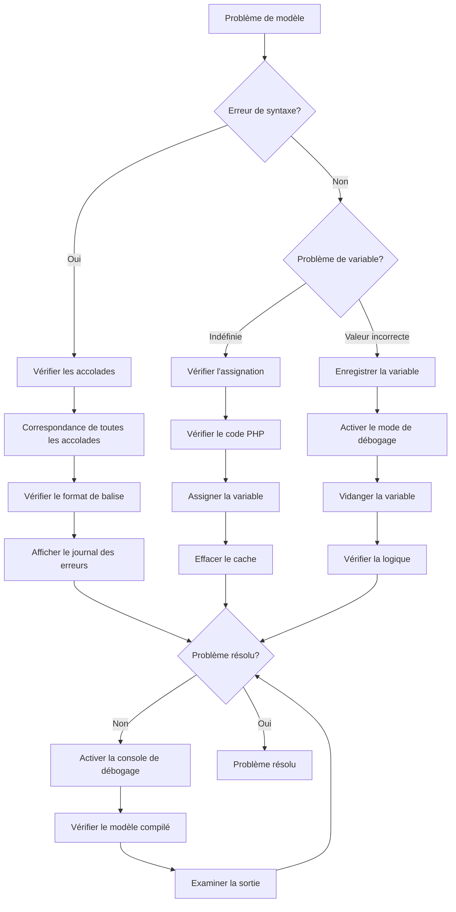
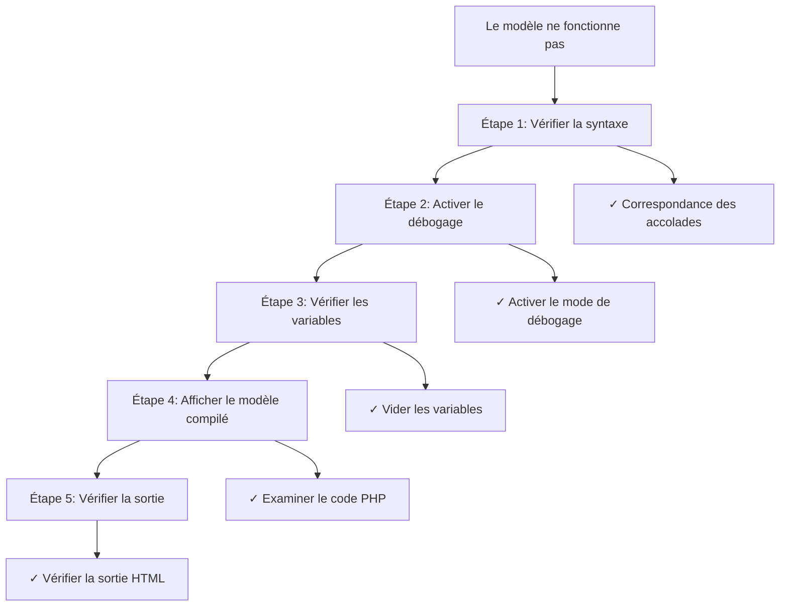

> Techniques avancées pour déboguer les modèles Smarty dans les thèmes et modules XOOPS.

---

## Diagramme de diagnostic



---

## Activer le mode de débogage Smarty

### Méthode 1: Panneau d'administration

XOOPS Admin > Paramètres > Performance:
- Activer "Sortie de débogage"
- Définir "Niveau de débogage" à 2

---

### Méthode 2: Configuration du code

```php
<?php
// Dans mainfile.php ou le code du module
require_once XOOPS_ROOT_PATH . '/class/smarty/Smarty.class.php';

$tpl = new XoopsTpl();

// Activer le mode de débogage
$tpl->debugging = true;

// Optionnel: Définir un modèle de débogage personnalisé
$tpl->debug_tpl = XOOPS_ROOT_PATH . '/class/smarty/debug.tpl';

// Afficher le modèle
$tpl->display('file:template.html');
?>
```

---

### Méthode 3: Fenêtre contextuelle de débogage dans le navigateur

```smarty
{* Ajouter au modèle pour activer le débogage dans le pied de page *}
{debug}
```

Cela affiche une fenêtre contextuelle avec toutes les variables assignées.

---

## Techniques courantes de débogage Smarty

### Vider toutes les variables

```php
<?php
// Dans le code PHP
$tpl = new XoopsTpl();

// Obtenir toutes les variables assignées
$variables = $tpl->get_template_vars();

echo "<pre>";
print_r($variables);
echo "</pre>";
?>
```

Dans le modèle:
```smarty
{* Afficher les informations de débogage *}
<div style="border: 1px red solid; background: #ffffcc; padding: 10px;">
    <h3>Infos de débogage</h3>
    {debug}
</div>
```

---

### Enregistrer une variable spécifique

```php
<?php
$tpl = new XoopsTpl();

// Vérifier si la variable existe
$user = $tpl->get_template_var('user');

if ($user === null) {
    error_log("Variable 'user' non assignée au modèle");
} else {
    error_log("Données utilisateur: " . json_encode($user));
}
?>
```

---

### Vérifier la variable dans le modèle

```smarty
{* Vider la variable pour le débogage *}
<pre>
{$variable|print_r}
</pre>

{* Ou avec un libellé *}
<pre>
Données utilisateur:
{$user|print_r}
</pre>

{* Vérifier si la variable existe *}
{if isset($user)}
    <p>Utilisateur: {$user.name}</p>
{else}
    <p style="color: red;">ERREUR: variable user non définie</p>
{/if}
```

---

## Afficher les modèles compilés

Smarty compile les modèles en PHP pour la performance. Déboguer en affichant le code compilé:

```bash
# Trouver les modèles compilés
ls -la xoops_data/caches/smarty_compile/

# Afficher le modèle compilé
cat xoops_data/caches/smarty_compile/filename.php
```

```php
<?php
// Créer un script de débogage pour afficher le dernier modèle compilé
$compile_dir = XOOPS_CACHE_PATH . '/smarty_compile';

// Obtenir le dernier fichier compilé
$files = glob($compile_dir . '/*.php');
usort($files, function($a, $b) {
    return filemtime($b) - filemtime($a);
});

if ($files) {
    echo "<h1>Dernier modèle compilé</h1>";
    echo "<pre>";
    echo htmlspecialchars(file_get_contents($files[0]));
    echo "</pre>";
}
?>
```

---

## Analyser la compilation des modèles

```php
<?php
// Créer modules/yourmodule/debug_smarty.php

require_once '../../mainfile.php';
require_once XOOPS_ROOT_PATH . '/vendor/autoload.php';

$tpl = new XoopsTpl();
$ray = ray();  // Si vous utilisez le débogueur Ray

$ray->group('Configuration de Smarty');

// Obtenir les chemins de Smarty
$ray->label('Répertoire de compilation')->info($tpl->getCompileDir());
$ray->label('Répertoire cache')->info($tpl->getCacheDir());
$ray->label('Répertoires de modèles')->dump($tpl->getTemplateDir());

// Vérifier les modèles compilés
$compile_dir = $tpl->getCompileDir();
$compiled_files = glob($compile_dir . '*.php');
$ray->label('Modèles compilés')->info(count($compiled_files) . " fichiers");

// Afficher les statistiques de compilation
$total_size = 0;
foreach ($compiled_files as $file) {
    $total_size += filesize($file);
}
$ray->label('Taille du cache compilé')->info(round($total_size / 1024 / 1024, 2) . " MB");

// Vérifier le répertoire cache
$cache_dir = $tpl->getCacheDir();
$cache_files = glob($cache_dir . '*.php');
$ray->label('Modèles en cache')->info(count($cache_files) . " fichiers");

$ray->groupEnd();
?>
```

---

## Déboguer des problèmes spécifiques

### Problème 1: La variable s'affiche vide

```php
<?php
$tpl = new XoopsTpl();

// Vérifier ce qui est assigné
$user = $tpl->get_template_var('user');

if ($user === null) {
    error_log("ERREUR: 'user' non assignée");
} elseif (empty($user)) {
    error_log("AVERTISSEMENT: 'user' est vide");
} else {
    error_log("données utilisateur: " . json_encode($user));
}

// Aussi vérifier dans le modèle
?>
```

Débogage du modèle:
```smarty
{if !isset($user)}
    <span style="color: red;">ERREUR: variable user non définie</span>
{elseif empty($user)}
    <span style="color: orange;">AVERTISSEMENT: user est vide</span>
{else}
    <p>Utilisateur: {$user.name}</p>
{/if}
```

---

### Problème 2: Clé de tableau non trouvée

```smarty
{* Utiliser l'accès sécurisé au tableau *}

{* MAUVAIS - cause une notification d'index indéfini *}
{$array.key}

{* CORRECT - vérifier d'abord *}
{if isset($array.key)}
    {$array.key}
{else}
    <span style="color: red;">Clé 'key' non trouvée dans le tableau</span>
{/if}

{* Ou utiliser par défaut *}
{$array.key|default:'clé non trouvée'}
```

Déboguer en PHP:
```php
<?php
$array = $tpl->get_template_var('array');

if (!isset($array['key'])) {
    error_log("Clé manquante dans le tableau: " . json_encode(array_keys($array)));
}
?>
```

---

### Problème 3: Plug-in/modificateur non trouvé

```php
<?php
// Créer un plug-in personnalisé: plugins/modifier.debug.php

function smarty_modifier_debug($var) {
    return '<pre style="background: #ffffcc; border: 1px solid red;">' .
           htmlspecialchars(json_encode($var, JSON_PRETTY_PRINT)) .
           '</pre>';
}
?>
```

Enregistrer dans le code:
```php
<?php
$tpl = new XoopsTpl();
$tpl->addPluginDir(XOOPS_ROOT_PATH . '/modules/yourmodule/plugins');
$tpl->register_modifier('debug', 'smarty_modifier_debug');
?>
```

Utiliser dans le modèle:
```smarty
{$data|debug}
```

---

### Problème 4: Affichage de tableau imbriqué

```smarty
{* Déboguer les tableaux imbriqués *}
<div style="background: #f5f5f5; padding: 10px; border: 1px solid #ccc;">
    <h3>Débogage des données</h3>
    <pre>{$data|@json_encode}</pre>
</div>

{* Ou itérer et afficher *}
<h3>Données utilisateur:</h3>
{foreach $user as $key => $value}
    <p><strong>{$key}:</strong> {$value|escape}</p>
{/foreach}

{* Vérifier des clés spécifiques *}
<h3>Vérification:</h3>
<ul>
    <li>A 'name': {if isset($user.name)}✓{else}✗{/if}</li>
    <li>A 'email': {if isset($user.email)}✓{else}✗{/if}</li>
    <li>A 'id': {if isset($user.id)}✓{else}✗{/if}</li>
</ul>
```

---

## Créer un modèle de débogage

```smarty
{* Créer themes/mytheme/debug.html *}
{strip}

<div style="background: #fff3cd; border: 2px solid #ff0000; padding: 20px; margin: 20px 0;">
    <h2 style="color: #ff0000;">Mode de débogage SMARTY</h2>

    <h3>Variables assignées:</h3>
    <div style="background: white; padding: 10px; border: 1px solid #999; overflow-x: auto; max-height: 400px;">
        {* Afficher toutes les variables *}
        {debug output='html'}
    </div>

    <h3>Informations du modèle:</h3>
    <table style="width: 100%; border-collapse: collapse;">
        <tr>
            <td style="border: 1px solid #999; padding: 5px;"><strong>Modèle actuel:</strong></td>
            <td style="border: 1px solid #999; padding: 5px;">{$smarty.template}</td>
        </tr>
        <tr>
            <td style="border: 1px solid #999; padding: 5px;"><strong>Version Smarty:</strong></td>
            <td style="border: 1px solid #999; padding: 5px;">{$smarty.version}</td>
        </tr>
        <tr>
            <td style="border: 1px solid #999; padding: 5px;"><strong>Heure actuelle:</strong></td>
            <td style="border: 1px solid #999; padding: 5px;">{$smarty.now|date_format:"%Y-%m-%d %H:%M:%S"}</td>
        </tr>
    </table>

    <p style="color: #ff0000;"><strong>⚠️ Supprimez ce code de débogage avant d'aller en production!</strong></p>
</div>

{/strip}
```

---

## Débogage des performances

### Mesurer le rendu des modèles

```php
<?php
$start = microtime(true);

$tpl->display('file:template.html');

$render_time = (microtime(true) - $start) * 1000;

error_log("Modèle affiché en: {$render_time}ms");

if ($render_time > 100) {
    error_log("AVERTISSEMENT: Rendu lent du modèle");
}
?>
```

### Vérifier l'efficacité du cache

```php
<?php
$compile_dir = XOOPS_CACHE_PATH . '/smarty_compile';
$cache_dir = XOOPS_CACHE_PATH . '/smarty_cache';

// Compter les fichiers
$compiled = count(glob($compile_dir . '*.php'));
$cached = count(glob($cache_dir . '*.php'));

// Taille
$compile_size = 0;
foreach (glob($compile_dir . '*') as $file) {
    $compile_size += filesize($file);
}

$cache_size = 0;
foreach (glob($cache_dir . '*') as $file) {
    $cache_size += filesize($file);
}

echo "Compilé: $compiled fichiers (" . round($compile_size/1024/1024, 2) . "MB)";
echo "En cache: $cached fichiers (" . round($cache_size/1024/1024, 2) . "MB)";

// Âge des fichiers
$oldest_compile = min(array_map('filemtime', glob($compile_dir . '*')));
$oldest_cache = min(array_map('filemtime', glob($cache_dir . '*')));

echo "Compilé le plus ancien: " . date('Y-m-d H:i:s', $oldest_compile);
echo "Mis en cache le plus ancien: " . date('Y-m-d H:i:s', $oldest_cache);
?>
```

---

## Vider et reconstruire le cache

```php
<?php
// Forcer la reconstruction de tous les modèles

$tpl = new XoopsTpl();

// Vider le cache
$tpl->clearCache();
$tpl->clearCompiledTemplate();

// Forcer la recompilation
$tpl->force_compile = true;

// Afficher tous les modèles de modules
$modules = ['mymodule', 'publisher', 'downloads'];

foreach ($modules as $module) {
    $template = "file:" . XOOPS_ROOT_PATH . "/modules/$module/templates/index.html";

    try {
        $tpl->display($template);
        error_log("Compilé: $module");
    } catch (Exception $e) {
        error_log("Erreur de compilation $module: " . $e->getMessage());
    }
}

// Désactiver la compilation forcée après
$tpl->force_compile = false;
?>
```

---

## Flux de débogage

### Processus de débogage étape par étape



---

## Fonctions d'aide au débogage

```php
<?php
// Créer class/TemplateDebugger.php

class TemplateDebugger {
    private static $tpl = null;
    private static $debug_info = [];

    public static function init(&$smarty) {
        self::$tpl = $smarty;
    }

    public static function dumpVar($name) {
        $var = self::$tpl->get_template_var($name);

        if ($var === null) {
            self::$debug_info[] = "Variable '$name' non trouvée";
            return;
        }

        self::$debug_info[] = "$name: " . json_encode($var);
    }

    public static function checkVar($name, $keys = []) {
        $var = self::$tpl->get_template_var($name);

        if ($var === null) {
            return "ERREUR: Variable '$name' non assignée";
        }

        if (!is_array($var)) {
            return "$name n'est pas un tableau";
        }

        $missing = [];
        foreach ($keys as $key) {
            if (!isset($var[$key])) {
                $missing[] = $key;
            }
        }

        if ($missing) {
            return "Clés manquantes dans '$name': " . implode(', ', $missing);
        }

        return "OK: Variable '$name' a toutes les clés requises";
    }

    public static function getReport() {
        return implode("\n", self::$debug_info);
    }

    public static function logAll() {
        $vars = self::$tpl->get_template_vars();
        error_log("Variables de modèle: " . json_encode($vars));
    }
}
?>
```

Utilisation:
```php
<?php
TemplateDebugger::init($tpl);
TemplateDebugger::dumpVar('user');
TemplateDebugger::checkVar('articles', ['id', 'title', 'author']);
error_log(TemplateDebugger::getReport());
?>
```

---

## Documentation connexe

- Activer le mode débogage
- Erreurs de modèles
- Utilisation du débogueur Ray
- Modèles Smarty

---

#xoops #templates #smarty #debugging #troubleshooting
