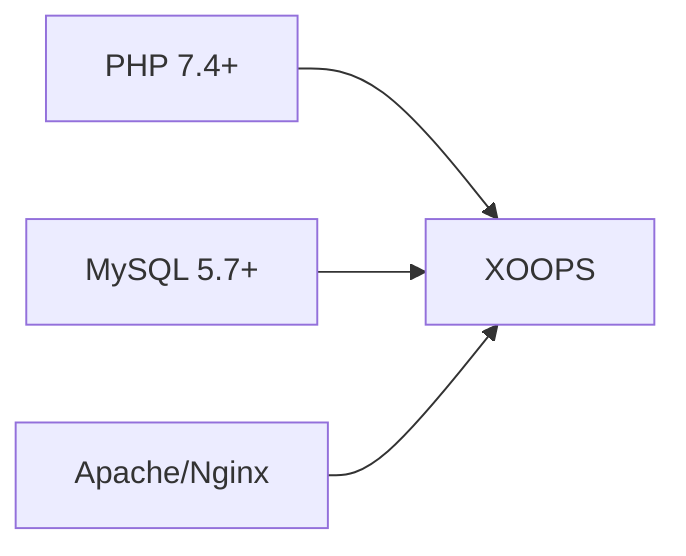
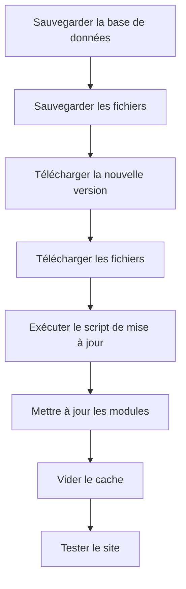

> Questions et réponses courantes sur l'installation de XOOPS.

---

## Avant l'installation

### Q: Quels sont les besoins serveur minimaux?

**R:** XOOPS 2.5.x nécessite:
- PHP 7.4 ou supérieur (PHP 8.x recommandé)
- MySQL 5.7+ ou MariaDB 10.3+
- Apache avec mod_rewrite ou Nginx
- Minimum 64 MB limite de mémoire PHP (128 MB+ recommandé)



### Q: Puis-je installer XOOPS sur un hébergement mutualisé?

**R:** Oui, XOOPS fonctionne bien sur la plupart des hébergements mutualisés qui respectent la configuration requise. Vérifier que votre hébergement fournit:
- PHP avec extensions requises (mysqli, gd, curl, json, mbstring)
- Accès à la base de données MySQL
- Capacité de téléchargement de fichiers
- Support .htaccess (pour Apache)

### Q: Quelles extensions PHP sont requises?

**R:** Extensions requises:
- `mysqli` - Connectivité de base de données
- `gd` - Traitement d'images
- `json` - Gestion JSON
- `mbstring` - Support des chaînes multioctets

Recommandées:
- `curl` - Appels API externes
- `zip` - Installation de modules
- `intl` - Internationalisation

---

## Processus d'installation

### Q: L'assistant d'installation affiche une page vide

**R:** C'est généralement une erreur PHP. Essayez:

1. Activer temporairement l'affichage des erreurs:
```php
// Ajouter à htdocs/install/index.php au sommet
error_reporting(E_ALL);
ini_set('display_errors', 1);
```

2. Vérifier le journal des erreurs PHP
3. Vérifier la compatibilité de la version PHP
4. Vérifier que toutes les extensions requises sont chargées

### Q: Je reçois "Impossible d'écrire dans mainfile.php"

**R:** Définir les permissions d'écriture avant l'installation:

```bash
chmod 666 mainfile.php
# Après l'installation, le sécuriser:
chmod 444 mainfile.php
```

### Q: Les tables de base de données ne sont pas créées

**R:** Vérifier:

1. L'utilisateur MySQL a les privilèges CREATE TABLE:
```sql
GRANT ALL PRIVILEGES ON xoopsdb.* TO 'xoopsuser'@'localhost';
FLUSH PRIVILEGES;
```

2. La base de données existe:
```sql
CREATE DATABASE xoopsdb CHARACTER SET utf8mb4 COLLATE utf8mb4_unicode_ci;
```

3. Les identifiants de l'assistant correspondent aux paramètres de base de données

### Q: L'installation est terminée mais le site affiche des erreurs

**R:** Corrections post-installation courantes:

1. Supprimer ou renommer le répertoire d'installation:
```bash
mv htdocs/install htdocs/install.bak
```

2. Définir les permissions correctes:
```bash
chmod -R 755 htdocs/
chmod -R 777 xoops_data/
chmod 444 mainfile.php
```

3. Vider le cache:
```bash
rm -rf xoops_data/caches/smarty_cache/*
rm -rf xoops_data/caches/smarty_compile/*
```

---

## Configuration

### Q: Où est le fichier de configuration?

**R:** La configuration principale se trouve dans `mainfile.php` à la racine XOOPS. Paramètres clés:

```php
define('XOOPS_ROOT_PATH', '/path/to/htdocs');
define('XOOPS_VAR_PATH', '/path/to/xoops_data');
define('XOOPS_URL', 'https://yoursite.com');
define('XOOPS_DB_HOST', 'localhost');
define('XOOPS_DB_USER', 'username');
define('XOOPS_DB_PASS', 'password');
define('XOOPS_DB_NAME', 'database');
define('XOOPS_DB_PREFIX', 'xoops');
```

### Q: Comment changer l'URL du site?

**R:** Éditer `mainfile.php`:

```php
define('XOOPS_URL', 'https://newdomain.com');
```

Puis vider le cache et mettre à jour les URL codées en dur dans la base de données.

### Q: Comment déplacer XOOPS dans un répertoire différent?

**R:**

1. Déplacer les fichiers vers un nouvel emplacement
2. Mettre à jour les chemins dans `mainfile.php`:
```php
define('XOOPS_ROOT_PATH', '/new/path/to/htdocs');
define('XOOPS_VAR_PATH', '/new/path/to/xoops_data');
```
3. Mettre à jour la base de données si nécessaire
4. Vider tous les caches

---

## Mises à jour

### Q: Comment mettre à jour XOOPS?

**R:**



1. **Sauvegarder tout** (base de données + fichiers)
2. Télécharger la nouvelle version de XOOPS
3. Télécharger les fichiers (ne pas écraser `mainfile.php`)
4. Exécuter `htdocs/upgrade/` si fourni
5. Mettre à jour les modules via le panneau d'administration
6. Vider tous les caches
7. Tester complètement

### Q: Puis-je sauter des versions lors de la mise à jour?

**R:** Généralement non. Mettre à jour séquentiellement par versions majeures pour assurer que les migrations de base de données s'exécutent correctement. Vérifier les notes de version pour des conseils spécifiques.

### Q: Mes modules ont cessé de fonctionner après la mise à jour

**R:**

1. Vérifier la compatibilité du module avec la nouvelle version de XOOPS
2. Mettre à jour les modules aux dernières versions
3. Régénérer les modèles: Admin → Système → Maintenance → Modèles
4. Vider tous les caches
5. Vérifier les journaux des erreurs PHP pour les erreurs spécifiques

---

## Dépannage

### Q: J'ai oublié le mot de passe administrateur

**R:** Réinitialiser via la base de données:

```sql
-- Générer un nouveau hash de mot de passe
UPDATE xoops_users
SET pass = MD5('newpassword')
WHERE uname = 'admin';
```

Ou utiliser la fonction de réinitialisation de mot de passe si l'e-mail est configuré.

### Q: Le site est très lent après l'installation

**R:**

1. Activer la mise en cache dans Admin → Système → Préférences
2. Optimiser la base de données:
```sql
OPTIMIZE TABLE xoops_session;
OPTIMIZE TABLE xoops_online;
```
3. Vérifier les requêtes lentes en mode débogage
4. Activer PHP OpCache

### Q: Les images/CSS ne se chargent pas

**R:**

1. Vérifier les permissions des fichiers (644 pour les fichiers, 755 pour les répertoires)
2. Vérifier que `XOOPS_URL` est correct dans `mainfile.php`
3. Vérifier .htaccess pour les conflits de réécriture
4. Inspecter la console du navigateur pour les erreurs 404

---

## Documentation connexe

- Guide d'installation
- Configuration de base
- Écran blanc de la mort

---

#xoops #faq #installation #troubleshooting
