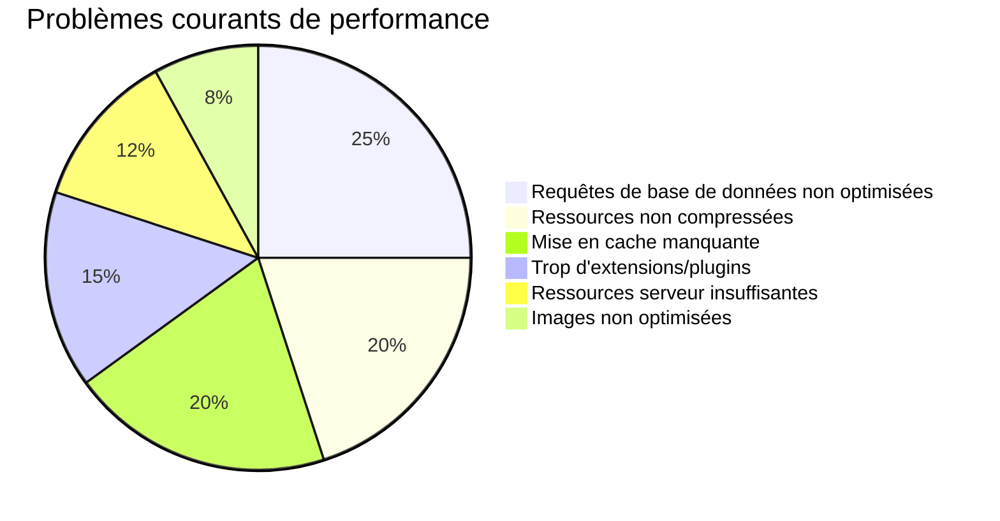
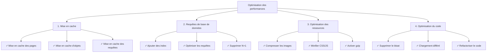
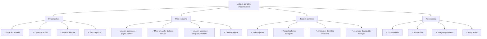

# Questions fréquemment posées sur les performances

> Questions et réponses courantes sur l'optimisation des performances de XOOPS et le diagnostic des sites lents.

---

## Performances générales

### Q: Comment savoir si mon site XOOPS est lent?

**R:** Utiliser ces outils et métriques:

1. **Temps de chargement des pages**:
```bash
# Utiliser curl pour mesurer le temps de réponse
curl -w "@curl-format.txt" -o /dev/null -s https://yoursite.com

# Ou utiliser des outils en ligne
# - PageSpeed Insights (Google)
# - GTmetrix
# - WebPageTest
```

2. **Métriques cibles**:
- First Contentful Paint (FCP): < 1,8s
- Largest Contentful Paint (LCP): < 2,5s
- Time to First Byte (TTFB): < 0,6s
- Taille total de la page: < 2-3 MB

3. **Vérifier les journaux du serveur**:
```bash
# Apache
tail -100 /var/log/apache2/access.log

# Nginx
tail -100 /var/log/nginx/access.log

# Chercher les requêtes lentes (> 1 seconde)
```

---

### Q: Quels sont les problèmes de performance les plus courants?

**R:**


---

### Q: Où dois-je concentrer mes efforts d'optimisation?

**R:** Suivre la priorité d'optimisation:



---

## Mise en cache

### Q: Comment activer la mise en cache dans XOOPS?

**R:** XOOPS dispose d'une mise en cache intégrée. Configurer dans Admin > Paramètres > Performances:

```php
<?php
// Vérifier les paramètres de cache dans mainfile.php ou admin
// Types de cache courants:
// 1. file - Cache basé sur fichier (par défaut)
// 2. memcache - Memcached (si installé)
// 3. redis - Redis (si installé)

// Dans le code, utiliser le cache:
$cache = xoops_cache_handler::getInstance();

// Lire du cache
$data = $cache->read('cache_key');

if ($data === false) {
    // Pas en cache, obtenir de la source
    $data = expensive_operation();

    // Écrire en cache (3600 = 1 heure)
    $cache->write('cache_key', $data, 3600);
}
?>
```

---

### Q: Quel type de mise en cache dois-je utiliser?

**R:**
- **File Cache**: Par défaut, simple, pas de configuration supplémentaire. Bien pour les petits sites.
- **Memcache**: Plus rapide, basé en mémoire. Mieux pour les sites à fort trafic.
- **Redis**: Plus puissant, supporte plus de types de données. Meilleur pour la mise à l'échelle.

Installation et activation:
```bash
# Installer Memcached
sudo apt-get install memcached php-memcached

# Ou installer Redis
sudo apt-get install redis-server php-redis

# Redémarrer PHP-FPM ou Apache
sudo systemctl restart php-fpm
sudo systemctl restart apache2
```

Puis activer dans l'administration XOOPS.

---

### Q: Comment vider le cache XOOPS?

**R:**
```bash
# Vider tout le cache
rm -rf xoops_data/caches/*

# Vider spécifiquement le cache Smarty
rm -rf xoops_data/caches/smarty_cache/*
rm -rf xoops_data/caches/smarty_compile/*

# Ou dans le panneau d'administration
Aller à Admin > Système > Maintenance > Vider le cache
```

En code:
```php
<?php
$cache = xoops_cache_handler::getInstance();
$cache->deleteAll();

// Ou vider des clés spécifiques
$cache->delete('cache_key');
?>
```

---

## Optimisation de la base de données

### Q: Comment trouver les requêtes de base de données lentes?

**R:** Activer l'enregistrement des requêtes:

```php
<?php
// Dans mainfile.php
define('XOOPS_DB_DEBUGMODE', true);
define('XOOPS_SQL_DEBUG', true);

// Puis vérifier la table xoops_log
SELECT * FROM xoops_log WHERE logid > SOME_NUMBER
ORDER BY created DESC LIMIT 20;
?>
```

Ou utiliser le journal des requêtes lentes MySQL:
```bash
# Activer dans /etc/mysql/my.cnf
[mysqld]
slow_query_log = 1
slow_query_log_file = /var/log/mysql/slow.log
long_query_time = 1  # Enregistrer les requêtes > 1 seconde

# Afficher les requêtes lentes
tail -100 /var/log/mysql/slow.log
```

---

### Q: Comment optimiser les requêtes de base de données?

**R:** Suivre ces étapes:

**1. Ajouter des index de base de données**
```sql
-- Ajouter un index aux colonnes recherchées fréquemment
ALTER TABLE `xoops_articles` ADD INDEX `author_id` (`author_id`);
ALTER TABLE `xoops_articles` ADD INDEX `created` (`created`);

-- Vérifier si l'index aide
ANALYZE TABLE `xoops_articles`;
EXPLAIN SELECT * FROM xoops_articles WHERE author_id = 5;
```

**2. Utiliser LIMIT et pagination**
```php
<?php
// MAUVAIS - Obtient tous les enregistrements
$result = $db->query("SELECT * FROM xoops_articles");

// CORRECT - Obtient 10 enregistrements à partir du décalage
$limit = 10;
$offset = 0;  // Changer avec pagination
$result = $db->query(
    "SELECT * FROM xoops_articles LIMIT $limit OFFSET $offset"
);
?>
```

**3. Sélectionner uniquement les colonnes nécessaires**
```php
<?php
// MAUVAIS
$result = $db->query("SELECT * FROM xoops_articles");

// CORRECT
$result = $db->query(
    "SELECT id, title, author_id, created FROM xoops_articles"
);
?>
```

**4. Éviter le problème N+1**
```php
<?php
// MAUVAIS - Problème N+1
$articles = $db->query("SELECT * FROM xoops_articles");
while ($article = $articles->fetch_assoc()) {
    // Cette requête s'exécute une fois par article!
    $author = $db->query(
        "SELECT * FROM xoops_users WHERE uid = " . $article['author_id']
    );
}

// CORRECT - Utiliser JOIN
$result = $db->query("
    SELECT a.*, u.uname, u.email
    FROM xoops_articles a
    JOIN xoops_users u ON a.author_id = u.uid
");

while ($row = $result->fetch_assoc()) {
    echo $row['title'] . " par " . $row['uname'];
}
?>
```

**5. Utiliser EXPLAIN pour analyser les requêtes**
```sql
EXPLAIN SELECT * FROM xoops_articles WHERE author_id = 5 AND status = 1;

-- Chercher:
-- - type: ALL (mauvais), INDEX (correct), const/ref (bon)
-- - possible_keys: Doit afficher les index disponibles
-- - key: Doit utiliser le meilleur index
-- - rows: Doit être un petit nombre
```

---

## Optimisation des serveurs

### Q: Comment vérifier les performances du serveur?

**R:**

```bash
# CPU et mémoire
top -b -n 1 | head -20
free -h
df -h

# Vérifier les processus PHP-FPM
ps aux | grep php-fpm

# Vérifier les connexions Apache/Nginx
netstat -an | grep ESTABLISHED | wc -l

# Surveiller en temps réel
watch 'free -h && echo "---" && df -h'
```

---

### Q: Comment optimiser PHP pour XOOPS?

**R:** Éditer `/etc/php/8.x/fpm/php.ini`:

```ini
; Augmenter les limites pour XOOPS
max_execution_time = 300         ; 30 secondes par défaut
memory_limit = 512M              ; 128 MB par défaut
upload_max_filesize = 100M       ; 2 MB par défaut
post_max_size = 100M             ; 8 MB par défaut

; Activer opcache pour la performance
opcache.enable = 1
opcache.memory_consumption = 256
opcache.max_accelerated_files = 20000
opcache.validate_timestamps = 0   ; Production: 0 (rechargement au redémarrage)
opcache.revalidate_freq = 0       ; Production: 0 ou un nombre élevé

; Base de données
default_socket_timeout = 60
mysqli.default_socket = /run/mysqld/mysqld.sock
```

Puis redémarrer PHP:
```bash
sudo systemctl restart php8.2-fpm
# ou
sudo systemctl restart apache2
```

---

## Lista de contrôle d'optimisation des performances



---

## Documentation connexe

- Débogage de base de données
- Activer le mode débogage
- FAQ modules
- Optimisation des performances

---

#xoops #performance #optimization #faq #troubleshooting #caching
