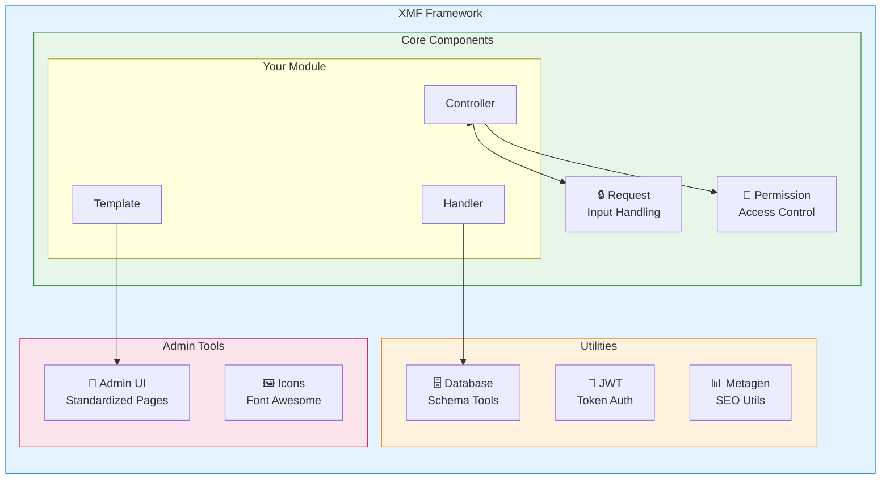
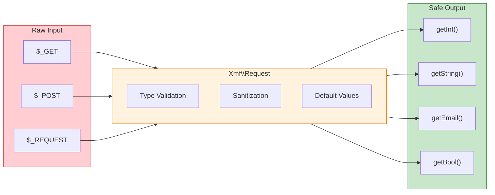

<span class="version-badge version-25x">2.5.x ✅</span> <span class="version-badge version-40x">4.0.x ✅</span>

:::tip[Le pont vers un XOOPS moderne]
XMF fonctionne **à la fois sur XOOPS 2.5.x et XOOPS 4.0.x**. C'est la méthode recommandée pour moderniser vos modules aujourd'hui tout en vous préparant à XOOPS 4.0. XMF fournit le chargement automatique PSR-4, les espaces de noms et les aides qui facilitent la transition.
:::

Le **XOOPS Module Framework (XMF)** est une bibliothèque puissante conçue pour simplifier et standardiser le développement des modules XOOPS. XMF fournit les pratiques PHP modernes, notamment les espaces de noms, le chargement automatique et un ensemble complet de classes d'aide qui réduisent le code passe-partout et améliorent la maintenabilité.

## Qu'est-ce que XMF?

XMF est une collection de classes et d'utilitaires qui offrent:

- **Support PHP moderne** - Support complet des espaces de noms avec chargement automatique PSR-4
- **Gestion des requêtes** - Validation et assainissement sécurisés des entrées
- **Aides de module** - Accès simplifié aux configurations et objets du module
- **Système de permissions** - Gestion facile des permissions
- **Utilitaires de base de données** - Outils de migration de schéma et de gestion de table
- **Support JWT** - Implémentation JSON Web Token pour l'authentification sécurisée
- **Génération de métadonnées** - Utilitaires SEO et d'extraction de contenu
- **Interface d'administration** - Pages d'administration standardisées du module

### Aperçu des composants XMF



## Fonctionnalités principales

### Espaces de noms et chargement automatique

Toutes les classes XMF résident dans l'espace de noms `Xmf`. Les classes sont chargées automatiquement lorsqu'elles sont référencées - aucune inclusion manuelle requise.

```php
use Xmf\Request;
use Xmf\Module\Helper;

// Classes load automatically when used
$input = Request::getString('input', '');
$helper = Helper::getHelper('mymodule');
```

### Gestion sécurisée des requêtes

La [classe Request](../05-XMF-Framework/Basics/XMF-Request.md) fournit un accès de type sûr aux données de requête HTTP avec assainissement intégré:



```php
use Xmf\Request;

$id = Request::getInt('id', 0);
$name = Request::getString('name', '');
$email = Request::getEmail('email', '');
```

### Système d'aide du module

L'[aide du module](../05-XMF-Framework/Basics/XMF-Module-Helper.md) fournit un accès facile à la fonctionnalité du module:

```php
$helper = \Xmf\Module\Helper::getHelper('mymodule');

// Access module configuration
$configValue = $helper->getConfig('setting_name', 'default');

// Get module object
$module = $helper->getModule();

// Access handlers
$handler = $helper->getHandler('items');
```

### Gestion des permissions

L'[aide de permission](../05-XMF-Framework/Recipes/Permission-Helper.md) simplifie la gestion des permissions XOOPS:

```php
$permHelper = new \Xmf\Module\Helper\Permission();

// Check user permission
if ($permHelper->checkPermission('view', $itemId)) {
    // User has permission
}
```

## Structure de la documentation

### Bases

- [Getting-Started-with-XMF](../05-XMF-Framework/Basics/Getting-Started-with-XMF.md) - Installation et utilisation de base
- [XMF-Request](../05-XMF-Framework/Basics/XMF-Request.md) - Gestion des requêtes et validation des entrées
- [XMF-Module-Helper](../05-XMF-Framework/Basics/XMF-Module-Helper.md) - Utilisation de la classe d'aide du module

### Recettes

- [Permission-Helper](../05-XMF-Framework/Recipes/Permission-Helper.md) - Travailler avec les permissions
- [Module-Admin-Pages](../05-XMF-Framework/Recipes/Module-Admin-Pages.md) - Création d'interfaces d'administration standardisées

### Référence

- [JWT](../05-XMF-Framework/Reference/JWT.md) - Implémentation JSON Web Token
- [Database](../05-XMF-Framework/Reference/Database.md) - Utilitaires de base de données et gestion de schéma
- [Metagen](Reference/Metagen.md) - Utilitaires de métadonnées et SEO

## Exigences

- XOOPS 2.5.8 ou version ultérieure
- PHP 7.2 ou version ultérieure (PHP 8.x recommandé)

## Installation

XMF est inclus avec XOOPS 2.5.8 et les versions ultérieures. Pour les versions antérieures ou l'installation manuelle:

1. Téléchargez le package XMF depuis le dépôt XOOPS
2. Extrayez dans votre répertoire `/class/xmf/` XOOPS
3. Le chargeur automatique gère le chargement de classe automatiquement

## Exemple de démarrage rapide

Voici un exemple complet montrant les modèles d'utilisation courants de XMF:

```php
<?php
use Xmf\Request;
use Xmf\Module\Helper;
use Xmf\Module\Helper\Permission;

// Get module helper
$helper = Helper::getHelper('mymodule');

// Get configuration values
$itemsPerPage = $helper->getConfig('items_per_page', 10);

// Handle request input
$op = Request::getCmd('op', 'list');
$id = Request::getInt('id', 0);

// Check permissions
$permHelper = new Permission();
if (!$permHelper->checkPermission('view', $id)) {
    redirect_header('index.php', 3, 'Access denied');
}

// Process based on operation
switch ($op) {
    case 'view':
        $handler = $helper->getHandler('items');
        $item = $handler->get($id);
        // ... display item
        break;
    case 'list':
    default:
        // ... list items
        break;
}
```

## Ressources

- [Dépôt XMF GitHub](https://github.com/XOOPS/XMF)
- [Site Web du projet XOOPS](https://xoops.org)

---

#xmf #xoops #framework #php #développement-module
