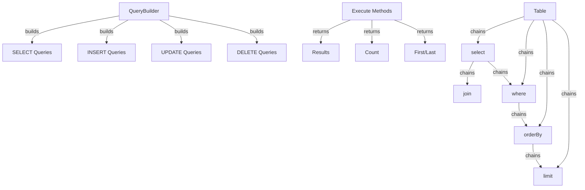

Το XOOPS Εργαλείο δόμησης ερωτημάτων παρέχει μια σύγχρονη, ευχάριστη διεπαφή για τη δημιουργία ερωτημάτων SQL. Βοηθά στην αποτροπή της έγχυσης SQL, βελτιώνει την αναγνωσιμότητα και παρέχει αφαίρεση βάσης δεδομένων για πολλαπλά συστήματα βάσεων δεδομένων.

## Query Builder Architecture



## Τάξη QueryBuilder

Η κύρια κλάση του προγράμματος δημιουργίας ερωτημάτων με άπταιστη διεπαφή.

## # Επισκόπηση τάξης

```php
namespace Xoops\Database;

class QueryBuilder
{
    protected string $table = '';
    protected string $type = 'SELECT';
    protected array $selects = [];
    protected array $joins = [];
    protected array $wheres = [];
    protected array $orders = [];
    protected int $limit = 0;
    protected int $offset = 0;
    protected array $bindings = [];
}
```

## # Στατικές μέθοδοι

### # πίνακας

Δημιουργεί ένα νέο εργαλείο δημιουργίας ερωτημάτων για έναν πίνακα.

```php
public static function table(string $table): QueryBuilder
```

**Παράμετροι:**

| Παράμετρος | Τύπος | Περιγραφή |
|-----------|------|-------------|
| `$table` | χορδή | Όνομα πίνακα (με ή χωρίς πρόθεμα) |

**Επιστροφές:** `QueryBuilder` - Παράδειγμα δημιουργίας ερωτημάτων

**Παράδειγμα:**
```php
$query = QueryBuilder::table('users');
$query = QueryBuilder::table('xoops_users'); // With prefix
```

## SELECT Ερωτήματα

## # επιλέξτε

Καθορίζει στήλες προς επιλογή.

```php
public function select(...$columns): self
```

**Παράμετροι:**

| Παράμετρος | Τύπος | Περιγραφή |
|-----------|------|-------------|
| `...$columns` | συστοιχία | Ονόματα ή εκφράσεις στηλών |

**Επιστροφές:** `self` - Για αλυσιδοποίηση μεθόδων

**Παράδειγμα:**
```php
// Simple select
QueryBuilder::table('users')
    ->select('id', 'username', 'email')
    ->get();

// Select with aliases
QueryBuilder::table('users')
    ->select('id as user_id', 'username as name')
    ->get();

// Select all columns
QueryBuilder::table('users')
    ->select('*')
    ->get();

// Select with expressions
QueryBuilder::table('orders')
    ->select('id', 'COUNT(*) as total_items')
    ->groupBy('id')
    ->get();
```

## # πού

Προσθέτει μια συνθήκη WHERE.

```php
public function where(string $column, string $operator = '=', mixed $value = null): self
```

**Παράμετροι:**

| Παράμετρος | Τύπος | Περιγραφή |
|-----------|------|-------------|
| `$column` | χορδή | Όνομα στήλης |
| `$operator` | χορδή | Σύγκριση χειριστή |
| `$value` | μικτή | Αξία προς σύγκριση |

**Επιστροφές:** `self` - Για αλυσιδοποίηση μεθόδων

** Χειριστές: **

| Χειριστής | Περιγραφή | Παράδειγμα |
|----------|-------------|---------|
| `=` | Ίσο | `->where('status', '=', 'active')` |
| `!=` ή `<>` | Όχι ίσο | `->where('status', '!=', 'deleted')` |
| `>` | Μεγαλύτερο από | `->where('price', '>', 100)` |
| `<` | Λιγότερο από | `->where('price', '<', 100)` |
| `>=` | Μεγαλύτερο ή ίσο | `->where('age', '>=', 18)` |
| `<=` | Λιγότερο ή ίσο | `->where('age', '<=', 65)` |
| `LIKE ` | Ταίριασμα μοτίβου | `->where('name', 'LIKE', '%john%')` |
| `IN ` | Στη λίστα | `->where('status', 'IN', ['active', 'pending'])` |
| `NOT IN ` | Όχι στη λίστα | `->where('id', 'NOT IN', [1, 2, 3])` |
| `BETWEEN ` | Εύρος | `->where('age', 'BETWEEN', [18, 65])` |
| `IS NULL ` | Είναι μηδενικό | `->where('deleted_at', 'IS NULL')` |
| `IS NOT NULL ` | Μη μηδενικό | `->where('deleted_at', 'IS NOT NULL')` |

**Παράδειγμα:**
```php
// Single condition
QueryBuilder::table('users')
    ->select('*')
    ->where('status', '=', 'active')
    ->get();

// Multiple conditions (AND)
QueryBuilder::table('users')
    ->select('*')
    ->where('status', '=', 'active')
    ->where('age', '>=', 18)
    ->get();

// IN operator
QueryBuilder::table('products')
    ->select('*')
    ->where('category_id', 'IN', [1, 2, 3])
    ->get();

// LIKE operator
QueryBuilder::table('users')
    ->select('*')
    ->where('email', 'LIKE', '%@example.com')
    ->get();

// NULL check
QueryBuilder::table('users')
    ->select('*')
    ->where('deleted_at', 'IS NULL')
    ->get();
```

## # ή Πού

Προσθέτει μια συνθήκη OR.

```php
public function orWhere(string $column, string $operator = '=', mixed $value = null): self
```

**Παράδειγμα:**
```php
QueryBuilder::table('users')
    ->select('*')
    ->where('status', '=', 'active')
    ->orWhere('premium', '=', 1)
    ->get();
    // SELECT * FROM users WHERE status = 'active' OR premium = 1
```

## # WhereIn / WhereNotIn

Μέθοδοι ευκολίας για IN/NOT IN.

```php
public function whereIn(string $column, array $values): self
public function whereNotIn(string $column, array $values): self
```

**Παράδειγμα:**
```php
QueryBuilder::table('posts')
    ->select('*')
    ->whereIn('status', ['published', 'scheduled'])
    ->get();

QueryBuilder::table('comments')
    ->select('*')
    ->whereNotIn('spam_score', [8, 9, 10])
    ->get();
```

## # whereNull / whereNotNull

Εύκολες μέθοδοι για ελέγχους NULL.

```php
public function whereNull(string $column): self
public function whereNotNull(string $column): self
```

**Παράδειγμα:**
```php
QueryBuilder::table('users')
    ->select('*')
    ->whereNotNull('verified_at')
    ->get();
```

## # όπου Μεταξύ

Ελέγχει εάν η τιμή είναι μεταξύ δύο τιμών.

```php
public function whereBetween(string $column, array $values): self
```

**Παράδειγμα:**
```php
QueryBuilder::table('products')
    ->select('*')
    ->whereBetween('price', [10, 100])
    ->get();

QueryBuilder::table('orders')
    ->select('*')
    ->whereBetween('created_at', ['2024-01-01', '2024-12-31'])
    ->get();
```

## # εγγραφείτε

Προσθέτει ένα INNER JOIN.

```php
public function join(
    string $table,
    string $first,
    string $operator = '=',
    string $second = null
): self
```

**Παράδειγμα:**
```php
QueryBuilder::table('posts')
    ->select('posts.*', 'users.username', 'categories.name')
    ->join('users', 'posts.user_id', '=', 'users.id')
    ->join('categories', 'posts.category_id', '=', 'categories.id')
    ->where('posts.published', '=', 1)
    ->get();
```

## # αριστεράΣυμμετοχή / δεξιάΕγγραφή

Εναλλακτικοί τύποι ενώσεων.

```php
public function leftJoin(
    string $table,
    string $first,
    string $operator = '=',
    string $second = null
): self

public function rightJoin(
    string $table,
    string $first,
    string $operator = '=',
    string $second = null
): self
```

**Παράδειγμα:**
```php
QueryBuilder::table('users')
    ->select('users.*', 'COUNT(posts.id) as post_count')
    ->leftJoin('posts', 'users.id', '=', 'posts.user_id')
    ->groupBy('users.id')
    ->get();
```

## # groupBy

Ομαδοποιήστε τα αποτελέσματα κατά στήλες.

```php
public function groupBy(...$columns): self
```

**Παράδειγμα:**
```php
QueryBuilder::table('orders')
    ->select('user_id', 'COUNT(*) as order_count', 'SUM(total) as total_spent')
    ->groupBy('user_id')
    ->get();

QueryBuilder::table('sales')
    ->select('department', 'region', 'SUM(amount) as total')
    ->groupBy('department', 'region')
    ->get();
```

## # έχοντας

Προσθέτει μια συνθήκη HAVING.

```php
public function having(string $column, string $operator = '=', mixed $value = null): self
```

**Παράδειγμα:**
```php
QueryBuilder::table('orders')
    ->select('user_id', 'COUNT(*) as order_count')
    ->groupBy('user_id')
    ->having('order_count', '>', 5)
    ->get();
```

## # παραγγελίαΑπό

Αποτελέσματα παραγγελιών.

```php
public function orderBy(string $column, string $direction = 'ASC'): self
```

**Παράμετροι:**

| Παράμετρος | Τύπος | Περιγραφή |
|-----------|------|-------------|
| `$column` | χορδή | Στήλη κατά παραγγελία κατά |
| `$direction ` | χορδή | ` ASC ` ή ` DESC` |

**Παράδειγμα:**
```php
// Single order
QueryBuilder::table('users')
    ->select('*')
    ->orderBy('created_at', 'DESC')
    ->get();

// Multiple orders
QueryBuilder::table('posts')
    ->select('*')
    ->orderBy('category_id', 'ASC')
    ->orderBy('created_at', 'DESC')
    ->get();

// Random order
QueryBuilder::table('quotes')
    ->select('*')
    ->orderBy('RAND()')
    ->get();
```

## # όριο / μετατόπιση

Περιορίζει και αντισταθμίζει τα αποτελέσματα.

```php
public function limit(int $limit): self
public function offset(int $offset): self
```

**Παράδειγμα:**
```php
// Simple limit
QueryBuilder::table('posts')
    ->select('*')
    ->limit(10)
    ->get();

// Pagination
$page = 2;
$perPage = 20;
$offset = ($page - 1) * $perPage;

QueryBuilder::table('posts')
    ->select('*')
    ->limit($perPage)
    ->offset($offset)
    ->get();
```

## Μέθοδοι Εκτέλεσης

## # πάρτε

Εκτελεί το ερώτημα και επιστρέφει όλα τα αποτελέσματα.

```php
public function get(): array
```

**Επιστρέφει:** `array` - Πίνακας σειρών αποτελεσμάτων

**Παράδειγμα:**
```php
$users = QueryBuilder::table('users')
    ->select('id', 'username', 'email')
    ->where('status', '=', 'active')
    ->orderBy('username')
    ->get();

foreach ($users as $user) {
    echo $user['username'] . ' (' . $user['email'] . ')' . "\n";
}
```

## # πρώτα

Παίρνει το πρώτο αποτέλεσμα.

```php
public function first(): ?array
```

**Επιστρέφει:** `?array` - Πρώτη σειρά ή μηδενική

**Παράδειγμα:**
```php
$user = QueryBuilder::table('users')
    ->select('*')
    ->where('id', '=', 123)
    ->first();

if ($user) {
    echo 'Found: ' . $user['username'];
}
```

## # τελευταίο

Παίρνει το τελευταίο αποτέλεσμα.

```php
public function last(): ?array
```

**Παράδειγμα:**
```php
$latestPost = QueryBuilder::table('posts')
    ->select('*')
    ->orderBy('created_at', 'DESC')
    ->last();
```

## # μέτρηση

Λαμβάνει τον αριθμό των αποτελεσμάτων.

```php
public function count(): int
```

**Επιστροφές:** `int` - Αριθμός σειρών

**Παράδειγμα:**
```php
$activeUsers = QueryBuilder::table('users')
    ->where('status', '=', 'active')
    ->count();

echo "Active users: $activeUsers";
```

Το ### υπάρχει

Ελέγχει εάν το ερώτημα επιστρέφει αποτελέσματα.

```php
public function exists(): bool
```

**Επιστρέφει:** `bool` - Σωστό εάν υπάρχουν αποτελέσματα

**Παράδειγμα:**
```php
if (QueryBuilder::table('users')->where('email', '=', 'test@example.com')->exists()) {
    echo 'User already exists';
}
```

## # συγκεντρωτικό

Λαμβάνει συγκεντρωτικές τιμές.

```php
public function aggregate(string $function, string $column): mixed
```

**Παράδειγμα:**
```php
$maxPrice = QueryBuilder::table('products')
    ->aggregate('MAX', 'price');

$avgAge = QueryBuilder::table('users')
    ->aggregate('AVG', 'age');

$totalSales = QueryBuilder::table('orders')
    ->aggregate('SUM', 'total');
```

## INSERT Ερωτήματα

## # ένθετο

Εισάγει μια σειρά.

```php
public function insert(array $values): bool
```

**Παράδειγμα:**
```php
QueryBuilder::table('users')->insert([
    'username' => 'john',
    'email' => 'john@example.com',
    'password' => password_hash('secret', PASSWORD_BCRYPT),
    'created_at' => date('Y-m-d H:i:s')
]);
```

## # εισάγετε Πολλά

Εισάγει πολλές σειρές.

```php
public function insertMany(array $rows): bool
```

**Παράδειγμα:**
```php
QueryBuilder::table('log_entries')->insertMany([
    ['action' => 'login', 'user_id' => 1, 'timestamp' => time()],
    ['action' => 'logout', 'user_id' => 2, 'timestamp' => time()],
    ['action' => 'update', 'user_id' => 3, 'timestamp' => time()]
]);
```

## UPDATE Ερωτήματα

## # ενημέρωση

Ενημερώνει τις σειρές.

```php
public function update(array $values): int
```

**Επιστροφές:** `int` - Αριθμός επηρεαζόμενων σειρών

**Παράδειγμα:**
```php
// Update single user
QueryBuilder::table('users')
    ->where('id', '=', 123)
    ->update([
        'email' => 'newemail@example.com',
        'updated_at' => date('Y-m-d H:i:s')
    ]);

// Update multiple rows
QueryBuilder::table('posts')
    ->where('status', '=', 'draft')
    ->where('created_at', '<', date('Y-m-d', strtotime('-30 days')))
    ->update([
        'status' => 'archived'
    ]);
```

## # προσαύξηση / μείωση

Αυξάνει ή μειώνει μια στήλη.

```php
public function increment(string $column, int $amount = 1): int
public function decrement(string $column, int $amount = 1): int
```

**Παράδειγμα:**
```php
// Increment view count
QueryBuilder::table('posts')
    ->where('id', '=', 123)
    ->increment('views');

// Decrement stock
QueryBuilder::table('products')
    ->where('id', '=', 456)
    ->decrement('stock', 5);
```

## DELETE Ερωτήματα

## # διαγραφή

Διαγράφει σειρές.

```php
public function delete(): int
```

**Επιστρέφει:** `int` - Αριθμός διαγραμμένων σειρών

**Παράδειγμα:**
```php
// Delete single record
QueryBuilder::table('comments')
    ->where('id', '=', 789)
    ->delete();

// Delete multiple records
QueryBuilder::table('log_entries')
    ->where('created_at', '<', date('Y-m-d', strtotime('-30 days')))
    ->delete();
```

## # περικοπή

Διαγράφει όλες τις σειρές από τον πίνακα.

```php
public function truncate(): bool
```

**Παράδειγμα:**
```php
// Clear all sessions
QueryBuilder::table('sessions')->truncate();
```

## Προηγμένες δυνατότητες

## # Ακατέργαστες εκφράσεις

```php
QueryBuilder::table('products')
    ->select('id', 'name', QueryBuilder::raw('price * quantity as total'))
    ->get();
```

## # Υποερωτήματα

```php
$recentPostIds = QueryBuilder::table('posts')
    ->select('id')
    ->where('created_at', '>', date('Y-m-d', strtotime('-7 days')))
    ->toSql();

$comments = QueryBuilder::table('comments')
    ->select('*')
    ->whereIn('post_id', $recentPostIds)
    ->get();
```

## # Λήψη του SQL

```php
public function toSql(): string
```

**Παράδειγμα:**
```php
$sql = QueryBuilder::table('users')
    ->select('id', 'username')
    ->where('status', '=', 'active')
    ->toSql();

echo $sql;
// SELECT id, username FROM xoops_users WHERE status = ?
```

## Πλήρη παραδείγματα

## # Σύνθετη επιλογή με συνδέσεις

```php
<?php
/**
 * Get posts with author and category info
 */

$posts = QueryBuilder::table('posts')
    ->select(
        'posts.id',
        'posts.title',
        'posts.content',
        'posts.created_at',
        'users.username as author',
        'categories.name as category'
    )
    ->join('users', 'posts.user_id', '=', 'users.id')
    ->join('categories', 'posts.category_id', '=', 'categories.id')
    ->where('posts.published', '=', 1)
    ->orderBy('posts.created_at', 'DESC')
    ->limit(10)
    ->get();

foreach ($posts as $post) {
    echo '<article>';
    echo '<h2>' . htmlspecialchars($post['title']) . '</h2>';
    echo '<p class="meta">By ' . htmlspecialchars($post['author']) . ' in ' . htmlspecialchars($post['category']) . '</p>';
    echo '<p>' . htmlspecialchars($post['content']) . '</p>';
    echo '</article>';
}
```

## # Σελιδοποίηση με QueryBuilder

```php
<?php
/**
 * Paginated results
 */

$page = isset($_GET['page']) ? (int)$_GET['page'] : 1;
$perPage = 20;
$offset = ($page - 1) * $perPage;

// Get total count
$total = QueryBuilder::table('articles')
    ->where('status', '=', 'published')
    ->count();

// Get page results
$articles = QueryBuilder::table('articles')
    ->select('*')
    ->where('status', '=', 'published')
    ->orderBy('created_at', 'DESC')
    ->limit($perPage)
    ->offset($offset)
    ->get();

// Calculate pagination
$pages = ceil($total / $perPage);

// Display results
foreach ($articles as $article) {
    echo '<div class="article">' . htmlspecialchars($article['title']) . '</div>';
}

// Display pagination links
if ($pages > 1) {
    echo '<nav class="pagination">';
    for ($i = 1; $i <= $pages; $i++) {
        if ($i == $page) {
            echo '<span class="current">' . $i . '</span>';
        } else {
            echo '<a href="?page=' . $i . '">' . $i . '</a>';
        }
    }
    echo '</nav>';
}
```

## # Ανάλυση δεδομένων με συγκεντρωτικά στοιχεία

```php
<?php
/**
 * Sales analysis
 */

// Total sales by region
$regionSales = QueryBuilder::table('orders')
    ->select('region', QueryBuilder::raw('SUM(total) as total_sales'), QueryBuilder::raw('COUNT(*) as order_count'))
    ->groupBy('region')
    ->orderBy('total_sales', 'DESC')
    ->get();

foreach ($regionSales as $region) {
    echo $region['region'] . ': $' . number_format($region['total_sales'], 2) . ' (' . $region['order_count'] . ' orders)' . "\n";
}

// Average order value
$avgOrderValue = QueryBuilder::table('orders')
    ->aggregate('AVG', 'total');

echo 'Average order value: $' . number_format($avgOrderValue, 2);
```

## Βέλτιστες πρακτικές

1. **Χρήση παραμετροποιημένων ερωτημάτων** - Το QueryBuilder χειρίζεται αυτόματα τη σύνδεση παραμέτρων
2. **Μέθοδοι αλυσίδας** - Αξιοποιήστε τη ρευστική διεπαφή για αναγνώσιμο κώδικα
3. **Δοκιμή SQL Έξοδος** - Χρησιμοποιήστε το `toSql()` για να επαληθεύσετε τα ερωτήματα που δημιουργούνται
4. **Χρήση ευρετηρίων** - Βεβαιωθείτε ότι οι στήλες με τα συχνά ερωτήματα είναι ευρετηριασμένες
5. **Περιορισμός αποτελεσμάτων** - Να χρησιμοποιείτε πάντα `limit()` για μεγάλα σύνολα δεδομένων
6. **Χρησιμοποιήστε Aggregates** - Αφήστε τη βάση δεδομένων να κάνει counting/summing αντί για PHP
7. **Έξοδος διαφυγής** - Να γίνεται πάντα διαφυγή από τα εμφανιζόμενα δεδομένα με το `htmlspecialchars()`
8. **Απόδοση ευρετηρίου** - Παρακολουθήστε αργά ερωτήματα και βελτιστοποιήστε ανάλογα

## Σχετική τεκμηρίωση

- XoopsDatabase - Επίπεδο βάσης δεδομένων και συνδέσεις
- Κριτήρια - Σύστημα ερωτημάτων που βασίζεται σε κριτήρια παλαιού τύπου
- ../Core/XoopsObject - Εμμονή αντικειμένου δεδομένων
- ../Module/Module-System - Λειτουργίες βάσης δεδομένων μονάδας

---

*Δείτε επίσης: [XOOPS Βάση δεδομένων API](https://github.com/XOOPS/XoopsCore27/tree/master/htdocs/class)*
