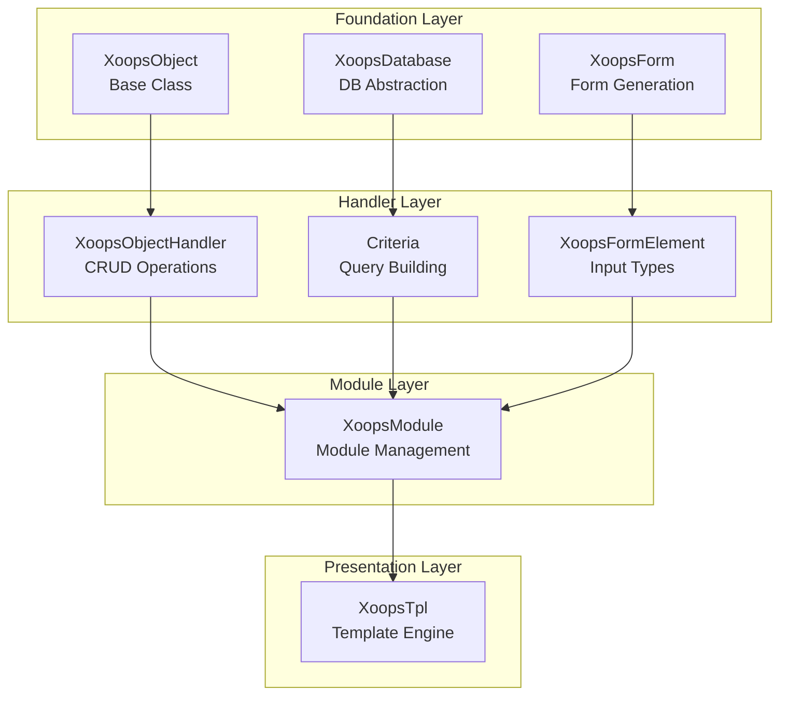
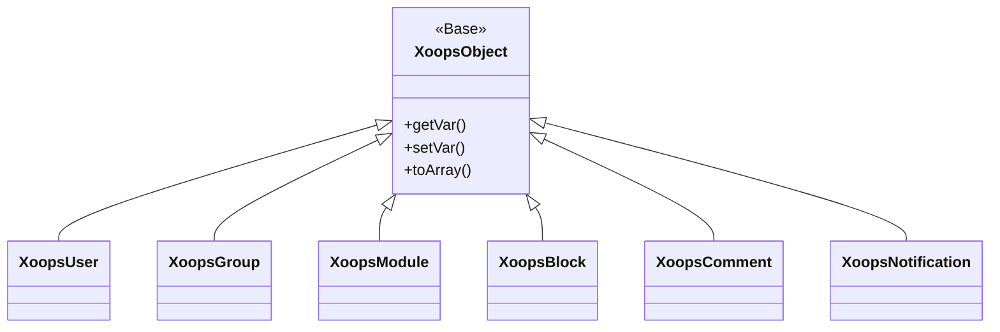
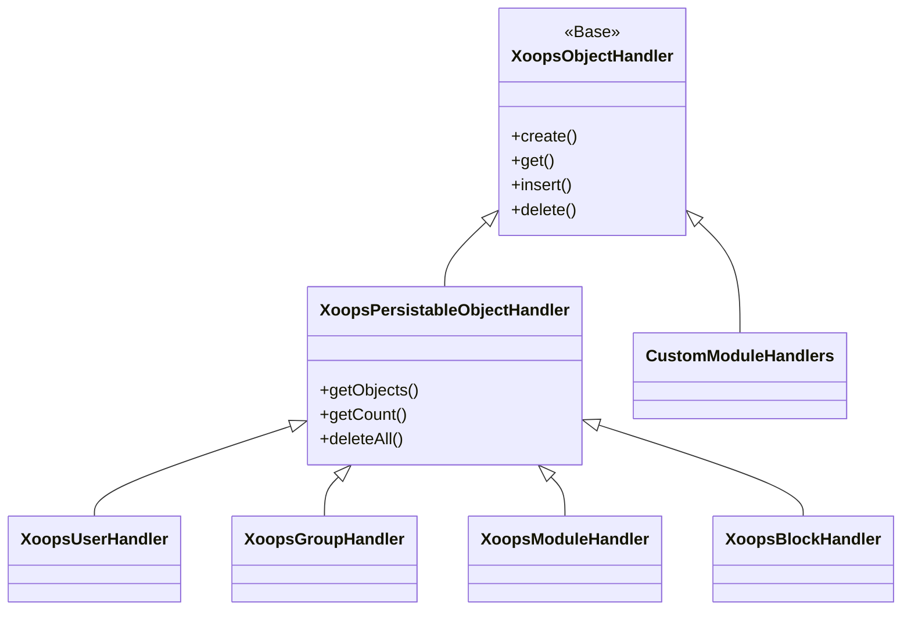
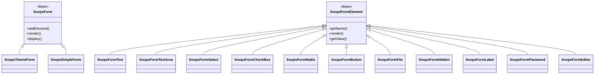

Καλώς ήρθατε στο ολοκληρωμένοXOOPS APIΤεκμηρίωση αναφοράς. Αυτή η ενότητα παρέχει λεπτομερή τεκμηρίωση για όλες τις βασικές κλάσεις, μεθόδους και συστήματα που αποτελούν τοXOOPSΣύστημα Διαχείρισης Περιεχομένου.

## Επισκόπηση

ΤοXOOPS APIοργανώνεται σε πολλά μεγάλα υποσυστήματα, το καθένα υπεύθυνο για μια συγκεκριμένη πτυχή τουCMSλειτουργικότητα. Η κατανόηση αυτών των API είναι απαραίτητη για την ανάπτυξη λειτουργικών μονάδων, θεμάτων και επεκτάσεων γιαXOOPS.

## APIΕνότητες

## # Βασικές τάξεις

Τα θεμέλια τάξεις που όλα τα άλλαXOOPSεξαρτήματα που βασίζονται.

| Τεκμηρίωση | Περιγραφή |
|--------------|-------------|
| XoopsObject | Βασική κλάση για όλα τα αντικείμενα δεδομένωνXOOPS|
| XoopsObjectHandler | Μοτίβο χειριστή γιαCRUDλειτουργίες |

## # Επίπεδο βάσης δεδομένων

Βοηθητικά προγράμματα αφαίρεσης βάσεων δεδομένων και δημιουργίας ερωτημάτων.

| Τεκμηρίωση | Περιγραφή |
|--------------|-------------|
| Βάση δεδομένων XOOPS | Επίπεδο αφαίρεσης βάσης δεδομένων |
| Σύστημα κριτηρίων | Κριτήρια και προϋποθέσεις ερωτήματος |
| QueryBuilder | Σύγχρονο κτήριο με άπταιστα ερωτήματα |

## # Σύστημα φόρμαςHTMLδημιουργία και επικύρωση φόρμας.

| Τεκμηρίωση | Περιγραφή |
|--------------|-------------|
| XoopsForm | Δοχείο φόρμας και απόδοση |
| Στοιχεία Μορφής | Όλοι οι διαθέσιμοι τύποι στοιχείων φόρμας |

## # Τάξεις πυρήνα

Βασικά στοιχεία και υπηρεσίες συστήματος.

| Τεκμηρίωση | Περιγραφή |
|--------------|-------------|
| Τάξεις πυρήνα | Πυρήνας συστήματος και βασικά στοιχεία |

## # Σύστημα Ενοτήτων

Διαχείριση ενοτήτων και κύκλος ζωής.

| Τεκμηρίωση | Περιγραφή |
|--------------|-------------|
| Σύστημα Ενοτήτων | Φόρτωση, εγκατάσταση και διαχείριση ενότητας |

## # Σύστημα προτύπων

Έξυπνη ενσωμάτωση προτύπων.

| Τεκμηρίωση | Περιγραφή |
|--------------|-------------|
| Σύστημα προτύπων | Έξυπνη ενοποίηση και διαχείριση προτύπων |

## # Σύστημα χρήστη

Διαχείριση χρηστών και έλεγχος ταυτότητας.

| Τεκμηρίωση | Περιγραφή |
|--------------|-------------|
| Σύστημα χρήστη | Λογαριασμοί χρηστών, ομάδες και δικαιώματα |

## Επισκόπηση Αρχιτεκτονικής



## Ιεραρχία τάξης

## # Μοντέλο αντικειμένου



## # Μοντέλο χειριστή



## # Μοντέλο φόρμας



## Μοτίβα σχεδίασης

ΤοXOOPS APIεφαρμόζει πολλά γνωστά σχέδια σχεδίασης:

## # Μοτίβο Singleton
Χρησιμοποιείται για παγκόσμιες υπηρεσίες όπως συνδέσεις βάσεων δεδομένων και παρουσίες κοντέινερ.

```php
$db = XoopsDatabase::getInstance();
$container = XoopsContainer::getInstance();
```

## # Εργοστασιακό μοτίβο
Οι χειριστές αντικειμένων δημιουργούν αντικείμενα τομέα με συνέπεια.

```php
$handler = xoops_getHandler('user');
$user = $handler->create();
```

## # Σύνθετο μοτίβο
Οι φόρμες περιέχουν πολλαπλά στοιχεία φόρμας. Τα κριτήρια μπορούν να περιέχουν ένθετα κριτήρια.

```php
$criteria = new CriteriaCompo();
$criteria->add(new Criteria('status', 1));
$criteria->add(new CriteriaCompo(...)); // Nested
```

## # Μοτίβο παρατηρητή
Το σύστημα συμβάντων επιτρέπει χαλαρή σύζευξη μεταξύ των μονάδων.

```php
$dispatcher->addListener('module.news.article_published', $callback);
```

## Παραδείγματα γρήγορης εκκίνησης

## # Δημιουργία και αποθήκευση αντικειμένου

```php
// Get the handler
$handler = xoops_getHandler('user');

// Create a new object
$user = $handler->create();
$user->setVar('uname', 'newuser');
$user->setVar('email', 'user@example.com');

// Save to database
$handler->insert($user);
```

## # Ερώτημα με κριτήρια

```php
// Build criteria
$criteria = new CriteriaCompo();
$criteria->add(new Criteria('level', 0, '>'));
$criteria->setSort('uname');
$criteria->setOrder('ASC');
$criteria->setLimit(10);

// Get objects
$handler = xoops_getHandler('user');
$users = $handler->getObjects($criteria);
```

## # Δημιουργία φόρμας

```php
$form = new XoopsThemeForm('User Profile', 'userform', 'save.php', 'post', true);
$form->addElement(new XoopsFormText('Username', 'uname', 50, 255, $user->getVar('uname')));
$form->addElement(new XoopsFormTextArea('Bio', 'bio', $user->getVar('bio')));
$form->addElement(new XoopsFormButton('', 'submit', _SUBMIT, 'submit'));
echo $form->render();
```

## APIσυμβάσεις

## # Συμβάσεις ονομασίας

| Τύπος | Σύμβαση | Παράδειγμα |
|------|-----------|---------|
| Τάξεις | PascalCase |`XoopsUser `, ` CriteriaCompo`|
| Μέθοδοι | CamelCase |`getVar() `, ` setVar()`|
| Ακίνητα | CamelCase (προστατευμένη) |`$_vars `, `$_handler`|
| Σταθερές |UPPER_SNAKE_CASE | `XOBJ_DTYPE_INT`|
| Πίνακες βάσεων δεδομένων | snake_case |`users `, ` groups_users_link`|

## # Τύποι δεδομένωνXOOPSορίζει τυπικούς τύπους δεδομένων για μεταβλητές αντικειμένων:

| Σταθερά | Τύπος | Περιγραφή |
|----------|------|-------------|
|`XOBJ_DTYPE_TXTBOX`| Χορδή | Εισαγωγή κειμένου (απολαυσμένη) |
|`XOBJ_DTYPE_TXTAREA`| Χορδή | Περιεχόμενο Textarea |
|`XOBJ_DTYPE_INT`| Ακέραιος | Αριθμητικές τιμές |
|`XOBJ_DTYPE_URL`| Χορδή |URLεπικύρωση |
|`XOBJ_DTYPE_EMAIL`| Χορδή | Επικύρωση email |
|`XOBJ_DTYPE_ARRAY`| Συστοιχία | Σειριακές συστοιχίες |
|`XOBJ_DTYPE_OTHER`| Μικτή | Προσαρμοσμένος χειρισμός |
|`XOBJ_DTYPE_SOURCE`| Χορδή | Πηγαίος κώδικας (ελάχιστη απολύμανση) |
|`XOBJ_DTYPE_STIME`| Ακέραιος | Σύντομη χρονική σήμανση |
|`XOBJ_DTYPE_MTIME`| Ακέραιος | Μεσαία χρονική σήμανση |
|`XOBJ_DTYPE_LTIME`| Ακέραιος | Μεγάλη χρονική σήμανση |

## Μέθοδοι ελέγχου ταυτότητας

ΤοAPIυποστηρίζει πολλαπλές μεθόδους ελέγχου ταυτότητας:

### APIΈλεγχος ταυτότητας κλειδιού
```
X-API-Key: your-api-key
```

## # OAuth Bearer Token
```
Authorization: Bearer your-oauth-token
```

## # Έλεγχος ταυτότητας βάσει περιόδου λειτουργίας
Χρησιμοποιεί υπάρχονταXOOPSσυνεδρία όταν είστε συνδεδεμένοι.

## REST APIΚαταληκτικά σημεία

Όταν τοREST APIείναι ενεργοποιημένο:

| Τελικό σημείο | Μέθοδος | Περιγραφή |
|----------|--------|-------------|
|`/api.php/rest/users` | GET| Λίστα χρηστών |
|`/api.php/rest/users/{id}` | GET| Λήψη χρήστη με αναγνωριστικό |
|`/api.php/rest/users` | POST| Δημιουργία χρήστη |
|`/api.php/rest/users/{id}` | PUT| Ενημέρωση χρήστη |
|`/api.php/rest/users/{id}` | DELETE| Διαγραφή χρήστη |
|`/api.php/rest/modules` | GET| Λίστα ενοτήτων |

## Σχετική τεκμηρίωση

- Οδηγός Ανάπτυξης Ενοτήτων
- Οδηγός Ανάπτυξης Θεμάτων
- Διαμόρφωση συστήματος
- Βέλτιστες πρακτικές ασφάλειας

## Ιστορικό έκδοσης

| Έκδοση | Αλλαγές |
|---------|---------|
| 2.5.11 | Τρέχουσα σταθερή έκδοση |
| 2.5.10 | Προστέθηκε GraphQLAPIυποστήριξη |
| 2.5.9 | Σύστημα ενισχυμένων κριτηρίων |
| 2.5.8 |PSR-4 υποστήριξη αυτόματης φόρτωσης |

---

*Αυτή η τεκμηρίωση αποτελεί μέρος τουXOOPSΒάση γνώσεων. Για τις πιο πρόσφατες ενημερώσεις, επισκεφθείτε το [XOOPSαποθετήριο GitHub](https://github.com/XOOPS).*
