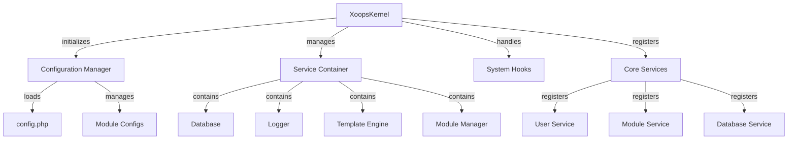

Ο πυρήνας XOOPS παρέχει το θεμελιώδες πλαίσιο για την εκκίνηση του συστήματος, τη διαχείριση διαμορφώσεων, τον χειρισμό συμβάντων του συστήματος και την παροχή βασικών βοηθητικών προγραμμάτων. Αυτές οι κλάσεις αποτελούν τη ραχοκοκαλιά της εφαρμογής XOOPS.

## Αρχιτεκτονική Συστήματος



## Τάξη XoopsKernel

Η κύρια κλάση πυρήνα που αρχικοποιεί και διαχειρίζεται το σύστημα XOOPS.

## # Επισκόπηση τάξης

```php
namespace Xoops;

class XoopsKernel
{
    private static ?XoopsKernel $instance = null;
    protected ServiceContainer $services;
    protected ConfigurationManager $config;
    protected array $modules = [];
    protected bool $isLoaded = false;
}
```

## # Κατασκευαστής

```php
private function __construct()
```

Ο ιδιωτικός κατασκευαστής επιβάλλει μονότονο μοτίβο.

## # getInstance

Ανακτά την παρουσία πυρήνα singleton.

```php
public static function getInstance(): XoopsKernel
```

**Επιστρέφει:** `XoopsKernel` - Το παράδειγμα πυρήνα singleton

**Παράδειγμα:**
```php
$kernel = XoopsKernel::getInstance();
```

## # Διαδικασία εκκίνησης

Η διαδικασία εκκίνησης του πυρήνα ακολουθεί τα εξής βήματα:

1. **Αρχικοποίηση** - Ορίστε τους χειριστές σφαλμάτων, ορίστε σταθερές
2. **Διαμόρφωση** - Φόρτωση αρχείων διαμόρφωσης
3. **Εγγραφή υπηρεσίας** - Εγγραφή βασικών υπηρεσιών
4. **Ανίχνευση μονάδας** - Σάρωση και αναγνώριση ενεργών μονάδων
5. **Εκκίνηση βάσης δεδομένων** - Σύνδεση στη βάση δεδομένων
6. **Εκκαθάριση** - Προετοιμαστείτε για τον χειρισμό αιτημάτων

```php
public function boot(): void
```

**Παράδειγμα:**
```php
$kernel = XoopsKernel::getInstance();
$kernel->boot();
```

## # Μέθοδοι κοντέινερ σέρβις

### # registerService

Καταχωρεί μια υπηρεσία στο κοντέινερ σέρβις.

```php
public function registerService(
    string $name,
    callable|object $definition
): void
```

**Παράμετροι:**

| Παράμετρος | Τύπος | Περιγραφή |
|-----------|------|-------------|
| `$name` | χορδή | Αναγνωριστικό υπηρεσίας |
| `$definition` | καλούμενο\|αντικείμενο | Εργοστάσιο ή παράδειγμα υπηρεσιών |

**Παράδειγμα:**
```php
$kernel->registerService('custom.handler', function($c) {
    return new CustomHandler();
});
```

### # getService

Ανακτά μια καταχωρημένη υπηρεσία.

```php
public function getService(string $name): mixed
```

**Παράμετροι:**

| Παράμετρος | Τύπος | Περιγραφή |
|-----------|------|-------------|
| `$name` | χορδή | Αναγνωριστικό υπηρεσίας |

**Επιστροφές:** `mixed` - Η ζητούμενη υπηρεσία

**Παράδειγμα:**
```php
$database = $kernel->getService('database');
$logger = $kernel->getService('logger');
```

### # έχει Υπηρεσία

Ελέγχει εάν μια υπηρεσία είναι καταχωρημένη.

```php
public function hasService(string $name): bool
```

**Παράδειγμα:**
```php
if ($kernel->hasService('cache')) {
    $cache = $kernel->getService('cache');
}
```

## Διαχειριστής διαμόρφωσης

Διαχειρίζεται τη διαμόρφωση της εφαρμογής και τις ρυθμίσεις της μονάδας.

## # Επισκόπηση τάξης

```php
namespace Xoops\Core;

class ConfigurationManager
{
    protected array $config = [];
    protected array $defaults = [];
    protected string $configPath;
}
```

## # Μέθοδοι

### # φόρτωση

Φορτώνει τη διαμόρφωση από αρχείο ή πίνακα.

```php
public function load(string|array $source): void
```

**Παράμετροι:**

| Παράμετρος | Τύπος | Περιγραφή |
|-----------|------|-------------|
| `$source` | συμβολοσειρά\|πίνακας | Διαδρομή αρχείου διαμόρφωσης ή πίνακας |

**Παράδειγμα:**
```php
$config = $kernel->getService('config');
$config->load(XOOPS_ROOT_PATH . '/include/config.php');
$config->load(['sitename' => 'My Site', 'admin_email' => 'admin@example.com']);
```

### # πάρτε

Ανακτά μια τιμή διαμόρφωσης.

```php
public function get(string $key, mixed $default = null): mixed
```

**Παράμετροι:**

| Παράμετρος | Τύπος | Περιγραφή |
|-----------|------|-------------|
| `$key` | χορδή | Κλειδί διαμόρφωσης (σημειογραφία κουκκίδας) |
| `$default` | μικτή | Προεπιλεγμένη τιμή εάν δεν βρεθεί |

**Επιστρέφει:** `mixed` - Τιμή διαμόρφωσης

**Παράδειγμα:**
```php
$siteName = $config->get('sitename');
$adminEmail = $config->get('admin.email', 'admin@example.com');
```

### # σετ

Ορίζει μια τιμή διαμόρφωσης.

```php
public function set(string $key, mixed $value): void
```

**Παράμετροι:**

| Παράμετρος | Τύπος | Περιγραφή |
|-----------|------|-------------|
| `$key` | χορδή | Κλειδί διαμόρφωσης |
| `$value` | μικτή | Τιμή διαμόρφωσης |

**Παράδειγμα:**
```php
$config->set('sitename', 'New Site Name');
$config->set('features.cache_enabled', true);
```

### # getModuleConfig

Λαμβάνει διαμόρφωση για μια συγκεκριμένη ενότητα.

```php
public function getModuleConfig(
    string $moduleName
): array
```

**Παράμετροι:**

| Παράμετρος | Τύπος | Περιγραφή |
|-----------|------|-------------|
| `$moduleName` | χορδή | Όνομα καταλόγου μονάδας |

**Επιστρέφει:** `array` - Συστοιχία διαμόρφωσης μονάδας

**Παράδειγμα:**
```php
$publisherConfig = $config->getModuleConfig('publisher');
```

## Άγκιστρα συστήματος

Τα άγκιστρα συστήματος επιτρέπουν σε μονάδες και πρόσθετα να εκτελούν κώδικα σε συγκεκριμένα σημεία του κύκλου ζωής της εφαρμογής.

## # Τάξη HookManager

```php
namespace Xoops\Core;

class HookManager
{
    protected array $hooks = [];
    protected array $listeners = [];
}
```

## # Μέθοδοι

### # addHook

Καταχωρεί ένα σημείο άγκιστρου.

```php
public function addHook(string $name): void
```

**Παράμετροι:**

| Παράμετρος | Τύπος | Περιγραφή |
|-----------|------|-------------|
| `$name` | χορδή | Αναγνωριστικό άγκιστρου |

**Παράδειγμα:**
```php
$hooks = $kernel->getService('hooks');
$hooks->addHook('system.startup');
$hooks->addHook('user.login');
$hooks->addHook('module.install');
```

### # ακούστε

Προσαρτά έναν ακροατή σε ένα γάντζο.

```php
public function listen(
    string $hookName,
    callable $callback,
    int $priority = 10
): void
```

**Παράμετροι:**

| Παράμετρος | Τύπος | Περιγραφή |
|-----------|------|-------------|
| `$hookName` | χορδή | Αναγνωριστικό άγκιστρου |
| `$callback` | κλητός | Λειτουργία για εκτέλεση |
| `$priority` | int | Προτεραιότητα εκτέλεσης (πρώτα οι υψηλότερες εκτελέσεις) |

**Παράδειγμα:**
```php
$hooks->listen('user.login', function($user) {
    error_log('User ' . $user->uname . ' logged in');
}, 10);

$hooks->listen('module.install', function($module) {
    // Custom module installation logic
    echo "Installing " . $module->getName();
}, 5);
```

### # σκανδάλη

Εκτελεί όλους τους ακροατές για ένα γάντζο.

```php
public function trigger(
    string $hookName,
    mixed $arguments = null
): array
```

**Παράμετροι:**

| Παράμετρος | Τύπος | Περιγραφή |
|-----------|------|-------------|
| `$hookName` | χορδή | Αναγνωριστικό άγκιστρου |
| `$arguments` | μικτή | Δεδομένα για διαβίβαση στους ακροατές |

**Επιστροφές:** `array` - Αποτελέσματα από όλους τους ακροατές

**Παράδειγμα:**
```php
$results = $hooks->trigger('system.startup');
$results = $hooks->trigger('user.created', $newUser);
```

## Επισκόπηση βασικών υπηρεσιών

Ο πυρήνας καταγράφει πολλές βασικές υπηρεσίες κατά την εκκίνηση:

| Υπηρεσία | Τάξη | Σκοπός |
|---------|-------|---------|
| `database` | Βάση δεδομένων XOOPS | Επίπεδο αφαίρεσης βάσης δεδομένων |
| `config` | ConfigurationManager | Διαχείριση διαμόρφωσης |
| `logger` | Logger | Καταγραφή εφαρμογών |
| `template` | XoopsTpl | Μηχανή προτύπου |
| `user` | UserManager | Υπηρεσία διαχείρισης χρηστών |
| `module` | ModuleManager | Διαχείριση ενότητας |
| `cache` | CacheManager | Στρώμα προσωρινής αποθήκευσης |
| `hooks` | HookManager | Άγκιστρα συμβάντων συστήματος |

## Παράδειγμα πλήρους χρήσης

```php
<?php
/**
 * Custom module boot process utilizing kernel
 */

// Get kernel instance
$kernel = XoopsKernel::getInstance();

// Boot the system
$kernel->boot();

// Get services
$config = $kernel->getService('config');
$database = $kernel->getService('database');
$logger = $kernel->getService('logger');
$hooks = $kernel->getService('hooks');

// Access configuration
$siteName = $config->get('sitename');
$adminEmail = $config->get('admin.email');

// Register module-specific hooks
$hooks->listen('user.login', function($user) {
    // Log user login
    $logger->info('User login: ' . $user->uname);

    // Track in database
    $database->query(
        'INSERT INTO ' . $database->prefix('event_log') .
        ' (type, user_id, message, timestamp) VALUES (?, ?, ?, ?)',
        ['login', $user->uid(), 'User login', time()]
    );
});

$hooks->listen('module.install', function($module) {
    $logger->info('Module installed: ' . $module->getName());
});

// Trigger hooks
$hooks->trigger('system.startup');

// Use database service
$result = $database->query(
    'SELECT * FROM ' . $database->prefix('users') .
    ' LIMIT 10'
);

while ($row = $database->fetchArray($result)) {
    echo "User: " . htmlspecialchars($row['uname']) . "\n";
}

// Register custom service
$kernel->registerService('custom.repository', function($c) {
    return new CustomRepository($c->getService('database'));
});

// Later access custom service
$repo = $kernel->getService('custom.repository');
```

## Βασικές σταθερές

Ο πυρήνας ορίζει αρκετές σημαντικές σταθερές κατά την εκκίνηση:

```php
// System paths
define('XOOPS_ROOT_PATH', '/var/www/xoops');
define('XOOPS_HTDOCS_PATH', XOOPS_ROOT_PATH . '/htdocs');
define('XOOPS_MODULES_PATH', XOOPS_ROOT_PATH . '/htdocs/modules');
define('XOOPS_THEMES_PATH', XOOPS_ROOT_PATH . '/htdocs/themes');

// Web paths
define('XOOPS_URL', 'http://example.com');
define('XOOPS_HTDOCS_URL', XOOPS_URL . '/htdocs');

// Database
define('XOOPS_DB_PREFIX', 'xoops_');
```

## Χειρισμός σφαλμάτων

Ο πυρήνας ρυθμίζει τους χειριστές σφαλμάτων κατά την εκκίνηση:

```php
// Set custom error handler
set_error_handler(function($errno, $errstr, $errfile, $errline) {
    $kernel->getService('logger')->error(
        "Error: $errstr in $errfile:$errline"
    );
});

// Set exception handler
set_exception_handler(function($exception) {
    $kernel->getService('logger')->critical(
        "Exception: " . $exception->getMessage()
    );
});
```

## Βέλτιστες πρακτικές

1. **Single Boot** - Καλέστε το `boot()` μόνο μία φορά κατά την εκκίνηση της εφαρμογής
2. **Χρησιμοποιήστε το Service Container** - Καταχωρίστε και ανακτήστε υπηρεσίες μέσω του πυρήνα
3. **Handle Hooks Early** - Καταχωρίστε τους ακροατές hook πριν τους ενεργοποιήσετε
4. **Καταγραφή σημαντικών συμβάντων** - Χρησιμοποιήστε την υπηρεσία καταγραφής για εντοπισμό σφαλμάτων
5. **Διαμόρφωση προσωρινής μνήμης** - Φόρτωση παραμέτρων μία φορά και επαναχρησιμοποίηση
6. **Χειρισμός σφαλμάτων** - Να ρυθμίζετε πάντα τους χειριστές σφαλμάτων πριν από την επεξεργασία αιτημάτων

## Σχετική τεκμηρίωση

- ../Module/Module-System - Σύστημα μονάδας και κύκλος ζωής
- ../Template/Template-System - Ενσωμάτωση κινητήρα προτύπου
- ../User/User-System - Έλεγχος ταυτότητας χρήστη και διαχείριση
- ../Database/XoopsDatabase - Επίπεδο βάσης δεδομένων

---

*Δείτε επίσης: [XOOPS Πηγή πυρήνα](https://github.com/XOOPS/XoopsCore27/tree/master/htdocs/class)*
