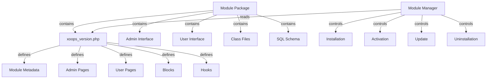

Το XOOPS Module System παρέχει ένα πλήρες πλαίσιο για την ανάπτυξη, εγκατάσταση, διαχείριση και επέκταση της λειτουργικότητας της μονάδας. Οι μονάδες είναι αυτόνομα πακέτα που επεκτείνουν το XOOPS με πρόσθετες δυνατότητες και δυνατότητες.

## Αρχιτεκτονική Ενοτήτων



## Δομή ενότητας

Τυπική δομή καταλόγου ενότητας XOOPS:

```
mymodule/
├── xoops_version.php          # Module manifest and configuration
├── admin.php                  # Admin main page
├── index.php                  # User main page
├── admin/                     # Admin pages directory
│   ├── main.php
│   ├── manage.php
│   └── settings.php
├── class/                     # Module classes
│   ├── Handler/
│   │   ├── ItemHandler.php
│   │   └── CategoryHandler.php
│   └── Objects/
│       ├── Item.php
│       └── Category.php
├── sql/                       # Database schemas
│   ├── mysql.sql
│   └── postgres.sql
├── include/                   # Include files
│   ├── common.inc.php
│   └── functions.php
├── templates/                 # Module templates
│   ├── admin/
│   │   └── main.tpl
│   └── user/
│       ├── index.tpl
│       └── item.tpl
├── blocks/                    # Module blocks
│   └── blocks.php
├── tests/                     # Unit tests
├── language/                  # Language files
│   ├── english/
│   │   └── main.php
│   └── spanish/
│       └── main.php
└── docs/                      # Documentation
```

## Τάξη XoopsModule

Η κλάση XoopsModule αντιπροσωπεύει μια εγκατεστημένη λειτουργική μονάδα XOOPS.

## # Επισκόπηση τάξης

```php
namespace Xoops\Core\Module;

class XoopsModule extends XoopsObject
{
    protected int $moduleid = 0;
    protected string $name = '';
    protected string $dirname = '';
    protected string $version = '';
    protected string $description = '';
    protected array $config = [];
    protected array $blocks = [];
    protected array $adminPages = [];
    protected array $userPages = [];
}
```

## # Ιδιότητες

| Ακίνητα | Τύπος | Περιγραφή |
|----------|------|-------------|
| `$moduleid` | int | Μοναδικό αναγνωριστικό μονάδας |
| `$name` | χορδή | Εμφανιζόμενο όνομα μονάδας |
| `$dirname` | χορδή | Όνομα καταλόγου μονάδας |
| `$version` | χορδή | Τρέχουσα έκδοση ενότητας |
| `$description` | χορδή | Περιγραφή ενότητας |
| `$config` | συστοιχία | Διαμόρφωση μονάδας |
| `$blocks` | συστοιχία | Μπλοκ ενοτήτων |
| `$adminPages` | συστοιχία | Σελίδες πίνακα διαχείρισης |
| `$userPages` | συστοιχία | Σελίδες που αντιμετωπίζουν οι χρήστες |

## # Κατασκευαστής

```php
public function __construct()
```

Δημιουργεί μια νέα παρουσία λειτουργικής μονάδας και αρχικοποιεί μεταβλητές.

## # Βασικές Μέθοδοι

### # getName

Λαμβάνει το εμφανιζόμενο όνομα της μονάδας.

```php
public function getName(): string
```

**Επιστροφές:** `string` - Εμφανιζόμενο όνομα μονάδας

**Παράδειγμα:**
```php
$module = new XoopsModule();
$module->setVar('name', 'Publisher');
echo $module->getName(); // "Publisher"
```

### # getDirname

Λαμβάνει το όνομα καταλόγου της μονάδας.

```php
public function getDirname(): string
```

**Επιστρέφει:** `string` - Όνομα καταλόγου μονάδας

**Παράδειγμα:**
```php
echo $module->getDirname(); // "publisher"
```

### # getVersion

Λαμβάνει την τρέχουσα έκδοση της μονάδας.

```php
public function getVersion(): string
```

**Επιστρέφει:** `string` - Συμβολοσειρά έκδοσης

**Παράδειγμα:**
```php
echo $module->getVersion(); // "2.1.0"
```

### # getDescription

Λαμβάνει την περιγραφή της ενότητας.

```php
public function getDescription(): string
```

**Επιστροφές:** `string` - Περιγραφή ενότητας

**Παράδειγμα:**
```php
$desc = $module->getDescription();
```

### # getConfig

Ανακτά τη διαμόρφωση της μονάδας.

```php
public function getConfig(string $key = null): mixed
```

**Παράμετροι:**

| Παράμετρος | Τύπος | Περιγραφή |
|-----------|------|-------------|
| `$key` | χορδή | Κλειδί διαμόρφωσης (μηδενικό για όλους) |

**Επιστρέφει:** `mixed` - Τιμή διαμόρφωσης ή πίνακας

**Παράδειγμα:**
```php
$config = $module->getConfig();
$itemsPerPage = $module->getConfig('items_per_page');
```

### # setConfig

Ορίζει τη διαμόρφωση της μονάδας.

```php
public function setConfig(string $key, mixed $value): void
```

**Παράμετροι:**

| Παράμετρος | Τύπος | Περιγραφή |
|-----------|------|-------------|
| `$key` | χορδή | Κλειδί διαμόρφωσης |
| `$value` | μικτή | Τιμή διαμόρφωσης |

**Παράδειγμα:**
```php
$module->setConfig('items_per_page', 20);
$module->setConfig('enable_cache', true);
```

### # getPath

Λαμβάνει την πλήρη διαδρομή συστήματος αρχείων προς τη μονάδα.

```php
public function getPath(): string
```

**Επιστρέφει:** `string` - Απόλυτη διαδρομή καταλόγου λειτουργιών

**Παράδειγμα:**
```php
$path = $module->getPath(); // "/var/www/xoops/modules/publisher"
$classPath = $module->getPath() . '/class';
```

### # getUrl

Λαμβάνει το URL στη μονάδα.

```php
public function getUrl(): string
```

**Επιστροφές:** `string` - Ενότητα URL

**Παράδειγμα:**
```php
$url = $module->getUrl(); // "http://example.com/modules/publisher"
```

## Διαδικασία εγκατάστασης μονάδας

## # Λειτουργία xoops_module_install

Η λειτουργία εγκατάστασης της μονάδας που ορίζεται στο `xoops_version.php`:

```php
function xoops_module_install_modulename($module)
{
    // $module is an XoopsModule instance

    // Create database tables
    // Initialize default configuration
    // Create default folders
    // Set up file permissions

    return true; // Success
}
```

**Παράμετροι:**

| Παράμετρος | Τύπος | Περιγραφή |
|-----------|------|-------------|
| `$module` | XoopsModule | Η μονάδα που εγκαθίσταται |

**Επιστροφές:** `bool` - Σωστό στην επιτυχία, ψευδές στην αποτυχία

**Παράδειγμα:**
```php
function xoops_module_install_publisher($module)
{
    // Get module path
    $modulePath = $module->getPath();

    // Create uploads directory
    $uploadsPath = XOOPS_ROOT_PATH . '/uploads/publisher';
    if (!is_dir($uploadsPath)) {
        mkdir($uploadsPath, 0755, true);
    }

    // Get database connection
    global $xoopsDB;

    // Execute SQL installation script
    $sqlFile = $modulePath . '/sql/mysql.sql';
    if (file_exists($sqlFile)) {
        $sqlQueries = file_get_contents($sqlFile);
        // Execute queries (simplified)
        $xoopsDB->queryFromFile($sqlFile);
    }

    // Set default configuration
    $module->setConfig('items_per_page', 10);
    $module->setConfig('enable_comments', true);

    return true;
}
```

## # Λειτουργία xoops_module_uninstall

Η λειτουργία απεγκατάστασης μονάδας:

```php
function xoops_module_uninstall_modulename($module)
{
    // Drop database tables
    // Remove uploaded files
    // Clean up configuration

    return true;
}
```

**Παράδειγμα:**
```php
function xoops_module_uninstall_publisher($module)
{
    global $xoopsDB;

    // Drop tables
    $tables = ['publisher_items', 'publisher_categories', 'publisher_comments'];
    foreach ($tables as $table) {
        $xoopsDB->query('DROP TABLE IF EXISTS ' . $xoopsDB->prefix($table));
    }

    // Remove upload folder
    $uploadsPath = XOOPS_ROOT_PATH . '/uploads/publisher';
    if (is_dir($uploadsPath)) {
        // Recursive directory deletion
        $this->recursiveRemoveDir($uploadsPath);
    }

    return true;
}
```

## Άγκιστρα ενότητας

Τα άγκιστρα μονάδων επιτρέπουν στις μονάδες να ενσωματωθούν με άλλες μονάδες και το σύστημα.

## # Δήλωση Hook

Σε `xoops_version.php`:

```php
$modversion['hooks'] = [
    'system.page.footer' => [
        'function' => 'publisher_page_footer'
    ],
    'user.profile.view' => [
        'function' => 'publisher_user_articles'
    ],
];
```

## # Υλοποίηση γάντζου

```php
// In a module file (e.g., include/hooks.php)

function publisher_page_footer()
{
    // Return HTML for footer
    return '<div class="publisher-footer">Publisher Footer Content</div>';
}

function publisher_user_articles($user_id)
{
    global $xoopsDB;

    // Get user's articles
    $result = $xoopsDB->query(
        'SELECT * FROM ' . $xoopsDB->prefix('publisher_articles') .
        ' WHERE author_id = ? ORDER BY published DESC LIMIT 5',
        [$user_id]
    );

    $articles = [];
    while ($row = $xoopsDB->fetchAssoc($result)) {
        $articles[] = $row;
    }

    return $articles;
}
```

## # Διαθέσιμα άγκιστρα συστήματος

| Γάντζος | Παράμετροι | Περιγραφή |
|------|-----------|-------------|
| `system.page.header` | Κανένα | Έξοδος κεφαλίδας σελίδας |
| `system.page.footer` | Κανένα | Έξοδος υποσέλιδου σελίδας |
| `user.login.success` | $user αντικείμενο | Μετά την είσοδο χρήστη |
| `user.logout` | $user αντικείμενο | Μετά την αποσύνδεση χρήστη |
| `user.profile.view` | $user_id | Προβολή προφίλ χρήστη |
| `module.install` | $module αντικείμενο | Εγκατάσταση μονάδας |
| `module.uninstall` | $module αντικείμενο | Απεγκατάσταση μονάδας |

## Υπηρεσία Διαχείρισης Ενοτήτων

Η υπηρεσία ModuleManager χειρίζεται τις λειτουργίες της μονάδας.

## # Μέθοδοι

### # getModule

Ανακτά μια ενότητα με το όνομα.

```php
public function getModule(string $dirname): ?XoopsModule
```

**Παράμετροι:**

| Παράμετρος | Τύπος | Περιγραφή |
|-----------|------|-------------|
| `$dirname` | χορδή | Όνομα καταλόγου μονάδας |

**Επιστρέφει:** `?XoopsModule` - Παράδειγμα ενότητας ή μηδενικό

**Παράδειγμα:**
```php
$moduleManager = $kernel->getService('module');
$publisher = $moduleManager->getModule('publisher');
if ($publisher) {
    echo $publisher->getName();
}
```

### # getAllModules

Λαμβάνει όλες τις εγκατεστημένες μονάδες.

```php
public function getAllModules(bool $activeOnly = true): array
```

**Παράμετροι:**

| Παράμετρος | Τύπος | Περιγραφή |
|-----------|------|-------------|
| `$activeOnly` | bool | Επιστροφή μόνο ενεργών λειτουργικών μονάδων |

**Επιστρέφει:** `array` - Πίνακας αντικειμένων XoopsModule

**Παράδειγμα:**
```php
$activeModules = $moduleManager->getAllModules(true);
foreach ($activeModules as $module) {
    echo $module->getName() . " - " . $module->getVersion() . "\n";
}
```

### # isModuleActive

Ελέγχει εάν μια λειτουργική μονάδα είναι ενεργή.

```php
public function isModuleActive(string $dirname): bool
```

**Παράδειγμα:**
```php
if ($moduleManager->isModuleActive('publisher')) {
    // Publisher module is active
}
```

### # activateModule

Ενεργοποιεί μια λειτουργική μονάδα.

```php
public function activateModule(string $dirname): bool
```

**Παράδειγμα:**
```php
if ($moduleManager->activateModule('publisher')) {
    echo "Publisher activated";
}
```

### # deactivateModule

Απενεργοποιεί μια μονάδα.

```php
public function deactivateModule(string $dirname): bool
```

**Παράδειγμα:**
```php
if ($moduleManager->deactivateModule('publisher')) {
    echo "Publisher deactivated";
}
```

## Διαμόρφωση μονάδας (xoops_version.php)

Παράδειγμα δήλωσης πλήρους ενότητας:

```php
<?php
/**
 * Module manifest for Publisher
 */

$modversion = [
    'name' => 'Publisher',
    'version' => '2.1.0',
    'description' => 'Professional content publishing module',
    'author' => 'XOOPS Community',
    'credits' => 'Based on original work by...',
    'license' => 'GPL v2',
    'official' => 1,
    'image' => 'images/logo.png',
    'dirname' => 'publisher',
    'onInstall' => 'xoops_module_install_publisher',
    'onUpdate' => 'xoops_module_update_publisher',
    'onUninstall' => 'xoops_module_uninstall_publisher',

    // Admin pages
    'hasAdmin' => 1,
    'adminindex' => 'admin/main.php',
    'adminmenu' => [
        [
            'title' => 'Dashboard',
            'link' => 'admin/main.php',
            'icon' => 'dashboard.png'
        ],
        [
            'title' => 'Manage Items',
            'link' => 'admin/items.php',
            'icon' => 'items.png'
        ],
        [
            'title' => 'Settings',
            'link' => 'admin/settings.php',
            'icon' => 'settings.png'
        ]
    ],

    // User pages
    'hasMain' => 1,
    'main_file' => 'index.php',

    // Blocks
    'blocks' => [
        [
            'file' => 'blocks/recent.php',
            'name' => 'Recent Articles',
            'description' => 'Display recent published articles',
            'show_func' => 'publisher_recent_show',
            'edit_func' => 'publisher_recent_edit',
            'options' => '5|0|0',
            'template' => 'publisher_block_recent.tpl'
        ],
        [
            'file' => 'blocks/featured.php',
            'name' => 'Featured Articles',
            'description' => 'Display featured articles',
            'show_func' => 'publisher_featured_show',
            'edit_func' => 'publisher_featured_edit'
        ]
    ],

    // Module hooks
    'hooks' => [
        'system.page.footer' => [
            'function' => 'publisher_page_footer'
        ],
        'user.profile.view' => [
            'function' => 'publisher_user_articles'
        ]
    ],

    // Configuration items
    'config' => [
        [
            'name' => 'items_per_page',
            'title' => '_MI_PUBLISHER_ITEMS_PER_PAGE',
            'description' => '_MI_PUBLISHER_ITEMS_PER_PAGE_DESC',
            'formtype' => 'text',
            'valuetype' => 'int',
            'default' => '10'
        ],
        [
            'name' => 'enable_comments',
            'title' => '_MI_PUBLISHER_ENABLE_COMMENTS',
            'description' => '_MI_PUBLISHER_ENABLE_COMMENTS_DESC',
            'formtype' => 'yesno',
            'valuetype' => 'int',
            'default' => '1'
        ]
    ]
];

function xoops_module_install_publisher($module)
{
    // Installation logic
    return true;
}

function xoops_module_update_publisher($module)
{
    // Update logic
    return true;
}

function xoops_module_uninstall_publisher($module)
{
    // Uninstallation logic
    return true;
}
```

## Βέλτιστες πρακτικές

1. **Χώρος ονομάτων Οι τάξεις σας** - Χρησιμοποιήστε χώρους ονομάτων για συγκεκριμένες μονάδες για την αποφυγή διενέξεων

2. **Χρήση Handlers** - Να χρησιμοποιείτε πάντα κλάσεις χειριστή για λειτουργίες βάσης δεδομένων

3. **Διεθνοποίηση περιεχομένου** - Χρησιμοποιήστε σταθερές γλώσσας για όλες τις συμβολοσειρές που απευθύνονται στον χρήστη

4. **Δημιουργία Σεναρίων Εγκατάστασης** - Παρέχετε σχήματα SQL για πίνακες βάσης δεδομένων

5. **Άγκιστρα εγγράφων** - Καταγράψτε ξεκάθαρα τα άγκιστρα που παρέχει η μονάδα σας

6. **Version Your Module** - Αύξηση αριθμών έκδοσης με εκδόσεις

7. **Δοκιμαστική εγκατάσταση** - Δοκιμάστε διεξοδικά τις διαδικασίες install/uninstall

8. **Χειρισμός δικαιωμάτων** - Ελέγξτε τα δικαιώματα χρήστη πριν επιτρέψετε ενέργειες

## Παράδειγμα πλήρους ενότητας

```php
<?php
/**
 * Custom Article Module Main Page
 */

include __DIR__ . '/include/common.inc.php';

// Get module instance
$module = xoops_getModuleByDirname('mymodule');

// Check if module is active
if (!$module) {
    die('Module not found');
}

// Get module configuration
$itemsPerPage = $module->getConfig('items_per_page');

// Get item handler
$itemHandler = xoops_getModuleHandler('item', 'mymodule');

// Fetch items with pagination
$criteria = new CriteriaCompo();
$criteria->add(new Criteria('status', 1));
$items = $itemHandler->getObjects($criteria, $itemsPerPage);

// Prepare template
$xoopsTpl->assign('items', $items);
$xoopsTpl->assign('module_name', $module->getName());
$xoopsTpl->display($module->getPath() . '/templates/user/index.tpl');
```

## Σχετική τεκμηρίωση

- ../Kernel/Kernel-Classes - Αρχικοποίηση πυρήνα και βασικές υπηρεσίες
- ../Template/Template-System - Πρότυπα ενότητας και ενσωμάτωση θεμάτων
- ../Database/QueryBuilder - Δόμηση ερωτημάτων βάσης δεδομένων
- ../Core/XoopsObject - Βασική κλάση αντικειμένου

---

*Δείτε επίσης: [XOOPS Οδηγός ανάπτυξης ενότητας](https://github.com/XOOPS/XoopsCore27/wiki/Module-Development)*
