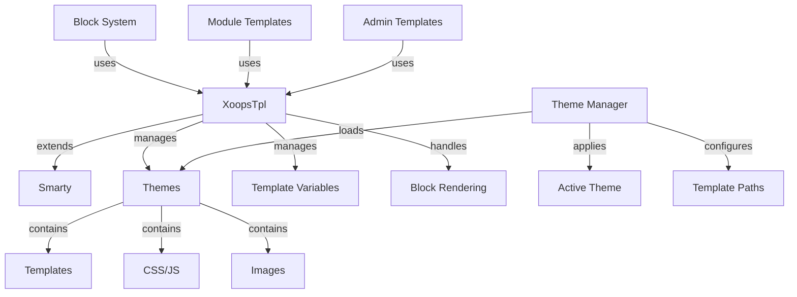

Το σύστημα προτύπων XOOPS είναι χτισμένο στον ισχυρό κινητήρα προτύπων Smarty, παρέχοντας έναν ευέλικτο και επεκτάσιμο τρόπο διαχωρισμού της λογικής παρουσίασης από την επιχειρηματική λογική. Διαχειρίζεται θέματα, απόδοση προτύπων, ανάθεση μεταβλητών και δημιουργία δυναμικού περιεχομένου.

## Αρχιτεκτονική προτύπων



## Τάξη XoopsTpl

Η κύρια κατηγορία κινητήρα προτύπου που επεκτείνει το Smarty.

## # Επισκόπηση τάξης

```php
namespace Xoops\Core;

class XoopsTpl extends Smarty
{
    protected array $vars = [];
    protected string $currentTheme = '';
    protected array $blocks = [];
    protected bool $isAdmin = false;
}
```

## # Επέκταση Smarty

```php
use Xoops\Core\XoopsTpl;

class XoopsTpl extends Smarty
{
    private static ?XoopsTpl $instance = null;

    private function __construct()
    {
        parent::__construct();
        $this->configureDirectories();
        $this->registerPlugins();
    }

    public static function getInstance(): XoopsTpl
    {
        if (!isset(self::$instance)) {
            self::$instance = new self();
        }
        return self::$instance;
    }
}
```

## # Βασικές Μέθοδοι

### # getInstance

Λαμβάνει την παρουσία προτύπου singleton.

```php
public static function getInstance(): XoopsTpl
```

**Επιστροφές:** `XoopsTpl` - Παράδειγμα Singleton

**Παράδειγμα:**
```php
$xoopsTpl = XoopsTpl::getInstance();
```

### # ανάθεση

Αντιστοιχίζει μια μεταβλητή στο πρότυπο.

```php
public function assign(
    string|array $tplVar,
    mixed $value = null
): void
```

**Παράμετροι:**

| Παράμετρος | Τύπος | Περιγραφή |
|-----------|------|-------------|
| `$tplVar` | συμβολοσειρά\|πίνακας | Όνομα μεταβλητής ή συσχετικός πίνακας |
| `$value` | μικτή | Μεταβλητή τιμή |

**Παράδειγμα:**
```php
$xoopsTpl->assign('page_title', 'Welcome');
$xoopsTpl->assign('user_name', 'John Doe');

// Multiple assignments
$xoopsTpl->assign([
    'items' => $items,
    'total_count' => count($items),
    'show_pagination' => true
]);
```

### # appendΑνάθεση

Προσθέτει τιμές σε μεταβλητές πίνακα προτύπων.

```php
public function appendAssign(
    string $tplVar,
    mixed $value
): void
```

**Παράμετροι:**

| Παράμετρος | Τύπος | Περιγραφή |
|-----------|------|-------------|
| `$tplVar` | χορδή | Όνομα μεταβλητής |
| `$value` | μικτή | Αξία προς προσθήκη |

**Παράδειγμα:**
```php
$xoopsTpl->assign('breadcrumbs', ['Home']);
$xoopsTpl->appendAssign('breadcrumbs', 'Blog');
$xoopsTpl->appendAssign('breadcrumbs', 'Posts');
// breadcrumbs = ['Home', 'Blog', 'Posts']
```

### # getAssignedVars

Λαμβάνει όλες τις εκχωρημένες μεταβλητές προτύπου.

```php
public function getAssignedVars(): array
```

**Επιστρέφει:** `array` - Εκχωρημένες μεταβλητές

**Παράδειγμα:**
```php
$vars = $xoopsTpl->getAssignedVars();
foreach ($vars as $name => $value) {
    echo "$name = " . var_export($value, true) . "\n";
}
```

Εμφάνιση ####

Αποδίδει ένα πρότυπο και εξάγει στο πρόγραμμα περιήγησης.

```php
public function display(
    string $resource,
    string|array $cache_id = null,
    string $compile_id = null,
    object $parent = null
): void
```

**Παράμετροι:**

| Παράμετρος | Τύπος | Περιγραφή |
|-----------|------|-------------|
| `$resource` | χορδή | Διαδρομή αρχείου προτύπου |
| `$cache_id` | συμβολοσειρά\|πίνακας | Αναγνωριστικό προσωρινής μνήμης |
| `$compile_id` | χορδή | Μεταγλώττιση αναγνωριστικού |
| `$parent` | αντικείμενο | Γονικό αντικείμενο προτύπου |

**Παράδειγμα:**
```php
$xoopsTpl->assign('page_title', 'Home');
$xoopsTpl->display('user:index.tpl');

// With absolute path
$xoopsTpl->display(XOOPS_ROOT_PATH . '/templates/user/index.tpl');
```

### # ανάκτηση

Αποδίδει ένα πρότυπο και επιστρέφει ως συμβολοσειρά.

```php
public function fetch(
    string $resource,
    string|array $cache_id = null,
    string $compile_id = null,
    object $parent = null
): string
```

**Επιστροφές:** `string` - Περιεχόμενο προτύπου απόδοσης

**Παράδειγμα:**
```php
$xoopsTpl->assign('message', 'Hello World');
$html = $xoopsTpl->fetch('user:message.tpl');
echo $html;

// Use for email templates
$emailContent = $xoopsTpl->fetch('mail:notification.tpl');
mail($to, $subject, $emailContent);
```

### # loadTheme

Φορτώνει ένα συγκεκριμένο θέμα.

```php
public function loadTheme(string $themeName): bool
```

**Παράμετροι:**

| Παράμετρος | Τύπος | Περιγραφή |
|-----------|------|-------------|
| `$themeName` | χορδή | Όνομα καταλόγου θεμάτων |

**Επιστροφές:** `bool` - True on success

**Παράδειγμα:**
```php
if ($xoopsTpl->loadTheme('bluemoon')) {
    echo "Theme loaded successfully";
}
```

### # get CurrentTheme

Λαμβάνει το όνομα του τρέχοντος ενεργού θέματος.

```php
public function getCurrentTheme(): string
```

**Επιστροφές:** `string` - Όνομα θέματος

**Παράδειγμα:**
```php
$currentTheme = $xoopsTpl->getCurrentTheme();
echo "Active theme: $currentTheme";
```

### # setOutputFilter

Προσθέτει ένα φίλτρο εξόδου για την επεξεργασία της εξόδου προτύπου.

```php
public function setOutputFilter(string $function): void
```

**Παράμετροι:**

| Παράμετρος | Τύπος | Περιγραφή |
|-----------|------|-------------|
| `$function` | χορδή | Όνομα συνάρτησης φίλτρου |

**Παράδειγμα:**
```php
// Remove whitespace from output
$xoopsTpl->setOutputFilter('trim');

// Custom filter
function my_output_filter($output) {
    // Minify HTML
    $output = preg_replace('/\s+/', ' ', $output);
    return trim($output);
}
$xoopsTpl->setOutputFilter('my_output_filter');
```

### # registerPlugin

Καταχωρεί μια προσαρμοσμένη προσθήκη Smarty.

```php
public function registerPlugin(
    string $type,
    string $name,
    callable $callback
): void
```

**Παράμετροι:**

| Παράμετρος | Τύπος | Περιγραφή |
|-----------|------|-------------|
| `$type` | χορδή | Τύπος προσθήκης (τροποποιητής, μπλοκ, λειτουργία) |
| `$name` | χορδή | Όνομα προσθήκης |
| `$callback` | κλητός | Λειτουργία επανάκλησης |

**Παράδειγμα:**
```php
// Register custom modifier
$xoopsTpl->registerPlugin('modifier', 'markdown', function($text) {
    return markdown_parse($text);
});

// Use in template: {$content|markdown}

// Register custom block tag
$xoopsTpl->registerPlugin('block', 'permission', function($params, $content, $smarty, &$repeat) {
    if ($repeat) return;

    // Check permission
    if (has_permission($params['name'])) {
        return $content;
    }
    return '';
});

// Use in template: {permission name="admin"}...{/permission}
```

## Σύστημα θεμάτων

## # Δομή θέματος

Τυπική δομή καταλόγου θεμάτων XOOPS:

```
bluemoon/
├── style.css              # Main stylesheet
├── admin.css              # Admin stylesheet
├── theme.html             # Main page template
├── admin.html             # Admin page template
├── blocks/                # Block templates
│   ├── block_left.tpl
│   └── block_right.tpl
├── modules/               # Module templates
│   ├── publisher/
│   │   ├── index.tpl
│   │   └── item.tpl
│   └── news/
│       └── index.tpl
├── images/                # Theme images
│   ├── logo.png
│   └── banner.png
├── js/                    # Theme JavaScript
│   └── script.js
└── readme.txt             # Theme documentation
```

## # Τάξη Διαχείρισης θεμάτων

```php
namespace Xoops\Core\Theme;

class ThemeManager
{
    protected array $themes = [];
    protected string $activeTheme = '';
    protected string $themeDirectory = '';

    public function getActiveTheme(): string {}
    public function setActiveTheme(string $theme): bool {}
    public function getThemeList(): array {}
    public function themeExists(string $name): bool {}
}
```

## Μεταβλητές προτύπου

## # Τυπικές καθολικές μεταβλητές

Το XOOPS εκχωρεί αυτόματα πολλές καθολικές μεταβλητές προτύπου:

| Μεταβλητή | Τύπος | Περιγραφή |
|----------|------|-------------|
| `$xoops_url` | χορδή | XOOPS εγκατάσταση URL |
| `$xoops_user` | XoopsUser\|null | Τρέχον αντικείμενο χρήστη |
| `$xoops_uname` | χορδή | Τρέχον όνομα χρήστη |
| `$xoops_isadmin` | bool | Ο χρήστης είναι διαχειριστής |
| `$xoops_banner` | χορδή | Banner HTML |
| `$xoops_notification` | χορδή | Σήμανση ειδοποίησης |
| `$xoops_version` | χορδή | Έκδοση XOOPS |

## # Μεταβλητές ειδικές για μπλοκ

Κατά την απόδοση μπλοκ:

| Μεταβλητή | Τύπος | Περιγραφή |
|----------|------|-------------|
| `$block` | συστοιχία | Πληροφορίες αποκλεισμού |
| `$block.title` | χορδή | Τίτλος μπλοκ |
| `$block.content` | χορδή | Αποκλεισμός περιεχομένου |
| `$block.id` | int | Αναγνωριστικό μπλοκ |
| `$block.module` | χορδή | Όνομα ενότητας |

## # Μεταβλητές προτύπου μονάδας

Οι ενότητες συνήθως αντιστοιχούν:

| Μεταβλητή | Τύπος | Περιγραφή |
|----------|------|-------------|
| `$module_name` | χορδή | Εμφανιζόμενο όνομα μονάδας |
| `$module_dir` | χορδή | Κατάλογος ενότητας |
| `$xoops_module_header` | χορδή | Ενότητα CSS/JS |

## Smarty Configuration

## # Κοινοί Smarty Modifiers

| Τροποποιητής | Περιγραφή | Παράδειγμα |
|----------|-------------|---------|
| `capitalize ` | Κάντε κεφαλαία το πρώτο γράμμα | `{$title\|capitalize}` |
| `count_characters ` | Αριθμός χαρακτήρων | `{$text\|count_characters}` |
| `date_format ` | Μορφοποίηση χρονικής σφραγίδας | `{$timestamp\|date_format:'%Y-%m-%d'}` |
| `escape ` | Escape special χαρακτήρες | `{$html\|escape:'html'}` |
| `nl2br ` | Μετατροπή νέων γραμμών σε `<br>` | `{$text\|nl2br}` |
| `strip_tags ` | Κατάργηση ετικετών HTML | `{$content\|strip_tags}` |
| `truncate ` | Όριο μήκους συμβολοσειράς | `{$text\|truncate:100}` |
| `upper ` | Μετατροπή σε κεφαλαία | `{$name\|upper}` |
| `lower ` | Μετατροπή σε πεζά | `{$name\|lower}` |

## # Δομές ελέγχου

```smarty
{* If statement *}
{if $user->isAdmin()}
    <p>Admin content</p>
{else}
    <p>User content</p>
{/if}

{* For loop *}
{foreach $items as $item}
    <div class="item">{$item.title}</div>
{/foreach}

{* For loop with counter *}
{foreach $items as $item name=item_loop}
    {$smarty.foreach.item_loop.iteration}: {$item.title}
{/foreach}

{* While loop *}
{while $condition}
    <!-- content -->
{/while}

{* Switch statement *}
{switch $status}
    {case 'draft'}<span class="draft">Draft</span>{break}
    {case 'published'}<span class="published">Published</span>{break}
    {default}<span class="unknown">Unknown</span>
{/switch}
```

## Παράδειγμα πλήρους προτύπου

## # PHP Κωδ

```php
<?php
/**
 * Module Article List Page
 */

include __DIR__ . '/include/common.inc.php';

$xoopsTpl = XoopsTpl::getInstance();

// Check if module is active
$module = xoops_getModuleByDirname('articles');
if (!$module) {
    redirect_header(XOOPS_URL, 3, 'Module not found');
}

// Get item handler
$itemHandler = xoops_getModuleHandler('item', 'articles');

// Get pagination parameters
$page = !empty($_GET['page']) ? (int)$_GET['page'] : 1;
$perPage = $module->getConfig('items_per_page') ?: 10;
$offset = ($page - 1) * $perPage;

// Build criteria
$criteria = new CriteriaCompo();
$criteria->add(new Criteria('status', 1));
$criteria->setSort('published', 'DESC');
$criteria->setLimit($perPage);
$criteria->setStart($offset);

// Fetch items
$items = $itemHandler->getObjects($criteria);
$total = $itemHandler->getCount(new Criteria('status', 1));

// Calculate pagination
$pages = ceil($total / $perPage);

// Assign template variables
$xoopsTpl->assign([
    'module_name' => $module->getName(),
    'items' => $items,
    'total_items' => $total,
    'current_page' => $page,
    'total_pages' => $pages,
    'items_per_page' => $perPage,
    'show_pagination' => $pages > 1
]);

// Add breadcrumbs
$xoopsTpl->assign('xoops_breadcrumbs', [
    ['url' => XOOPS_URL, 'title' => 'Home'],
    ['url' => $module->getUrl(), 'title' => $module->getName()],
    ['title' => 'Articles']
]);

// Display template
$xoopsTpl->display($module->getPath() . '/templates/user/list.tpl');
```

## # Αρχείο προτύπου (list.tpl)

```smarty
<div id="articles-list">
    <h1>{$module_name|escape}</h1>

    {if $items}
        <div class="articles-container">
            {foreach $items as $item}
                <article class="article-item">
                    <header>
                        <h2>
                            <a href="{$item.url|escape}">
                                {$item.title|escape}
                            </a>
                        </h2>
                        <div class="meta">
                            <span class="author">By {$item.author|escape}</span>
                            <span class="date">
                                {$item.published|date_format:'%B %d, %Y'}
                            </span>
                        </div>
                    </header>

                    <div class="content">
                        <p>{$item.summary|truncate:150}</p>
                    </div>

                    <footer>
                        <a href="{$item.url|escape}" class="read-more">
                            Read More »
                        </a>
                    </footer>
                </article>
            {/foreach}
        </div>

        {* Pagination *}
        {if $show_pagination}
            <nav class="pagination">
                {if $current_page > 1}
                    <a href="?page=1" class="first">« First</a>
                    <a href="?page={$current_page - 1}" class="prev">‹ Previous</a>
                {/if}

                {for $i=1 to $total_pages}
                    {if $i == $current_page}
                        <span class="current">{$i}</span>
                    {else}
                        <a href="?page={$i}">{$i}</a>
                    {/if}
                {/for}

                {if $current_page < $total_pages}
                    <a href="?page={$current_page + 1}" class="next">Next ›</a>
                    <a href="?page={$total_pages}" class="last">Last »</a>
                {/if}
            </nav>
        {/if}
    {else}
        <p class="no-items">No articles found.</p>
    {/if}
</div>
```

## Προσαρμοσμένες έξυπνες λειτουργίες

## # Δημιουργία μιας προσαρμοσμένης συνάρτησης μπλοκ

```php
<?php
/**
 * Custom Smarty block function for permission checking
 */

function smarty_block_permission($params, $content, $smarty, &$repeat)
{
    if ($repeat) return;

    if (!isset($params['name'])) {
        return 'Permission name required';
    }

    $permName = $params['name'];
    $user = $GLOBALS['xoopsUser'];

    // Check if user has permission
    if ($user && $user->isAdmin()) {
        return $content;
    }

    if ($user && check_user_permission($user->uid(), $permName)) {
        return $content;
    }

    return '';
}
```

Εγγραφή και χρήση:

```php
$xoopsTpl->registerPlugin('block', 'permission', 'smarty_block_permission');
```

Περίγραμμα:

```smarty
{permission name="edit_articles"}
    <button>Edit Article</button>
{/permission}
```

## Βέλτιστες πρακτικές

1. **Escape User Content** - Να χρησιμοποιείτε πάντα το `|escape` για περιεχόμενο που δημιουργείται από τον χρήστη
2. **Χρήση Διαδρομών Προτύπων** - Πρότυπα αναφοράς σχετικά με το θέμα
3. **Διαχωρίστε τη λογική από την παρουσίαση** - Διατηρήστε τη σύνθετη λογική στο PHP
4. **Πρότυπα προσωρινής μνήμης** - Ενεργοποιήστε την προσωρινή αποθήκευση προτύπων στην παραγωγή
5. **Χρησιμοποιήστε σωστά τους τροποποιητές** - Εφαρμόστε κατάλληλα φίλτρα για το περιβάλλον
6. **Οργάνωση μπλοκ** - Τοποθετήστε τα πρότυπα μπλοκ σε ειδικό κατάλογο
7. **Μεταβλητές εγγράφου** - Τεκμηριώστε όλες τις μεταβλητές προτύπου στο PHP

## Σχετική τεκμηρίωση

- ../Module/Module-System - Σύστημα μονάδων και άγκιστρα
- ../Kernel/Kernel-Classes - Πυρήνας και διαμόρφωση
- ../Core/XoopsObject - Βασική κλάση αντικειμένου

---

*Δείτε επίσης: [Smarty Documentation](https://www.smarty.net/docs) | [XOOPS Πρότυπο API](https://github.com/XOOPS/XoopsCore27/tree/master/htdocs/class)*
