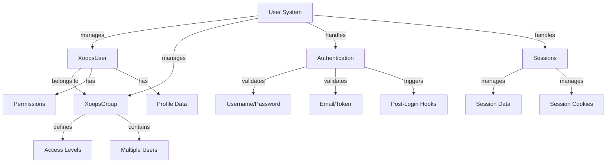

Το σύστημα χρήστη XOOPS διαχειρίζεται λογαριασμούς χρηστών, έλεγχο ταυτότητας, εξουσιοδότηση, ιδιότητα μέλους ομάδας και διαχείριση περιόδων σύνδεσης. Παρέχει ένα ισχυρό πλαίσιο για την ασφάλεια της εφαρμογής σας και τον έλεγχο της πρόσβασης των χρηστών.

## Αρχιτεκτονική Συστήματος Χρηστών



## XoopsUser Class

Η κύρια κατηγορία αντικειμένου χρήστη που αντιπροσωπεύει έναν λογαριασμό χρήστη.

## # Επισκόπηση τάξης

```php
namespace Xoops\Core\User;

class XoopsUser extends XoopsObject
{
    protected int $uid = 0;
    protected string $uname = '';
    protected string $email = '';
    protected string $pass = '';
    protected int $uregdate = 0;
    protected int $ulevel = 0;
    protected array $groups = [];
    protected array $permissions = [];
}
```

## # Κατασκευαστής

```php
public function __construct(int $uid = null)
```

Δημιουργεί ένα νέο αντικείμενο χρήστη, προαιρετικά φορτωμένο από τη βάση δεδομένων κατά αναγνωριστικό.

**Παράμετροι:**

| Παράμετρος | Τύπος | Περιγραφή |
|-----------|------|-------------|
| `$uid` | int | Αναγνωριστικό χρήστη για φόρτωση (προαιρετικό) |

**Παράδειγμα:**
```php
// Create new user
$user = new XoopsUser();

// Load existing user
$user = new XoopsUser(123);
```

## # Ιδιότητες πυρήνων

| Ακίνητα | Τύπος | Περιγραφή |
|----------|------|-------------|
| `uid` | int | Αναγνωριστικό χρήστη |
| `uname` | χορδή | Όνομα χρήστη |
| `email` | χορδή | Διεύθυνση ηλεκτρονικού ταχυδρομείου |
| `pass` | χορδή | Κατακερματισμός κωδικού πρόσβασης |
| `uregdate` | int | Χρονική σήμανση εγγραφής |
| `ulevel` | int | Επίπεδο χρήστη (9=διαχειριστής, 1=χρήστης) |
| `groups` | συστοιχία | Αναγνωριστικά ομάδας |
| `permissions` | συστοιχία | Σημαίες άδειας |

## # Βασικές Μέθοδοι

### # getID / getUid

Λαμβάνει το αναγνωριστικό του χρήστη.

```php
public function getID(): int
public function getUid(): int  // Alias
```

**Επιστροφές:** `int` - Αναγνωριστικό χρήστη

**Παράδειγμα:**
```php
$user = new XoopsUser(1);
echo $user->getID(); // 1
echo $user->getUid(); // 1
```

### # getUnameReal

Λαμβάνει το εμφανιζόμενο όνομα του χρήστη.

```php
public function getUnameReal(): string
```

**Επιστροφές:** `string` - Πραγματικό όνομα χρήστη

**Παράδειγμα:**
```php
$realName = $user->getUnameReal();
echo "Hello, $realName";
```

### # λάβετε Email

Λαμβάνει τη διεύθυνση email του χρήστη.

```php
public function getEmail(): string
```

**Επιστροφές:** `string` - Διεύθυνση ηλεκτρονικού ταχυδρομείου

**Παράδειγμα:**
```php
$email = $user->getEmail();
mail($email, 'Welcome', 'Welcome to XOOPS');
```

### # getVar / setVar

Λαμβάνει ή ορίζει μια μεταβλητή χρήστη.

```php
public function getVar(string $key, string $format = 's'): mixed
public function setVar(string $key, mixed $value, bool $notGpc = false): bool
```

**Παράδειγμα:**
```php
// Get values
$username = $user->getVar('uname');
$email = $user->getVar('email', 's'); // Formatted for display

// Set values
$user->setVar('uname', 'newusername');
$user->setVar('email', 'user@example.com');
```

### # getGroups

Λαμβάνει τις συνδρομές ομάδας χρηστών.

```php
public function getGroups(): array
```

**Επιστρέφει:** `array` - Συστοιχία αναγνωριστικών ομάδων

**Παράδειγμα:**
```php
$groups = $user->getGroups();
echo "Member of " . count($groups) . " groups";
```

### # isInGroup

Ελέγχει εάν ο χρήστης ανήκει σε μια ομάδα.

```php
public function isInGroup(int $groupId): bool
```

**Παράμετροι:**

| Παράμετρος | Τύπος | Περιγραφή |
|-----------|------|-------------|
| `$groupId` | int | Αναγνωριστικό ομάδας για έλεγχο |

**Επιστρέφει:** `bool` - Σωστό εάν είναι σε ομάδα

**Παράδειγμα:**
```php
if ($user->isInGroup(1)) { // 1 = Webmasters
    echo 'User is a webmaster';
}
```

### # είναι Διαχειριστής

Ελέγχει εάν ο χρήστης είναι διαχειριστής.

```php
public function isAdmin(): bool
```

**Επιστρέφει:** `bool` - Αληθές εάν admin

**Παράδειγμα:**
```php
if ($user->isAdmin()) {
    // Show admin controls
    echo '<a href="admin/">Admin Panel</a>';
}
```

### # getProfile

Λαμβάνει πληροφορίες προφίλ χρήστη.

```php
public function getProfile(): array
```

**Επιστροφές:** `array` - Δεδομένα προφίλ

**Παράδειγμα:**
```php
$profile = $user->getProfile();
echo 'Bio: ' . $profile['bio'];
```

### # είναι Ενεργό

Ελέγχει εάν ο λογαριασμός χρήστη είναι ενεργός.

```php
public function isActive(): bool
```

**Επιστρέφει:** `bool` - True εάν είναι ενεργό

**Παράδειγμα:**
```php
if ($user->isActive()) {
    // Allow user access
} else {
    // Restrict access
}
```

### # updateLastLogin

Ενημερώνει την τελευταία χρονική σήμανση σύνδεσης του χρήστη.

```php
public function updateLastLogin(): bool
```

**Επιστροφές:** `bool` - True on success

**Παράδειγμα:**
```php
if ($user->updateLastLogin()) {
    echo 'Login recorded';
}
```

## Τάξη XoopsGroup

Διαχειρίζεται ομάδες χρηστών και δικαιώματα.

## # Επισκόπηση τάξης

```php
namespace Xoops\Core\User;

class XoopsGroup extends XoopsObject
{
    protected int $groupid = 0;
    protected string $name = '';
    protected string $description = '';
    protected int $group_type = 0;
    protected array $users = [];
}
```

## # Σταθερές

| Σταθερά | Αξία | Περιγραφή |
|----------|-------|-------------|
| `TYPE_NORMAL` | 0 | Κανονική ομάδα χρηστών |
| `TYPE_ADMIN` | 1 | Διοικητική ομάδα |
| `TYPE_SYSTEM` | 2 | Ομάδα συστήματος |

## # Μέθοδοι

### # getName

Λαμβάνει το όνομα της ομάδας.

```php
public function getName(): string
```

**Επιστροφές:** `string` - Όνομα ομάδας

**Παράδειγμα:**
```php
$group = new XoopsGroup(1);
echo $group->getName(); // "Webmasters"
```

### # getDescription

Λαμβάνει την περιγραφή της ομάδας.

```php
public function getDescription(): string
```

**Επιστροφές:** `string` - Περιγραφή

**Παράδειγμα:**
```php
echo $group->getDescription();
```

### # getUsers

Λαμβάνει μέλη της ομάδας.

```php
public function getUsers(): array
```

**Επιστρέφει:** `array` - Συστοιχία αναγνωριστικών χρηστών

**Παράδειγμα:**
```php
$users = $group->getUsers();
echo "Group has " . count($users) . " members";
```

### # addUser

Προσθέτει έναν χρήστη στην ομάδα.

```php
public function addUser(int $uid): bool
```

**Παράμετροι:**

| Παράμετρος | Τύπος | Περιγραφή |
|-----------|------|-------------|
| `$uid` | int | Αναγνωριστικό χρήστη |

**Επιστροφές:** `bool` - True on success

**Παράδειγμα:**
```php
$group = new XoopsGroup(2); // Editors
$group->addUser(123);
$groupHandler->insert($group);
```

### # removeUser

Αφαιρεί έναν χρήστη από την ομάδα.

```php
public function removeUser(int $uid): bool
```

**Παράδειγμα:**
```php
$group->removeUser(123);
```

## Έλεγχος ταυτότητας χρήστη

## # Διαδικασία σύνδεσης

```php
/**
 * User login
 */
function xoops_user_login(string $uname, string $pass, bool $rememberMe = false): ?XoopsUser
{
    global $xoopsDB;

    // Sanitize username
    $uname = trim($uname);

    // Get user from database
    $query = $xoopsDB->prepare(
        'SELECT * FROM ' . $xoopsDB->prefix('users') .
        ' WHERE uname = ? AND active = 1'
    );
    $query->bind_param('s', $uname);
    $query->execute();
    $result = $query->get_result();

    if ($result->num_rows === 0) {
        return null; // User not found
    }

    $row = $result->fetch_assoc();

    // Verify password
    if (!password_verify($pass, $row['pass'])) {
        return null; // Invalid password
    }

    // Load user object
    $user = new XoopsUser($row['uid']);

    // Update last login
    $user->updateLastLogin();

    // Handle "Remember Me"
    if ($rememberMe) {
        // Set persistent cookie
        setcookie(
            'xoops_user_remember',
            $user->uid(),
            time() + (30 * 24 * 60 * 60), // 30 days
            '/',
            $_SERVER['HTTP_HOST'] ?? ''
        );
    }

    return $user;
}
```

## # Διαχείριση κωδικών πρόσβασης

```php
/**
 * Hash password securely
 */
function xoops_hash_password(string $password): string
{
    return password_hash($password, PASSWORD_BCRYPT, [
        'cost' => 12
    ]);
}

/**
 * Verify password
 */
function xoops_verify_password(string $password, string $hash): bool
{
    return password_verify($password, $hash);
}

/**
 * Check if password needs rehashing
 */
function xoops_password_needs_rehash(string $hash): bool
{
    return password_needs_rehash($hash, PASSWORD_BCRYPT, [
        'cost' => 12
    ]);
}
```

## Διαχείριση συνεδρίας

## # Τάξη συνεδρίας

```php
namespace Xoops\Core;

class SessionManager
{
    protected array $data = [];
    protected string $sessionId = '';

    public function start(): void {}
    public function get(string $key): mixed {}
    public function set(string $key, mixed $value): void {}
    public function destroy(): void {}
}
```

## # Μέθοδοι συνεδρίας

### # Έναρξη συνεδρίας

```php
<?php
session_start();

// Regenerate session ID for security
session_regenerate_id(true);

// Set session timeout
ini_set('session.gc_maxlifetime', 3600); // 1 hour

// Store user in session
if ($user) {
    $_SESSION['xoops_user'] = $user;
    $_SESSION['xoops_uid'] = $user->getID();
    $_SESSION['xoops_uname'] = $user->getVar('uname');
}
```

### # Έλεγχος συνεδρίας

```php
/**
 * Get current user from session
 */
function xoops_get_current_user(): ?XoopsUser
{
    if (isset($_SESSION['xoops_user']) && $_SESSION['xoops_user'] instanceof XoopsUser) {
        return $_SESSION['xoops_user'];
    }
    return null;
}

/**
 * Check if user is logged in
 */
function xoops_is_user_logged_in(): bool
{
    return isset($_SESSION['xoops_uid']) && $_SESSION['xoops_uid'] > 0;
}
```

### # Destroy Session

```php
/**
 * User logout
 */
function xoops_user_logout()
{
    global $xoopsUser;

    // Log the logout
    if ($xoopsUser) {
        error_log('User ' . $xoopsUser->getVar('uname') . ' logged out');
    }

    // Destroy session data
    $_SESSION = [];

    // Delete session cookie
    if (ini_get('session.use_cookies')) {
        $params = session_get_cookie_params();
        setcookie(
            session_name(),
            '',
            time() - 42000,
            $params['path'],
            $params['domain'],
            $params['secure'],
            $params['httponly']
        );
    }

    // Destroy session
    session_destroy();
}
```

## Σύστημα αδειών

## # Σταθερές άδειας

| Σταθερά | Αξία | Περιγραφή |
|----------|-------|-------------|
| `XOOPS_PERMISSION_NONE` | 0 | Χωρίς άδεια |
| `XOOPS_PERMISSION_VIEW` | 1 | Προβολή περιεχομένου |
| `XOOPS_PERMISSION_SUBMIT` | 2 | Υποβολή περιεχομένου |
| `XOOPS_PERMISSION_EDIT` | 4 | Επεξεργασία περιεχομένου |
| `XOOPS_PERMISSION_DELETE` | 8 | Διαγραφή περιεχομένου |
| `XOOPS_PERMISSION_ADMIN` | 16 | Πρόσβαση διαχειριστή |

## # Έλεγχος άδειας

```php
/**
 * Check if user has permission
 */
function xoops_check_permission($user, $resource, $permission)
{
    if (!$user) {
        return false;
    }

    // Admins have all permissions
    if ($user->isAdmin()) {
        return true;
    }

    // Check group permissions
    $groups = $user->getGroups();
    foreach ($groups as $groupId) {
        if (xoops_group_has_permission($groupId, $resource, $permission)) {
            return true;
        }
    }

    return false;
}
```

## Χειριστής χρήστη

Το UserHandler διαχειρίζεται τις λειτουργίες επιμονής χρήστη.

```php
/**
 * Get user handler
 */
$userHandler = xoops_getHandler('user');

/**
 * Create new user
 */
$user = new XoopsUser();
$user->setVar('uname', 'newuser');
$user->setVar('email', 'user@example.com');
$user->setVar('pass', xoops_hash_password('password123'));
$user->setVar('uregdate', time());
$user->setVar('uactive', 1);

if ($userHandler->insert($user)) {
    echo 'User created with ID: ' . $user->getID();
}

/**
 * Update user
 */
$user = $userHandler->get(123);
$user->setVar('email', 'newemail@example.com');
$userHandler->insert($user);

/**
 * Get user by name
 */
$user = $userHandler->findByUsername('john');

/**
 * Delete user
 */
$userHandler->delete($user);

/**
 * Search users
 */
$criteria = new CriteriaCompo();
$criteria->add(new Criteria('uname', '%admin%', 'LIKE'));
$users = $userHandler->getObjects($criteria);
```

## Παράδειγμα ολοκληρωμένης διαχείρισης χρηστών

```php
<?php
/**
 * Complete user authentication and profile example
 */

require_once XOOPS_ROOT_PATH . '/include/common.inc.php';

$xoopsUser = $GLOBALS['xoopsUser'];

// Check if user is logged in
if (!$xoopsUser || !$xoopsUser->isActive()) {
    redirect_header(XOOPS_URL, 3, 'Please login');
}

// Get user handler
$userHandler = xoops_getHandler('user');

// Get current user with fresh data
$currentUser = $userHandler->get($xoopsUser->getID());

// User profile page
echo '<h1>Profile: ' . htmlspecialchars($currentUser->getVar('uname')) . '</h1>';

echo '<div class="user-profile">';
echo '<p><strong>Username:</strong> ' . htmlspecialchars($currentUser->getVar('uname')) . '</p>';
echo '<p><strong>Email:</strong> ' . htmlspecialchars($currentUser->getVar('email')) . '</p>';
echo '<p><strong>Registered:</strong> ' . date('Y-m-d H:i:s', $currentUser->getVar('uregdate')) . '</p>';
echo '<p><strong>Groups:</strong> ';

$groupHandler = xoops_getHandler('group');
$groups = $currentUser->getGroups();
$groupNames = [];
foreach ($groups as $groupId) {
    $group = $groupHandler->get($groupId);
    if ($group) {
        $groupNames[] = htmlspecialchars($group->getName());
    }
}
echo implode(', ', $groupNames);
echo '</p>';

// Admin status
if ($currentUser->isAdmin()) {
    echo '<p><strong>Status:</strong> Administrator</p>';
}

echo '</div>';

// Change password form
if ($_SERVER['REQUEST_METHOD'] === 'POST' && !empty($_POST['change_password'])) {
    $oldPassword = $_POST['old_password'] ?? '';
    $newPassword = $_POST['new_password'] ?? '';
    $confirmPassword = $_POST['confirm_password'] ?? '';

    // Verify old password
    if (!password_verify($oldPassword, $currentUser->getVar('pass'))) {
        echo '<div class="error">Current password is incorrect</div>';
    } elseif ($newPassword !== $confirmPassword) {
        echo '<div class="error">New passwords do not match</div>';
    } elseif (strlen($newPassword) < 6) {
        echo '<div class="error">Password must be at least 6 characters</div>';
    } else {
        // Update password
        $currentUser->setVar('pass', xoops_hash_password($newPassword));
        if ($userHandler->insert($currentUser)) {
            echo '<div class="success">Password changed successfully</div>';
        } else {
            echo '<div class="error">Failed to update password</div>';
        }
    }
}

// Password change form
echo '<form method="post">';
echo '<h3>Change Password</h3>';
echo '<div class="form-group">';
echo '<label>Current Password:</label>';
echo '<input type="password" name="old_password" required>';
echo '</div>';
echo '<div class="form-group">';
echo '<label>New Password:</label>';
echo '<input type="password" name="new_password" required>';
echo '</div>';
echo '<div class="form-group">';
echo '<label>Confirm Password:</label>';
echo '<input type="password" name="confirm_password" required>';
echo '</div>';
echo '<button type="submit" name="change_password">Change Password</button>';
echo '</form>';
```

## Βέλτιστες πρακτικές

1. **Κωδικοί κατακερματισμού** - Χρησιμοποιείτε πάντα bcrypt ή argon2 για κατακερματισμό κωδικού πρόσβασης
2. **Validate Input** - Επικύρωση και απολύμανση όλων των εισόδων χρήστη
3. **Έλεγχος δικαιωμάτων** - Επαληθεύστε πάντα τα δικαιώματα χρήστη πριν από ενέργειες
4. **Χρησιμοποιήστε τις περιόδους σύνδεσης με ασφάλεια** - Αναδημιουργήστε τα αναγνωριστικά περιόδου σύνδεσης κατά τη σύνδεση
5. **Δραστηριότητες καταγραφής** - Σύνδεση σύνδεσης, αποσύνδεση και κρίσιμες ενέργειες
6. **Περιορισμός ποσοστού** - Εφαρμογή περιορισμού ποσοστού προσπάθειας σύνδεσης
7. **HTTPS Μόνο** - Να χρησιμοποιείτε πάντα HTTPS για έλεγχο ταυτότητας
8. **Διαχείριση ομάδας** - Χρησιμοποιήστε ομάδες για οργάνωση αδειών

## Σχετική τεκμηρίωση

- ../Kernel/Kernel-Classes - Υπηρεσίες πυρήνα και bootstrapping
- ../Database/QueryBuilder - Ερωτήματα βάσης δεδομένων για δεδομένα χρήστη
- ../Core/XoopsObject - Βασική κλάση αντικειμένου

---

*Δείτε επίσης: [XOOPS Χρήστης API](https://github.com/XOOPS/XoopsCore27/tree/master/htdocs/class) | [PHP Ασφάλεια](https://www.php.net/manual/en/book.password.php)*
