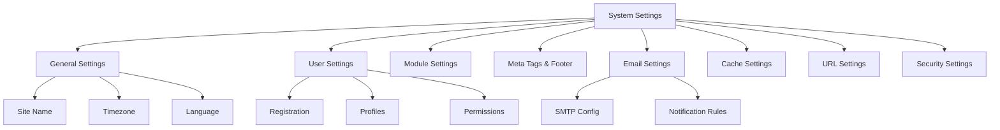

# XOOPS Ρυθμίσεις συστήματος

Αυτός ο οδηγός καλύπτει τις πλήρεις ρυθμίσεις συστήματος που είναι διαθέσιμες στον πίνακα διαχείρισης XOOPS, οργανωμένες ανά κατηγορία.

## Αρχιτεκτονική ρυθμίσεων συστήματος



## Πρόσβαση στις ρυθμίσεις συστήματος

## # Τοποθεσία

**Πίνακας διαχειριστή > Σύστημα > Προτιμήσεις**

Ή πλοηγηθείτε απευθείας:

```
http://your-domain.com/xoops/admin/index.php?fct=preferences
```

## # Απαιτήσεις άδειας

- Μόνο οι διαχειριστές (webmasters) έχουν πρόσβαση στις ρυθμίσεις συστήματος
- Οι αλλαγές επηρεάζουν ολόκληρο τον ιστότοπο
- Οι περισσότερες αλλαγές τίθενται σε ισχύ αμέσως

## Γενικές ρυθμίσεις

Η βασική διαμόρφωση για την εγκατάσταση XOOPS.

## # Βασικές πληροφορίες

```
Site Name: [Your Site Name]
Default Description: [Brief description of your site]
Site Slogan: [Catchy slogan]
Admin Email: admin@your-domain.com
Webmaster Name: Administrator Name
Webmaster Email: admin@your-domain.com
```

## # Ρυθμίσεις εμφάνισης

```
Default Theme: [Select theme]
Default Language: English (or preferred language)
Items Per Page: 15 (typically 10-25)
Words in Snippet: 25 (for search results)
Theme Upload Permission: Disabled (security)
```

## # Τοπικές ρυθμίσεις

```
Default Timezone: [Your timezone]
Date Format: %Y-%m-%d (YYYY-MM-DD format)
Time Format: %H:%M:%S (HH:MM:SS format)
Daylight Saving Time: [Auto/Manual/None]
```

**Πίνακας μορφής ζώνης ώρας:**

| Περιφέρεια | Ζώνη ώρας | UTC Μετατόπιση |
|---|---|---|
| Ανατολική ΗΠΑ | America/New_York | -5 / -4 |
| Κεντρική ΗΠΑ | America/Chicago | -6 / -5 |
| Βουνό ΗΠΑ | America/Denver | -7 / -6 |
| ΗΠΑ Ειρηνικός | America/Los_Angeles | -8 / -7 |
| UK/London | Europe/London | 0 / +1 |
| France/Germany | Europe/Paris | +1 / +2 |
| Ιαπωνία | Asia/Tokyo | +9 |
| Κίνα | Asia/Shanghai | +8 |
| Australia/Sydney | Australia/Sydney | +10 / +11 |

## # Διαμόρφωση αναζήτησης

```
Enable Search: Yes
Search Admin Pages: Yes/No
Search Archives: Yes
Default Search Type: All / Pages only
Words Excluded from Search: [Comma-separated list]
```

**Συνήθεις εξαιρούμενες λέξεις:** τα, α, ένα, και, ή, αλλά, σε, επί, σε, από, προς, από

## Ρυθμίσεις χρήστη

Ελέγξτε τη συμπεριφορά του λογαριασμού χρήστη και τη διαδικασία εγγραφής.

## # Εγγραφή χρήστη

```
Allow User Registration: Yes/No
Registration Type:
  ☐ Auto-activate (Instant access)
  ☐ Admin approval (Admin must approve)
  ☐ Email verification (User must verify email)

Notification to Users: Yes/No
User Email Verification: Required/Optional
```

## # Διαμόρφωση νέου χρήστη

```
Auto-login New Users: Yes/No
Assign Default User Group: Yes
Default User Group: [Select group]
Create User Avatar: Yes/No
Initial User Avatar: [Select default]
```

## # Ρυθμίσεις προφίλ χρήστη

```
Allow User Profiles: Yes
Show Member List: Yes
Show User Statistics: Yes
Show Last Online Time: Yes
Allow User Avatar: Yes
Avatar Max File Size: 100KB
Avatar Dimensions: 100x100 pixels
```

## # Ρυθμίσεις email χρήστη

```
Allow Users to Hide Email: Yes
Show Email on Profile: Yes
Notification Email Interval: Immediately/Daily/Weekly/Never
```

## # Παρακολούθηση δραστηριότητας χρήστη

```
Track User Activity: Yes
Log User Logins: Yes
Log Failed Logins: Yes
Track IP Address: Yes
Clear Activity Logs Older Than: 90 days
```

## # Όρια λογαριασμού

```
Allow Duplicate Email: No
Minimum Username Length: 3 characters
Maximum Username Length: 15 characters
Minimum Password Length: 6 characters
Require Special Characters: Yes
Require Numbers: Yes
Password Expiration: 90 days (or Never)
Accounts Inactive Days to Delete: 365 days
```

## Ρυθμίσεις μονάδας

Διαμόρφωση συμπεριφοράς μεμονωμένης μονάδας.

## # Επιλογές κοινής μονάδας

Για κάθε εγκατεστημένη μονάδα, μπορείτε να ορίσετε:

```
Module Status: Active/Inactive
Display in Menu: Yes/No
Module Weight: [1-999] (higher = lower in display)
Homepage Default: This module shows when visiting /
Admin Access: [Allowed user groups]
User Access: [Allowed user groups]
```

## # Ρυθμίσεις μονάδας συστήματος

```
Show Homepage as: Portal / Module / Static Page
Default Homepage Module: [Select module]
Show Footer Menu: Yes
Footer Color: [Color selector]
Show System Stats: Yes
Show Memory Usage: Yes
```

## # Διαμόρφωση ανά μονάδα

Κάθε ενότητα μπορεί να έχει ρυθμίσεις για συγκεκριμένες μονάδες:

**Παράδειγμα - Ενότητα σελίδας:**
```
Enable Comments: Yes/No
Moderate Comments: Yes/No
Comments Per Page: 10
Enable Ratings: Yes
Allow Anonymous Ratings: Yes
```

**Παράδειγμα - Ενότητα χρήστη:**
```
Avatar Upload Folder: ./uploads/
Maximum Upload Size: 100KB
Allow File Upload: Yes
Allowed File Types: jpg, gif, png
```

Πρόσβαση σε ρυθμίσεις για συγκεκριμένες μονάδες:
- **Διαχειριστής > Ενότητες > [Όνομα ενότητας] > Προτιμήσεις**

## Meta Tags & SEO Ρυθμίσεις

Διαμόρφωση μετα-ετικέτες για βελτιστοποίηση μηχανών αναζήτησης.

## # Παγκόσμιες μετα-ετικέτες

```
Meta Keywords: xoops, cms, content management system
Meta Description: A powerful content management system for building dynamic websites
Meta Author: Your Name
Meta Copyright: Copyright 2025, Your Company
Meta Robots: index, follow
Meta Revisit: 30 days
```

## # Βέλτιστες πρακτικές Meta Tag

| Ετικέτα | Σκοπός | Σύσταση |
|---|---|---|
| Λέξεις-κλειδιά | Όροι αναζήτησης | 5-10 σχετικές λέξεις-κλειδιά, διαχωρισμένες με κόμμα |
| Περιγραφή | Αναζήτηση καταχώρισης | 150-160 χαρακτήρες |
| Συγγραφέας | Δημιουργός σελίδας | Το όνομα ή η εταιρεία σας |
| Πνευματικά δικαιώματα | Νομική | Η σημείωση πνευματικών δικαιωμάτων σας |
| Ρομπότ | Οδηγίες ανιχνευτή | index, follow (επιτρέπεται η ευρετηρίαση) |

## # Ρυθμίσεις υποσέλιδου

```
Show Footer: Yes
Footer Color: Dark/Light
Footer Background: [Color code]
Footer Text: [HTML allowed]
Additional Footer Links: [URL and text pairs]
```

**Δείγμα υποσέλιδου HTML:**
```html
<p>Copyright &copy; 2025 Your Company. All rights reserved.</p>
<p><a href="/privacy">Privacy Policy</a> | <a href="/terms">Terms of Use</a></p>
```

## # Μετα-ετικέτες κοινωνικής δικτύωσης (ανοιχτό γράφημα)

```
Enable Open Graph: Yes
Facebook App ID: [App ID]
Twitter Card Type: summary / summary_large_image / player
Default Share Image: [Image URL]
```

## Ρυθμίσεις email

Διαμόρφωση συστήματος παράδοσης και ειδοποίησης email.

## # Μέθοδος παράδοσης email

```
Use SMTP: Yes/No

If SMTP:
  SMTP Host: smtp.gmail.com
  SMTP Port: 587 (TLS) or 465 (SSL)
  SMTP Security: TLS / SSL / None
  SMTP Username: [email@example.com]
  SMTP Password: [password]
  SMTP Authentication: Yes/No
  SMTP Timeout: 10 seconds

If PHP mail():
  Sendmail Path: /usr/sbin/sendmail -t -i
```

## # Διαμόρφωση email

```
From Address: noreply@your-domain.com
From Name: Your Site Name
Reply-To Address: support@your-domain.com
BCC Admin Emails: Yes/No
```

## # Ρυθμίσεις ειδοποιήσεων

```
Send Welcome Email: Yes/No
Welcome Email Subject: Welcome to [Site Name]
Welcome Email Body: [Custom message]

Send Password Reset Email: Yes/No
Include Random Password: Yes/No
Token Expiration: 24 hours
```

## # Ειδοποιήσεις διαχειριστή

```
Notify Admin on Registration: Yes
Notify Admin on Comments: Yes
Notify Admin on Submissions: Yes
Notify Admin on Errors: Yes
```

## # Ειδοποιήσεις χρηστών

```
Notify User on Registration: Yes
Notify User on Comments: Yes
Notify User on Private Messages: Yes
Allow Users to Disable Notifications: Yes
Default Notification Frequency: Immediately
```

## # Πρότυπα email

Προσαρμόστε τα email ειδοποιήσεων στον πίνακα διαχείρισης:

**Διαδρομή:** Σύστημα > Πρότυπα email

Διαθέσιμα πρότυπα:
- Εγγραφή χρήστη
- Επαναφορά κωδικού πρόσβασης
- Ειδοποίηση σχολίων
- Ιδιωτικό μήνυμα
- Ειδοποιήσεις συστήματος
- Μηνύματα ηλεκτρονικού ταχυδρομείου για συγκεκριμένες μονάδες

## Ρυθμίσεις προσωρινής μνήμης

Βελτιστοποιήστε την απόδοση μέσω της προσωρινής αποθήκευσης.

## # Διαμόρφωση προσωρινής μνήμης

```
Enable Caching: Yes/No
Cache Type:
  ☐ File Cache
  ☐ APCu (Alternative PHP Cache)
  ☐ Memcache (Distributed caching)
  ☐ Redis (Advanced caching)

Cache Lifetime: 3600 seconds (1 hour)
```

## # Επιλογές προσωρινής μνήμης κατά τύπο

**Κρυφή μνήμη αρχείου:**
```
Cache Directory: /var/www/html/xoops/cache/
Clear Interval: Daily
Maximum Cache Files: 1000
```

** APCu Cache:**
```
Memory Allocation: 128MB
Fragmentation Level: Low
```

**Memcache/Redis:**
```
Server Host: localhost
Server Port: 11211 (Memcache) / 6379 (Redis)
Persistent Connection: Yes
```

## # Τι αποθηκεύεται στην κρυφή μνήμη

```
Cache Module Lists: Yes
Cache Configuration Data: Yes
Cache Template Data: Yes
Cache User Session Data: Yes
Cache Search Results: Yes
Cache Database Queries: Yes
Cache RSS Feeds: Yes
Cache Images: Yes
```

## URL Ρυθμίσεις

Διαμόρφωση URL επανεγγραφής και μορφοποίησης.

## # Φιλικές URL Ρυθμίσεις

```
Enable Friendly URLs: Yes/No
Friendly URL Type:
  ☐ Path Info: /page/about
  ☐ Query String: /index.php?p=about

Trailing Slash: Include / Omit
URL Case: Lower case / Case sensitive
```

## # URL Επανεγγραφή κανόνων

```
.htaccess Rules: [Display current]
Nginx Rules: [Display current if Nginx]
IIS Rules: [Display current if IIS]
```

## Ρυθμίσεις ασφαλείας

Ελέγξτε τη διαμόρφωση που σχετίζεται με την ασφάλεια.

## # Ασφάλεια κωδικού πρόσβασης

```
Password Policy:
  ☐ Require uppercase letters
  ☐ Require lowercase letters
  ☐ Require numbers
  ☐ Require special characters

Minimum Password Length: 8 characters
Password Expiration: 90 days
Password History: Remember last 5 passwords
Force Password Change: On next login
```

## # Ασφάλεια σύνδεσης

```
Lock Account After Failed Attempts: 5 attempts
Lock Duration: 15 minutes
Log All Login Attempts: Yes
Log Failed Logins: Yes
Admin Login Alert: Send email on admin login
Two-Factor Authentication: Disabled/Enabled
```

## # Ασφάλεια μεταφόρτωσης αρχείων

```
Allow File Uploads: Yes/No
Maximum File Size: 128MB
Allowed File Types: jpg, gif, png, pdf, zip, doc, docx
Scan Uploads for Malware: Yes (if available)
Quarantine Suspicious Files: Yes
```

## # Ασφάλεια συνεδρίας

```
Session Management: Database/Files
Session Timeout: 1800 seconds (30 min)
Session Cookie Lifetime: 0 (until browser closes)
Secure Cookie: Yes (HTTPS only)
HTTP Only Cookie: Yes (prevent JavaScript access)
```

## # CORS Ρυθμίσεις

```
Allow Cross-Origin Requests: No
Allowed Origins: [List domains]
Allow Credentials: No
Allowed Methods: GET, POST
```

## Προηγμένες ρυθμίσεις

Πρόσθετες επιλογές διαμόρφωσης για προχωρημένους χρήστες.

## # Λειτουργία εντοπισμού σφαλμάτων

```
Debug Mode: Disabled/Enabled
Log Level: Error / Warning / Info / Debug
Debug Log File: /var/log/xoops_debug.log
Display Errors: Disabled (production)
```

## # Performance Tuning

```
Optimize Database Queries: Yes
Use Query Cache: Yes
Compress Output: Yes
Minify CSS/JavaScript: Yes
Lazy Load Images: Yes
```

## # Ρυθμίσεις περιεχομένου

```
Allow HTML in Posts: Yes/No
Allowed HTML Tags: [Configure]
Strip Harmful Code: Yes
Allow Embed: Yes/No
Content Moderation: Automatic/Manual
Spam Detection: Yes
```

## Ρυθμίσεις Export/Import

## # Ρυθμίσεις δημιουργίας αντιγράφων ασφαλείας

Εξαγωγή τρεχουσών ρυθμίσεων:

**Πίνακας διαχειριστή > Σύστημα > Εργαλεία > Ρυθμίσεις εξαγωγής**

```bash
# Settings exported as JSON file
# Download and store securely
```

## # Επαναφορά ρυθμίσεων

Εισαγωγή ρυθμίσεων που έχουν εξαχθεί προηγουμένως:

**Πίνακας διαχειριστή > Σύστημα > Εργαλεία > Ρυθμίσεις εισαγωγής**

```bash
# Upload JSON file
# Verify changes before confirming
```

## Ιεραρχία διαμόρφωσης

XOOPS ιεραρχία ρυθμίσεων (από πάνω προς τα κάτω - νίκες πρώτου αγώνα):

```
1. mainfile.php (Constants)
2. Module-specific config
3. Admin System Settings
4. Theme configuration
5. User preferences (for user-specific settings)
```

## Ρυθμίσεις Backup Script

Δημιουργήστε ένα αντίγραφο ασφαλείας των τρεχουσών ρυθμίσεων:

```php
<?php
// Backup script: /var/www/html/xoops/backup-settings.php
require_once __DIR__ . '/mainfile.php';

$config_handler = xoops_getHandler('config');
$configs = $config_handler->getConfigs();

$backup = [
    'exported_date' => date('Y-m-d H:i:s'),
    'xoops_version' => XOOPS_VERSION,
    'php_version' => PHP_VERSION,
    'settings' => []
];

foreach ($configs as $config) {
    $backup['settings'][$config->getVar('conf_name')] = [
        'value' => $config->getVar('conf_value'),
        'description' => $config->getVar('conf_desc'),
        'type' => $config->getVar('conf_type'),
    ];
}

// Save to JSON file
file_put_contents(
    '/backups/xoops_settings_' . date('YmdHis') . '.json',
    json_encode($backup, JSON_PRETTY_PRINT)
);

echo "Settings backed up successfully!";
?>
```

## Κοινές αλλαγές ρυθμίσεων

## # Αλλαγή ονόματος τοποθεσίας

1. Διαχειριστής > Σύστημα > Προτιμήσεις > Γενικές ρυθμίσεις
2. Τροποποίηση "Όνομα ιστότοπου"
3. Κάντε κλικ στο "Αποθήκευση"

## # Enable/Disable Εγγραφή

1. Διαχειριστής > Σύστημα > Προτιμήσεις > Ρυθμίσεις χρήστη
2. Εναλλαγή "Να επιτρέπεται η εγγραφή χρήστη"
3. Επιλέξτε τύπο εγγραφής
4. Κάντε κλικ στο "Αποθήκευση"

## # Αλλαγή προεπιλεγμένου θέματος

1. Διαχειριστής > Σύστημα > Προτιμήσεις > Γενικές ρυθμίσεις
2. Επιλέξτε "Προεπιλεγμένο θέμα"
3. Κάντε κλικ στο "Αποθήκευση"
4. Εκκαθαρίστε την προσωρινή μνήμη για να τεθούν σε ισχύ οι αλλαγές

## # Ενημέρωση email επικοινωνίας

1. Διαχειριστής > Σύστημα > Προτιμήσεις > Γενικές ρυθμίσεις
2. Τροποποίηση "Email διαχειριστή"
3. Τροποποίηση "Ηλεκτρονικό ταχυδρομείο webmaster"
4. Κάντε κλικ στο "Αποθήκευση"

## Λίστα ελέγχου επαλήθευσης

Αφού διαμορφώσετε τις ρυθμίσεις συστήματος, επαληθεύστε:

- [ ] Το όνομα της τοποθεσίας εμφανίζεται σωστά
- [ ] Η ζώνη ώρας δείχνει τη σωστή ώρα
- [ ] Οι ειδοποιήσεις email αποστέλλονται σωστά
- [ ] Η εγγραφή χρήστη λειτουργεί όπως έχει ρυθμιστεί
- [ ] Η αρχική σελίδα εμφανίζει την επιλεγμένη προεπιλογή
- [ ] Η λειτουργία αναζήτησης λειτουργεί
- [ ] Η προσωρινή μνήμη βελτιώνει τον χρόνο φόρτωσης της σελίδας
- [ ] Οι φιλικές διευθύνσεις URL λειτουργούν (αν είναι ενεργοποιημένες)
- [ ] Οι μετα-ετικέτες εμφανίζονται στην πηγή της σελίδας
- [ ] Λήφθηκαν ειδοποιήσεις διαχειριστή
- [ ] Οι ρυθμίσεις ασφαλείας επιβλήθηκαν

## Ρυθμίσεις αντιμετώπισης προβλημάτων

## # Οι ρυθμίσεις δεν αποθηκεύονται

**Λύση:**
```bash
# Check file permissions on config directory
chmod 755 /var/www/html/xoops/var/

# Verify database writable
# Try saving again in admin panel
```

## # Οι αλλαγές δεν ισχύουν

**Λύση:**
```bash
# Clear cache
rm -rf /var/www/html/xoops/cache/*
rm -rf /var/www/html/xoops/templates_c/*

# If still not working, restart web server
systemctl restart apache2
```

## # Το email δεν αποστέλλεται

**Λύση:**
1. Επαληθεύστε τα διαπιστευτήρια SMTP στις ρυθμίσεις email
2. Δοκιμή με το κουμπί "Αποστολή δοκιμαστικού email".
3. Ελέγξτε τα αρχεία καταγραφής σφαλμάτων
4. Δοκιμάστε να χρησιμοποιήσετε το PHP mail() αντί για το SMTP

## Επόμενα βήματα

Μετά τη διαμόρφωση των ρυθμίσεων συστήματος:

1. Διαμορφώστε τις ρυθμίσεις ασφαλείας
2. Βελτιστοποιήστε την απόδοση
3. Εξερευνήστε τις δυνατότητες του πίνακα διαχείρισης
4. Ρυθμίστε τη διαχείριση χρηστών

---

**Ετικέτες:** #system-settings #configuration #preferences #admin-panel

**Σχετικά άρθρα:**
- ../../06-Publisher-Module/User-Guide/Basic-Configuration
- Ασφάλεια-Διαμόρφωση
- Απόδοση-Βελτιστοποίηση
- ../First-Steps/Admin-Panel-Overview
