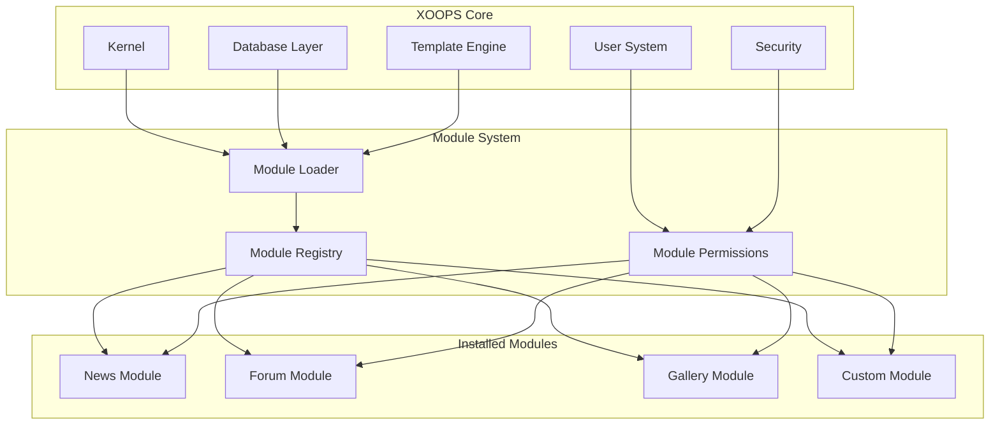
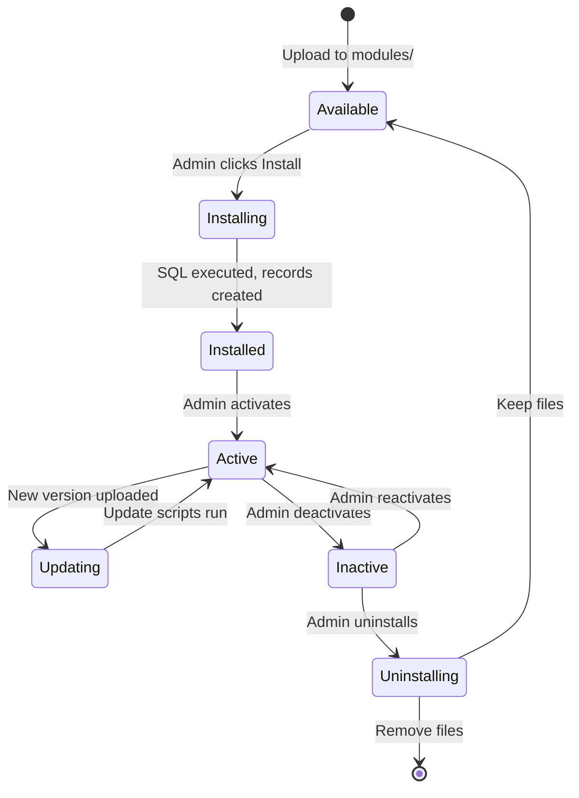

# ADR-001: Modular Architecture

> Αρχείο απόφασης αρχιτεκτονικής για τη βασική φιλοσοφία αρθρωτού σχεδιασμού του XOOPS.

---

## Κατάσταση

**Εγκρίθηκε** - Θεμελιώδης απόφαση από την έναρξη του XOOPS

---

## Περιεχόμενο

Το XOOPS (eXtensible Object-Oriented Portal System) χρειαζόταν μια αρχιτεκτονική που θα:

1. Επιτρέψτε σε τρίτους προγραμματιστές να επεκτείνουν τη λειτουργικότητα
2. Δώστε τη δυνατότητα στους διαχειριστές του ιστότοπου να προσαρμόζουν χωρίς κωδικοποίηση
3. Υποστήριξη ανεξάρτητης ανάπτυξης και ενημερώσεων
4. Παρέχετε απομόνωση μεταξύ διαφορετικών χαρακτηριστικών
5. Κλίμακα από απλά ιστολόγια σε πολύπλοκες πύλες

Το τοπίο CMS των αρχών της δεκαετίας του 2000 προσέφερε μονολιθικά συστήματα που ήταν δύσκολο να προσαρμοστούν και να επεκταθούν.

---

## Διάγραμμα απόφασης



---

## Απόφαση

Θα εφαρμόσουμε μια **αρθρωτή αρχιτεκτονική** όπου:

## # 1. Ο πυρήνας παρέχει υποδομή
- Αφαίρεση βάσης δεδομένων
- Έλεγχος ταυτότητας χρήστη και δικαιώματα
- Απόδοση προτύπου (Smarty)
- Υπηρεσίες ασφαλείας
- Δημιουργία φόρμας
- Κοινές υπηρεσίες κοινής ωφέλειας

## # 2. Οι ενότητες είναι αυτόνομες
Κάθε ενότητα:
- Έχει τη δική του δομή καταλόγου
- Περιέχει τις δικές του κλάσεις, πρότυπα, SQL
- Ορίζει τη δική του διαμόρφωση
- Μπορεί να είναι installed/uninstalled ανεξάρτητα
- Διαθέτει παρακολούθηση έκδοσης

## # 3. Τυπική δομή μονάδας
```
modules/modulename/
├── admin/                  # Admin interface
│   ├── index.php
│   └── menu.php
├── class/                  # PHP classes
├── include/                # Include files
├── language/               # Translations
├── sql/                    # Database schema
├── templates/              # Smarty templates
├── blocks/                 # Block definitions
├── xoops_version.php       # Module manifest
├── index.php               # Entry point
└── header.php              # Module bootstrap
```

## # 4. Μανιφέστο ενότητας (xoops_version.php)
```php
<?php
$modversion['name']        = 'Module Name';
$modversion['version']     = '1.0.0';
$modversion['description'] = 'Module description';
$modversion['dirname']     = basename(__DIR__);
$modversion['hasMain']     = 1;
$modversion['hasAdmin']    = 1;
$modversion['sqlfile']['mysql'] = 'sql/mysql.sql';
$modversion['tables']      = ['modulename_table1'];
$modversion['templates']   = [...];
$modversion['config']      = [...];
$modversion['blocks']      = [...];
```

## # 5. Ενότητα Επικοινωνίας
- Μέσω βασικών API (χειριστές, συμβάντα)
- Σχέσεις βάσεων δεδομένων
- Προφόρτωση γάντζων
- Κοινόχρηστες υπηρεσίες

---

## Κύκλος ζωής ενότητας



---

## Συνέπειες

## # Θετικό

1. **Επεκτασιμότητα**: Χιλιάδες ενότητες που δημιουργήθηκαν από την κοινότητα
2. **Ανεξαρτησία**: Οι ενότητες μπορούν να αναπτυχθούν ξεχωριστά
3. **Ευελιξία**: Οι ιστότοποι μπορούν να συνδυάζουν και να ταιριάζουν χαρακτηριστικά
4. **Δυνατότητα συντήρησης**: Οι ενημερώσεις δεν επηρεάζουν άλλες μονάδες
5. **Marketplace**: Εμφανίστηκε το οικοσύστημα ενότητας
6. **Καμπύλη μάθησης**: Οι προγραμματιστές μαθαίνουν ένα μοτίβο

## # Αρνητικό

1. **Γενικά έξοδα**: Κάθε ενότητα έχει κόστος εκκίνησης
2. **Αντιγραφή**: Ο κοινός κωδικός μπορεί να επαναληφθεί
3. **Ενσωμάτωση**: Τα χαρακτηριστικά πολλαπλών μονάδων χρειάζονται προσεκτικό σχεδιασμό
4. **Έκδοση**: Απαιτείται διαχείριση συμβατότητας μονάδας
5. **Διακύμανση ποιότητας**: Η ποιότητα της μονάδας τρίτου κατασκευαστή ποικίλλει

## # Ουδέτερο

1. **Βάση δεδομένων**: Κάθε λειτουργική μονάδα διαχειρίζεται τους δικούς της πίνακες
2. **Πρότυπα**: Το θέμα πρέπει να φιλοξενεί διάφορες ενότητες
3. **Ενημερώσεις**: Ο πυρήνας και οι μονάδες ενημερώνονται ανεξάρτητα

---

## Εξετάζονται εναλλακτικές λύσεις

## # 1. Μονολιθική Αρχιτεκτονική
**Απορρίφθηκε** - Πολύ άκαμπτο, δύσκολο να προσαρμοστεί

## # 2. Αρχιτεκτονική προσθηκών (στυλ WordPress)
**Μερικώς εγκρίθηκε** - Τα μπλοκ και οι προφορτώσεις παρέχουν άγκιστρα τύπου πρόσθετων εντός των λειτουργικών μονάδων

## # 3. Αρχιτεκτονική στοιχείων (στυλ Joomla)
**Απορρίφθηκε** - Πιο περίπλοκο, λιγότερο φιλικό προς τους προγραμματιστές

## # 4. Μικροϋπηρεσίες
**Δεν ισχύει** - Πολύ περίπλοκο για την εποχή κοινής φιλοξενίας

---

## Σχετικές Αποφάσεις

- ADR-002: Αντικειμενοστραφή πρόσβαση σε βάση δεδομένων
- ADR-003: Smarty Template Engine
- ADR-005: Σύστημα αδειών

---

## Αναφορές

- XOOPS Ιστορικό έργου
- PHP Μοτίβα Αρχιτεκτονικής Εφαρμογών
- CMS Συγκριτικές Μελέτες (2001-2005)

---

# XOOPS #αρχιτεκτονική #adr #modules #design-decision
