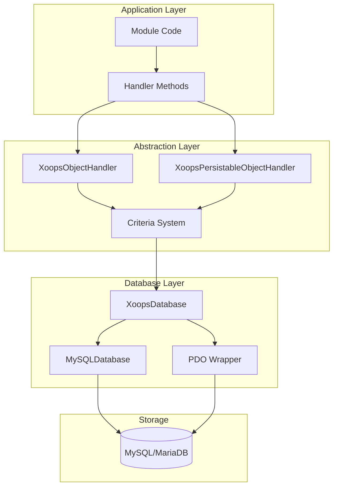
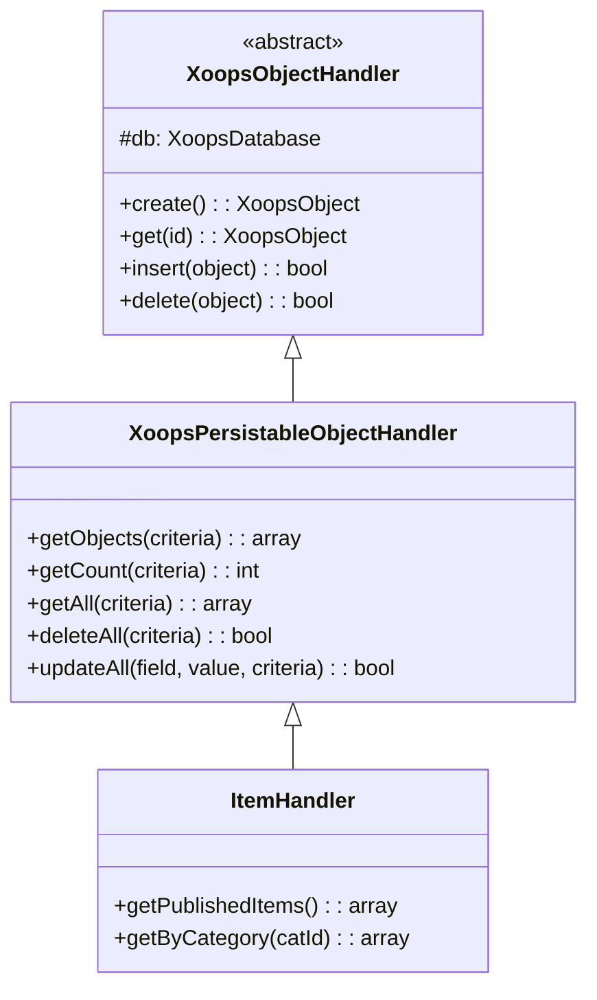
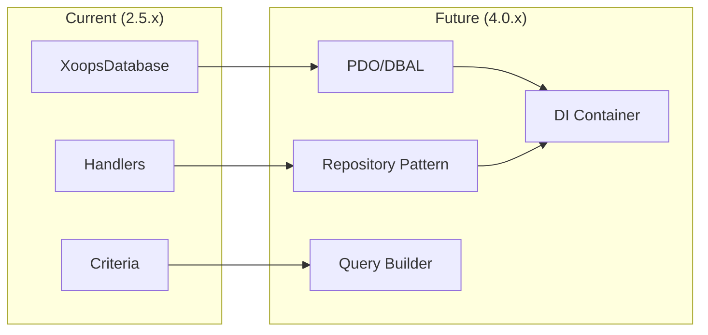

# ADR-002: Αφαίρεση βάσης δεδομένων

> Αρχιτεκτονική Απόφαση Εγγραφή για το αντικειμενοστραφή μοτίβο πρόσβασης στη βάση δεδομένων του XOOPS.

---

## Κατάσταση

**Αποδεκτό** - Βασικό μοτίβο από XOOPS 2.0

---

## Περιεχόμενο

Το XOOPS χρειαζόταν μια στρατηγική αλληλεπίδρασης με βάση δεδομένων που θα:

1. Αφηρημένη σύνταξη SQL για συγκεκριμένη βάση δεδομένων
2. Παρέχετε συνεπείς λειτουργίες CRUD σε όλες τις μονάδες
3. Ενεργοποιήστε την αυτόματη εξυγίανση δεδομένων και διαφυγή
4. Υποστήριξη μελλοντικών αλλαγών του μηχανισμού βάσης δεδομένων
5. Απλοποιήστε τις κοινές λειτουργίες για προγραμματιστές

Οι εναλλακτικές ήταν:
- Ακατέργαστο SQL σε όλη τη βάση κωδικών
- Πλήρες ORM (Δόγμα, Εύγλωττο)
- Προσαρμοσμένη ελαφριά αφαίρεση

---

## Διάγραμμα απόφασης



---

## Απόφαση

Θα εφαρμόσουμε ένα **μοτίβο χειριστή** με:

## # 1. XoopsObject - Δοχείο δεδομένων

Κάθε οντότητα δεδομένων επεκτείνει το XoopsObject:

```php
class Item extends XoopsObject
{
    public function __construct()
    {
        $this->initVar('id', XOBJ_DTYPE_INT, null, false);
        $this->initVar('title', XOBJ_DTYPE_TXTBOX, '', true, 255);
        $this->initVar('content', XOBJ_DTYPE_TXTAREA, '', false);
        $this->initVar('status', XOBJ_DTYPE_INT, 0, false);
    }
}
```

## # 2. Handler - Operations Manager

Κάθε αντικείμενο έχει έναν αντίστοιχο χειριστή:

```php
class ItemHandler extends XoopsPersistableObjectHandler
{
    public function __construct($db)
    {
        parent::__construct($db, 'mymodule_items', Item::class, 'id', 'title');
    }

    // CRUD methods inherited:
    // - create(), get(), insert(), delete()
    // - getObjects(), getCount(), getAll()
}
```

## # 3. Κριτήρια - Εργαλείο δημιουργίας ερωτημάτων

Αντικειμενοστρεφείς συνθήκες ερωτήματος:

```php
$criteria = new CriteriaCompo();
$criteria->add(new Criteria('status', 1));
$criteria->add(new Criteria('created', time() - 86400, '>='));
$criteria->setSort('created');
$criteria->setOrder('DESC');
$criteria->setLimit(10);

$items = $handler->getObjects($criteria);
```

---

## Σταθερές τύπου δεδομένων

```php
// Variable types with automatic sanitization
XOBJ_DTYPE_INT       // Integer
XOBJ_DTYPE_TXTBOX    // Single-line text (escaped)
XOBJ_DTYPE_TXTAREA   // Multi-line text (escaped)
XOBJ_DTYPE_EMAIL     // Email validation
XOBJ_DTYPE_URL       // URL validation
XOBJ_DTYPE_ARRAY     // Serialized array
XOBJ_DTYPE_OTHER     // No processing
XOBJ_DTYPE_FLOAT     // Floating point
```

---

## Κληρονομικότητα χειριστή



---

## Συνέπειες

## # Θετικό

1. **Συνέπεια**: Όλες οι μονάδες χρησιμοποιούν τα ίδια μοτίβα
2. **Ασφάλεια**: Η αυτόματη διαφυγή αποτρέπει την έγχυση SQL
3. **Απλότητα**: Οι συνήθεις λειτουργίες απαιτούν ελάχιστο κωδικό
4. **Δυνατότητα συντήρησης**: Οι αλλαγές στο επίπεδο βάσης δεδομένων δεν επηρεάζουν τις λειτουργικές μονάδες
5. **Δυνατότητα δοκιμής**: Οι χειριστές μπορούν να κοροϊδεύονται για δοκιμές

## # Αρνητικό

1. **Απόδοση**: Επιπλέον έξοδα αφαίρεσης
2. **Πολυπλοκότητα**: Καμπύλη εκμάθησης για νέους προγραμματιστές
3. **Περιορισμοί**: σύνθετα ερωτήματα μπορεί να χρειάζονται ακατέργαστο SQL
4. **N+1 Πρόβλημα**: Δεν υπάρχει ενσωματωμένη ανυπόμονη φόρτωση

## # Μετριασμούς

- **Απόδοση**: Αποθήκευση αντικειμένων με συχνή πρόσβαση
- **Σύνθετα ερωτήματα**: Να επιτρέπεται το ακατέργαστο SQL όταν χρειάζεται
- **N+1**: Χρησιμοποιήστε το getAll() με τα κατάλληλα κριτήρια

---

## Εξέλιξη σε XOOPS 4.0



XOOPS 4.0 σχέδια:
- Δόγμα DBAL για αφαίρεση βάσης δεδομένων
- Μοτίβο αποθήκης που αντικαθιστά χειριστές
- Εργαλείο δημιουργίας ερωτημάτων για σύνθετα ερωτήματα
- Πλήρης ενσωμάτωση κοντέινερ PSR-11

---

## Παραδείγματα κώδικα

## # Βασικό CRUD

```php
$helper = Helper::getInstance();
$handler = $helper->getHandler('Item');

// Create
$item = $handler->create();
$item->setVar('title', 'New Item');
$handler->insert($item);

// Read
$item = $handler->get($id);
$title = $item->getVar('title');

// Update
$item->setVar('title', 'Updated Title');
$handler->insert($item);

// Delete
$handler->delete($item);
```

## # Σύνθετο ερώτημα

```php
$criteria = new CriteriaCompo();
$criteria->add(new Criteria('status', 'published'));
$criteria->add(new Criteria('category_id', '(1,2,3)', 'IN'));
$criteria->add(new Criteria('created', strtotime('-30 days'), '>='));
$criteria->setSort('views');
$criteria->setOrder('DESC');
$criteria->setLimit(10);
$criteria->setStart(0);

$items = $handler->getObjects($criteria);
$total = $handler->getCount($criteria);
```

---

## Σχετικές Αποφάσεις

- ADR-001: Modular Architecture
- ADR-003: Smarty Template Engine

---

## Αναφορές

- Martin Fowler - Patterns of Enterprise Application Architecture
- Έννοιες σχεδίασης που βασίζονται στον τομέα
- Μοτίβα Active Record έναντι Data Mapper

---

# XOOPS #αρχιτεκτονική #adr #βάση δεδομένων #handler #design-decision
