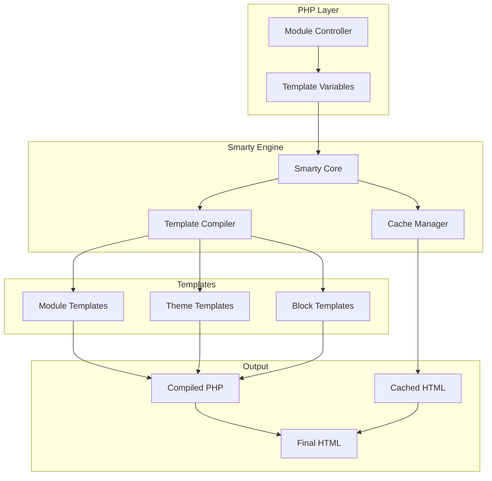
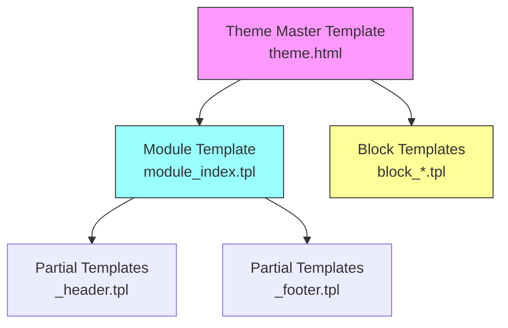
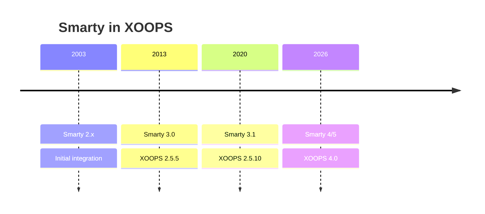

# ADR-003: Template Engine (Smarty)

> Αρχείο απόφασης αρχιτεκτονικής για την υιοθέτηση από τον XOOPS της μηχανής προτύπου Smarty.

---

## Κατάσταση

**Αποδεκτό** - Βασική απόφαση από το XOOPS 2.0

**Εξελίσσεται** - Η μετάβαση στο Smarty 4/5 έχει προγραμματιστεί για το XOOPS 4.0

---

## Περιεχόμενο

Το XOOPS χρειαζόταν μια λύση προτύπου που θα:

1. Ξεχωρίστε την παρουσίαση από την επιχειρηματική λογική
2. Επιτρέψτε στους σχεδιαστές θεμάτων να εργαστούν χωρίς PHP γνώση
3. Υποστήριξη προτύπου κληρονομιάς και περιλαμβάνει
4. Παρέχετε προσωρινή αποθήκευση για απόδοση
5. Ενεργοποιήστε πρότυπα προσαρμόσιμα από το χρήστη
6. Υποστήριξη διεθνοποίησης

---

## Διάγραμμα απόφασης



---

## Απόφαση

Θα χρησιμοποιήσουμε το **Smarty** ως μηχανή προτύπων επειδή:

## # 1. Διαχωρισμός ανησυχιών

```php
// PHP (Controller) - Business logic
$items = $itemHandler->getPublishedItems();
$xoopsTpl->assign('items', $items);

// Smarty (View) - Presentation
// templates/items.tpl
```

```smarty
{* Smarty template - No PHP logic *}
<{foreach item=item from=$items}>
    <article>
        <h2><{$item.title}></h2>
        <p><{$item.summary}></p>
    </article>
<{/foreach}>
```

## # 2. XOOPS Οριοθέτες

Το XOOPS χρησιμοποιεί `<{` και `}>` αντί του τυπικού `{` `}`:

```smarty
{* Standard Smarty *}
{$variable}

{* XOOPS Smarty - Avoids JavaScript conflicts *}
<{$variable}>
```

## # 3. Ιεραρχία προτύπων



## # 4. Αποθήκευση προτύπων

- **Βάση δεδομένων**: Προσαρμοσμένα πρότυπα που αποθηκεύονται για δυνατότητα επαναφοράς
- **Σύστημα αρχείων**: Αρχικά πρότυπα σε καταλόγους λειτουργικών μονάδων
- **Cache**: Μεταγλωττισμένα πρότυπα για απόδοση

---

## Smarty Configuration

```php
// XOOPS Smarty initialization
$xoopsTpl = new XoopsTpl();

// Custom delimiters
$xoopsTpl->left_delim = '<{';
$xoopsTpl->right_delim = '}>';

// Caching
$xoopsTpl->caching = XOOPS_TEMPLATE_CACHE;
$xoopsTpl->cache_lifetime = 3600;

// Security
$xoopsTpl->security_policy = new Smarty_Security($xoopsTpl);
$xoopsTpl->security_policy->php_functions = [];
$xoopsTpl->security_policy->php_modifiers = ['escape', 'count'];
```

---

## Χρησιμοποιούνται χαρακτηριστικά προτύπου

## # Μεταβλητές

```smarty
{* Simple variable *}
<{$title}>

{* Object property *}
<{$item.title}>

{* With modifier *}
<{$content|truncate:200:'...'}>

{* Escaped output *}
<{$userInput|escape:'html'}>
```

## # Δομές ελέγχου

```smarty
{* Conditional *}
<{if $isAdmin}>
    <a href="admin.php">Admin</a>
<{elseif $isUser}>
    <a href="profile.php">Profile</a>
<{else}>
    <a href="login.php">Login</a>
<{/if}>

{* Loop *}
<{foreach item=item from=$items name=itemloop}>
    <{$smarty.foreach.itemloop.index}>: <{$item.title}>
<{/foreach}>
```

## # Περιλαμβάνει

```smarty
{* Include another template *}
<{include file="db:mymodule_header.tpl"}>

{* Include with variables *}
<{include file="db:mymodule_item.tpl" item=$currentItem}>

{* Include from theme *}
<{include file="file:$theme_path/partials/sidebar.tpl"}>
```

---

## Συνέπειες

## # Θετικό

1. **Κατάλληλο για σχεδιαστή**: σύνταξη όπως HTML
2. **Caching**: Ενσωματωμένη προσωρινή αποθήκευση προτύπων
3. **Ασφάλεια**: PHP απομόνωση κωδικού
4. **Ευελιξία**: Τροποποιητές, λειτουργίες, πρόσθετα
5. **Προσαρμογή**: Οι χρήστες μπορούν να τροποποιήσουν πρότυπα
6. **Κοινότητα**: Μεγάλο Smarty οικοσύστημα

## # Αρνητικό

1. **Καμπύλη μάθησης**: Έξυπνη σύνταξη
2. **Γενικά**: Απαιτείται βήμα μεταγλώττισης
3. **Εντοπισμός σφαλμάτων**: Τα σφάλματα προτύπου μπορεί να είναι κρυπτικά
4. **Προβλήματα έκδοσης**: Διακοπή αλλαγών μεταξύ των εκδόσεων

## # Μετριασμούς

- **Μάθηση**: Ολοκληρωμένη τεκμηρίωση
- **Απόδοση**: Επιθετική προσωρινή αποθήκευση
- **Εντοπισμός σφαλμάτων**: Κονσόλα εντοπισμού σφαλμάτων, διαγραφή μηνυμάτων σφάλματος
- **Εκδόσεις**: Επίπεδο συμβατότητας στο XOOPS

---

## Ιστορικό έκδοσης



---

## Μετεγκατάσταση: Smarty 3 σε 4/5

## # Σπαστικές αλλαγές

```smarty
{* Smarty 3 - Deprecated *}
<{php}>echo date('Y');<{/php}>

{* Smarty 4+ - Use modifiers or assign from PHP *}
<{$current_year}>

{* Smarty 3 - {section} deprecated *}
<{section name=i loop=$items}>
    <{$items[i].title}>
<{/section}>

{* Smarty 4+ - Use {foreach} *}
<{foreach $items as $item}>
    <{$item.title}>
<{/foreach}>
```

## # Επίπεδο συμβατότητας

Το XOOPS παρέχει ένα επίπεδο συμβατότητας για ομαλές μεταβάσεις:

```php
// XoopsTpl extends Smarty with compatibility methods
class XoopsTpl extends Smarty
{
    public function assign($tpl_var, $value = null)
    {
        // Handles both Smarty 3 and 4 syntax
        return parent::assign($tpl_var, $value);
    }
}
```

---

## Εξετάζονται εναλλακτικές λύσεις

## # 1. Κλαδί
**Πλεονεκτήματα**: Μοντέρνο, οικοσύστημα Symfony
**Μειονεκτήματα**: Διαφορετική σύνταξη, προσπάθεια μετανάστευσης
**Απόφαση**: Πιθανή μελλοντική επιλογή για XOOPS 3.x

## # 2. Λεπίδα (Laravel)
**Πλεονεκτήματα**: Καθαρή σύνταξη, δημοφιλής
**Μειονεκτήματα**: Ειδικά για Laravel
**Απόφαση**: Δεν είναι κατάλληλο για αυτόνομη χρήση

## # 3. Εγγενή PHP Πρότυπα
**Πλεονεκτήματα**: Χωρίς καμπύλη εκμάθησης, γρήγορα
**Μειονεκτήματα**: Κίνδυνοι ασφάλειας, χωρίς διαχωρισμό
**Απόφαση**: Απορρίφθηκε λόγω δυνατότητας συντήρησης

---

## Σχετικές Αποφάσεις

- ADR-001: Modular Architecture
- ADR-002: Αφαίρεση βάσης δεδομένων

---

## Αναφορές

- Smarty Documentation: https://www.Smarty.net/docs/en/
- XOOPS Οδηγός συστήματος προτύπων
- MVC Μοτίβο σε εφαρμογές Ιστού

---

# XOOPS #αρχιτεκτονική #adr #Smarty #templates #design-decision
